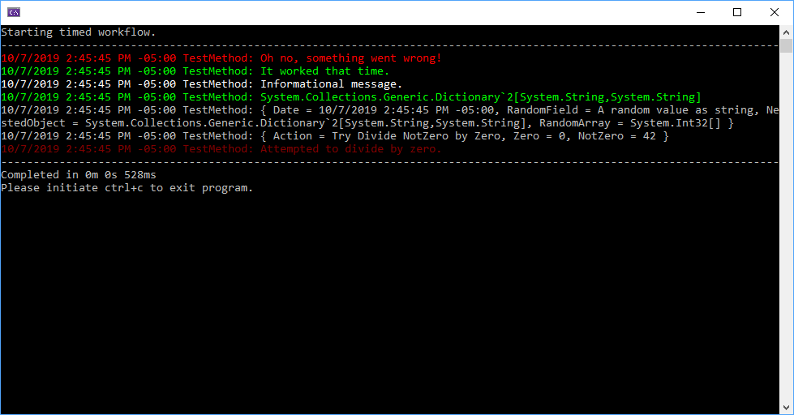
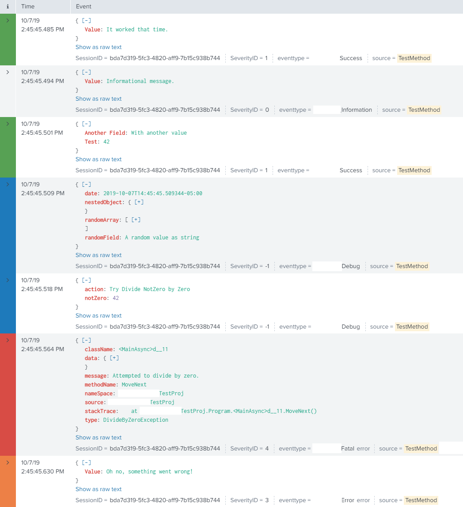

# c# – Logging Directly to Splunk

This is a portion of my Logging libraries, to allow me to log data to Splunk using the HEC. The data being logged can either be a simple string, or a full-blown object. Code examples are below to also handle exporting Metrics to Splunk.

<!-- more -->

A few key fields are indexed as Metadata, to enable faster searches. The rest of the fields are automatically parsed out at Searchtime, via Json KV_MODE.

To note- I will briefly document the utilization of this class, as it would be up to you, the developer, to properly implement it in your environment.

As well- my implement does support waiting for indexer acknowledgements to return, if they are enabled.

## Disclaimer

This is not an all inclusive guide to writing your own library to log your application’s data into Splunk. This is also not a simple plug and play for your application. This was written to provide some examples on how to roll your own logic for logging data into Splunk.

If you wish to utilize a plug and play library with minimal configuration, I recommend you check out these alternatives.

* [Apache Log4Net](https://logging.apache.org/log4net/){target=_blank}
    * Plug-ins do exist to send directly to Splunk.
* [NLog](https://nlog-project.org/){target=_blank}
* [Microsoft Enterprise Library](https://docs.microsoft.com/en-us/previous-versions/msp-n-p/ff648951(v=pandp.10)?redirectedfrom=MSDN){target=_blank}
* [Serilog](https://serilog.net/){target=_blank}
    * A [Splunk Sink](https://github.com/serilog/serilog-sinks-splunk){target=_blank} does exist.

All of the above libraries are extensible, and Splunk targets likely already exist for them.

If you go this route- I personally recommend serilog.

Lastly- this is not a guide on how to create your own logging library! My below examples do not include my “ILogger” classes, nor how my logic is setup to reliably log data asynchronously. The intent of this article is solely how you can log data to Splunk!

## The Code

### ILogEntry

This class holds a “Log Message”, and a few other various fields.

``` csharp
public interface ILogEntry
{
    //The Splunk index to log to. May be overridden by HEC settings.
    string Index { get; set; }
    //This is the name of the server the log is "For". Not to be confused with the name of the server logging the process.
    //Example- This tool is running on Server_A, but, is logging data into Splunk from Server_B. Server_A would be stored as Logging_Computer
    // Server_B would be set as "ServerName"
    string ServerName { get; set; }
    //The name of the computer logging this event.
    string Logging_Computer { get; set; }

    //If set as true, the "host" field in Splunk will be set to "ServerName" instead of "Logging_Computer"
    bool SetSplunkHostAsServerName { get; set; }

    //This is the name of the "Process" or "Workflow" doing the logging. It is mapped to "source" in Splunk.
    string LogName { get; set; }

    //This object can contain a string, or a full c# object, as long as it can be serialized.
    object Message { get; set; }

    //The time at which this event was generated.
    DateTimeOffset TimeStamp { get; set; }

    //Another field, used to filter events. It can contain additional information about what is being executed. Can be null.
    string Component { get; set; }
    
    //The "Severity" of the event. Follows normal syslog severity.
    int SeverityID { get; set; }

    //This is the "SessionID". IE- every instance of a workflow or process is executed with its own SessionID, making it very easy to group logs from a single execution.
    // This also allows me to generate an email for each session.
    Guid SessionID { get; set; }

    //This log's order in the particular session. Not utilized by Splunk.
    int Session_Order_ID { get; set; }
}
```
This interface contains a few various fields and properties.

### Event Exporter Class

This class is responsible for exporting my “ILogEntry” objects to Splunk.

``` csharp
/// <summary>
/// This class exports events to Splunk.
/// Data is expected to fit into an ILogEntry.
/// </summary>
public class EventExporter : ILoggerTarget
{
    //This is the Splunk HEC Token, generated within Splunk.
    private Guid authenticationToken;

    //ISerializer is an abstraction for the serialization library. In my environment, it points at newtonsoft.
    private ISerializer serializer;

    //URI to Splunk HEC.
    private Uri splunkURI;

    public EventExporter(ISerializer Serializer, Uri SplunkURI, Guid Token)
    {
        this.splunkURI = SplunkURI;
        this.authenticationToken = Token;
        this.serializer = Serializer;
    }

    //If acknoweldgements are enabled, this is required.
    private static Guid channelIdentifier = Guid.NewGuid();

    public async Task WriteLogAsync(ILogEntry log)
    {
        string host = log.Logging_Computer;
        string serverName = log.ServerName;

        //If flag to set host as servername is checked, and a server name is specified....
        //Use the value as the host, 
        if (log.SetSplunkHostAsServerName == true && !string.IsNullOrEmpty(log.ServerName))
        {
            host = log.ServerName;
            serverName = null;
        }

        string Json = serializer.SerializeObject(new
        {
            //Primary attributes, will be automatically log.Indexed by Splunk.
            time = log.TimeStamp.ToEpochTime(),
            index = log.Index,
            source = log.LogName,
            sourcetype = "MyCustomSourceType",   //Contains the proper extractions for dealing with the below fields, and structure.

//Don't worry- that is not the actual sourcetype....
            host = host, //The CURRENT logging machine
            @event = new
            {
                //MetaData Fields, will be log.Indexed in Splunk, with a special transform.
                SeverityID = log.SeverityID,
                SessionID = log.SessionID,
                Component = log.Component,
                ComputerName = serverName,

                //Only the raw data for the base event, will actually be stored.
                Event = (log.Message is string) ? new { Value = log.Message } : log.Message,
            }
        });

        using (var client = new HttpClient())
        {
            client.BaseAddress = splunkURI;
            client.DefaultRequestHeaders.Accept.Clear();
            client.DefaultRequestHeaders.Accept.Add(new System.Net.Http.Headers.MediaTypeWithQualityHeaderValue("application/json"));
            client.DefaultRequestHeaders.Add("Authorization", $"Splunk {authenticationToken}");
            client.DefaultRequestHeaders.Add("X-Splunk-Request-Channel", channelIdentifier.ToString());
            try
            {
                // New code:
                HttpResponseMessage response = await client.PostAsync("services/collector/event", new StringContent(Json));

                if (!response.IsSuccessStatusCode)
                    throw new Exception(response.ReasonPhrase);

                DateTimeOffset EventSent = DateTimeOffset.Now;

                var Content = await response.Content.ReadAsStringAsync();
                var Ack = serializer.DeSerializeObject<Models.SplunkAck>(Content);

                //Completed.
                if (!Ack.ackId.HasValue)
                    return; 

                var req = serializer.SerializeObject(new
                {
                    acks = new int[] { Ack.ackId.Value }
                });

                //
                await Task.Delay(TimeSpan.FromSeconds(2));

                while (true)
                {
                    HttpResponseMessage responseAck = await client.PostAsync($"services/collector/ack?channel={channelIdentifier.ToString()}", new StringContent(req));
                    Content = await responseAck.Content.ReadAsStringAsync();
                    var AckCheck = serializer.DeSerializeObject<Models.SplunkAck>(Content);

                    //Acknowledgements are disabled. Success.
                    if (AckCheck.code == 14)
                        return;

                    //Acknowldgement was successful. Return.
                    if (AckCheck.acks[Ack.ackId.ToString()] == true)
                        return;

                    double MinuteSinceFirstMessage = DateTimeOffset.Now.Subtract(EventSent).TotalMinutes;

                    if (MinuteSinceFirstMessage < 10)
                    {
                        await Task.Delay(TimeSpan.FromSeconds(30));
                    }
                    else if (MinuteSinceFirstMessage < 60)
                    {
                        await Task.Delay(TimeSpan.FromMinutes(1));
                    }
                    else
                    {
                        //throw exception. The message bus or sender should retry.
                        throw new Exception("No acknowledgement after 1 hour.");
                    }

                }
            }
            catch (Exception ex)
            {
                throw;
            }
        }
    }
}
```

### Splunk Props/Transforms

So- while you could run this code without the use of Props or Transforms, I utilize props/transforms to greatly reduce the amount of _raw data stored, and to clean up the events.

Since SeverityID, SessionID, Component, and ComputerName are stored as INDEXED fields, I do not need to retain them with the _raw data. By removing them, I can clean up the events, making them easier to read within Splunk.

``` ini title="props.conf"
[MyCustomSourceType]
LEARN_MODEL = false
LEARN_SOURCETYPE = false
SHOULD_LINEMERGE = 0
KV_MODE = json
TIME_FORMAT=%Y-%m-%dT%H:%M:%S.%6N%z
TRANSFORMS-setMetadata=set_SeverityID,set_SessionID,set_Component,set_ComputerName,replace_event
```

``` ini title="transforms.conf"
#Remove metadata.
[set_SeverityID]
REGEX = "SeverityID":([-0-9]{1,3}),
FORMAT = SeverityID::$1
SOURCE_KEY=_raw
WRITE_META = true

[set_Component]
REGEX = "Component":"([^\}\{,\"]*)",
FORMAT = Component::$1
SOURCE_KEY=_raw
WRITE_META = true

[set_SessionID]
REGEX = "SessionID":"([0-9a-fA-F]{8}-[0-9a-fA-F]{4}-[0-9a-fA-F]{4}-[0-9a-fA-F]{4}-[0-9a-fA-F]{12})",
FORMAT = SessionID::$1
SOURCE_KEY=_raw
WRITE_META = true

[set_ComputerName]
REGEX = "ComputerName":"([a-zA-Z0-9-]{1,25})",
FORMAT = ComputerName::$1
SOURCE_KEY=_raw
WRITE_META=true

[replace_event]
LOOKAHEAD=100000000
REGEX="Event":(.*)}$
FORMAT=$1
DEST_KEY=_raw
SOURCE_KEY=_raw
```

To add a bit of color to the events, we can leverage `eventtypes.conf`

``` ini title="eventtypes.conf"
[Debug]
search = SeverityID=-1
color = et_blue

[Fatal]
search = SeverityID=4
priority = 1
color = et_red
```

The replace_event transform removes all of the extra json which was translated to metadata events. The primary purpose is to clean up the events to make searching easier.

### Splunk Metric Exporter

As well, here is a snippet of code used to export Metric data to Splunk.

First, here is a simple interface which contains a “Metric”. I have left out the classes to generate a metric. But- I will say, they contain logic to ensure the metric name is properly formatted, and matches our naming standards.

``` csharp title="IMetricData.cs"
public interface IMetricData
{
    string Host { get; set; }
    string Index { get; set; }
    string Name { get; set; }
    DateTimeOffset TimeStamp { get; set; }
    double Value { get; set; }
    Dictionary<string, object> Dimensions { get; }
}
```

Next up, here is the class which is responsible for sending the metrics to Splunk.

``` csharp title="SplunkMetricTarget.cs"
/// <summary>
/// This class exports metrics to Splunk.
/// </summary>
public class Splunk : IMetricTarget
{
    //Splunk HEC Authentication Token
    private Guid authenticationToken;
    //Abstraction of preferred serialization library.
    private ISerializer serializer;
    //URI to Splunk.
    private Uri splunkURI;

    public Splunk(ISerializer Serializer, Uri SplunkURI, Guid Token)
    {
        this.splunkURI = SplunkURI;
        this.authenticationToken = Token;
        this.serializer = Serializer;
    }

    public async Task PublishMetricDataAsync(IMetricData log)
    {
        string Json = serializer.SerializeObject(new
        {
            //Primary attributes, will be automatically log.Indexed by Splunk.
            time = log.TimeStamp.ToEpochTime(),
            @event = "metric",
            index = log.Index,
            host = log.Host,
            fields = log.Dimensions
        });

        using (var httpClientHandler = new HttpClientHandler())
        {
            httpClientHandler.ServerCertificateCustomValidationCallback = (message, cert, chain, errors) => { return true; };

            using (var client = new HttpClient(httpClientHandler))
            {
                client.BaseAddress = splunkURI;
                client.DefaultRequestHeaders.Accept.Clear();
                client.DefaultRequestHeaders.Accept.Add(new System.Net.Http.Headers.MediaTypeWithQualityHeaderValue("application/json"));
                client.DefaultRequestHeaders.Add("Authorization", $"Splunk {authenticationToken}");

                // New code:
                HttpResponseMessage response = await client.PostAsync("services/collector", new StringContent(Json));
                if (response.IsSuccessStatusCode)
                {
                    return;
                }
                else
                {
                    //To note- I use MassTransit/RabbitMQ to handle messages between my tiers.
                    //By throwing an exception, it allows the message to be retried and re-queued.
                    throw new Exception(response.ReasonPhrase);
                }
            }
        }
    }
}
```

## Example

``` csharp title="program.cs"
private async Task MainAsync()
{
    //Testing logging a simple error
    log.Error("Oh no, something went wrong!");

    //A "Success" message.
    log.Success("It worked that time.");

    //Info
    log.Info("Informational message.");

    //My "ILogger" supports multiple methods and overloads to handle many use-cases. I will not document them here.

    //Lets try... logging a complete object.

    var ToLog = new Dictionary<string, string>
    {
        { "Test", "42"},
        {"Another Field", "With another value" }
    };

    //Lets log the entire dictionary.
    log.Success(ToLog);

    //Log an anonymous object.
    log.Debug(new
    {
        Date = DateTimeOffset.Now,
        RandomField = "A random value as string",
        NestedObject = ToLog,
        RandomArray = new int[] { 7, 13, 42 }
    });

    try
    {
        int NotZero = 42;
        int Zero = 0;

        log.Debug(new
        {
            Action = "Try Divide NotZero by Zero",
            Zero,
            NotZero
        });

        int TryDivideByZero = NotZero / Zero;
    }
    catch (Exception ex)
    {
        //Exception.GetUsefulDetails is an extenstion method I have created to log relavent details regarding the exception.
        log.Fatal(ex.GetUsefulDetails());
    }
}
```

Running the above program, outputs the following content to the console:



When viewed within Splunk, we see the following details:



Output as seen inside of Splunk. Notice the metadata fields are not visible within the event text.

## Final Notes

This was not intended to be a complete guide on how to fully log your application with Splunk. The intentions of this post, were to giving you working examples on how to leverage Splunk for logging application / debugging data, as well as logging Metrics.

I use some of the above code samples hundreds of thousands of times per day to log data into Splunk, which have been in production for going on nearly 7 years now.