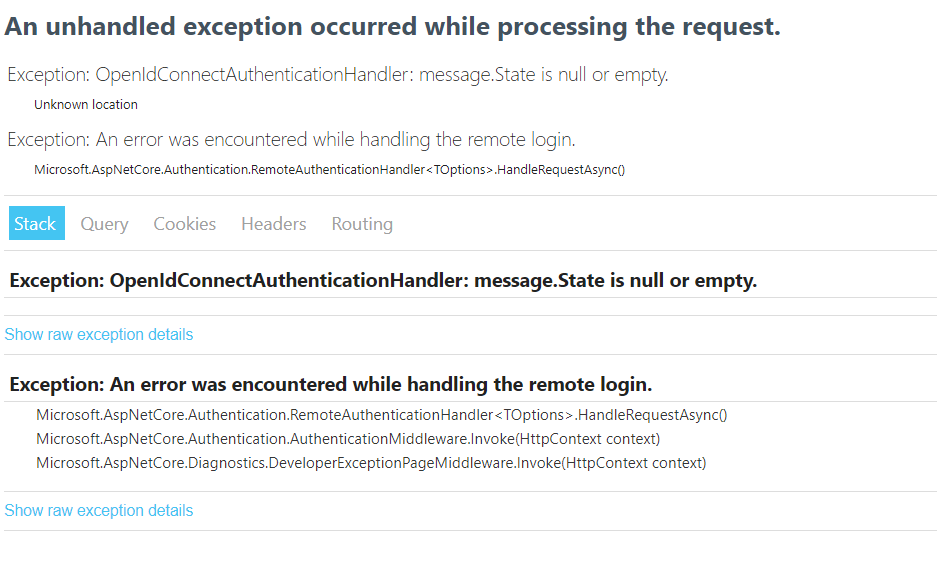

# ASP.NET Core – Links don’t work from office/word document to SSO site.

Here is an unusual issue.

You build a website. Its address is say… `https://mywebsite.com/`

You email this link to somebody, and it works. 
You share this link in a chat. it works.

You put this link into a word or excel document, and all of a sudden, you see this:



<!-- more -->

Now, you are puzzled. Why are my hyper-links not working inside of a word or excel document? What makes them different??

## Supporting Documentation

A colleague of mine had actually experienced this issue, and shared some Microsoft documentation with me.

[Issues when you click hyperlink to SSO Web site in a document](https://docs.microsoft.com/en-us/office/troubleshoot/office-suite-issues/click-hyperlink-to-sso-website){target=_blank}

Well, at least its good news that this issue isn’t just me, right?

It appears the cause, is because office tries to directly bind to the resource using Microsoft’s hyper-link library, which causes very weird side-effects.

## The Work-Around

Based on the documentation, it appears office attempts to insert its own broken cookie into the SSO-enabled website. or- at least, that is what I gathered.

Well, turns out, I couldn’t find a good solution. But, I did find A solution… based on [THIS MICROSOFT ARTICLE](https://docs.microsoft.com/en-us/azure/active-directory-b2c/enable-authentication-web-application-options#pass-id-token-hint){target=_blank}

Essentially, I found a place to hook into remote authentication failures. My solution was simply to redirect the user to the home page. It works….

If you find the ACTUAL solution to this problem, please let me know.

``` csharp
 services
    .AddAuthentication(OpenIdConnectDefaults.AuthenticationScheme)
    .AddMicrosoftIdentityWebApp(options =>
    {
        Configuration.Bind("AzureAd", options);
        options.Events ??= new OpenIdConnectEvents();
        options.Events.OnRemoteFailure += (RemoteFailureContext options) =>
        {
            //Redirect the user to the home page.
            options.HttpContext.Response.Redirect("/");

            //Stop further processing.
            options.HandleResponse();

            return Task.CompletedTask;
        };
    });
```