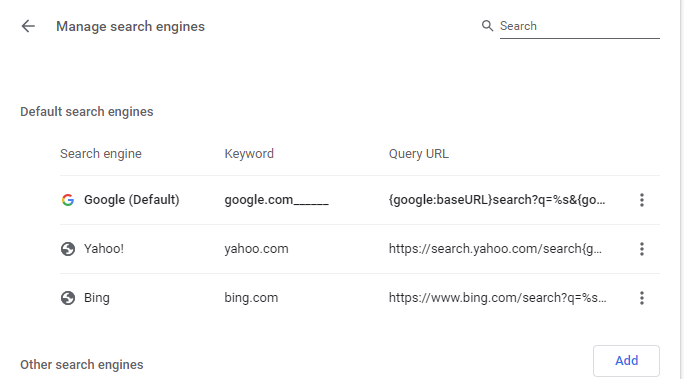

# How to Search Splunk and Service-Now from your browser's search bar.

## Introduction

So-

At least a few times a day, I find myself typing `index=…` into my browser's search bar, and expecting something to happen…

If I were to not catch my mistake and press enter, it would just bring me to a random google search result full of garbage results.

But- what if, you could actually search Splunk or other products directly from the address bar?

Well- it turns out, you can. And- below, I am going to show you how to do it.

This guide should work for either chrome or chromium(not tested). I am quite certain, it would also work for firefox or other browsers as well… but, I have not checked their documentation.

<!-- more -->

## Adding a custom search provider in Chrome

First- lets open up the search providers settings menu for chrome.

1. Open Settings
2. Click “Search Engine” (on the left)
3. Click “Manage Search Engines”

This will bring us to a screen which resembles this:

From here, we will need to click the “Add” button to add a new provider.

#### Search Engine

This is how it will appear in the search bar when you are searching this source. You can specify whichever name you choose. If you wanted to configure MULTIPLE instances of Splunk to search, you can do that.

#### Keyword

This is the prefix which you must type, before chrome will send search results to this custom provider.

For my example, I used `|`

You may use whichever prefix you prefer.

#### URL

This is the URL which will be called.

If you would like to use a different app by default, you can specify that below.

For my example, here is the URL I used:

https://Splunk.MyCompany.com/en-US/app/search/search?q=%s

It will navigate to the search app, at splunk,mycompany.com, and enter the query into a search, and search.

You COULD get fancy and add additional parameters to the above query string, to limit the time range, etc.

For a few examples, these are some of the defaults in my environment.

`&display.page.search.mode=verbose`

`&dispatch.sample_ratio=1`

`&workload_pool=`

`&earliest=-24h%40h`

`&latest=now`

`&display.page.search.tab=statistics`

`&display.general.type=statistics`

There should be a parameter you can pass in your string to specify or set any of the defaults.

## Testing!

### Before

### After

Ignore the blacked out areas, to protect my privacy!

## Service-Now Instructions

As well as having this issue with Splunk- I frequently find myself having to lookup records in service-now. Applying the same logic above, we can do this for ServiceNow as well!

For the URL Field, use this:

`https://mycompany.service-now.com/nav_to.do?uri=/$sn_global_search_results.do?sysparm_search=%s`

If you would rather open up a task directly, you can use this search string:

`https://mycompany.service-now.com/nav_to.do?uri=/task.do?sys_id=%s`

You can’t search with it, but, if a record which inherits from task exists, with the provided number, it will open it directly.

For my use, I set the keyword as `sn`. You can use whichever prefix you would remember.

Then, you can type…. `sn CHG000123` to automatically open the change up in your service-now instance!

### Settings Preview

### Before

### After

## Summary

If you found this article useful, please consider subscribing to this blog, or Liking us on Facebook… Or, even leaving a comment below. I don’t sell your information or ask for money- but, leaving a comment or a Like does let me know that you did find this page useful.

### Post History

This post was originally published on 2020-01-13, and migrated to this static site 2023-12-08. Content remains unaltered with minor formatting changes. 