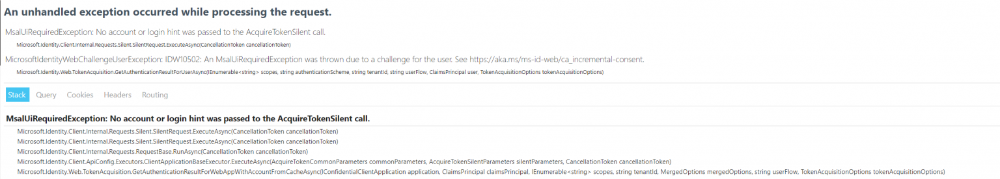

# MicrosoftIdentityWebChallengeUserException: IDW10502

An MsalUiRequiredException was thrown due to a challenge for the user. See https://aka.ms/ms-id-web/ca_inc

<!-- more -->

## Introduction

When I started using Blazor earlier this year, I would occasionally run into this exception. For a long time, I could not reproduce it. Navigating to the root of my web application would cause the issue to stop happening.



A few weeks ago, I figured out how to reproduce this issue with 100% success rate.. and Today, I figured out how to resolve this issue.

To reproduce this issue, you need to be running Microsoft.Identity for authentication. Then, just restart the backend service running kestrel.

## What is happening, and how to reproduce it.

This issue is only reproducible for me, on sub-pages within my website. It will not reproduce on the root page.

However, what happens, is when your browser has a cached cookie, and you restart the backend service, the backend service now knows nothing regarding your session cookie, which causes this exception to be thrown.

## How do you fix this?

Well, it took me 6 months to find the answer myself- however, I found it today after traveling through many linked Microsoft articles and github pages…. On this [github ticket](https://github.com/AzureAD/microsoft-identity-web/issues/13){target=_blank}

Long story short- to fix the issue, you add a filter which rejects a session cookie which the website does not know how to handle.

I will be copying the [solution from here](https://github.com/AzureAD/microsoft-identity-web/issues/13#issuecomment-878528492){target=_blank}. Remember- this is not my code, I am just copying the solution here for you!

First, you need to create a filter. This filters purpose is to “reject” cookies, which are not cached by your front-end.

``` csharp title="RejectSessionCookieWhenAccountNotInCacheEvents.cs"
    using Microsoft.AspNetCore.Authentication.Cookies;
    using Microsoft.Extensions.DependencyInjection;
    using Microsoft.Identity.Client;
    using Microsoft.Identity.Web;
    namespace YourProject;
    internal class RejectSessionCookieWhenAccountNotInCacheEvents : CookieAuthenticationEvents
    {
        public async override Task ValidatePrincipal(CookieValidatePrincipalContext context)
        {
            try
            {
                var tokenAcquisition = context.HttpContext.RequestServices.GetRequiredService<ITokenAcquisition>();
                string token = await tokenAcquisition.GetAccessTokenForUserAsync(
                    scopes: new[] { "profile" },
                    user: context.Principal);
            }
            catch (MicrosoftIdentityWebChallengeUserException ex) when (AccountDoesNotExitInTokenCache(ex))
            {
                context.RejectPrincipal();
            }
        }
        /// <summary>
        /// Is the exception thrown because there is no account in the token cache?
        /// </summary>
        /// <param name="ex">Exception thrown by <see cref="ITokenAcquisition"/>.GetTokenForXX methods.</param>
        /// <returns>A boolean telling if the exception was about not having an account in the cache</returns>
        private static bool AccountDoesNotExitInTokenCache(MicrosoftIdentityWebChallengeUserException ex)
        {
            return ex.InnerException is MsalUiRequiredException && (ex.InnerException as MsalUiRequiredException).ErrorCode == "user_null";
        }
    }
```

After you have created this module somewhere, we just need to “plug it in”

In your Startup.ConfigureServices method, just plug in the options.

``` csharp title="Startup.cs"
    services.AddMicrosoftIdentityWebAppAuthentication(Configuration).AddInMemoryTokenCaches();
    //Add this line.
    services.Configure<CookieAuthenticationOptions>(CookieAuthenticationDefaults.AuthenticationScheme, options => options.Events = new RejectSessionCookieWhenAccountNotInCacheEvents());

```

Thats it! At least, that resolve this long-standing issue for me.

Hopefully, this is of benefit to someone else. Based on the github article, there does not appear to be a “fix” going into the libraries for this issue.

Edit- as of Nov 2022, this issue is still not resolved on Github.