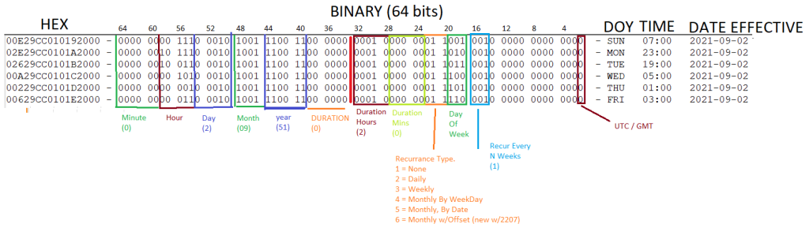
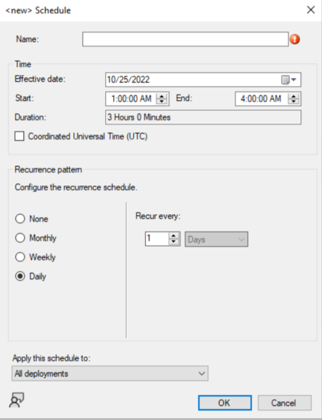
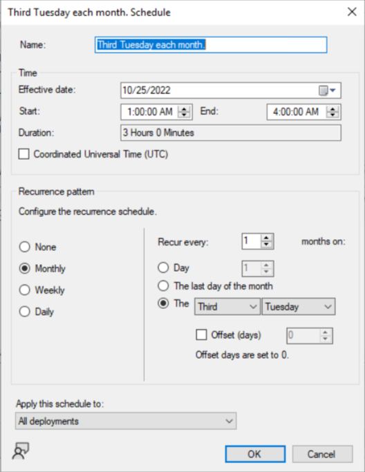
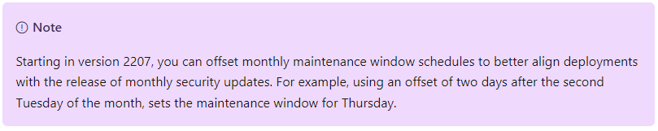
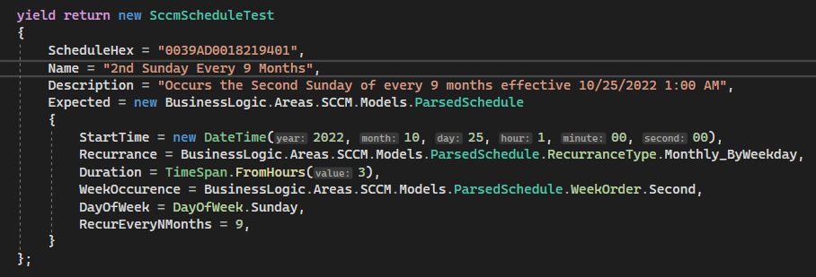
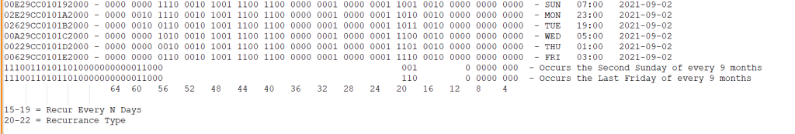

# SCCM – Parsing Collection Maintenance Windows from C-Sharp

## Introduction

This post details how to extract useful information from the SCCM Schedules format.

<!-- more -->

### Suggested Reading

Here are a few useful links to documentation regarding some of the activities being performed-

**This solution makes heavy use of Logical AND operators.**

* [https://learn.microsoft.com/.../boolean-logical-operators](https://learn.microsoft.com/en-us/dotnet/csharp/language-reference/operators/boolean-logical-operators)

**As well as heavy use of shift operators.**

* [https://learn.microsoft.com/.../bitwise-and-shift-operators](https://learn.microsoft.com/en-us/dotnet/csharp/language-reference/operators/bitwise-and-shift-operators)

## The Format

You can view the SCCM service windows by querying the view, “vSMS_ServiceWindow”

Here is an example query for retrieving collections along with their service windows.

``` sql
select
    c.CollectionID
    ,c.SiteID
    ,c.CollectionName
    ,c.CollectionType
    ,c.ServiceWindowsCount
    ,c.LimitToCollectionID
    ,c.LimitToCollectionName
    ,c.ObjectPath
    ,sw.Name
    ,sw.ServiceWindowType
    ,sw.Description
    ,sw.Enabled
    ,sw.Schedules
from v_Collections c
JOIN vSMS_ServiceWindow sw on sw.SiteID = c.SiteID
ORDER BY c.LimitToCollectionName
```

When you query this- you will get a lot of common information about your collections, their names, collection IDs, types, etc.

The piece I want to focus on here, is extracting out the actual schedules, which are stored in the “Schedules” column of the results from the above query.

At a glance, it would appear this column is complete gibberish, containing values such as below-

```
00629CC0101A2000
00A29CC0101A2000
02A29CC0101A2000
02E29CC0101A2000
02A29CC0101D2000
02E29CC0101D2000
00229CC0101D2000
00629CC0101D2000
```

However, this is in fact, 64bits of data, stored as a hexadecimal string.

## Reversing the format

Using data from both [PART 1](https://xtremeownage.com/2019/05/31/c-parse-sccm-schedules-from-sql/) of this post, as well as a bunch of testing collections I created- I came up with this diagram showing the relationships of the data in that column.



For the time being- I will be focused on “Weekly” windows, which are service-windows which repeats on the specified day of the week, every week.

I will note, the format of the above data will change, depending on the recurrence type, stored in bits 20- 22.


| Low Bit | High Bit | N Bits | Data                 | Recurrence Type               |
|---------|----------|--------|----------------------|-------------------------------|
| 1       | 1        | 1      | Is Date GMT/CST      |                               |
| 4       | 8        | 3      | Recur Every N Days   | 2 = Daily                     |
| 14      | 16       | 3      | Recur Every N Weeks  | 3 = Weekly                    |
| 16      | 18       | 3      | Day Of Week          | 3 = Weekly                    |
| 10      | 12       | 3      | Week Order           | 4 = Monthly by WeekDay        |
| 13      | 16       | 4      | Recur Every N Months | 4 = Monthly by WeekDay        |
| 17      | 19       | 3      | Day Of Week          | 4 = Monthly by WeekDay        |
| 11      | 14       | 4      | Recur Every N Months | 5 = Monthly By Date           |
| 15      | 19       | 5      | Recur Every N Days   | 5 = Monthly By Date           |
| 7       | 9        | 3      | Offset Days          | 6 = Monthly By Weekday Offset |
| 10      | 12       | 3      | Week Order           | 6 = Monthly By Weekday Offset |
| 13      | 16       | 4      | Recur Every N Months | 6 = Monthly By Weekday Offset |
| 17      | 19       | 3      | Day Of Week          | 6 = Monthly By Weekday Offset |
| 20      | 22       | 3      | Recurrence Type      |                               |
| 23      | 27       | 5      | Duration (Mins)      |                               |
| 28      | 32       | 5      | Duration (Hours)     |                               |
| 33      | 38       | 6      | Duration (???)       | Unsure- of what this is.      |
| 39      | 44       | 6      | Date – Year          |                               |
| 45      | 48       | 4      | Date – Month         |                               |
| 49      | 53       | 5      | Date – Day           |                               |
| 54      | 58       | 5      | Date – Hour          |                               |
| 59      | 64       | 6      | Date – Minute        |                               |

### Converting the HEX string into a ulong for processing.

``` csharp
    if (!ulong.TryParse(Hex, System.Globalization.NumberStyles.HexNumber, provider: null, out ulong Result))
      throw new Exception("Invalid hex provided. Unable to parse.");
```

While there is nothing special about converting a string containing HEX, into a number- there is one important thing to note here- I am parsing the value as ulong, instead of long.

The reason behind using ulong- all of the values are unsigned. If we parse as long instead, this will make it harder to manipulate the data later on, as c# will assume all of the resulting arithmetic results in signed numbers.

If you don’t know the difference between signed / unsigned-

Signed data types leverage the most significant bit, to determine if the value is negative or positive. This allows them to hold a negative value, but, sacrifices half of the maximum value.

Unsigned- uses all of the bits for numeric data.


### Common Fields

Bit 1, corresponds to “IS GMT / CST”, and is common for all types.

Bits 23-38 contains the duration, which is common for all recurrence types. I am unsure of what bits 33-38 stores…

Bits 39 – 64 contains the effective “Start Date” which is common and shared for all recurrence types. Parsing out this data is pretty easy.

Used the table above- we shift the data the specified number of bits, and do a bitwise AND to only include the number of bits notated.

``` csharp
    var Flags = (Result >> 19) & 0x7;                       //Recurrence Type Flags - 3 bits.
    model.Recurrance = (ParsedSchedule.RecurranceType)Flags;

    var R_Duration_Mins = (Result >> 22) & 0x1F;            //Duration Mins - 5 bits.
    var R_Duration_Hours = (Result >> 27) & 0x1F;           //Duration Hours- 5 bits.
    model.Duration = new TimeSpan((int)R_Duration_Hours, (int)R_Duration_Mins, 0);

    var IsGMT = (Result & 0x1) == 1;                    //First bit, specifies if this schedule is GMT, or Local.
    var Duration = (Result >> 32) & 0x3F;              // 6 bits. Not, sure exactly what this field's purpose is.
    var Year = ((Result >> 38) & 0x3F) + 1970;         // 6 bits + 1970
    var Month = (Result >> 44) & 0xF;                   // 1 byte
    var Day = (Result >> 48) & 0x1F;                    // 5 bits
    var Hour = (Result >> 53) & 0x1F;                   // 5 bits
    var Minute = (Result >> 58);                        // Remaining 6 bits. (Operating on a 64-bit ulong, no need to mask the rest)
    model.StartTime = new DateTime((int)Year, (int)Month, (int)Day, (int)Hour, (int)Minute, 0, IsGMT ? DateTimeKind.Utc : DateTimeKind.Local);
```

The final cast to int is needed, otherwise, you would receive a syntax error because you cannot create a datetime with ulongs.

I will note, I am not using checked when casting, as…. well. It’s impossible to overflow an int with only 6 bits….

### Recurrence Type

The Recurrence type, stored in bits 20-22, will determine the data stored in bits 2-19.

From my research, I have found these possible values:

##### None = 1
This service windows is not recurring, and will only occur once on the date provided.

##### Daily = 2
This schedule will repeat every N Days.



##### Weekly = 3
This schedule, will repeat on the specified day of the week, every week.

##### Monthly By Week Day = 4

This Schedule will occur every month, on a given weekday.



##### Monthly, With Offset = 6
This is the same as “Monthly by week day”, but, with the “Offset” checkbox checked.

This came with SCCM 2207

From Microsoft-



### Parsing out Recurrence-Specific Fields.

``` csharp
switch (model.Recurrance)
{
    case ParsedSchedule.RecurranceType.None:
        break;
    case ParsedSchedule.RecurranceType.Daily:
        model.RecurEveryNDays = (int)((Result >> 3) & 0x1F);                      //5 Bits
        break;
    case ParsedSchedule.RecurranceType.Weekly:
        model.DayOfWeek = (DayOfWeek)(((Result >> 16) & 0x7) - 1);                // 3 bits.
        model.RecurEveryNWeeks = (int)((Result >> 13) & 0x7);                     // 3 bits
        break;
    case ParsedSchedule.RecurranceType.Monthly_ByWeekday:
        model.WeekOccurence = (ParsedSchedule.WeekOrder)((Result >> 9) & 0x7);    // 3 bits
        model.RecurEveryNMonths = (int)((Result >> 12) & 0xF);                    // 4 bits
        model.DayOfWeek = (DayOfWeek)(((Result >> 16) & 0x7) - 1);                // 3 bits        
        break;
    case ParsedSchedule.RecurranceType.Monthly_ByDate:
        model.RecurEveryNDays = (int)((Result >> 14) & 0x1F);                     // 5 bits
        model.RecurEveryNMonths = (int)((Result >> 10) & 0xF);                    // 4 bits
        break;
    case ParsedSchedule.RecurranceType.Monthly_ByWeekDay_Offset:
        model.DayOfWeek = (DayOfWeek)(((Result >> 16) & 0x7) - 1);                 // 3 bits.
        model.OffsetDays = (int)((Result >> 6) & 0x7);                             // 3 bits.
        model.WeekOccurence = (ParsedSchedule.WeekOrder)((Result >> 9) & 0x7);     // 3 bits
        model.RecurEveryNMonths = (int)((Result >> 12) & 0xF);                     // 4 bits
        break;
}
```

About the only thing special to note here- SCCM stores Days of week, starting with Sunday = 1. .NET Starts the week on Sunday = 0. To compensate, we just subtract 1.

I will also note, for “WeekOccurence”, 0 corresponds to last, 1 = first, 2 = second, 3 = third, 4 = forth.

### How did I obtain this data?
Easier said than done!

While, I knew the general format from my previous article, and the pseudocode linked from it- I needed to parse out the specific offsets, and field types. As well, I wanted to leverage proper bitwise operations instead of relying on odd string/hex manipulation. So- a lot of this was trial and error.

The first step I did- was to generate a large number of dummy schedules, copy the hex, and I built a bunch of unit tests.



I knew the expected output, so, I provided the expected values. After which- most of the process was running unit tests, and using a bit of logic.

A lot of the work was done in Notepad++, looking at the binary values, and trying to determine what fits where.



By removing the “Known” bits, and only comparing the unknown bits- it makes it pretty easy to find what data, fits where, by comparing multiple variations of the data.

In the above example, it can be determined bits 17-19, corresponds to the day of the week.

Overall, it took me about one full working day to reverse engineer all of the formats.