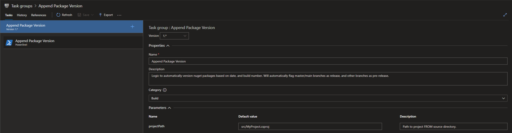

# TFS / Azure Devops - Semantic Versioning

I publish nuget packages. Alot of nuget packages.

I don’t have time to maintain nuget package versioning, so, I automatically generate versions based on the date and build number, like so: 2022.07.14.1

As well, I need support for alpha/beta/etc.

So, 2022.07.14.1-alpha.

Here is my method of doing it-

<!-- more -->

## 1. Task Group: Append Package Version

The first step, is to create a simple, reusable task group which runs powershell to append the package version to the .csproj file.

I have logic to automatically assign dev/* branches to -alpha, test or beta to -beta, qual / rc to -rc, master to production (no tag), and anything else gets assigned the -aa format, which is the lowest priority.

``` powershell
#Inputs
$input = Resolve-Path -LiteralPath "$(build.sourcesdirectory)\$(projectPath)"
$branch = "$(Build.SourceBranch)"
$buildNumber = "$env:BUILD_BUILDNUMBER"
$suffix = ""
$d = Get-Date
$prefix = $buildNumber


#Append -rc, -alpha, -beta versioning
$parts = ($branch -split '/')
if($parts[1] -eq "heads")
{
    if($parts[2] -eq "master")
    {
        #Production branch. Don't append anything.
    }
    elseif($parts[2] -eq "alpha" -or $parts[2].StartsWith("dev"))
    {
        $suffix  = "-alpha"
    }
    elseif($parts[2] -eq "beta" -or $parts[2] -eq "test")
    {
        $suffix  = "-beta"
    }
    elseif($parts[2] -eq "rc" -or $parts[2] -eq "qual")
    {
        $suffix  = "-rc"
    }
    else
    {
        #Unknown branch format. AA receives LAST priority in package selection.
        $suffix  = "-aa"  
    }
}

# For Debugging
Write-Output "Project Path: $input"
Write-Output "Build Number: $buildNumber"
Write-Output "VersionSuffix: $suffix"
Write-Output "VersionPrefix: $prefix"

#Get the Project Content
[xml]$content = (Get-Content -path $input)

#Remove all attributes for versioning. We will create new ones.
foreach($v in $content.SelectNodes("//VersionPrefix"))
{
    $v.ParentNode.RemoveChild($v)
}
foreach($v in $content.SelectNodes("//VersionSuffix"))
{
    $v.ParentNode.RemoveChild($v)
}
foreach($v in $content.SelectNodes("//Version"))
{
    $v.ParentNode.RemoveChild($v)
}


#create a new element with package version.
$newPG = $content.Project.AppendChild($content.CreateElement("PropertyGroup"))
$newPrefix = $newPG.AppendChild($content.CreateElement("VersionPrefix"))
$newPrefix.InnerText = $prefix
$newSuffix = $newPG.AppendChild($content.CreateElement("VersionSuffix"))
$newSuffix.InnerText = $suffix
Write-Output "Created new package version element"


Write-Output "Saving updated project."

#Save the modified file.
$content.Save($input)
```

Your task group just needs a simple parameter, accepting the expected project path.



## How to use?

I put this into my pipeline step, before my dotnet build / pack steps.

!!! notice
    Under Options, you will need to set the Build number format to:

    ```
    $(Year:yyyy).$(Month).$(DayOfMonth)$(Rev:.r)
    ```