# Building THE Swing set

A few years back, we had a 100+ mph wind gust hit my area. In addition to [knocking out the power for most of a week](./../../Solar/june-2023-lessons-learned.md){target=_blank}, it also had the side effect of leveling all of my trees, removing all of the soffit, and fascia from my house, and.... destroying most of the outdoor play sets for my kids. 

Basically- their swing set ended up in multiple pieces.

So, I was recently tasked with acquiring a new swing....

I decided to build one... that would be here long after I am gone.

<!-- more -->

### What- was the decision process to build a swing rather than buy one?

Originally, I checked the big name retail stores, Walmart, Sams, Atwoods, etc... looking at swingsets.

What I found- most of the cheap swings were between 200-400$

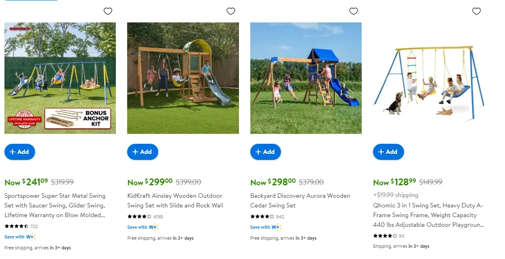

And- most of those cheap swing sets- were for pretty small children. As well, questionable quality, with thin-wall tubing that is easily damaged.

Since- I personally didn't want to end up with another broken swing set a few years later, due to another storm coming through... (I live in tornado alley)- I decided to look up higher quality swings.

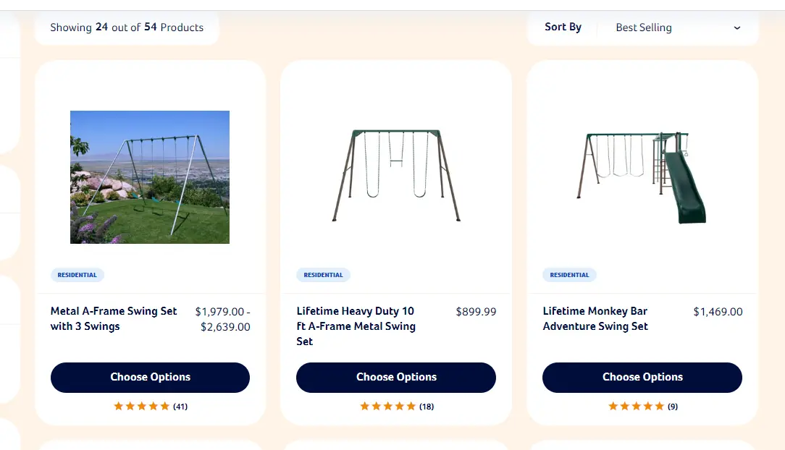

And- those typically ran between 1,000$, and 2,500$.

After pondering for a while- I felt I could build a rock-solid, solid-steel swing, for nearly less then the price of the cheap swings. I decided to give it a go.

## Materials Needed - 292$

#### 2 3/8" Steel Drill string - 135$

I found a local sellar on Facebook marketplace selling drill string. 

I was able to secure 32" sections of 2 3/8" drill string, for 45$ per section.

I also picked up a couple sections of 2 7/8" string, for 63$ per section.

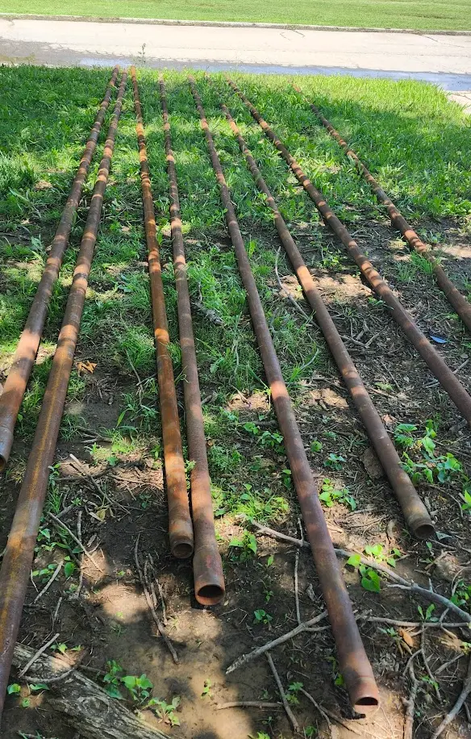

Originally- I was considering building the swing from the 2 7/8" tubing- but changed my mind after seeing how much thicker/heavier it was.

For context- here is my hand, around a piece of 2 7/8"

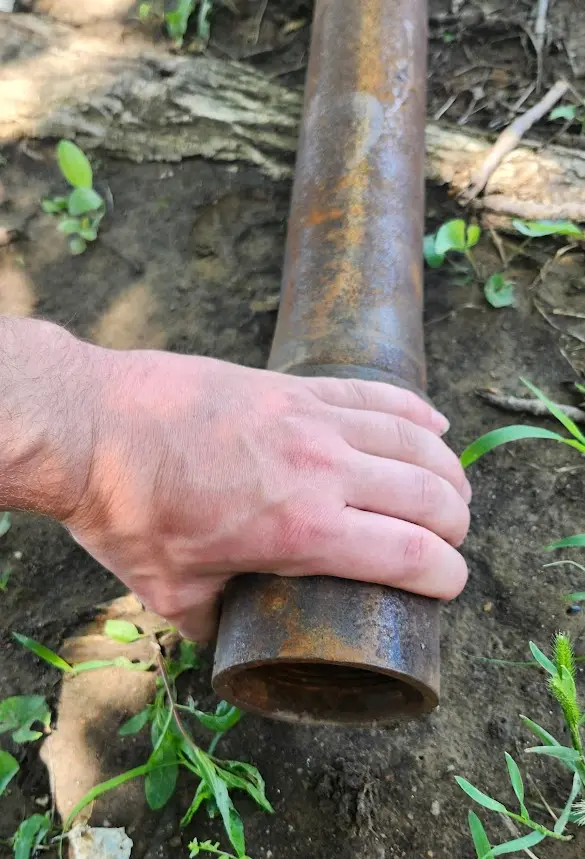

For- this swing, I needed three full sections of 2 3/8". This costed 135$.

I also needed two 6" sections of the 2 7/8, however, this isn't needed. You will see where this was used later on. (The 2 3/8" fits perfectly into the 2 7/8", making it easy to make a swing you can disassemble and transport)

#### 3/8" Steel D-Rings - 33$

With the primary structural materials out of the way- I needed to find a way to mount the swings and accessories to the set.

After evaluating many different options, swing hangers, pipe-clamp swing hangers, etc... I decided to just use simple D-Rings.

They are strong, durable, and cheap.

These, are rated for 6,000lbs before breaking.

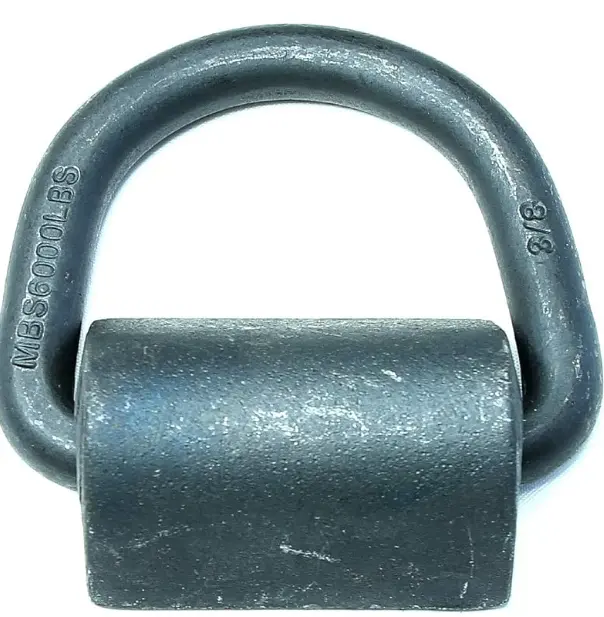

[Amazon Link](https://amzn.to/4csaFfJ){target=_blank}

The total cost for 12 D-Rings was 33$ 

You need two d-rings, per swing.

#### 1/8" Steel Gusset Plates - 26$

For reinforcing certain areas, I decided to pick up some pre-cut steel triangles. 

Each swing only needed a handful of these- however, I will use them on other projects, as it saves the time for me to cut the metal myself.

As well- the lines on these are straight. Anything I cut, is far from straight.

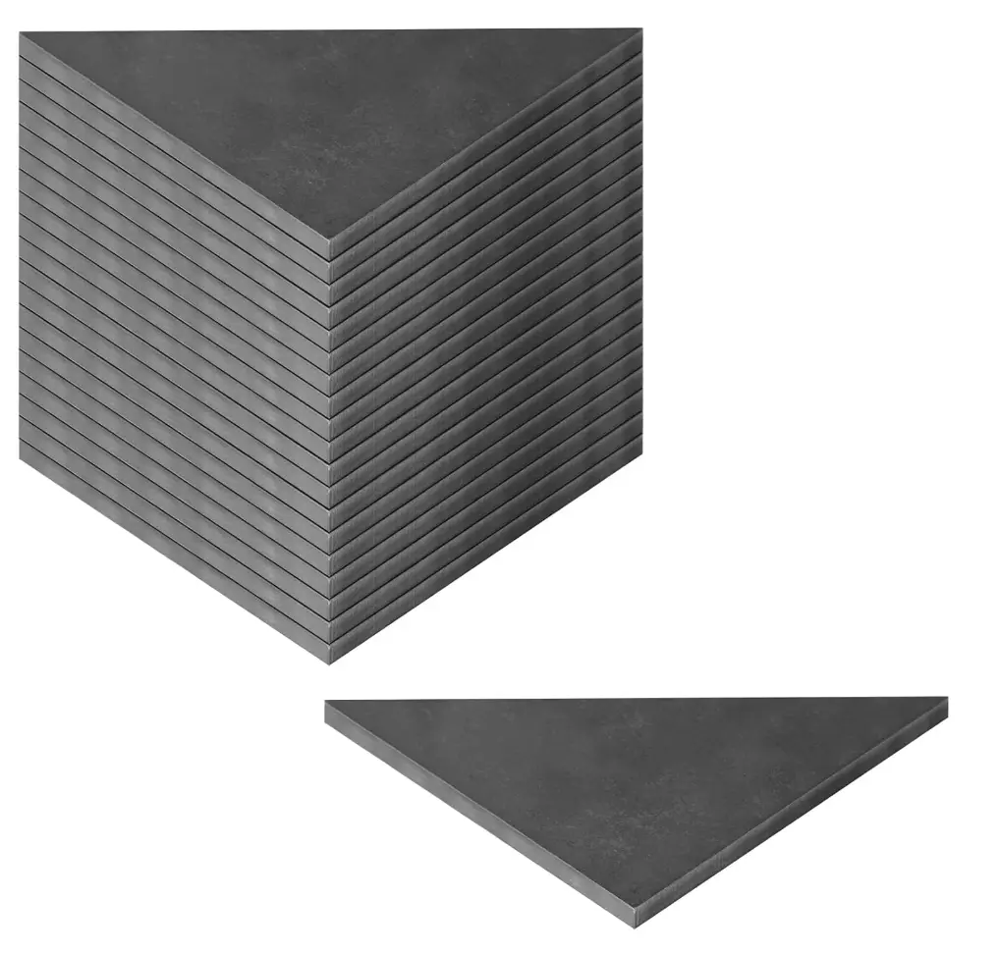

The cost of these, was 29.99$ for 20 pieces of 4x4 1/8" triangles / gussets.

[Amazon Link](https://amzn.to/4edXSyO){target=_blank}

#### Welding Rods - 56.98$

For welding- I decided on using 3/32" 6011 + 1/8" 7018 stick.

I decided on stick- because using a tig outside in the wind, is not very fun. My mig, is not very suitable for welding the thick-gauge metal. Its just a tiny 110v flux-core unit. 

6011 was used for root passes, tack welds, etc. I did not use 6010, because my inverter welder, does not handle 6010 very well. 6011 runs much better, and produces the same results.

As a bonus- 6010/6011, isn't very picky on surface prep. It has no issues welding right through surface rust, or other issues.

The 7018 was used for "final" welding. It also runs like smooth butter, and produces a much better end-result. 

!!! info
    Note- 7018 rods are low-hydrogen. They will easily absorb moisture from the area, causing reduced weld quality.

    It is recommended to either use a rod oven, or literally bake your rods in an oven before using, to remove any moisture.

I used 3/32" for the 6011- because I already had a box laying around. I went with 1/8" 7018, due to the thickness of the metal being welded.

[Amazon - 10 lbs Hobart 3/32" 6011](https://amzn.to/3VxnTlm){target=_blank}

[Amazon - 5lbs Hobart 1/8" 7018](https://amzn.to/3z1CaOo){target=_blank} - 20.99$

#### Rust-Oleum "Rust Reformer" - 35$

As, a Project-Farm fan, I typically watch his videos when applicable before acquiring products. 

In this case, he had [produced a video a few years ago, on rust converting methods.](https://www.youtube.com/watch?v=Ag46YUovPUc){target=_blank}

I had already picked out the Rust-Oleum before watching his video- but, ended up watching it, and using his link and saving 20$

That being said, the rust you see in the drill string earlier in this post- is all surface rust. That being said- I decided using this spray was a good method of getting it cleaned up and ready for paint.

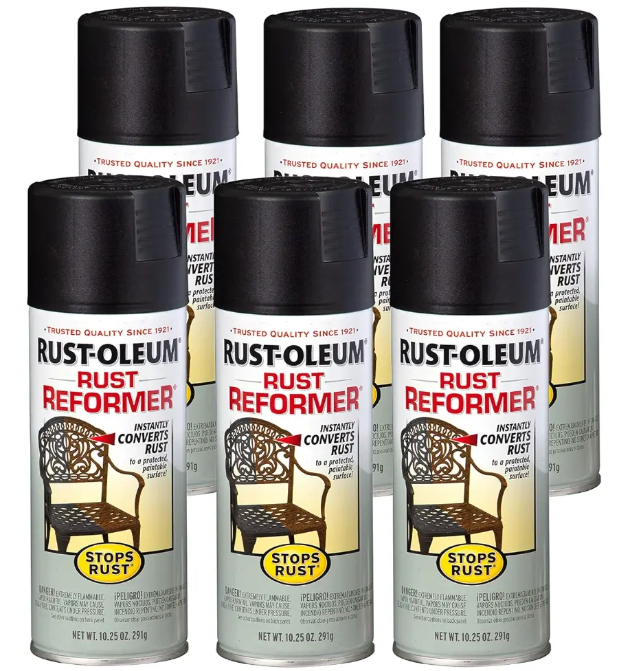

[Amazon Link](https://amzn.to/3Vvua0V){target=_blank}

I picked up the 6 pack, and paid... around 35$ Appears to be priced a few bucks more as of writing this post.

#### A marker - 6$

The last consumable material I needed... was a marker.

Not- a normal marker- but, I needed one that was capable of easily writing on the drill string. Most sharpies, and other common markers aren't typically up to the task.

As well, when you are cutting / welding on the metal- you need something capable of handling SOME heat.

I picked up a random one off of Amazon.

[Amazon Link](https://amzn.to/4edUODa){target=_blank}

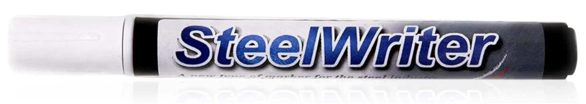

As- of the writing of this, I have already assembled the entire set- I will note, this pen performed flawlessly, and was easily legible, even with the welding hood on.

## Tools Used / Needed

#### A welding machine - 720$

For my welder, I used the AHP Alpha Tig 200x

I purchased this unit in March of 2018, and have been using it on various projects since. It has welded everything from thin aluminum cold-side tubing, and the steel hot-side of the turbo setup.

I have welded stainless steel kegs with it, cast-aluminum parts, I welded my cast-iron metal lathe back together with it, and, even did body-repairs on a lawnmower.

Overall- It has not given me any issues at all, and I would highly recommend it as a very cost-effective unit.

Mine does both TIG and Stick, up to 200 amps. It does both AC and DC, and has quite a few settings.

[Amazon Link - 2024 AHP AlphaTig 225Xi](https://amzn.to/3z1Da56){target=_blank}

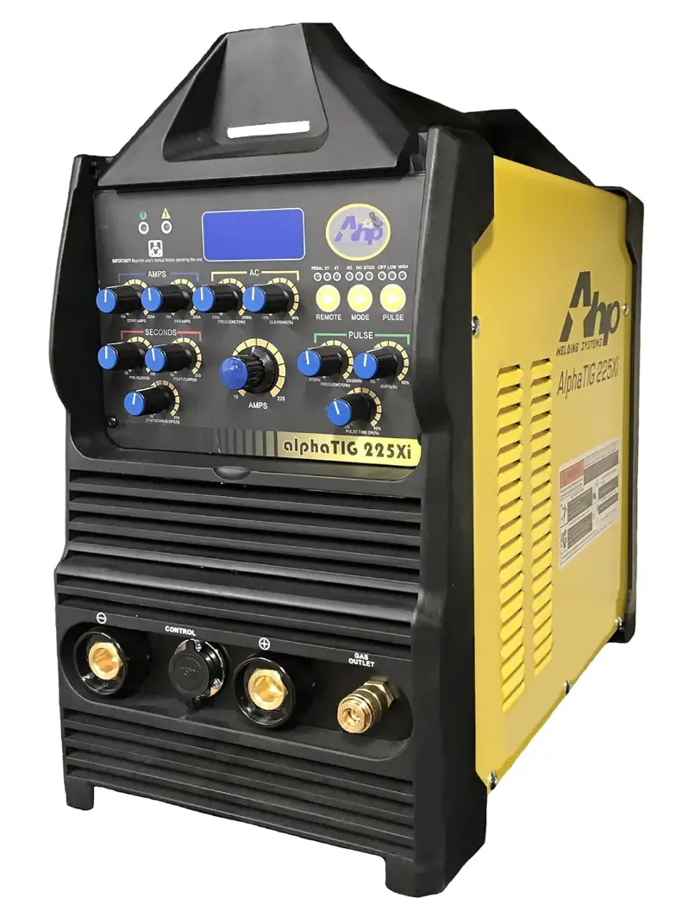

While- the above unit is 6 years newer then mine- It has all of the same features, but, better, and more.

For example- wider frequency settings, it now has a water-cooled torch option, a prettier-interface, and more adjustment options.

The best part- its the exact same price that I paid for my unit, 6 years ago.

These units also have a very good warranty. 

When I first ordered mine- I had a dud unit. I made a phone call, and a new unit was shipped to my house 3 days later. No charge. 

If- you want to read the specs on these units, [Please see AHP's website](https://ahpwelds.com/collections/tig-welders){target=_blank}

#### A plasma torch, or cutting torch. - 300$

For this project, I started out cutting everything with my oxy-acetylene torch. However- I ended up running out of oxygen three quarters through the first swing, and switched over to my cheap plasma cutter.

In 2020, I ended up ordering an el-cheapo "CUT50D" welder from Primeweld. 

There is nothing fancy about this unit. It was one of the cheapest units Amazon could deliver. 

And- here in 2024, its still going. It had no issues with the up to 1/2" thick steel plate.

[Amazon - CUT50 Plasma Cutter](https://amzn.to/3X6wEEq){target=_blank}

While cheap, it has not yet failed me, and does its job.

#### Die Grinder - Straight w/Burr

For my die-grinder, I have an Ingersoll rand unit. It has performed fantastically well over the years. Honestly, couldn't tell you how old it is.

[Amazon - Die Grinder - 308B](https://amzn.to/3yTzBy3){target=_blank}

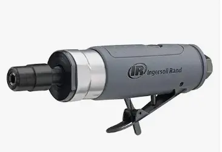

This was mainly used when notching the tube, to fit in specific angles.

For the burrs, I used a cheap no-name set. I picked these up in 2019- and they are still going strong. Although- they don't get used that often.

[Amazon - Carbide Burr Set](https://amzn.to/45cjB6o){target=_blank}

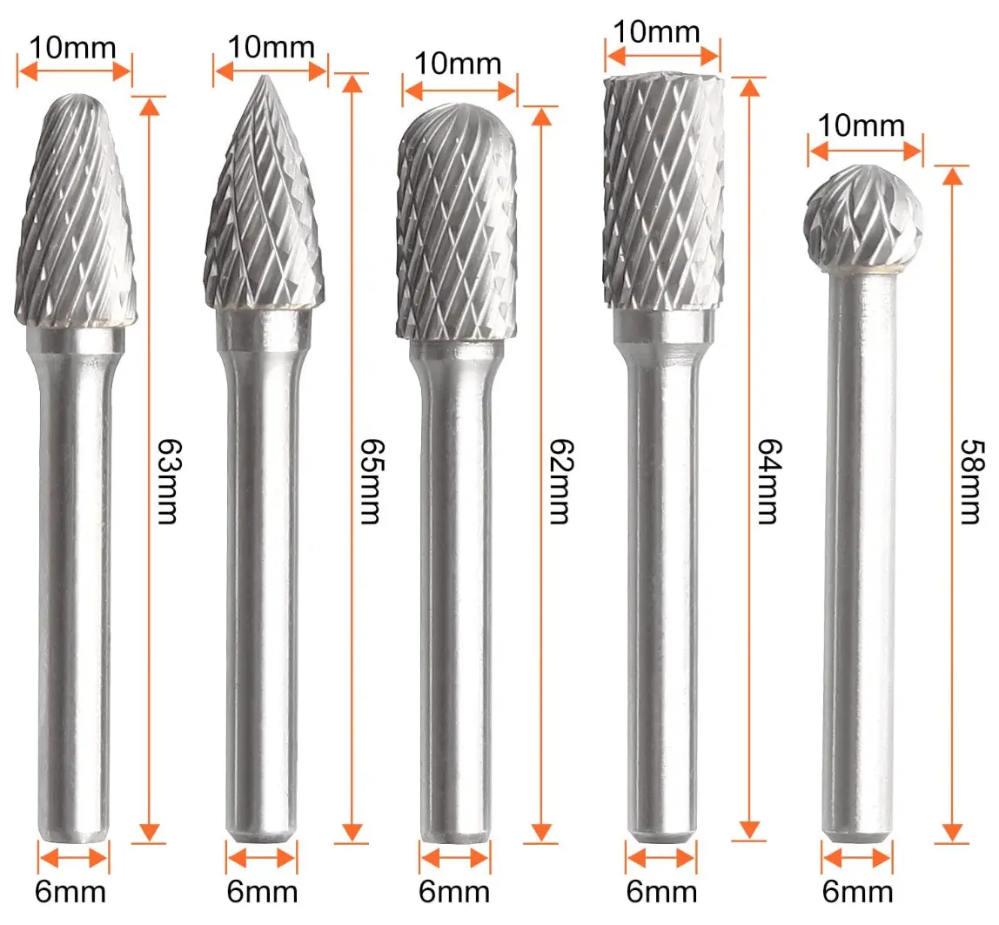

#### Angle Grinder & Flap Disks.

I will not pretend to be the best welder around. I KNOW my welds often look like poop.

That being said- A decent grinder, will make you the welder you aren't.

I personally, have a [Dewalt 11amp Angle Grinder - Amazon](https://amzn.to/3xhb99f){target=_blank}

Its, nothing fancy- however, it works well, and has plenty of power.

Then, I use it with the absolute cheapest flap disks I can find.

[Amazon - Dirt cheap flap discs](https://amzn.to/3VdLJS7){target=_blank}

I'm sure nicer discs might last longer- but, honestly, these work just fine for my needs. A box will last me quite a while.

#### Chop-saw - 200$

Back in 2018, I picked up a 14" Dewalt chopsaw. I don't recall the original need or purpose- but- I will note, it gets pretty frequent use.

[Amazon - Dewalt D28730](https://amzn.to/3yTztyz){target=_blank}

[Amazon - 14" Abrasive Wheels](https://amzn.to/3KxLiNy){target=_blank}

For this project- it was responsible for cutting the sections of both 2-3/8", and 2-7/8" tubing. It- had no issues performing this task.

I also used it for cutting the angle out for the feet.

Do- make sure to have extra abrasive blades on hand. I went through about two blades, per swing set.... Although, if you take your time, you will likely use less.

#### Other random tools

You need a wire brush for cleaning up your welds.

You need a good tape measure.

A magnetic level really helps.

A decent protractor / angle finder is useful. Or- you can just be very precise on your measurements, and do math.

## Building the swing

We decided to build the swings 10ft tall. This would be plenty tall so that it would never be out-grown.

As well- this opens up the flexibility of the swing, to other purposes as needed. (For example- being used as a engine hoist, etc.)

As trig is one of those skills- I feel you lose if you don't use.... I honestly do not remember much at all about trig, despite using calculus daily while doing software development. 

So- found a tool on the internet to do the trig for me.

Specifically- [THIS TOOL from blocklayer.com](https://www.blocklayer.com/trig/angleseng){target=_blank}

NORMALLY, the angle on a swing set is around 22 degrees or so. I did not want to build a swing set that would easily wobble when swinging. 

I also- did not want to concrete this into the ground, as it will easily weight over 400 lbs once completed.

So- I decided to go with a 45 degree angle. 

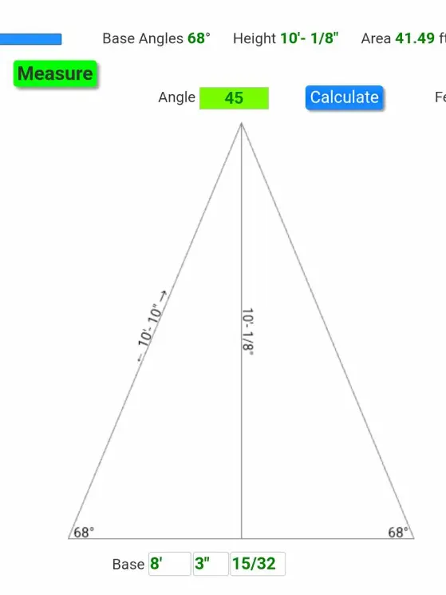

This, would give me a swing 10 foot tall, and slightly over 8 foot wide.

The first step- was to start cutting the tube, into 4x 10'10" sections. You will need two of these sections for each side.

After you have cut the sections- lay out two of them, in a roughly 45 degree angle.

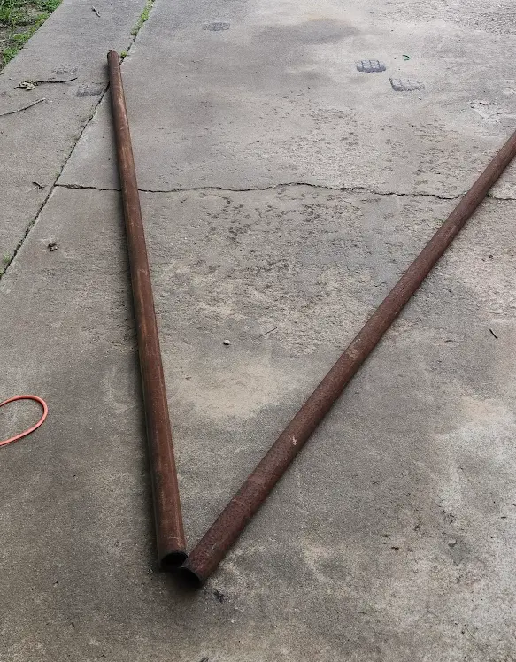

Next- I used a magnetic angle-finder to set the angle.

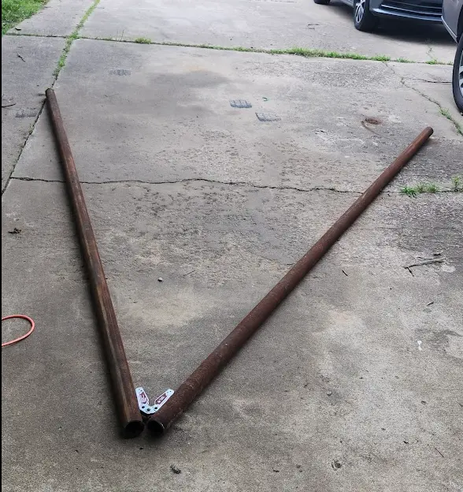

Not pictured- I used a tape measure to confirm the measurements with what was expected from the above diagrams.

After getting the angle set correctly, and confirming the measurements were as expected- I tack-welded the end, and welded a gusset plate to join both tubes.

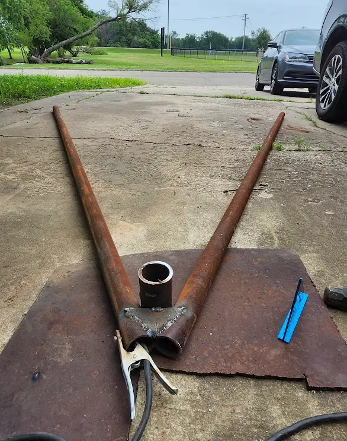
