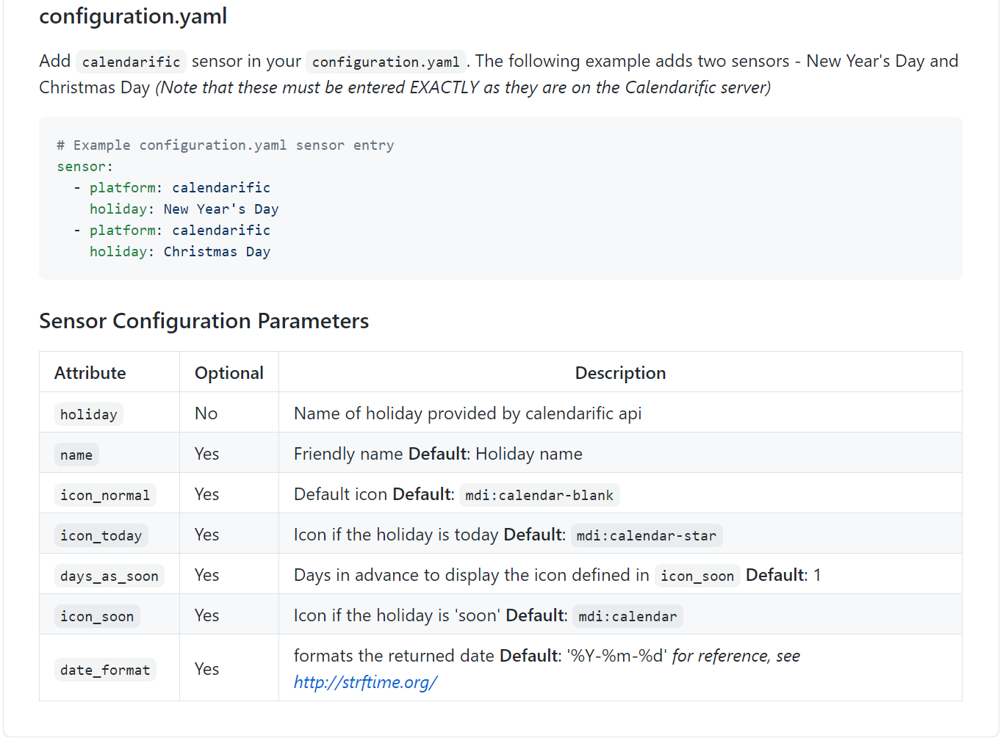
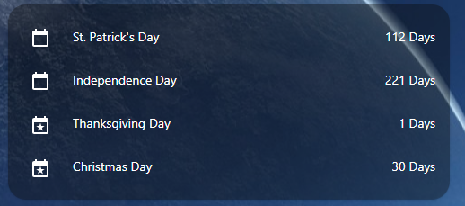
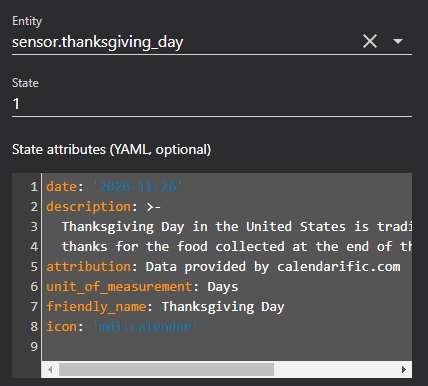
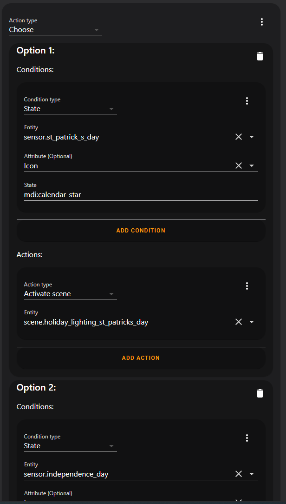
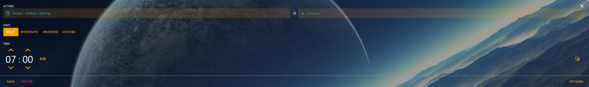
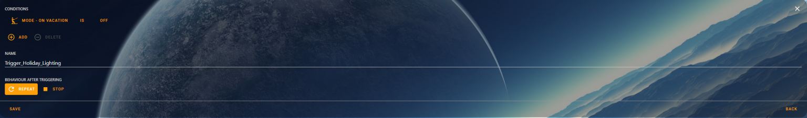

# Automate Holiday Lighting using Home Assistant

This week, I started installing WS2813 individually addressable LEDs around the house. I made a few simple patterns containing colors relevant to Thanksgiving and Christmas.

After manually turning on the lights for the 3rd day in a row… I thought to myself… This is automatable. So- I started down the quest to make it happen.

<!-- more -->

## Goals

1. To automate turning on holiday lightning relevant to the next upcoming holiday.
2. For Christmas- I want the christmas patterns to begin as soon as Thanksgiving is over.
3. For Thanksgiving, I want its pattern to start a week before Thanksgiving.
4. For Independence day, and St. patrick’s day, I only want the relevant patterns to display on that specific holiday.
5. In the future, I plan on putting addressable LED scripts on the exterior of my house. This solution needs to accommodate that.

## The Solution
First, I checked the built in integrations and sensors in Home Assistant. While you can [hack up the work_day sensor](https://www.home-assistant.io/integrations/workday/){target=_blank} to alert on specific holidays, it doesn’t allow me to easily setup a script or automation which triggers the proper colors, based on the holiday.

Personally- I try to avoid writing big, messy javascript lambdas as well.

After doing some research, I stumbled upon the [Calendarific integration](https://github.com/pinkywafer/Calendarific){target=_blank} in the [HACs store](https://hacs.xyz/){target=_blank}.

Out of the box, with minimal configuration, it offered the capabilities I required…. namely, being able to create a sensor for the specific holiday, with a configurable “lead” days.



Except from [Calendarific github page](https://github.com/pinkywafer/Calendarific){target=_blank}.
I started by following the directions posted in the above github article, and came up with this configuration.

To note- the integration has a built-in, configurable method of indicating when a holiday is upcoming. This is configured by the days_as_soon parameter.

To simplify configuration later, I specified the icon_soon as the same as icon_today. This way, I just need a single check to see if the icon_soon is set as "mdi:calendar-star" in my script.

``` yaml title="Configuration.yaml"
# https://github.com/pinkywafer/Calendarific
calendarific:
  api_key: (your calendarific api key here)
  # Country / State List: https://calendarific.com/supported-countries
  country: (your country here, based on the above link.)
  state: (your state here, based on the above link.)

sensor:
    # Calendarific documentation: https://calendarific.com/holidays/2020/us
  - platform: calendarific
    holiday: St. Patrick's Day  # March
    days_as_soon: 0
    icon_soon: mdi:calendar-star
  - platform: calendarific
    holiday: Independence Day   # June
    days_as_soon: 0
    icon_soon: mdi:calendar-star
  - platform: calendarific
    holiday: Thanksgiving Day   # November
    days_as_soon: 8
    icon_soon: mdi:calendar-star
  - platform: calendarific
    holiday: Christmas Day      # December
    days_as_soon: 30
    icon_soon: mdi:calendar-star
```

After saving the configuration and restarting Home Assistant, I created a simple “testing” dashboard to show the sensor values:





State display of one of the individual sensors.
Since- the state is just the days until the specific holiday, this makes it very easy to automate. Next- I started the process of building a few scenes for the different holidays.

``` yaml title="Scenes.yaml"
- id: holiday_thanksgiving
  name: Holiday Lighting - ThanksGiving
  icon: mdi:silverware-fork
  entities:
    light.livingroom_window_led:
      state: on
      brightness: 255
      effect: ThanksGiving Scan
- id: holiday_christmas
  name: Holiday Lighting - Christmas
  icon: mdi:pine-tree
  entities:
    light.livingroom_window_led:
      state: on
      brightness: 255
      effect: Christmas Scan
- id: holiday_independanceday
  name: Holiday Lighting - Independence Day
  icon: mdi:firework
  entities:
    light.livingroom_window_led:
      state: on
      brightness: 255
      effect: custom # I have not made the custom pattern yet for this one...
- id: holiday_stpattyday
  name: Holiday Lighting - St Patricks Day
  icon: mdi:gold
  entities:
    light.livingroom_window_led:
      state: on
      brightness: 125
      effect: None
      rgb_color:
      - 0
      - 255
      - 0
```

Since I now have sensors for each holiday, and I have scenes for each holiday, it is time to build the script to trigger the proper scene’s lighting.

For the script, here is the basic idea.

I use a [Choose](https://www.home-assistant.io/docs/scripts/#choose-a-group-of-actions){target=_blank}, which will only execute the first matching action. For the condition, I simply check each sensor, and look for the icon we configured for soon, or today. From the UI, it resembles this:



The UI designer for the choose statement to select the correct holiday.
Do note- I specified the holidays in the order of which the year they occur. I did this- because in the criteria I set above.. of say, trigger christmas 30 days out-…. If christmas occured before thanksgiving on the choose, it would be picked instead because. However, with the order set properly, as soon as thanksgiving is over, the christmas scene will be applied.

Here is the full configuration for the script:

``` yaml title="Automation Example YAML"
trigger_holiday_scene:
  alias: Global - Holiday Lighting
  icon: mdi:calendar
  mode: single
  sequence:
  - choose:
    - conditions:
      - condition: state
        entity_id: sensor.st_patrick_s_day
        state: mdi:calendar-star
        attribute: icon
      sequence:
      - scene: scene.holiday_lighting_st_patricks_day
    - conditions:
      - condition: state
        entity_id: sensor.independence_day
        state: mdi:calendar-star
        attribute: icon
      sequence:
      - scene: scene.holiday_lighting_independence_day
    - conditions:
      - condition: state
        entity_id: sensor.thanksgiving_day
        state: mdi:calendar-star
        attribute: icon
      sequence:
      - scene: scene.holiday_lighting_thanksgiving
    - conditions:
      - condition: state
        entity_id: sensor.christmas_day
        state: mdi:calendar-star
        attribute: icon
      sequence:
      - scene: scene.holiday_lighting_christmas
    default: [] # No holiday? No scene!
```

The only task to do now, is to schedule the lighting. For this, I will the “[Scheduler Card](https://github.com/nielsfaber/scheduler-card){target=_blank}” and “[Scheduler Component](https://github.com/nielsfaber/scheduler-component){target=_blank}“. I personally enjoy this card, because it gives a very simple, unified interface for creating schedules with simple conditions.

To note- I put the above logic into a script, to make it reusable by multiple automations. If you have no such need, you can place the above logic into an automation instead.

Here is the configuration:





And- with that, the automation for triggering holiday lighting scenes is now complete.


The steps to add more holidays is pretty simple.

1. Setup a calendarific sensor the additional holidays.
2. Create a new “Lighting” scene for the new holiday.
3. Update your script/automation and add in the new condition/trigger scene.

## Notes

There is no need to use a seperate script and automation/trigger, if you don’t wish for the additional flexibility. You can use a single automation to simplify.

If you don’t intend on having many devices in your scenes and you would like to simplify the configuration, you can instead put the actions directly inside of your script or automation.

If you want to get fancier, you can also have different actions apply depending on IF it is the holiday, or if the holiday is upcoming. However, I do not currently require that functionality.

## Update - 2023-01-08

Wow, I can't believe this was written 2-3 years ago. This setup still works fantastically fine for me, the only real change- I have a lot more WLED devices laying around now.

I will note, a few times a year, the calandarific api key will start fussing about my API key having fetched too many times. When this happens, I just rotate to another key I have laying around, and the error goes away for a few months.

As well- this post was migrated over to the static site today.