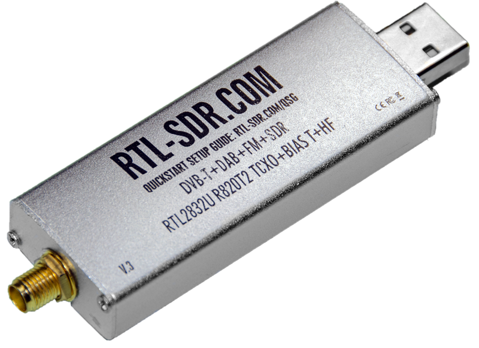

# 433 Mhz Temp / Humidity Sensors

How to get started with 433mhz based automation and sensors. 

This article, will provide the basic steps, for integrating 433mhz based sensors, using docker containers, and an RTL-SDR



<!-- more -->

## Why I recommend 433mhz automation?

### What are the benefits?

1. Battery life is measured in years. 
2. Range is exceptionally well, and not strongly affected by interior walls.
3. Update frequency is generally every 15-30 seconds.
4. The sensors are cheap, and easy to get on-boarded.
5. This solution is extremely reliable.

Lastly- it makes it very easy to create a dashboard showing the temp and humidity for every room inside your house.


<sub>Note- all three of the above bedrooms, the livingroom, and outdoor sensors are 433mhz. The other various sensors are different technologies.</sub>

### What are the downsides?

1. You will need a dedicated RTL-SDR stick, and antenna (rabbit-ears are fine.).
2. 433mhz has no security. Anybody in range, with the proper equipement can see the measurements.
    * This- generally isn't a huge issue- as I don't too much care if others can see the various temp/humidity measurements from my property.
    * The data has no personally identifable information. It looks like this:

``` json
{"time":"2022-11-19 16:49:55","model":"Acurite-Tower","id":14824,"channel":"C","battery_ok":1,"temperature_C":20.1,"humidity":45,"mic":"CHECKSUM"}
```


## Required Hardware

1. RTL_SDR Radio – Around 20-40$
    * I personally used the [RTL-SDR v3](https://amzn.to/3ndqO0M){target=_blank} however, they do not appear to be for sale anymore.
    * The [NooElec NESDR Mini 2](https://amzn.to/3gn4ySj){target=_blank} appears to be pretty popular now, with an extremely reasonable price.
2. 433mhz Sensors
    1. [AcuRite 06002M Indoor / Outdoor Temp/Humidity Sensor](https://amzn.to/2YhcAiS){target=_blank}
        * These are my top pick
    2. [AcuRite 606TX Indoor/Outdoor Temp Only](https://amzn.to/3EmSp7R){target=_blank}
        * Cheaper than the 06002M, however, only transmits temp. No humidity.
    3. [AcuRite 00986M Fridge/Freezer Temp Only](https://amzn.to/3V8FgWT){target=_blank}
        * I use these to monitor my fridge/freeze temps.
        * Includes a magnetic display you can put on your fridge.
        * Only recommended for fridge/freezer monitoring. Does not work above 100F.


## Installing RTL_433

In order to convert the 433mhz message into MQTT messages, we will be leveraging the software, [rtl_433](https://github.com/merbanan/rtl_433){target=_blank}.

Depending on your environment, there are a few ways to go about setting this up. I will detail kubernetes, docker-compose, and home-assistant.

=== "Docker Compose"
    This is the method I used for around two years to run rtl_433. Only recently did I switch everything over to Kubernetes.
    ``` yaml title="docker-compose.yaml"
	  rtl_433:
        image: hertzg/rtl_433:master
        hostname: rtl_433
        container_name: rtl_433
        #command: '-Fmqtt://IP_OR_HOSTNAME_OF_MQTT_SERVER:MQTT_PORT,events=MQTT_TOPIC[/model][/id]'  
        command: '-Fmqtt://mqtt:1883,events=rtl_433[/model][/id]'  
        devices:
          - /dev/bus/usb
        ## Note, I Leverage cgroups to only pass through the specific RTL-433 stick.
        ## I have left this section commented out for ease of use.
        #device_cgroup_rules:
        #  - 'a 189:* rwm'                                           
        volumes:
          - /etc/timezone:/etc/timezone:ro
          - /etc/localtime:/etc/localtime:ro
          - rtl_433:/etc/rtl_433
        labels:
          ## Enable watchtower automatic updates.
          com.centurylinklabs.watchtower.enable: true
        restart: unless-stopped
    volumes:
      rtl_433:
        name: rtl_433
    ```

=== "Kubernetes"
    To note- I simplified the manifests to make this more accessible to new-comers.
    ``` yaml title="rtl_433.yaml"
    # Create a namespace
    kind: Namespace
    apiVersion: v1
    metadata:
      name: rtl_433
    ---
    apiVersion: apps/v1
    kind: StatefulSet
    metadata:
      name: rtl-433
      namespace: rtl_433
    spec:
      replicas: 1
      serviceName: rtl-433  
      selector:
        matchLabels:
          app: rtl-433
      template:
        metadata:
          labels:
            app: rtl-433  
        spec:  
          volumes:
            ## Custom Configuration - Will need to uncomment to leverage a custom configuration.
            #- name: config
            #  configMap:
            #    name: rtl-config
            #    defaultMode: 420
            - name: usb
              hostPath:
                path: /dev/bus/usb
          containers:
            - name: rtl-433        
              image: hertzg/rtl_433:master
              securityContext:
                privileged: true  # This is required to pass in the host path containing the USB devices.... At least until Kubernetes has an easier way to do device passthrough.
              args:
                - '-Fmqtt://mqtt:1883,events=rtl_433[/model][/id]'    # NOTE- Replace mqtt:1883 with the IP/Hostname, and port of your MQTT server. 
              volumeMounts:
                ## If you want to pass through a custom configuration, you will need to uncomment these lines.
                #- name: config
                #  mountPath: /etc/rtl-433
                - mountPath: /dev/bus/usb
                  name: usb
          nodeSelector:
            # Requires rtl stick. (See below comments.)
            #feature.node.kubernetes.io/custom-rtl: 'true'
    ```
    Regarding `feature.node.kubernetes.io/custom-rtl`, the line is commented out because I cannot assume everyone runs [Node Feature Discovery (NFD)](https://intel.github.io/kubernetes-docs/nfd/index.html){target=_blank}.

    As such- I left the required label commented. If however- you need an example as to how my values.yaml are configured for the RTL-SDR stick- here is an excerp from my values.yaml used by the helm chart.

    I would highly recommend using NFD.

    ``` yaml title="values.yaml"
      worker:
        config:
          sources:
            custom:
            - name: "rtl" # RTL2838 radio dongel
              matchOn:
                - usbId:
                    vendor: ["0bda"]
                    device: ["2838"]
    ```

    If you wish to pass through a custom configuration file, you will need to uncomment the lines in the above manifest under volumes, and volume mounts. See the [Example RTL_433 configuration file](https://github.com/merbanan/rtl_433/blob/master/conf/rtl_433.example.conf){target=_blank}

    ``` yaml title="rtl-config.yaml"
    kind: ConfigMap
    apiVersion: v1
    metadata:
      name: rtl-config
      namespace: rtl_sdr
    data:
      rtl_433.conf: >
        # config for rtl_433

        # A valid config line is a keyword followed by an argument to the end of line.
        # Whitespace around the keyword is ignored, whitespace is space and tab
        # Comments start with a hash sign, no inline comments, empty lines are ok.
        #
        # Boolean options can be true/false, yes/no, on/off, enable/disable, or 1/0
        #
        # All options will be applied in the order given, overwriting previous values
        #
        # Config files can be nested/stacked (use multiple -c and config_file = ).
        #
        # If no -c option is given the first found of this list will be loaded:
        # - ./rtl_433.conf
        # - ~/.config/rtl_433/rtl_433.conf
        # - /usr/local/etc/rtl_433.conf
        # - /etc/rtl_433.conf

        ## General options

        # as command line option:
        #   [-v] Increase verbosity (can be used multiple times).
        #        -v : verbose, -vv : verbose decoders, -vvv : debug decoders, -vvvv : trace decoding).
        # 0 = normal, 1 = verbose, 2 = verbose decoders, 3 = debug decoders, 4 = trace decoding
        #verbose

        # as command line option:
        #   [-c <path>] Read config options from a file
        #config_file
        ## Rest of this file is truncated. Please see the example file linked above.

    ```
=== "Home Assistant"
    [rtl_433 Home Assistant Add-on](https://github.com/pbkhrv/rtl_433-hass-addons){target=_blank}

    I will note, there are two versions, one with auto-discovery, and one without.

    I personally, recommend not using auto-discovery, unless you don't mind having entities created for each tire on every other car driving down the road.

    <sub>Tire pressure sensors typically leverage 433mhz to transmit information. If you live in a busy area- this can generate a lot of entities.</sub>

    To note, I do not use this method, However- I have assisted multiple people with executing this method, and it works flawlessly.


## Validate RTL_433 is working properly

Regardless of the above method utilized to install your rtl_433 container- you should connect to your MQTT broker, and verify the data is being properly received.

I personally use [MQTT Explorer](http://mqtt-explorer.com/){target=_blank} to view my broker. Its small, simple, and fast.

After connecting to your broker, you should see a topic named, "rtl_433"


<sub>Note- the above image was edited to remove non-relavent topics to protect my privacy</sub>

If, you can see data coming into the topic- you are ready to move to the next section.

However- if you cannot see data, I would recommend looking at the container's logs.

## Configuring Home Assistant

Next up, we need to configure the sensors for home-assistant. Depending on the method you went with (docker,kubernetes,add-on), this section will be slightly different for you.

This is because with the docker-compose / kubernetes route, I specified a custom format, which I believe was more suitable for this data.

#### Common Configuration.

If you are like me, you will wind up having a ton of sensors. I personally didn't want to bloat home-assistant's `configuration.yml`, So, for this example, we will leverage YAML's ability to include another file.

``` yaml title="configuration.yaml"
mqtt:
  sensor: !include mqtt_sensors.yaml
  binary_sensor: !include mqtt_binary.yaml
```


=== "Docker-Compose / Kubernetes"
    The format and configuration is the same between the above Docker and Kubernetes deployments.

    **Example Events, in JSON Format**

    Acurite Tower - Example Event
    ``` json title="rtl_433/Acurite-Tower/6731"
    {"time":"2022-11-19 18:33:51","model":"Acurite-Tower","id":2888,"channel":"B","battery_ok":1,"temperature_C":22.4,"humidity":42,"mic":"CHECKSUM"}
    ```

    Acurite 606TX - Example Event (Note, no humidity)
    ``` json title="rtl_433/Acurite-606TX/164"
    {"time":"2022-11-19 18:33:58","model":"Acurite-606TX","id":164,"battery_ok":1,"temperature_C":22.9,"mic":"CHECKSUM"}
    ```

    First- we need to define the temp and humidity sensors.

    ``` yaml title="mqtt_sensors.yaml"
      ## 6731 = Back Porch
      - name: back_porch_temp                                 # Set your preferred name here.
        state_topic: "rtl_433/Acurite-Tower/6731"             # This needs to match the path as seen in your MQTT server.
        json_attributes_topic: "rtl_433/Acurite-Tower/6731"   # This, should match the state_topic above.
        value_template: "{{ value_json.temperature_C }}"      # This should match the json attribute containing your temperature.
        device_class: temperature               
        unique_id: 6731_temp                                  # This value needs to be unique PER sensor.   
        unit_of_measurement: '°C'                             # This needs to match the measurement as seen in your MQTT events. You change your performance preference within Home-Assistant's GUI.
        expire_after: 600                                     # After 10 minutes of no-data, report as unavailable.

      - name: back_porch_humidity                             
        state_topic: "rtl_433/Acurite-Tower/6731"
        json_attributes_topic: "rtl_433/Acurite-Tower/6731"
        value_template: "{{ value_json.humidity }}"
        device_class: humidity
        unique_id: 6731_humidity
        unit_of_measurement: '%'                               # '%' is the unit of measurement for humidity.
        expire_after: 600


      ## Note- if you have the Acurite-606TX, you will only define a sensor for temperature.
      - name: random_temp
        state_topic: "rtl_433/Acurite-606TX/14"
        json_attributes_topic: "rtl_433/Acurite-606TX/14"
        value_template: "{{ value_json.temperature_C }}"
        device_class: temperature
        unique_id: 14_temp
        unit_of_measurement: '°C'
        expire_after: 600
    ```

    The Acurite sensors report battery information back as "battery_ok", with a value of 1 for yes, or 0 for no. We will

    ``` yaml title="mqtt_binary.yaml"
    - name: back_porch_battery_ok                               # Unique name for this sensor
      state_topic: "rtl_433/Acurite-Tower/6731"                 # Needs to match the json topic name
      json_attributes_topic: "rtl_433/Acurite-Tower/6731"       # Needs to match the json topic name
      value_template: "{{ value_json.battery_ok }}"             
      payload_off: 0  
      payload_on: 1
      unique_id: 6731_battery                                   # Unique value for this sensor.
    ```

    And- thats it. 

=== "Home-Assistant RTL_433 Addon"
    Since I leverage JSON format when using either the Docker or Kubernetes deployment, and the home-assistant addon does not- we will need to do our configuration slightly different.

    Since-I do not leverage this method- I do not have any example events to share.

    ``` yaml title="mqtt_sensors.yaml"
    - name: Outdoor Temperature                                                           # Friendly name for your sensor
      state_topic: "rtl_433/74930c0d-rtl433/devices/Acurite-Tower/A/2415/temperature_C"   # This needs to match the state topic containing the temp.
      device_class: temperature
      object_id: outdoortemp_temp                                                         # Needs to be unique
      unique_id: outdoortemp_temp                                                         # Needs to be unique
      unit_of_measurement: "°C" 
      expire_after: 600
    - name: Outdoor Humidity
      state_topic: "rtl_433/74930c0d-rtl433/devices/Acurite-Tower/A/2415/humidity"        # This needs to match the state topic containing the humidity.
      device_class: humidity
      object_id: outdoorhum_temp
      unique_id: outdoorhum_temp
      unit_of_measurement: '%'
      expire_after: 600
    ```

    The Acurite sensors report battery information back as "battery_ok", with a value of 1 for yes, or 0 for no. We will

    ``` yaml title="mqtt_binary.yaml"
    - unique_id: garagefreezer_battery_ok                                                # Must be a unique name.
      state_topic: "rtl_433/74930c0d-rtl433/devices/Acurite-986/1R/49691/battery_ok"     # This needs to match the state topic for "battery_ok"
      name: Garage Freezer Battery                                                       # Put a friendly name here.
      device_class: battery
      payload_off: 1
      payload_on: 0
    ```

## Conclusion

At this point, you are all done. After restarting home assistant, or reloading its MQTT configuration- you should have working sensors within Home-Assistant.


##### History

This post was migrated from my [Wordpress Site](https://xtremeownage.com/2021/01/25/homeassistant_433/){target=_blank}. The original post was written in Jan, 2021.

Since creating the orignal post, all of my sensors have been working flawlessly.

I did- however, leave out the section on the Sonoff RM433, as I have not found it very useful.

You may also want to check out the original [Fridge / Freezer Monitoring Post](https://xtremeownage.com/2022/06/29/433mhz-fridge-freezer-monitoring/){target=_blank} for more information.