# Full local Z-Wave HVAC Control

## Introduction

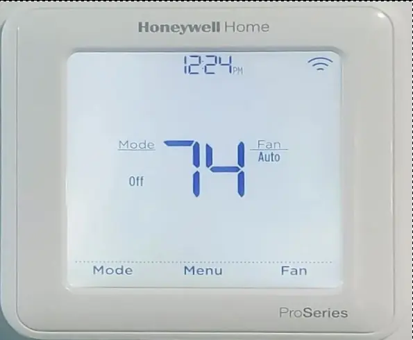

My house has had a Emerson Sensi thermostat for the last 6 or 7 servers. While, this thermostat has served its purpose, and worked reliably (locally), I have had the ongoing issue of having to integrate it into my Home Assistant by using it through the Smart Things Integration. This cloud integration randomly stops working, and does not give very much warning regarding its status.

Normally, this wouldn’t be a huge issue, but, a few years back, I automated my fireplace. So, my fireplace will kick on during the day, to avoid heating the entire house, saving energy. Since, the fireplace bases its temp on the MAIN thermostat located in the center of the house, its important to have somewhat accurate details.

So, I have decided to upgrade both the fireplace, as well as my thermostat, to leverage z-wave.

<!-- more -->

## Parts / Tools Needed 

### Products Used

1. [Zooz Z-Wave Plus Relay](https://amzn.to/3jPxTmW){target=_blank}
    * I chose this option, because it has three inputs, and three relay outputs, and works via z-wave. While, it doesn’t have any fancy features, it is simple, small, and self-contained.
2. [Honeywell T6 PRO Z-Wave](https://amzn.to/3CrYfm5){target=_blank}
    * There are not too many good z-wave thermostat options. I did not want a thermostat which looked like it came from the 1990s (Sorry [GoControl Thermostat](https://www.gocontrol.com/detail.php?productId=3){target=_blank}!). I did want to retain the ability to set a M-F + S+S weekly schedule, with the ability for HEAT, COOL, and AUTO scheduling. Those features have been amazing to have on the Sensi thermostat. The honeywell met all of the required criteria, so, I went with it.
3. [WAGO connectors](https://amzn.to/3w17Rlt){target=_blank}
    * A few years ago, I would called you crazy for telling me there is a better alternative then using screw nuts. Well, having used these connectors a handful of times, I am now telling you- they are nice, easy, and secure. If you have wiring you wish to reuse, these are even better.

### Tools Required

1. A phillips screwdriver
2. A flat-head screwdriver
3. A multi-meter.

## Installation

### Thermostat Install

The first step I took, was to replace my old thermostat, with the new thermostat.

!!! caustion
    You should turn off power before performing work on your system. Even better- you should hire a licensed HVAC technician. The common wire DOES carry current, and CAN shock you. If you are not licensed to work on HVAC or electrical equipment, you should certainly hire a licensed professional.

As you can see in the image, there was nothing overly fancy about the old thermostat.

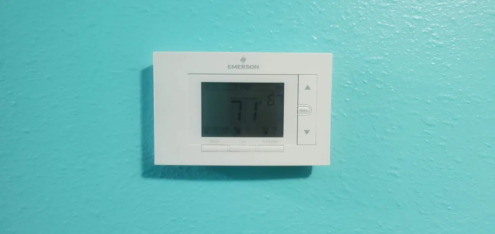

#### Step 1. Remove the old thermostat

In my case, you grab it, and lift it off of its base-plate.

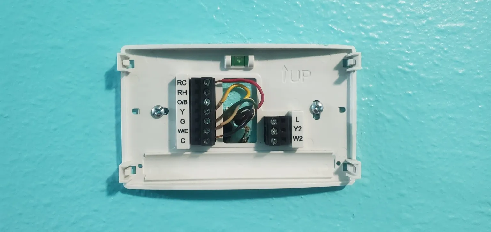

#### Step 2. Loosen all of the wires, and remove the old base plate.

Using a small screwdriver, loosen the screws retaining the wires, carefully remove the fires, and then remove the baseplate from the wall.

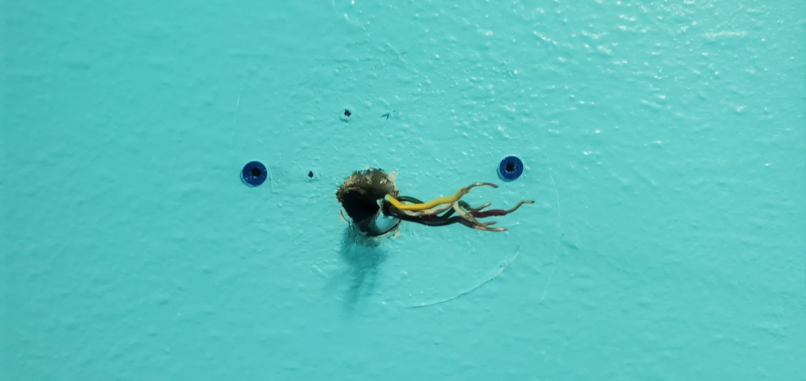

#### Step 3. Install the new base plate.

Since the existing holes were in the correct location, I reused them. This is a good time to check and ensure the baseplate is properly level. If this is not level, your thermostat will not be level. As well, your significant other, will remind you, it is not leveled.

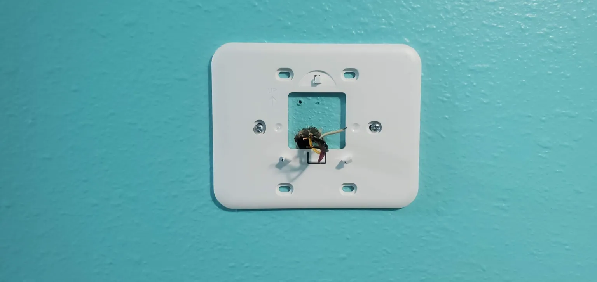

#### Step 4. Install the “Wiring guide”

DEPENDING on your HVAC configuration (Typical, Heat-Pump, Multiple-Stages, etc….) your wiring will be different.

I have a conventional system. It has these wires to be connected:

1. Yellow: A/C Compressor
2. White: Heating Relay (Turns on my natural gas furnace)
3. Black: Common.
4. Red: 24VAC
5. Green: Fan

!!! warning
    Do ensure you have 24VAC between RED and Black. If your voltage is out of tolerance, and you connect the new thermostat, you may damage it!!!

    If you do not know what you are doing, then you should call a licensed professional to do this step for you.

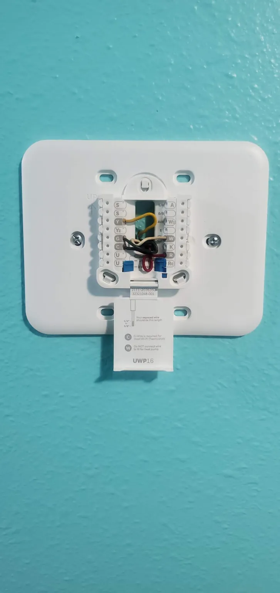

#### Step 5. Install the new thermostat

Just slap it into place! Don’t forget to put the new batteries in!

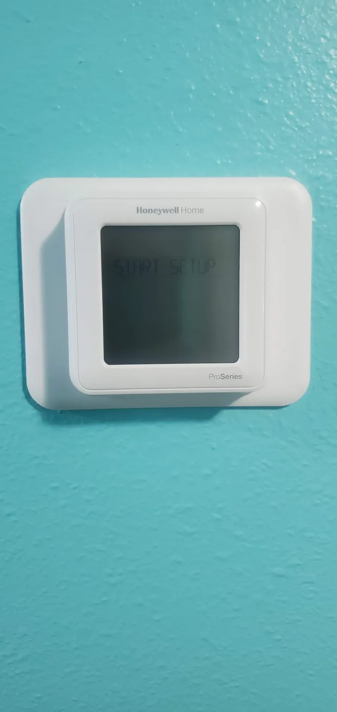

#### Step 6. Setup and configure your new thermostat.

In the case of my new thermostat, I followed the manufacturer’s documentation to configure the thermostat to my specific requirements. This entailed configuration of the date and time, my HVAC system’s requirements, enabling “Auto” mode, and lastly, setting the scheduling system to M-F, S+S

As well, this is a good time to include your new thermostat into your z-wave setup.

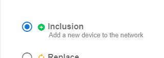

For me, this was as simple as starting an exclusion, and following the manufacturer’s documentation for the thermostat. Note- you WILL need to ensure it is joined with security (S2). If you do not join it in secure mode, its operation will be limited to read-only. For me, with ZWaveJS2MQTT, this happened automatically, and by default.

#### Step 7. Admire your new thermostat.

I hope you leveled it!

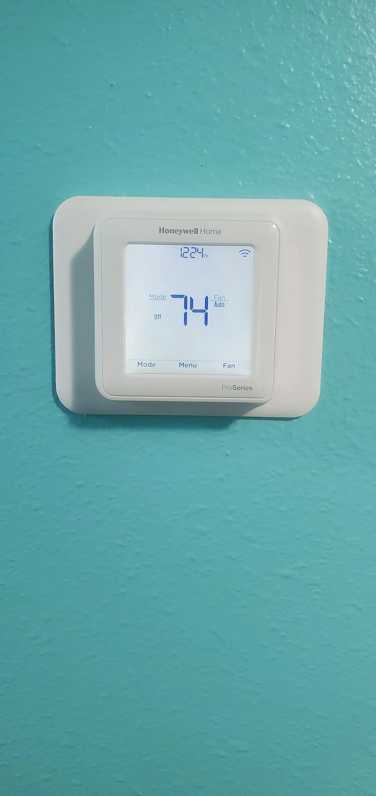

### Fireplace Conversion

If, you have not read my previous posts, this is a good time to check them out. 

TLDR; My fireplace is controlled automatically by home assistant.

[Fireplace Part 1](https://xtremeownage.com/2020/10/16/fireplace-automation/){target=_blank}

[Fireplace Part 2](https://xtremeownage.com/2020/10/20/fireplace-automation-part-2/){target=_blank}

My previous setup worked nearly perfectly last year. The only issues were related to smart things occasionally “not working”. Since, my setup depends strongly on the thermostat’s configuration, it is important that I can communicate with it.

Also, sometime since last year, my ESP controller died. I don’t know if it was due to a failed firmware update, or dust….. but, since I accidentally epoxied over the USB port, I just tossed it into the trash….. and replaced it with a [Zooz Z-Wave Plus Relay](https://amzn.to/3jPxTmW){target=_blank}.

#### Step 1. Obtain a z-wave DRY-CONTACT relay

Dry-contact is the key-word here. A Mains-relay, will not work. You need separate, individual relays.

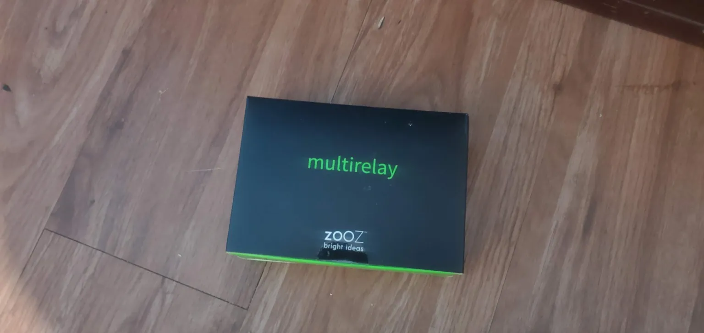

#### Step 2. Identify the mess under your fireplace

On the left, is the gas control valve. On its left, you have cables coming in for the thermophile, and a thermoprobe. The thermopile is responsible for generating a small amount of current for togging the flow of gas on and off. If your fireplace has issues remaining lit, you may need to replace your thermopile.

Last year, I had to replace mine [with this one](https://amzn.to/3jOxNvW){target=_blank} for under 20$, and it solved a lot of my issues.

Next- there is a switch at the bottom of the control block. This switch, toggles the fireplace between “ON”, “OFF”, and “REMOTE”. For controlling it via external automation, we will leave this to the “REMOTE” position.

The Red/Green wires you see, going into my old relay setup, are used to control remote operation. When the wires are connected to each other, current flows through, turning the gas flow on. When current stops, gas flow stops.

Next, you will see a [Sonoff Basic](https://amzn.to/3EwHmau){target=_blank} in place, which was used to control the fan on my fireplace. Since the new [Zooz z-wave module](https://amzn.to/3jPxTmW){target=_blank} has three relay outputs, I will be replacing it.

!!! danger
    Your fan typically uses 110v AC. If you don’t know what you are doing, CALL A LICENSED PROFESSIONAL! This can **shock and/or kill** you.

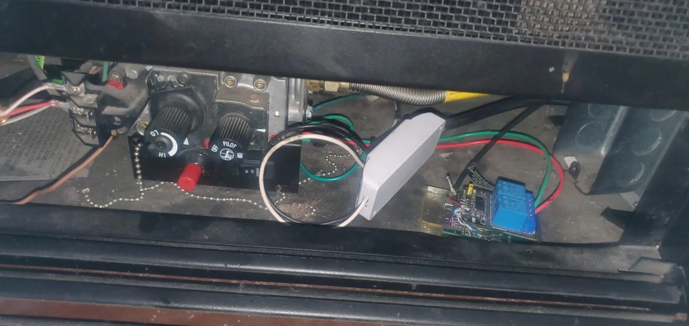

#### Step 3. Unbox your new solution

The new solution requires USB-C power plug.

!!! info
    Per the documentation, do not use a “LAPTOP or Tablet” charger. I used the existing 1 amp USB plug which was already in place from my old ESP-device.

As you can see, there are three relays on the left, and three switch inputs on the right.

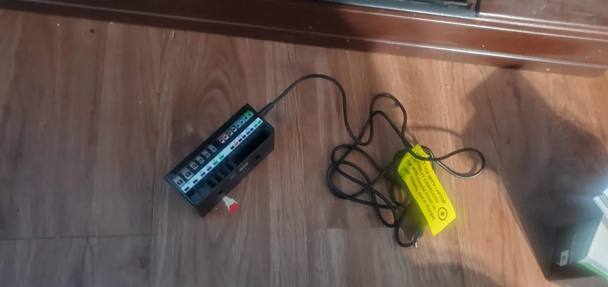

#### Step 4. Replace the old, with the new

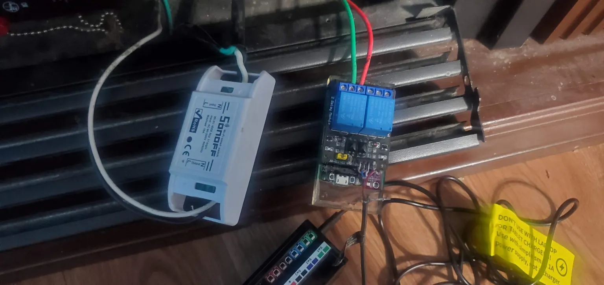

In my case, this involved removing both the sonoff, and my old ESP-based controller.

One minor difference in wiring- The sonoff has both HOT(Black), and COMMON(White) passing through. With the new relay, we are only going to be switching the “HOT” wire. I used a wago connector to tie the common wires together, and inserted both HOT wires into the sockets marked “R2”.

I also placed the RED/GREEN “Remote” wires for the gas control, into the sockets marked “R1”.

Since, this is a dry-contact relay, order does not matter. Just- don’t mix up the pairs or something will release magic smoke.

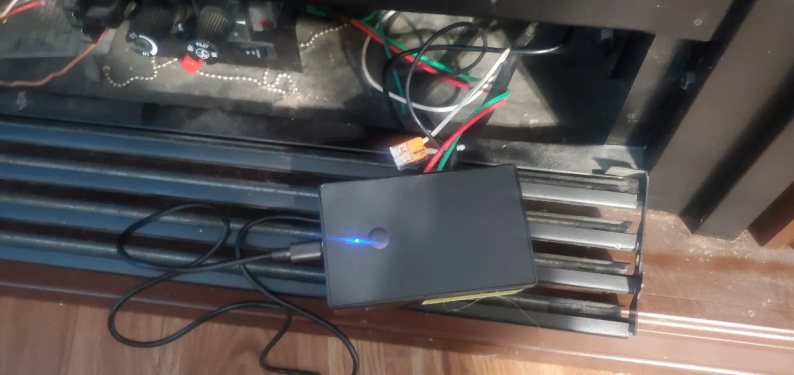

#### Step 5. Admire the new solution

Ok, it’s pretty dirty and dusty down there. And the cables are a bit of a mess. So, perhaps I shouldn’t admire it.

But, this is a good time to join your device to your z-wave network.

Ensure your USB-C cable is plugged into a power source (Not a laptop or tablet)
Set your z-wave network into “Inclusion” mode.
Press the button on the zooz three times fast.
Poof, its connected.

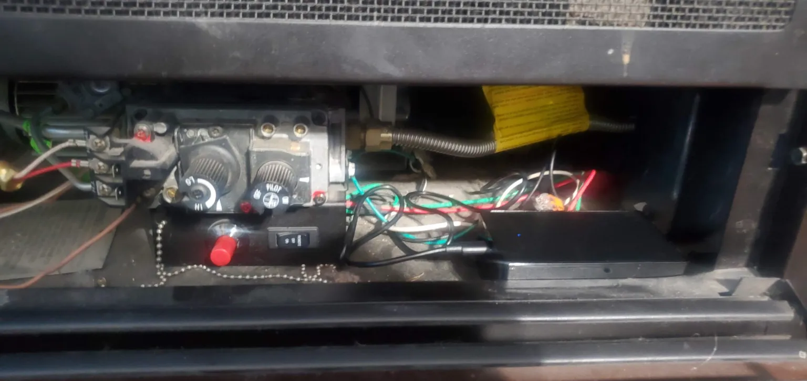

### Configuration of your automation

But wait, there’s more! You now need to update your home automation with these new devices! For me, using home assistant and zwavejs2mqtt(zwavejs now, as of 2023), this was performed automatically. The only action I took, was renaming the create entities to be a bit more descriptive.

As well, I removed the old entities, and updated the configurations to use the new entities.

To fully migrate everything from my old thermostat, to my new thermostat, was quite easy. I deleted the old integration, and renamed the new device to match the name of the old device, “Thermostat”. Since, both the old and new were of the “climate” device-type, everything automatically worked. Since the new z-wave integration automatically creates sensors for temp and humidity, I was able to remove my template-based sensors for the old integration.

As well, when configuring the zooz, I set the “power-failure” action to default all relays to “OFF”

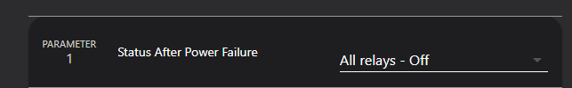

Make sure your relays are configured for “Switch”

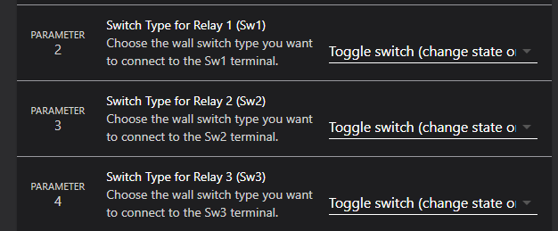

You can also set auto-on/off timers if desired. However, I plan to manage this via the thermostat template.

~~I don’t plan on writing an article for the minor differences to convert from the old entities to the new… Its mostly just updating entity names.~~ I lied- if you want to see some of the updates, then check out “[Fireplace Automation – Part 3](./fireplace-automation-part-3.md){target=_blank}″

If you need a easy method to configure your schedules, Check out [THIS GUIDE](./../2022/programmable-hvac-part-2.md){target=_blank}

Have fun!

## Update from 2023

If- you are reading this now- I finally updated this post from wordpress to the new static site.

To give you an update after nearly two years-

### Honeywell T6 Pro

I do not have a single issue at all to report for this thermostat. It works consistently as expected. I have not even had it disconnect from my network.

So far, it has had 100% reliability. My automation, has been working without fail for the past two years.

### Zooz relay / fireplace automation

This is one of the most frequently used automations in my house. 

Being as this automation controls a critical appliance (It makes fire. In my living areas), it is extremely crucial for it to work properly.

And- it has been rock solid. For the past two years, this automation has produced basically all of the heat in my house from the hours of 6am, to 11pm at night. (The central heater runs at night)

The **ONLY** issue I have had with this automation- The pilot light on my fireplace likes to blow out every few weeks. Due to the mechanical safety devices on my fireplace the gas flow will be shutoff. So, the only impact here, is needing to manually go light the pilot again.

## Disclaimers

--8<--- "docs/snippets/amazon-affiliate.md"
