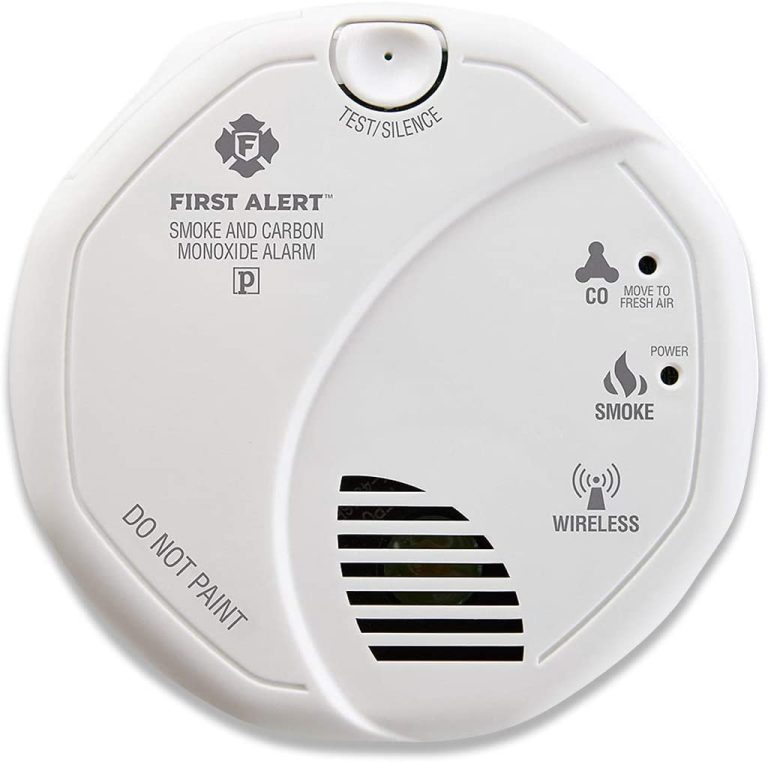

# First Alert Z-Wave Combo CO/Smoke Detector

This is a simple review, with a few steps for the First Alert Z-Wave CO/Smoke detectors.

<!-- more -->

## Where to buy

* [Purchase on Amazon](https://amzn.to/36uoPjU){target=_blank}

Around 40$ a piece, these are a tad expensive for a smoke detector solution, however, I do enjoy having some central management.

Note- Make SURE to get the 2nd generation. The 2nd generation is much easier to setup automations for, and supports SmartStart, and a few other features.

## Why would you buy this?

If you have hard-wired alarms already, I wouldn’t purchase this.

These are useful for when you don’t have a already hard-wired detector system. These alarms do not communicate with each other, so, if one goes off, the rest won’t go off either. Many fire codes requires alarms to sync with each other now.

If your goal is for alarms to sync with each other, these aren’t the best pick. For me, my house is relatively small, which means you can hear any alarm, anywhere in the house quite easily.

The main reason I picked up these units, is to enable some integration with the rest of my home automation.

## What can you accomplish with home automation?

1. View battery status in a central location. Setup alerts for batteries getting low.
2. If either smoke or CO is detected, you can integrate this into your automation as well, to send alerts, call the fire dept, etc. I also have notifications setup to be sent to my phone.

## What are my opinions?

1. The battery status is a bit weird. I have found, you want to change the batteries when z-wave starts reporting battery status around 80% or less. This is the point where the detectors starts to beep, alerting you to low battery.
2. Battery life is good, I got a bit over a year out of the original batteries before needing to swap them.
3. Getting these units to pair, was a bit tricky. However, working steps are below.
4. There is no way to trigger, or mute alerts via z-wave.
5. Be prepared for these units to “sleep” most of the day. Don’t expect any frequent communication unless these units are being triggered.
6. The Smoke detection does work, as my cooking has no issues triggering these units.
7. As well, the CO detection feature works as well.

## How to pair these to your z-wave network
1. If you use smartstart, go ahead and scan the QR code and add it.
2. Hold the button down for 20 seconds.
    * Its going to beep a few times, followed by a siren for a while…. and eventually, it will beep again, and go quiet. You can let off the button after this.
    * This step, is supposed to reset the unit.
3. Remove the battery tray
4. Wait 30 seconds. This is important.
5. You can go ahead and start inclusion mode IF, your z-wave does not support smart start.
    * If you do have smartstart, and you have already scanned the code, you don’t have to do anything on this step.
6. HOLD THE BUTTON
7. Reinsert the battery tray, while holding the button.
8. Keep holding the button…. for about 10 seconds, until you hear a long BEEP.
9. Let off the button.
10. The unit will now join your network.

I posted these steps, because… I had a lot of trouble getting some of these units to join my network. Some would instantly join without issues. Others, absolutely refused to join. These above steps, worked 100% of the time with my 6 units.

## My review a year later?

While- not quite a year later (8 months to be exact), I do like these units, compared to other battery-powered units.

When I start hearing a beep, I can easily look at the battery status to determine exactly which detector is beeping. This is fantastic.

One note, don't use rechargable batteries with these units... Unless you like hearing beeping noises.