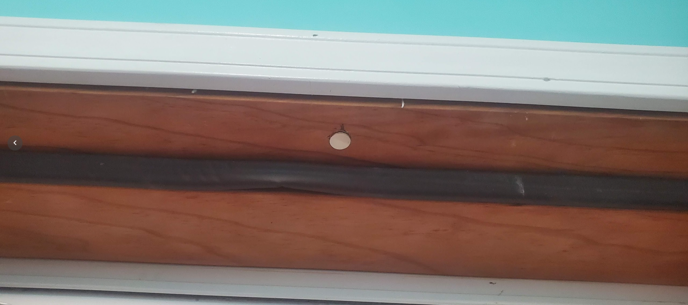
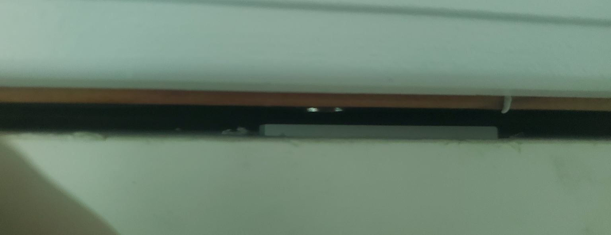
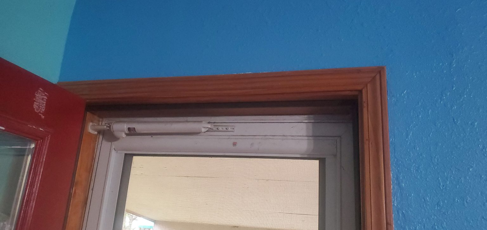

# Hidden door sensors

The default directions for installing doors sensors, involves using the included double-sized tape directly stick the sensor to doors and windows.

I personally, wanted these sensors to be out of sight, and out of mind. So, I decided to recess them into the doors themselves.

<!-- more -->

## Parts / Components Needed

### Contact Sensors

1. [Ring Alarm Contact Sensor - 6 Pack](https://amzn.to/37ZdatX){target=_blank}

There are MANY options for contact sensors. My only real requirement was z-wave, and ideally, a long-battery life. I figure ring doesn’t stay in business giving out contact sensors with a one month battery life. At the time of me writing this, it costed me 100$ for 6 contact sensors, which works out to about 15$ each.

While, that sounds expensive, your typical sensor is around 20$ a piece if you order individually. So, while there are cheaper options, there aren’t really cheaper options I found which are as well known.

### Coin Magnets

For my door sensors, I want them completely recessed, invisible, out of sight, and out of mind. I am going to use a simple coin magnet recessed into the trim to accomplish this.

1. [Cheap coin magnets](https://amzn.to/3LcT2Dk){target=_blank}

## Steps

First, I used a 9/16″ drill bit to hollow out a cavity in the top of the door. I used a wood chisel, hammer, and screwdriver to clean up the opening a bit. A router would be the preferred tool for this job… However, I do not have one.

After making a cavity for the z-wave sensor, I recessed it into the door. The space was tight enough so that it was not required to use adhesives or hardware to hold it into place.

Next, I used a drill bit the same size as the coin cell magnets used, to drill a tiny recess into the door frame.

I ended up using three magnets stacked on top of each other, as one was not powerful enough to account for the small gap.

After making this hole, I press-fit the magnets. In the future, I will come back and epoxy them into place, and paint them to match the door frame.

** Update, 2022-12-10, I have not yet had the need to use any adhesive to further secure the magnets.

With three magnets stack on top of each other, it has no issue accounting for the gap between the door and the frame. I could further recess both the magnets, and the sensor. However, it’s basically unnoticeable unless you are on a ladder looking at the top of my door.

Overall, my first time putting up a door contact sensor. And, well, it works perfectly. If the alarm is armed, it will basically go off instantly upon opening the door.

On my second attempt, I relied on the chisel more then the drill, which made a nicer pocket.

Sensor is hidden pretty well.

## Conclusion

Since, installing these recessed sensors into all of the entry / exit locations in my house in April 2022, As of Dec 2022, these sensors are still working perfectly, with no issues at all.