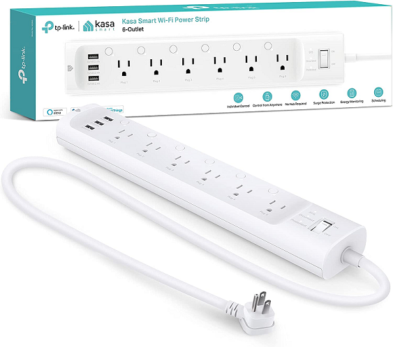
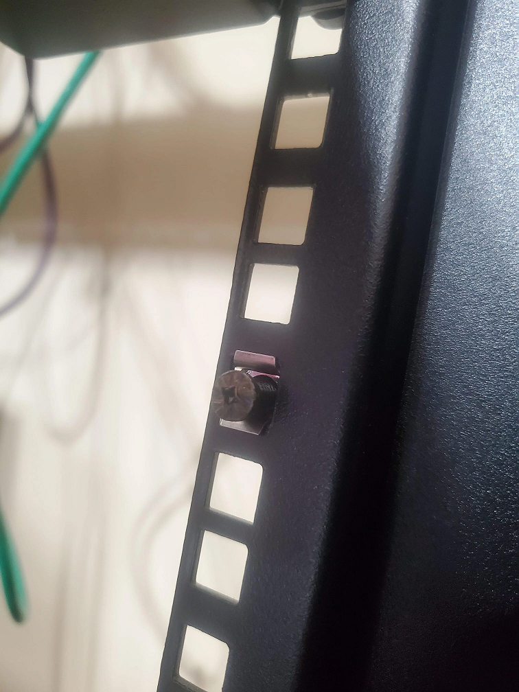
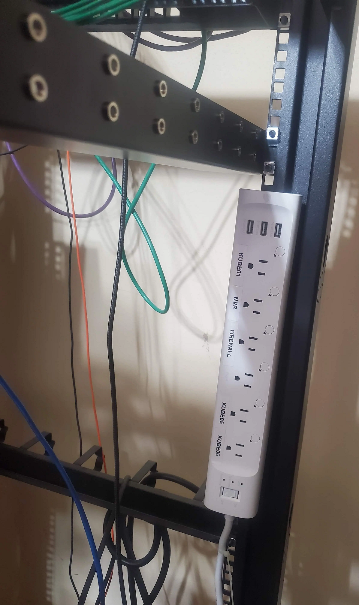
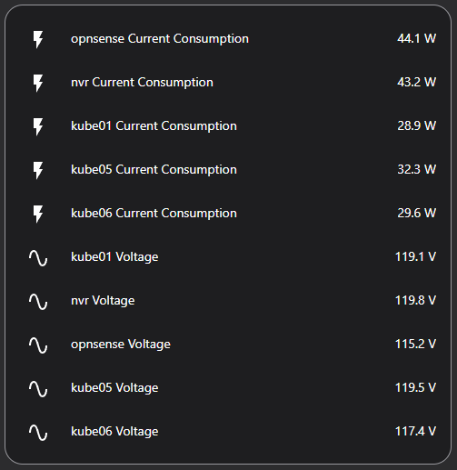
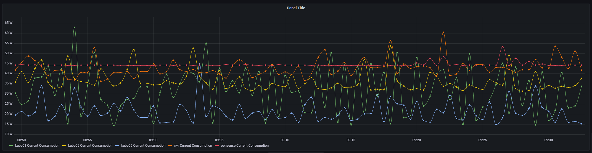

# Using Kasa HS300 powerstrip as a PDU.

Using a Tp-link kasa HS300 as a low-cost switchable PDU. This product has features for per-outlet power monitoring as well.

<!-- more -->

## Products Used

This article is centered around the [Tp-link Kasa HS300 (Amazon)](https://amzn.to/3Buk5Hx){target=_blank}

## Setup / Installation

### Step 1. Connect to your network.

For the initial setup, you will need the kasa app installed on your smart phone. After you have connected the device to your network, you will no longer need to leverage this app.

I connected the HS300 to my "IOT" network, and allocated a static IP address. 

Within my IOT network, the device is able to contact NTP, and DHCP, but, has no access to anything else.

After the device successfully connects to your network, you can leverage the Kasa app to name the outlets. Don't worry about setting icons.

As well, since this is on an isolated IOT network, there is no need or reason to click the remote control. We are going to leverage this device in full local-only.

#### Update Firmware!

!!! warning
    Update your firmware! My [HS300](https://amzn.to/3Buk5Hx){target=_blank} came with a pretty early firmware version. I noticed it would not reconnect to the wifi after being disconnected... This would be a huge issue...

    After updating to firmware 1.0.12, it appears this issue may have been resolved.

### Step 2. Label / Name outlets

If you don't have a label maker, I would recommend the [Dymo 100H (Amazon)](https://amzn.to/3UuiXdr){target=_blank}, it has been working great for the last few years.

After a bit of planning, I carefully attached labels to each of the outlets.

### Step 3. Mount to your rack.

Orignally, I considered cutting out a piece of steel to which I could mount the strip on the back of, and secure to my rack. After looking at various options, I decided I could leverage two of my rack screw/cages, to secure the strip.

However, my cage screws were a tad too wide/tall to fit into the power strip. So, I leverage a drill with a bench-grinder to reduce the size of the screws.

The unmodified screw is on the right. Doesn't look very pretty, however, it does get the job done.

Next, I installed a cage-nut, and screwed what was left of the screw into the nut.

Finally, I just needed to mount the strip to the screws. (There are two screws holding the strip in place.)

(Ignore the hanging fibre... and cords. its on the to-do list...)

I used a few zip-ties to secure the power cord to the rack.

### Step 4. Integrate with Home Assistant.

First, visit your integrations page, and click "Add Integration" at the bottom-right.

Search for "kasa"

Click on TP-Link Kasa Smart. Provide the IP address you allocated earlier.

Click submit.

#### Customize Entities

At this point, I went ahead and customized the entity names, display names, and icons.

### All done! Setup dashboards / reports / etc.

I was actually quite surprised to notice the HS300 does PER-plug consumption metrics.

I expected, only consumption to be measured at the strip-level, however, having per-plug metrics is fantastic!

Now- when somebody is wondering the power consumption of each of my SFF/MFF servers, I have concrete numbers!

#### Home Assistant Features

##### Data Exposed

* Per-plug Current (amps)
* Per-plug Consumption (watts)
    * Current Consumption
    * Today's Consumption
    * Total Consumption
* Per-plug voltage (volts)

##### Controls/Switches Exposed

* Per-plug power
    * ie- each plug, can be individually toggled on/off.
* LED Status
    * You can disable the LEDs. Useful if you don't want a bunch of LEDs lighting up a room.

##### Other Features

This unit **DOES** integrate with the built-in energy dashboards, out of the box, without additional configuration or customized sensors.

## My thoughts / Opinions

Overall- I am quite satisfied with the [HS300](https://amzn.to/3Buk5Hx){target=_blank}. It exceeded my expectations by providing per-plug current/voltage metrics.

I will note, I did have a lot of issues before updating to the latest firmware version, after it disconnected from the Wifi, I had to power-cycle the entire PDU to get it to reconnect.

I have heard complaints of the PDU power-cycling after updates, but, during my testing- The firmware update did not cause any of the loads to be power cycled.

WIth that said, I would recommend this product. The price is good. Ideally, I would leverage a [used enterprise APC PDU from e-bay](https://ebay.us/bSAxHF){target=_blank}, however, I am quite pleased with the performance of this unit. In the future, I may acquire a dedicated APC unit to review, and repurpose this unit.

Home assistant integration was effortless, with no issues at all here. 

As a bonus- since my Home Assistant automatically exports metrics to the prometheus instance hosted on my Kubernetes cluster, I was able to effortlessly graph these metrics in grafana.

### Disclaimers

!!! success "Not Sponsored"
    This is **NOT** a sponsered post. This is was not endorsed, affiliated, or sponsered in any way by tp-link.

    All hardware, time, and tools was provided solely by me.

--8<--- "docs/snippets/amazon-affiliate-link-non-sponsered.md"