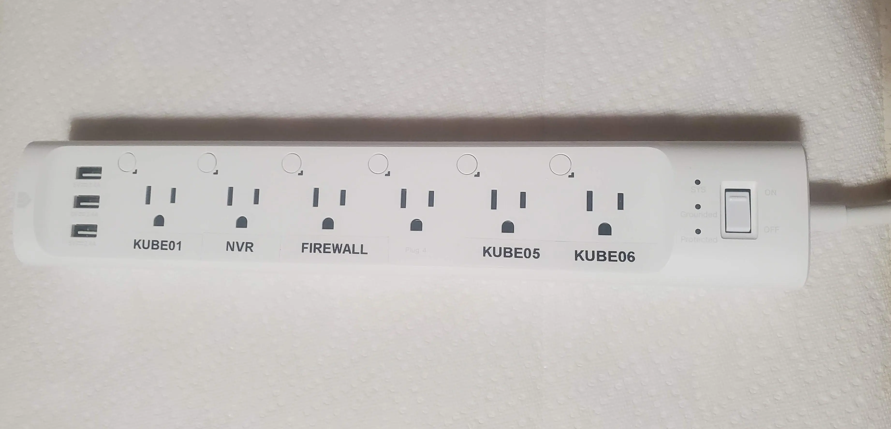
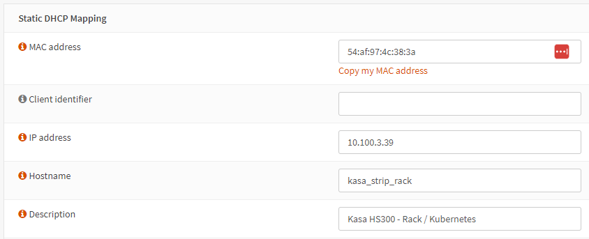
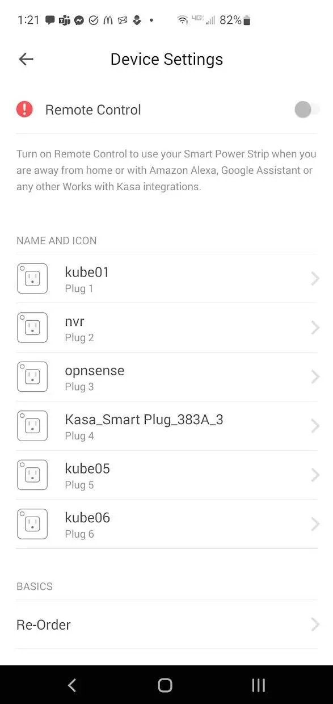
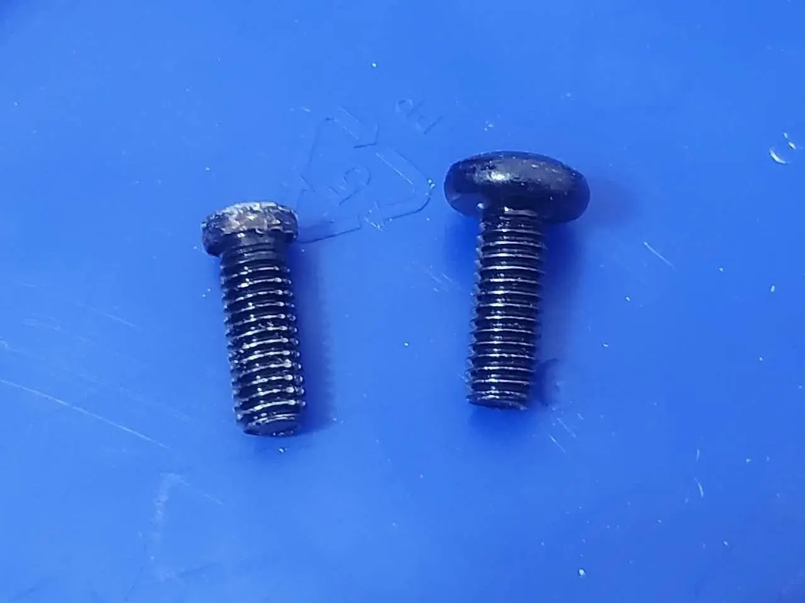
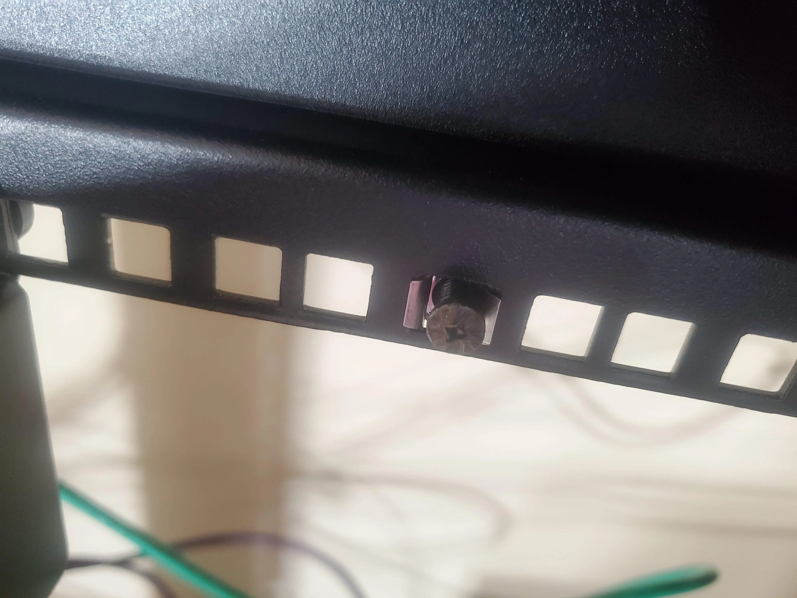
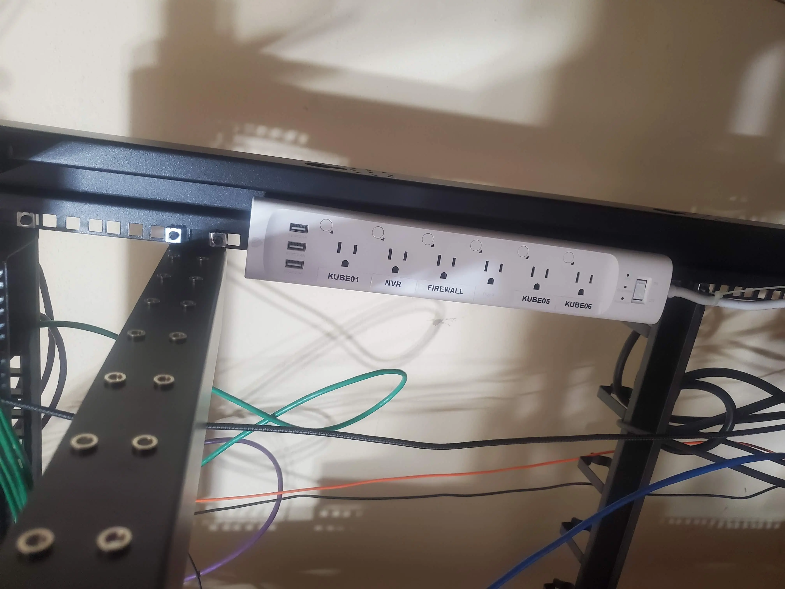
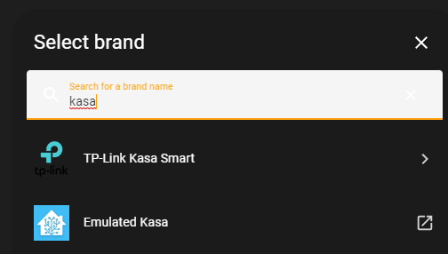
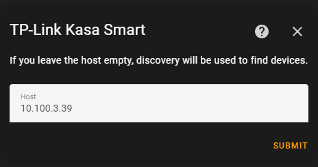
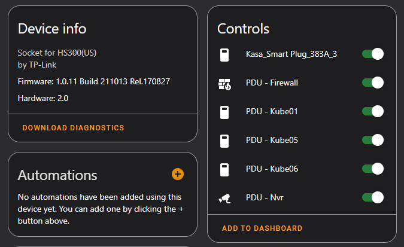

# Using Kasa powerstrip as PDU.

Using a Tp-link kasa HS300 as a low-cost switchable PDU.

<!-- more -->

## Setup / Installation

### Step 1. Connect to your network.

For the initial setup, you will need the kasa app installed on your smart phone. After you have connected the device to your network, you will no longer need to leverage this app.

I connected the HS300 to my "IOT" network, and allocated a static IP address. 

Within my IOT network, the device is able to contact NTP, and DHCP, but, has no access to anything else.

After the device successfully connects to your network, you can leverage the Kasa app to name the outlets. Don't worry about setting icons.

As well, since this is on an isolated IOT network, there is no need or reason to click the remote control. We are going to leverage this device in full local-only.

### Step 2. Label / Name outlets

If you don't have a label maker, I would recommend the [Dymo 100H (Amazon)](https://amzn.to/3UuiXdr){target=_blank}, it has been working great for the last few years.

After a bit of planning, I carefully attached labels to each of the outlets.

### Step 3. Mount to your rack.

Orignally, I considered cutting out a piece of steel to which I could mount the strip on the back of, and secure to my rack. After looking at various options, I decided I could leverage two of my rack screw/cages, to secure the strip.

However, my cage screws were a tad too wide/tall to fit into the power strip. So, I leverage a drill with a bench-grinder to reduce the size of the screws.

The unmodified screw is on the right. Doesn't look very pretty, however, it does get the job done.

Next, I installed a cage-nut, and screwed what was left of the screw into the nut.

Finally, I just needed to mount the strip to the screws. (There are two screws holding the strip in place.)

(Ignore the hanging fibre... and cords. its on the to-do list...)

I used a few zip-ties to secure the power cord to the rack.

### Step 4. Integrate with Home Assistant.

First, visit your integrations page, and click "Add Integration" at the bottom-right.

Search for "kasa"

Click on TP-Link Kasa Smart. Provide the IP address you allocated earlier.

Click submit.

#### Customize Entities

At this point, I went ahead and customized the entity names, display names, and icons.

