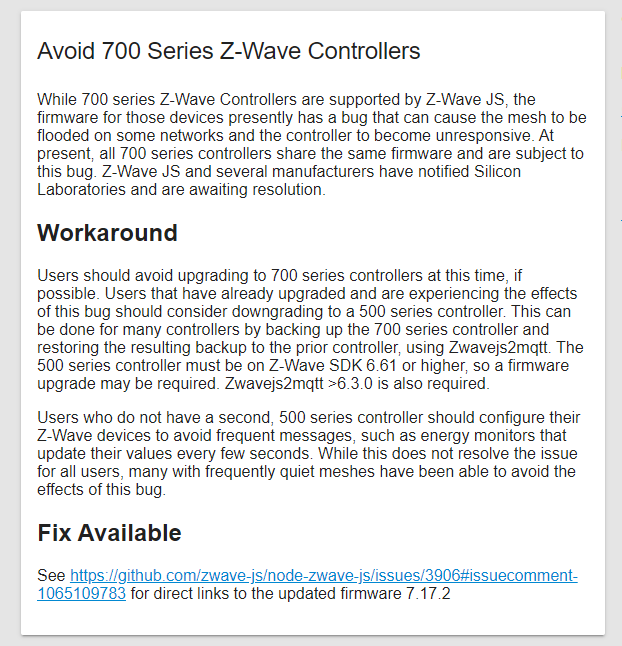
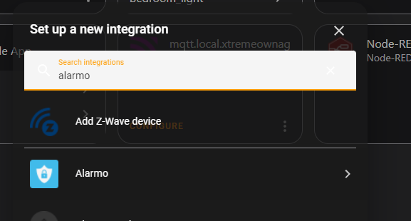
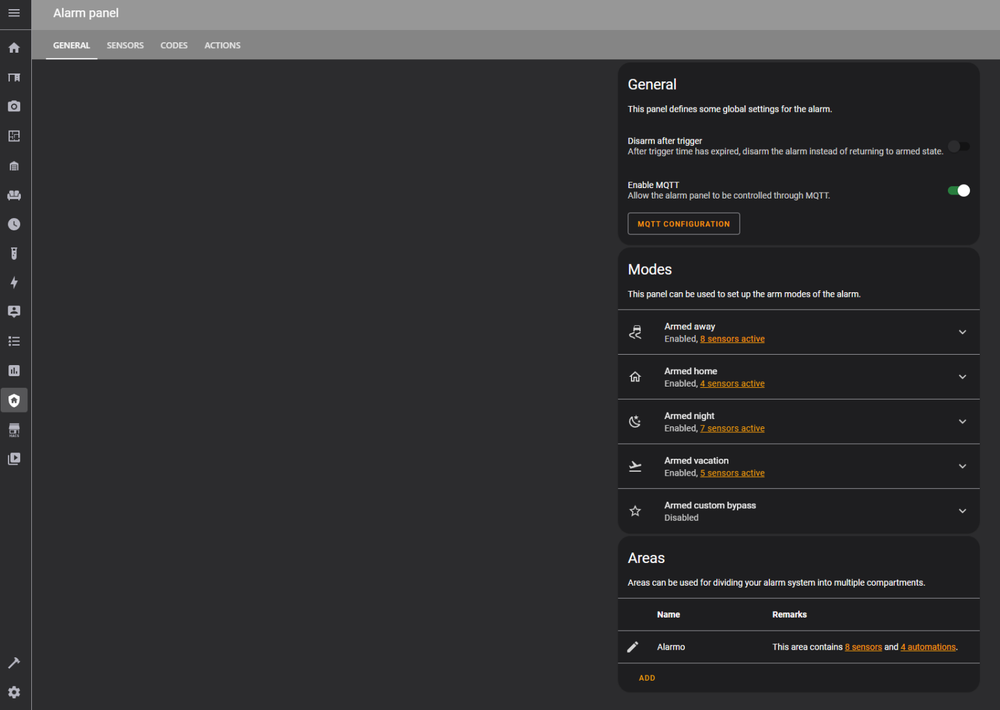
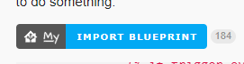
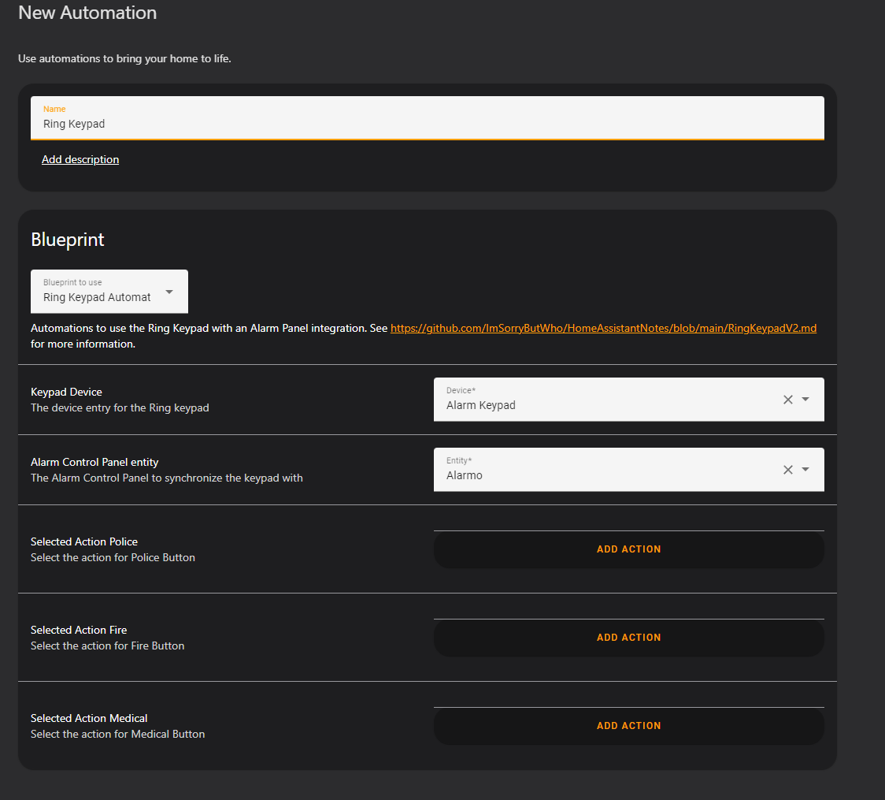

# Home Assistant Alarm

So, you want to have an alarm for your house. But, you don’t want to give your money to ADT/Ring/SimpliSafe/etc… and you want to build it yourself, with components you can easily service and replace, right? If so, this is the article for you.

<!-- more -->

If you prefer for someone else to do all of the work, or you want a solution that just “works” without any tweaking, you should look at other options perhaps. The process to get everything up and running is not hard at all. Quite easily as a matter of fact. But, there are a few mildly technical steps.

## Parts / Components Needed

### 700 Series Z-Wave

A 700 series z-wave stick supporting Smart Start is recommended. S2 Security is **required** to get the ring keypad joined to your z-wave network. Without S2 security, you will not be able to add a few of the components.

1. [Zooz 700 Series](https://amzn.to/38XK52r){target=_blank}
2. [Aeotec Z-Stick 7](https://amzn.to/3EzqjGp){target=_blank}

I personally went with the [Zooz 700 series](https://amzn.to/38XK52r){target=_blank} stick, because at the time (4/16/2022), it was nearly half the price.

In this post, I will also be detailing the process of updating its z-wave firmware, AND replacing my existing [HUSBZB-1 stick](https://amzn.to/3rznMqb){target=_blank}, without having to rejoin all of my devices. (There IS a firmware update to enable 700-series features, however, the process was more in-depth then I wanted to undertake…)

### Alarm Keypad

You ideally, need a keypad for arming / disarming your alarm. Optionally, you can also leverage a kiosk with an alarm display, however, I do enjoy physical buttons.

1. [Ring Alarm Keypad (2nd Gen)](https://amzn.to/3YdxJbK){target=_blank}

I went with this option, because the price was good, it looks nice, and, it is easily mounted.

### Contact Sensors

1. [Ring Alarm Contact Sensor - 6 Pack](https://amzn.to/37ZdatX){target=_blank}

There are MANY options for contact sensors. My only real requirement was z-wave, and ideally, a long-battery life. I figure ring doesn’t stay in business giving out contact sensors with a one month battery life. At the time of me writing this, it costed me 100$ for 6 contact sensors, which works out to about 15$ each.

While, that sounds expensive, your typical sensor is around 20$ a piece if you order individually. So, while there are cheaper options, there aren’t really cheaper options I found which are as well known.

## Installation / Setup

### Step 1. Upgrade/Replace your existing z-wave stick.

Since, 700 series z-wave is required for using S2 security, I will be replacing my current z-wave stick. If you do have a Nortek HUSBZB-1 stick, and would like to undertake the process of updating its firmware, there is a guide [HERE](https://community.hubitat.com/t/guide-nortek-husbzb-1-nvm-backup-restore-and-updating-z-wave-firmware/48012){target=_blank}. However, I will be completely rebuilding my network.

#### Why did I rebuild my network?

Well, quite simply, I failed at doing a in-place replacement. The nortek did not support NVM backups, and in the process of… “replacing” it, I ended up with a z-wave network where I could not “shift” to the new master. Hopefully, your luck is better then mine. But, in either case, the absolute worst case scenario, is having to rebuild your network. As long as you have S2 QR codes, this process actually isn’t too bad.

#### Updating Firmware

Why do we need to update the firmware? See the below alert issued by Home Assistant.

If you don’t update the firmware, there is a chance your network could become unresponsive.

Since, I purchased the [Zooz 700 Series](https://amzn.to/38XK52r){target=_blank} stick, the below instructions will be for it specifically. However, if you went with the [Aeotec Z-Stick 7](https://amzn.to/3EzqjGp){target=_blank}, you can find the relevant documentation on how to update [HERE](https://help.aeotec.com/support/solutions/articles/6000252296-update-z-stick-7-with-windows){target=_blank}. The steps are similar for both products.

I will be following [THESE](https://www.support.getzooz.com/kb/article/253-how-to-perform-an-ota-firmware-update-on-zooz-devices/){target=_blank} instructions from Zooz.

To note, if you are having trouble finding the “PC Controller Software”, [READ THIS.](https://community.silabs.com/s/article/How-to-get-Z-Wave-PC-Controller-and-Zniffer-tools?language=en_US){target=_blank}

I found a link to the updated firmware [HERE](https://github.com/zwave-js/node-zwave-js/issues/3906#issuecomment-1065109783){target=_blank}.

You supposedly can also update the firmware directly from zwavejs, however, I did not attempt this. I followed the official instructions and used the PC controller software.

### Step 2. From zwavejs, scan the QR code

You can either start inclusion mode, then select scan QR code, or go under the provisioning entries section, and click add / scan.

Make sure to keep your QR codes handy in a central location, and remember to write down what each code goes to.

You will want to scan the codes for both the alarm keypad, as well as the contact sensors. The nodes will not join until you turn them on.

### Step 3. Turn on the ring keypad

Plug in the USB power cable. And you will need to hold the “1” key. After this, the node should automatically join your z-wave network.

If you require more in-depth instructions, please see [THIS POST](https://github.com/ImSorryButWho/HomeAssistantNotes/blob/6f05b3f90a979f7118e7c688ce2d01b878227328/RingKeypadV2.md){target=_blank}

### Step 4. Add Alarmo integration to home assistant

If, you do not already have the [Alarmo integration](https://github.com/nielsfaber/alarmo){target=_blank} installed, Add it. I installed it via HACs. You can find the official installation instructions [HERE](https://github.com/nielsfaber/alarmo#installation){target=_blank}.

After you have installed it, visit integrations, and add the Alarmo integration.

### Step 5. Configure Alarmo

On the navigation bar, there will be a new icon for “Alarmo”. Visit it, and configure everything to your liking.

To note, the ring keypad will display three modes from the steps I will add below. Unarmed. Armed Home. Armed Away.

You can follow Alarmo’s [DOCUMENTATION](https://github.com/nielsfaber/alarmo#installation){target=_blank} for more details.

### Step 6. Ring keypad blueprint

Thanks to a wonderful fellow on the Home assistant forums, this step is extremely easy.

1. Visit [THIS PAGE](https://community.home-assistant.io/t/synchronize-ring-alarm-keypad-v2-with-alarmo/349461){target=_blank}
2. Click Import Blueprint
    
    

3. Import the blueprint.
4. Goto Automations. Click Create Automation.

    

5. Fill in the fields. You can edit this later. The fields for police/medical/etc are optional, and are not required.

    

6. Click Save.

You are done. That’s it!

At this point, you can arm and disarm your system directly from the keypad. The keypad has voice prompts for arming/disarming/etc. It will display your grace timer when exiting the building. It will also use the codes you defined in your alarmo configuration.

That step, literally could not be easier.

You can tweak some of the options via the zwavejs control panel too, if desired.

### Step 7. Install Door Sensors

Please see [Installing Embedded Door Sensors](./embedded-door-sensors.md){target=_blank}

I moved this section to its own post to clean this post up a tad.

## Further Steps / Recommendations
If you are intending to do a full home security system, here are a few of the steps I would recommend to you.

1. Make sure your home assistant and related networking gear is on a proper battery backup. My setup has my [homemade UPS](https://xtremeownage.com/2021/06/12/portable-2-4kwh-power-supply-ups/){target=_blank} keeping it powered.
2. I highly recommend installing many external-facing POE cameras. Frigate is FANTASTIC at picking up people, and is quite accurate.
3. Install door / window sensors on external doors and windows.
4. In the event your alarm does go off, make sure it does something useful. The alarm keypad has a siren built-in, however, I could put it in my driveway and trigger it, and I doubt anyone would notice. Make sure you have SOMETHING useful happening when your alarm triggers…. Notifications, SOMETHING.
    * An alarm system is only useful if it can attract attention to the fact someone broke into your house.
5. [Internal motion sensors](https://amzn.to/3rNHTBj){target=_blank}.
    * Unless you have cameras inside of your house performing person detection, there is no replacement for motion sensors!

Remember-

1. Assume an intruder will try to cut your power and internet.
2. Assume an intruder will use a wifi deauther.
    * This is a low effort / low cost attack which can render wifi-based devices unusable.
3. Wired security devices are ALWAYS preferred.

## FAQs

### Why did you leverage ring components? You hate cloud products, right?

I absolutely refuse to use cloud products with my home automation. However, all of these ring components will integrate into a proper z-wave network without any issues. There is NO requirement to have a ring account. These devices have no internet access as well.

I went with these products due to somewhat reasonable pricing. The 6 pack of contact sensors prices each unit around the same as I would pay for a generic chinese unit. I will assume the quality of the ring unit is better then a generic no-name chinese unit as well.

The keypad itself, is nicely made. It has OPTIONAL usb power. Can run on batteries. Has a lot of configuration options via zwavejs… and, well, it works.

I can leverage all of its functionality, make use of all of its buttons, and even its motion sensor automatically integrates in.

## Other

### Disclaimers

!!! success "Not Sponsored"
    This is **NOT** a sponsered post.

    All hardware, time, and tools was provided solely by me.

--8<--- "docs/snippets/amazon-affiliate.md"

### Changelogs

* 2022-12-10 - Ported to static site from wordpress.
    * Embedded door sensors moved to dedicated post