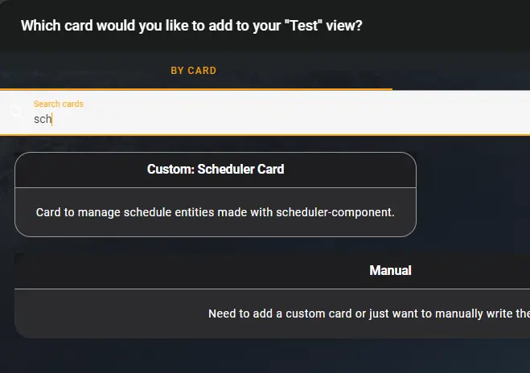

# Home Assistant – Programmable Thermostat GUI – Part 2

A while back, after [converting my primary thermostat over to z-wave](./../2021/full-local-hvac-control.md){target=_blank}, I found a creative way of managing my thermostat’s schedules using the [scheduler-card](https://github.com/nielsfaber/scheduler-card){target=_blank}.

Well, I recently [installed a new mini-split for my bedroom/office](https://xtremeownage.com/2022/03/27/pioneer-mini-split-home-assistant/){target=_blank}, and needed to integrate and maintain my schedules via home assistant. So, I decided to redo my schedules a bit.

I found the scheduler-card has a “make-scheme” button, which is far more intuitive for creating schedules then what I put together in [PART 1](https://xtremeownage.com/2021/10/30/home-assistant-programmable-thermostat-gui/){target=_blank}. In hindsight, this feature existed then as well…

<!-- more -->

## The end result

I am going to show you the completed product first, followed by the steps required to make it happen.


Completed view, with separate schedules for heating and cooling, for both my primary HVAC, as well as my mini-split.
Upon clicking any of the above schedules, you can easily change/add/remove setpoints/modes.


## How to do it

### How to add and configure the scheduler-card / component.

Read the [DOCUMENTATION](https://github.com/nielsfaber/scheduler-component#installation){target=_blank}. There is nothing I can add to improve on what is already documented.

### How to create a “dashboard”

#### Step 1. Add “Custom: Scheduler Card” Card

First, find a suitable dashboard, and click “Add Card”


Next, add the “Custom: Scheduler Card” Card.



#### Step 2. Select Relevant Entities

For entities, select any entities AND conditions relevant to your setup.

I would recommend selecting the relevant climate.* entities, and any other variables/entities/helpers you utilize to determine which schedules to run.


In my case, I will execute different schedules depending if it is a work-day, or if I am on vacation.

So, I will select the relevant entities.


At this point, we should have a fully functional scheduler card.


#### Step 3. Additional tweaks, sorting, and display options

However, there are a few additional tweaks I like to perform. Lets edit the card, and select “OTHER”


Here, you can adjust a few nice settings around this card.

First, for HVAC schedules, I like to generally adjust the time-step to 30 minutes, instead of 10/15 minutes.

For sorting, in this example, I am going to sort by “Display Title of the schedule”. Adjust these options to suit your needs. You can change this as many times as needed.

Lastly, For my “HVAC Schedules” dashboard, I use a tag named “HVAC” to filter. This hides the many other schedules I utilize.

Click save.

#### Step 4. Optionally, set panel mode

One last note, I typically will modify the view containing this card and set it to “panel mode”


This allows the scheduler-card to consume the entire screen, which is ideal for me, because this is the only card on the display. For the purpose of writing this post, I have this disabled though….. It’s a tad hard for people to read massive 4k screenshots.

### How to create schedules

#### Step 1. Click “ADD”


#### Step 2. Click Make Scheme

Select your Climate entity, and then click “MAKE SCHEME”


After clicking next, you will see a screen like this:


#### Step 3. Set your schedules

Since, I am creating a daily cooling schedule for my bedroom mini-split… here is what I want:

* Midnight-6am: Cool to 63F
* 6am-8pm: Cool to 72F
* 8pm-Midnight: Cool to 63F

You can add, or remove windows to suit your needs.

Now, click on each “window”, and customize.


#### Step 4. Set Conditions.
Next, I only want this schedule to become active if a few conditions are met. So, click “OPTIONS” in the bottom right.


I specified two conditions.

1. The primary thermostat must be set to “HEAT”. I base all of the HVAC automation in my house on the primary thermostat…. because it gives a single point of control.
2. I only want this schedule active if vacation mode is OFF. I will have a separate schedule for vacation mode (which only serves the purpose of keeping the house from freezing, and below 90F).

Do make sure to change the any/all selector to ALL, if you want all of the criteria to be met.

After your conditions are set, I specified a name to easily identify this schedule.

Finally, I use tags to separate my schedules between different dashboards. This way, I have a single view which shows all of the HVAC-related schedules, and different views for displaying lights, etc.

Lastly, click save. Thats it!

### Mini-Split “Auto” mode.

So, my mini-split has an auto mode which is pretty handy at keeping a given temp, efficiently. However, by default, I can only set a temp for HEAT or COOL modes.

But, Ideally, I want to also be able to set a temp using “AUTO” mode too. Thankfully, the scheduler card has you covered, with minor configuration.

First, edit the card, and select “Show Code Editor” at the bottom-left.


Next, we are going to add a bit of yaml to the bottom.

``` yaml
customize:
  climate.bedroom:                        # Replace this with the name of your climate device.
    actions: 
      - service: set_temperature
        service_data:
          hvac_mode: auto                 # The desired HVAC mode.
        variables:
          temperature:
            min: 63                       # Set the minimum temp your unit allows.. or the minimum you wish to have displayed on the dashboard.
            max: 80                       # Set the maximum temp your unit allows, or the maximum you want to have displayed on the dashboard.
            step: 1
            unit: °F                      # Feel free to change to °C, if this suits you better.
        icon: mdi:autorenew                        
        name: auto[ to {temperature}]     # Change "auto" to the text you want displayed.
```

The end result, should somewhat resemble this:

~~~ yaml
type: custom:scheduler-card
include:
  - binary_sensor.hvac_presence_detection
  - binary_sensor.work_days
  - climate
  - input_boolean.bedroom_hvac_schedule_bypass
  - input_boolean.cycle_heat
  - input_boolean.mode_vacation
  - script.cycle_heat_if_bedroom_is_cold
time_step: 5
title: HVAC Schedules
tags:
  - HVAC
discover_existing: false
display_options:
  primary_info: default
  secondary_info:
    - relative-time
    - days
exclude: []
show_header_toggle: false
sort_by:
  - title
customize:
  climate.bedroom:
    actions:
      - service: set_temperature
        service_data:
          hvac_mode: auto
        variables:
          temperature:
            min: 63
            max: 80
            step: 1
            unit: °F
        icon: mdi:autorenew
        name: auto[ to {temperature}]
~~~

Now, when setting schemes, your new option will be displayed.


To note, you can add more options if you wish. You can also remove the existing options if desired.

[HERE is the relevant documentation for creating custom actions](https://github.com/nielsfaber/scheduler-card#customizing-built-in-actions){target=_blank}

## More Reading

* [GitHub – Scheduler Card](https://github.com/nielsfaber/scheduler-card){target=_blank}
* [GitHub – Scheduler Component](https://github.com/nielsfaber/scheduler-component){target=_blank}

## Conclusion

This is a very easy way to setup and maintain your schedules. The scheduler card and components are very easy to setup and utilize as well.

One last note, If you use either the schedular card, or [alarmo](https://github.com/nielsfaber/alarmo){target=_blank} (Check it out, extremely useful), I would highly recommend [saying thanks](https://github.com/nielsfaber/scheduler-card#say-thank-you){target=_blank} to the creator. Buy the man a cup of coffee, Send him 20$. He is well deserving of that, and far more for supporting the Home Assistant community.