# Automating the Galaxy!

Tonight, I wanted to do a small, random side-project. I automated the galaxy!

(Or, at least a small version of it.)

<!-- more -->

## The Project

During Christmas, I received one of these:

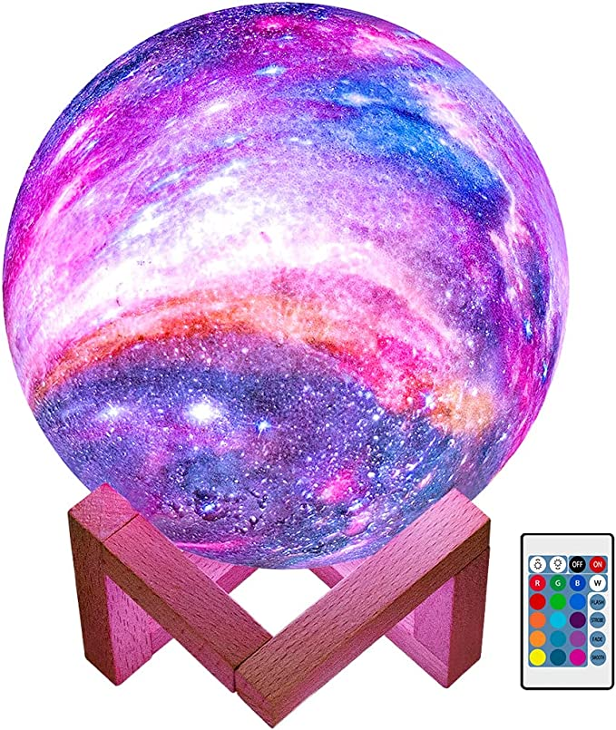

[Buy on Amazon](https://amzn.to/3XecEN3){target=_blank}

Being somebody who is really enjoys space... I enjoyed this gift. However, the only thing missing, was integration with home assistant!

As well, I felt it could benefit from being able to display multiple colors at the same time, to present nice shading effects.

BUT, in the event I failed at disassembling, and replacing the inner-workings of the globe, I decided to acquire a new one. After looking around, I discovered you could get these up to 10 inches in diamater.

### Parts / Products needed.

* [9.6" globe (Amazon Link)](https://amzn.to/3VOM7Vk){target=_blank}
* [QuinLED-Dig-Uno](https://quinled.info/pre-assembled-quinled-dig-uno/){target=_blank}
    * I already had a few of these on hand. These make assembling WLED projects a breeze. No guess work required. Plug and play.
    * You don't NEED one- but, it sure does make the process easier.
* [WS2815 LED Strip](https://amzn.to/3Xd08NN){target=_blank}
    * NORMALLY, I use WS2013 LEDs for my projects, which are 5v. However, I decided to go with 12v LEDs this time to maximize potential brightness. 
    * These are individually addressable, RGB LEDs with a backup channel. 
        * The backup channel, prevents individual LED failures from affecting the rest of the strip.

### Getting Started

#### Step 1. Remove the "bottom"

To remove the bottom section of the globe, I wedged a flat-head screw driver into the crack, and popped the bottom off.

Once the bottom was off, you will be left with an empty globe

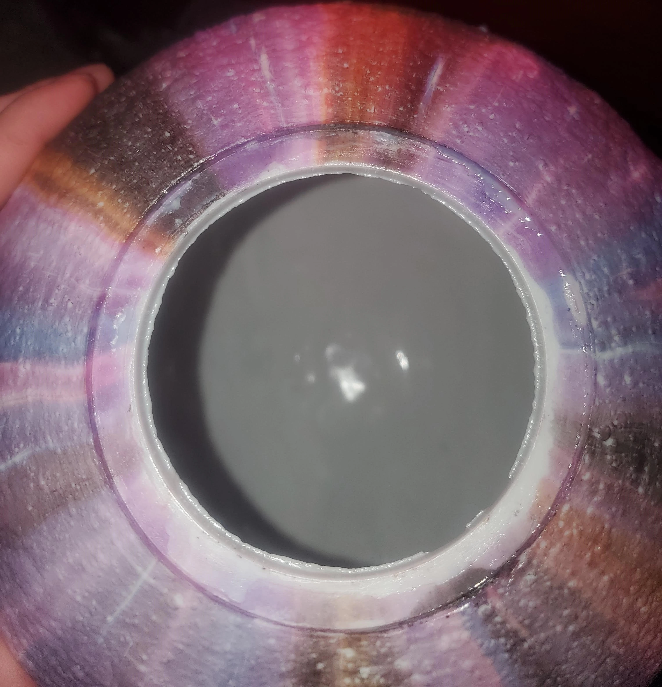

and, the stock circuity. Appears to be a very small microcontroller, with a small battery. It only contains 4 LEDs, which are always the same color.

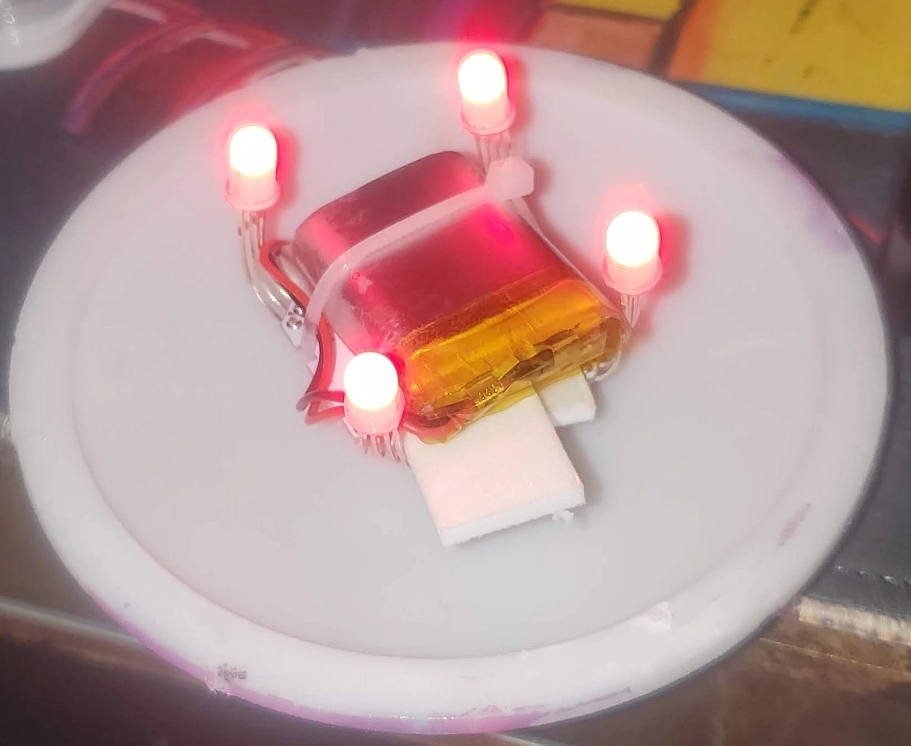

#### Step 2. "Mount" the LED strip.

After thinking for a bit, I decided to take a simple approach of just wrapping the LED strip around a piece of 2" PVC pipe I had laying around.

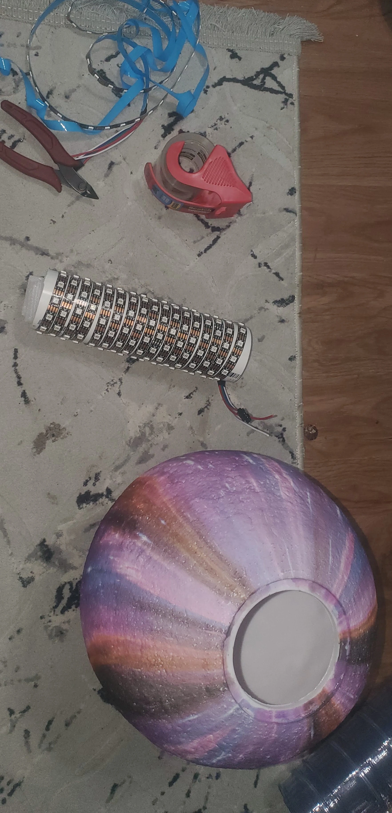

Do note, I pushed a piece of foam into the bottom of the tube, to allow it to rest on the inside of the globe, once installed.

#### Step 3. Connect WLED

Make SURE to set your jumper to the proper voltage! If you are using 12v LEDs, make sure to use 12v power! For 5v LEDs, use 5v power. Make sure the 12v/5v jumper reflects the voltage!

Once you have connected up the wires, and powered the QuinLED, connect to its wifi SSID using your phone. After connecting, you will be directed to a setup page.

Here, you can setup the proper wifi details. Once you have connected this unit to your wifi network, you can manage WLED using the WLED app.

The only configuration I performed, was to set the maximum current to 2 amps (This is the rating of my 12v power supply I am using), and set the number of LEDs. I happened to have exactly 200 LEDs.

This is important, because WLED will automatically adjust the brightness in order to greatly assistat color accuracy. 

Here is the results after this step was completed:

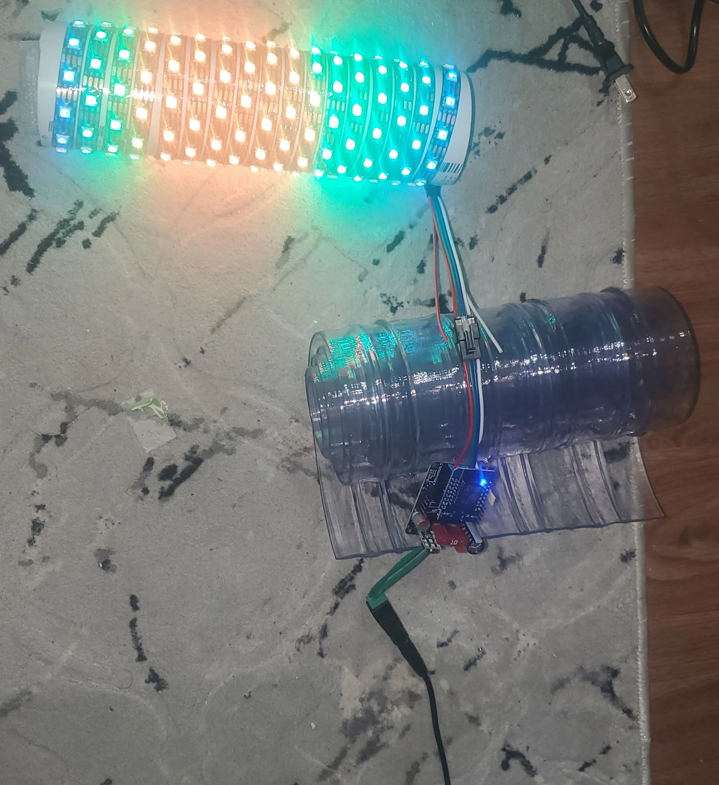

#### Step 4. Add power plug.

IF, you decide to use 5v LEDs, you can retain the stock power adaptor. For me, I will need to replace the 5v plug, with a proper 12v plug.

As you can see, there is a tiny bit of difference here.

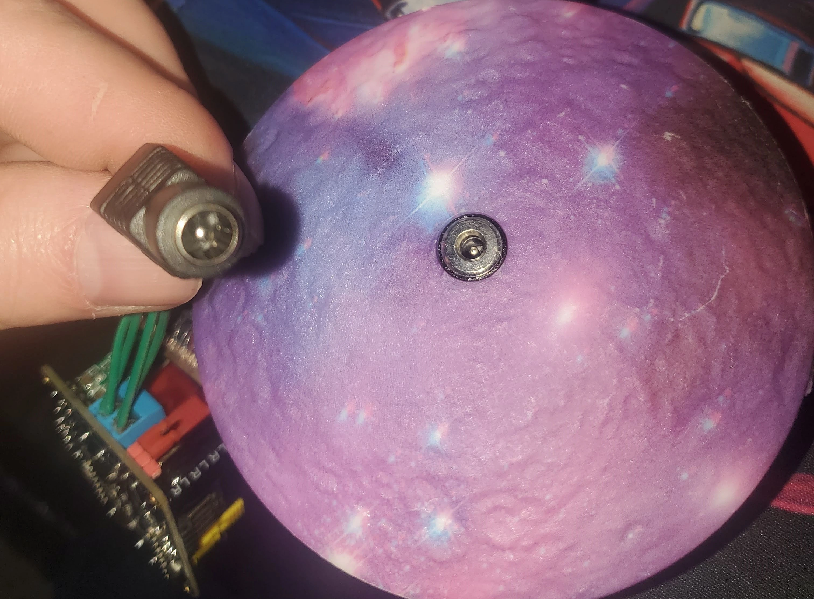

Since, the old plug was just held in using some glue, I positioned the bottom-plate on my vice, and used a hammer, in conjunction with a punch to knock the old plug out.

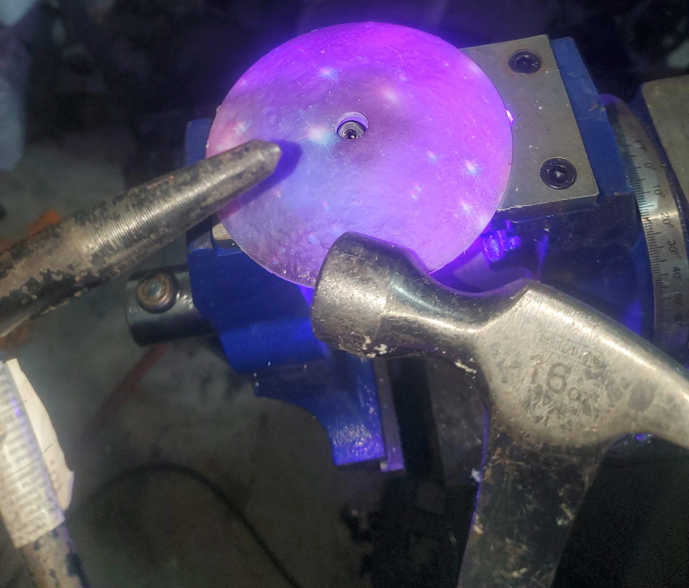

Knock on wood, my new plug fit right into the old hole, and required no additional modifications.

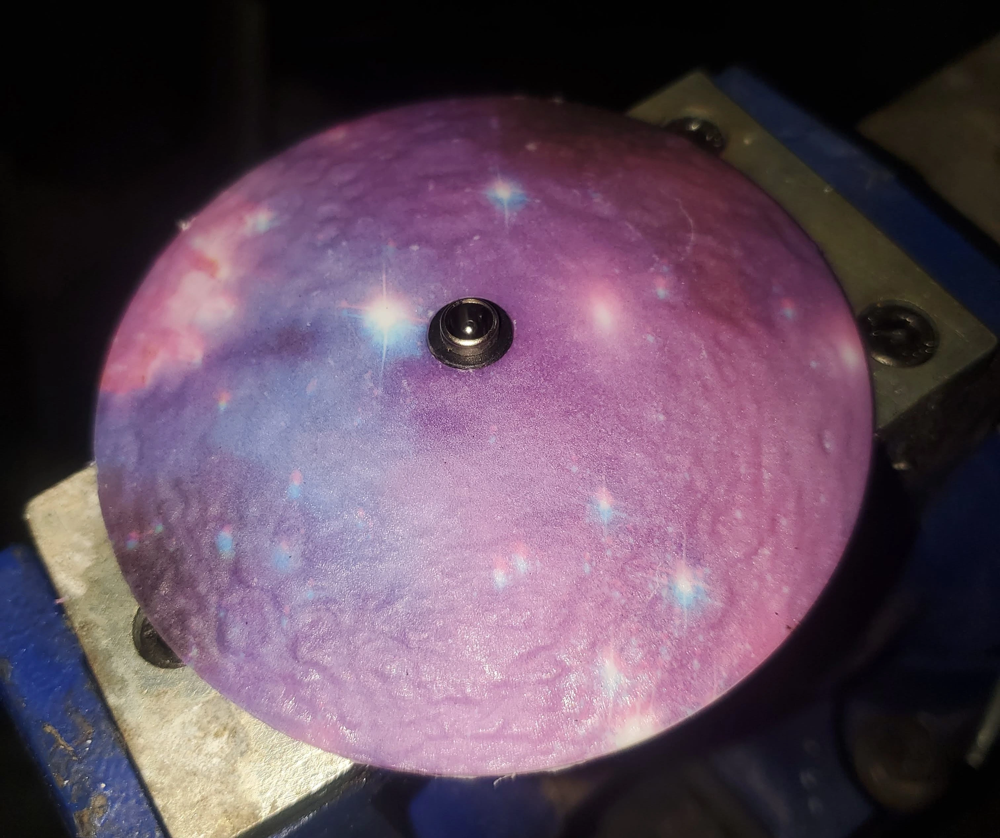

While I was in the garage, I grabbed a few short pieces of copper wire I had laying around. This wire is about the maximum diamater for which the terminals can fit... and is over-kill for the purpose. 

However, I had the choice of this, or 24ga wire, which is undersized. I also used a hot glue gun to glue in the new 12v plug.

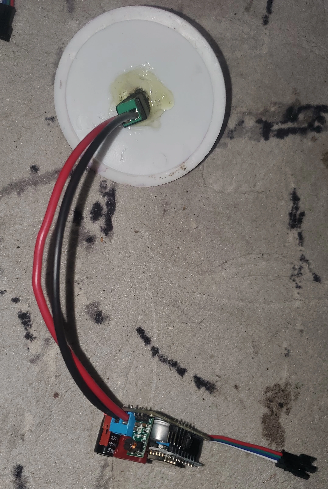

#### Step 5. Test fit everything, and mount.

Since I had a piece of 2" PVC, this was plenty big to push the QuinLED into, with plenty of room for the resulting wire.

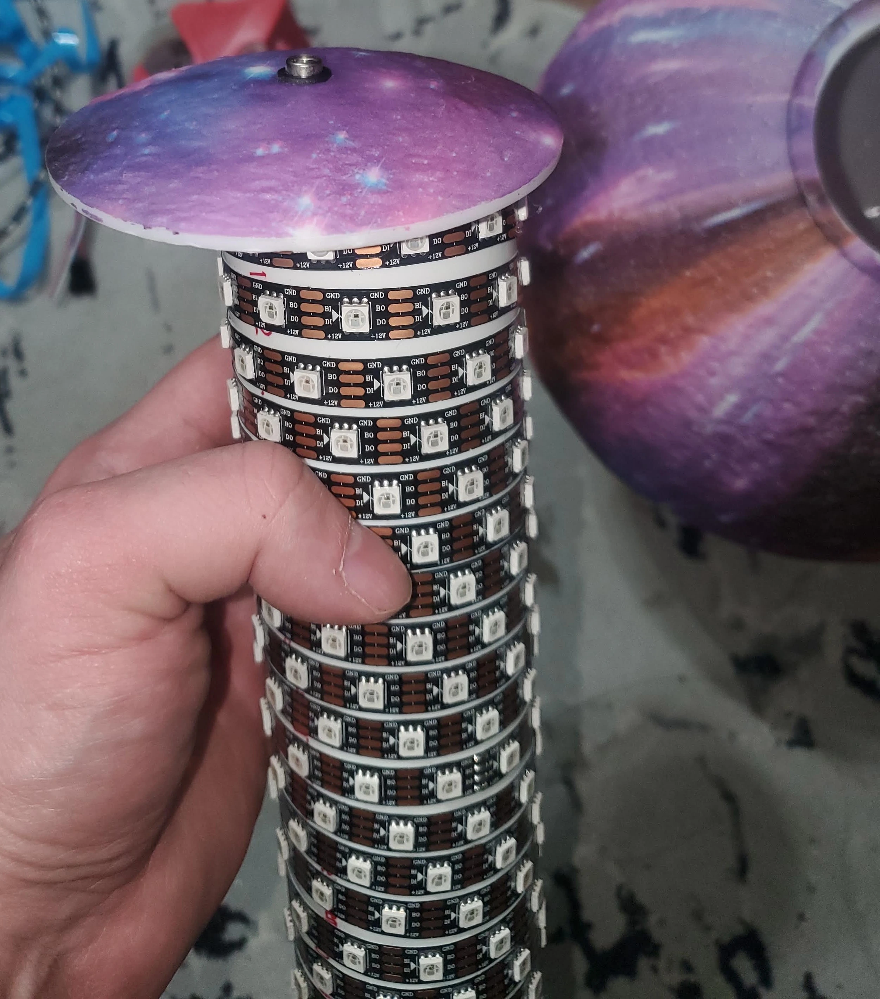

After pushing everything togather, and ensuring there are no clearance issues- I placed the assembly into the globe.

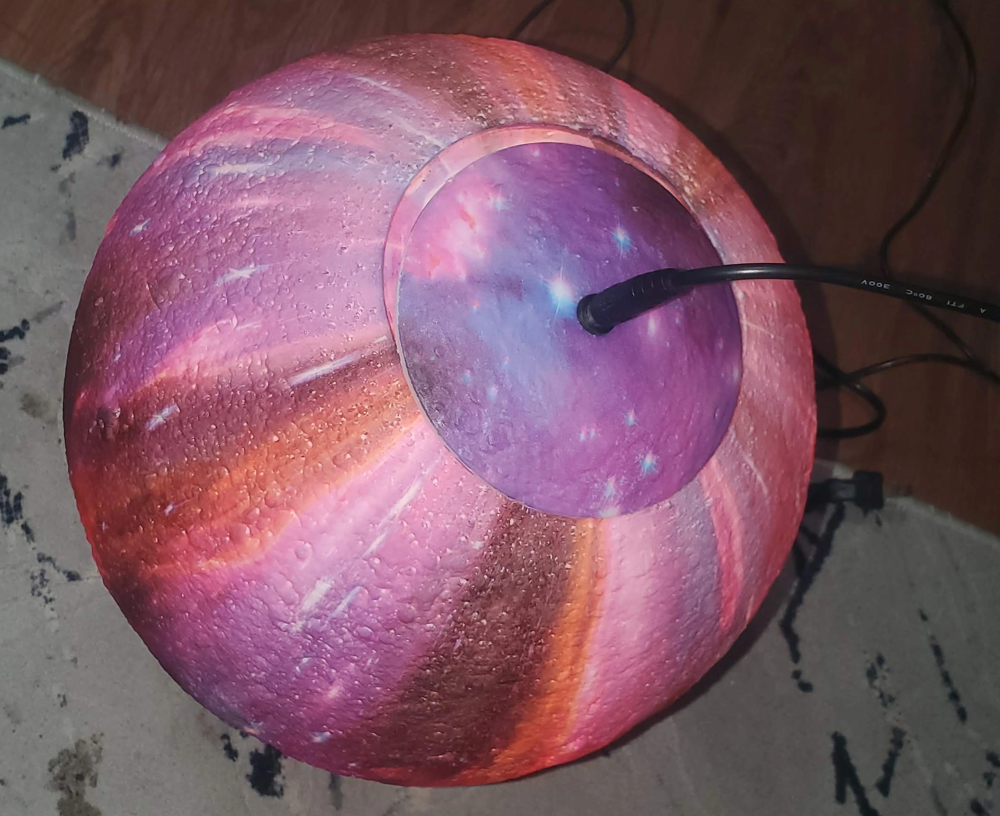

In an earlier step- you may have noticed a small piece of foam in the bottom of the PVC tube. This helps it fit snugly inside of the globe.

After validating everything fits togather, and WORKS properly, I pressed on the bottom piece. You can use some glue here if needed.

### Add to home assistant

[Click here to open your home assistant integrations](https://my.home-assistant.io/redirect/integrations/){target=_blank} or navigate to your home assistant, click settings, integrations.

Click Add Integration

Search for "WLED"

Click "WLED"

Type in the IP address of the WLED you configured earlier. If you did not allocate a static IP address via its configuration, or a static DHCP lease, I would strongly recommend doing so.

Once everything is setup and configured, you will be able to view and control this device via home-assistant. 

For now, I included this into my office's scenes for ambiance lighting.

## The final result?

<iframe width="626" height="1112" src="https://www.youtube.com/embed/hWdxvYTsVus" title="WLED - Preset 1" frameborder="0" allow="accelerometer; autoplay; clipboard-write; encrypted-media; gyroscope; picture-in-picture; web-share" allowfullscreen></iframe>

<iframe width="626" height="1112" src="https://www.youtube.com/embed/JeWnyIhCj6A" title="WLED - Preset 2" frameborder="0" allow="accelerometer; autoplay; clipboard-write; encrypted-media; gyroscope; picture-in-picture; web-share" allowfullscreen></iframe>

## Disclaimers

--8<--- "docs/snippets/amazon-affiliate-link-non-sponsered.md"

