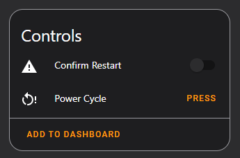
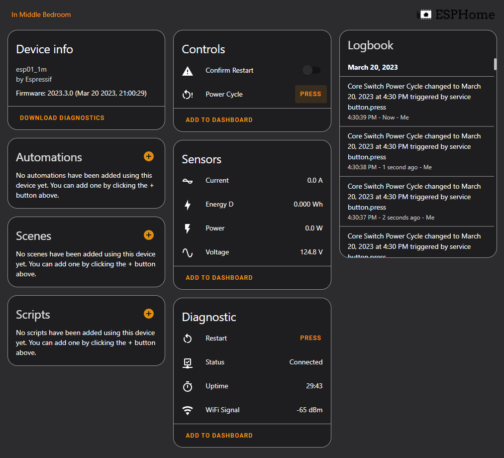
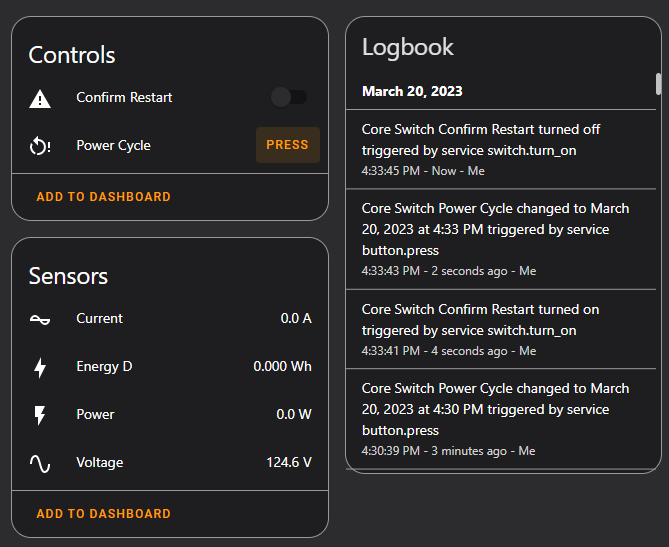

# Using ESPHome on critical devices, such as networking gear



In an effort to monitor the consumption of everything- I ran across an unusual problem.

When connecting my core switch to a ESPHome flashed smart switch, I noticed two things-

1. It is very easy to accidentally turn the switch off.
    * This is a problem, because you cannot turn it back on remotely! Since, wifi connects to the core switch.
2. When flashing updated firmware, the relay will quickly toggle for a very short duration.
    * This can cause devices to power cycle.

So, I set out to see how I could customize my configuration to be suitable for managing my core switch.

I will be implementing:

1. A button to power-cycle the core switch.
2. Configuration to prevent the relay from toggling during firmware updates / ESPHome restarts.
3. Removing toggle switches.

<!-- more -->

What are some of the use cases for doing this:

* Using a plug to monitor the energy consumption and status certain appliances, that you don't want to accidentally turn off.
    * A fridge
    * A deep freezer
* Using a smart plug on network equipment and servers.
    * Being able to power-cycle your router, switch, server, etc.
    * Ensuring you are able to successfully power-cycle the device hosting your wifi.


## How to prevent the switch from cycling during restarts?

To prevent the relay from cycling during firmware updates, or software restarts, only needs two things.

First- is this section in the configuration:

``` yaml
esp8266:
  early_pin_init: false
```

References:

* [Esphome - esp8266 component documentation](https://esphome.io/components/esp8266.html){target=_blank}
* [Original Github issue](https://github.com/esphome/issues/issues/3263){target=_blank}

Second- is setting the `restore_mode` for the GPIO switch.

``` yaml
switch:
  - platform: gpio
    pin: GPIO12
    # It is assumed this switch is used for a piece of critical infrastructure.
    # As such, we want it to remain ON turing reboots.
    # Lastly- the only functionality exposed for interacting with this relay, is to quickly power cycle it.
    restore_mode: ALWAYS_ON
```

With this two pieces of configuration, it should prevent the momentary "blip" of your relay being cycled when updating firmware, or restarting the software.

## How to add a confirm button?

The confirm button, required a few components.

First up, I needed a variable to contain the "confirm restart".

``` yaml
globals:
  # Global boolean containing value if confirm is selected.
  - id: confirm_restart
    type: bool
    restore_value: no
    # When the device is restarted, default the false / off.
    initial_value: 'false'
```

Next, we need to expose this to home assistant.

To handle this, I used a template switch, which references the above global variable. Clicking the switch, sets the state of the above variable.

``` yaml
switch:
  # Expose a "confirm restart" switch.
  - platform: template
    name: Confirm Restart
    id: confirm_restart_sw
    icon: mdi:alert
    lambda: |-
      return id(confirm_restart);
    turn_on_action:
      - lambda: |-
          id(confirm_restart) = true;
    turn_off_action:
      - lambda: |-
          id(confirm_restart) = false;
```

Now that we have a switch which we can toggle on and off from within home assistant, we need to connect this to the restart button.

``` yaml
button:
  - platform: template
    name: Power Cycle
    icon: mdi:restart-alert
    on_press:
      - if:
          condition:
              # Get the current value of the global variable.
              lambda: 'return id(confirm_restart);'
          then: # Below actions are ONLY executed, if the confirm switch is toggled on.
            # Turn off confirm switch after cycling relay, to greatly reduce the chance of the device being power cycled again.
            - switch.turn_off: confirm_restart_sw
            # Turn off the relay.
            - switch.turn_off: relay
            # Wait a half second before turning the relay back on.
            - delay: 0.5s
            # Turn on the relay.
            - switch.turn_on: relay
```

Here is the end result:



Notice, clicking the `Power Cycle` button does not actually cycle the device.

BUT, after switching the confirm on, it does successfully power cycle the device.



Overall, this worked flawlessly.

## Final Configurations

### Main configuration

``` yaml title="Core-Switch.yaml"
substitutions:
  devicename: "rack_core_switch"
  friendly_name: "Core Switch"
  # Put your own IPs here.
  ip_address: 10.1.2.3
  gateway: 10.1.2.1
  <<: !include secrets.yaml

<<: !include config/common.yaml
<<: !include common/sonoff-s13-reset-only.yaml
```

For the top-level config I copy/paste for various devices, that is literally it! I try to follow the D.R.Y. principal when building configurations for ESPHome. 

### Common Configuration

``` yaml title="common.yaml"
wifi:
  ssid: ${wifi_ssid}
  password: ${wifi_pass}
  domain: ".yourdomain.com"
  fast_connect: True
  power_save_mode: none
  manual_ip:
    static_ip: ${ip_address}
    gateway: ${gateway}
    # All of my IOT subnets are /24. I didn't see a need to make this a variable / substitution. 
    subnet: 255.255.255.0

  ap:
    ssid: "${devicename} Fallback"
    password: ${fallback_pass}

# captive_portal:

# Enable logging
logger:

# Enable Home Assistant API
api:
  encryption:
    key: ${encryption_key}
  # password: ${api_pass}
  # services:
  #   - service: reboot
  #     then:
  #       - platform: restart

ota:
  password: ${ota_pass}

# Enable Time Component
time:
#  - platform: homeassistant
#    id: homeassistant_time
#    timezone: YourTimezoneHere.
  # I use NTP, rather than home assistant, as I have been configuring my devices to be able to work stand-alone without home-assistant, if needed.
  - platform: sntp
    servers: ${ntp_server_ip}
    timezone: ${timezone}

# This section is optional. However, I configure all of my devices to also use MQTT, along with home assistant directly. 
# MQTT allows me to easily integrate them into other systems.
mqtt:
  broker: ${mqtt_pass}
  username: ${mqtt_user}
  password: ${mqtt_pass}
  discovery: false
  log_topic:
    topic: esphome/logs/${devicename}
    level: ERROR
  topic_prefix: esphome
  birth_message:
    topic: esphome/state/${devicename}
    payload: online
  will_message:
    topic: esphome/state/${devicename}
    payload: offline
```

### Secrets

``` yaml title="secrets.yaml"
api_pass: ""
ota_pass: ""
fallback_pass: ""
encryption_key: ""

wifi_ssid: ""
wifi_pass: ""

backup_wifi_ssid: ""
backup_wifi_pass: ""

# NTP Server IP, if you use NTP instead of home assistant for time. 
ntp_server_ip: 1.2.3.4
timezone: YourTimezoneHere

# MQTT Server IP, if you use MQTT.
mqtt_ip: 1.2.3.4
mqtt_user: ""
mqtt_pass: ""
```

### Device-specific configuration

Below is the primary configuration I am using for my [Sonoff S13](sonoff-s31-low-cost-energy-plug.md){target=_blank} devices, which have something important connected to them.

This configuration is designed to prevent the switch from being placed into an "Off" position. 

``` yaml title="common/sonoff-s13-reset-only.yaml"
esphome:
  name: ${devicename}
  friendly_name: ${friendly_name}

logger:
  # (UART logging interferes with cse7766)
  baud_rate: 0

esp8266:
  # https://esphome.io/components/esp8266.html
  # https://github.com/esphome/issues/issues/3263
  # Stops relay from cycling when restarting or flashing
  early_pin_init: false
  board: esp01_1m

uart:
  rx_pin: RX
  baud_rate: 4800


globals:
  # Global boolean containing value if confirm is selected.
  - id: confirm_restart
    type: bool
    restore_value: no
    initial_value: 'false'

binary_sensor:
  - platform: gpio
    pin:
      number: GPIO0
      mode: INPUT_PULLUP
      inverted: True
    internal: true
    id: the_button
    on_press:
      - switch.toggle: relay

  - platform: status
    name: Status

sensor:
  # Wifi Signal
  - <<: !include sensor-wifi-signal.yaml

  # Uptime
  - <<: !include sensor-uptime.yaml

  # Energy monitoring
  - platform: cse7766
    current:
      name: "Current"
      accuracy_decimals: 1
      state_class: measurement
      device_class: current
    voltage:
      name: "Voltage"
      accuracy_decimals: 1
      state_class: measurement
      device_class: voltage
    power:
      name: "Power"
      accuracy_decimals: 1
      state_class: measurement
      device_class: power
      id: my_power
    update_interval: 15s
  - platform: total_daily_energy
    name: "Energy D"
    state_class: total_increasing
    device_class: energy
    power_id: my_power

switch:
  - platform: gpio
    pin: GPIO12
    id: relay
    # It is assumed this switch is used for a piece of critical infrastructure.
    # As such, we want it to remain ON turing reboots.
    # Lastly- the only functionality exposed for interacting with this relay, is to quickly power cycle it.
    restore_mode: ALWAYS_ON
    # Hide from home assistant / mqtt.
    internal: true

  # Expose a "confirm restart" switch.
  - platform: template
    name: Confirm Restart
    id: confirm_restart_sw
    icon: mdi:alert
    lambda: |-
      return id(confirm_restart);
    turn_on_action:
      - lambda: |-
          id(confirm_restart) = true;
    turn_off_action:
      - lambda: |-
          id(confirm_restart) = false;

button:
  # Restart Button
  - <<: !include button-restart.yaml

  - platform: template
    name: Power Cycle
    icon: mdi:restart-alert
    on_press:
      - if:
          condition:
              lambda: 'return id(confirm_restart);'
          then:
            - switch.turn_off: relay
            - delay: 0.5s
            - switch.turn_on: relay
            # Turn off confirm switch after cycling relay
            - switch.turn_off: confirm_restart_sw

status_led:
  pin:
    number: GPIO13
    inverted: yes
```

### Other Referenced Configurations

button-restart, simply, is the restart button. Instead of placing the same 4 lines of configuration in every file, I just reference this one file.

``` yaml title="button-restart.yaml"
  - platform: restart
    name: Restart
    icon: "mdi:restart"
    entity_category: diagnostic
```

The same with my uptime sensor.

``` yaml title="sensor-uptime.yaml"
  - platform: uptime
    name: Uptime
    state_class: measurement
    device_class: duration
```

``` yaml title="sensor-wifi-signal.yaml"
  - platform: wifi_signal
    name: "WiFi Signal"
    update_interval: 60s
    state_class: measurement
    device_class: SIGNAL_STRENGTHr
```

I have these individual components broken out into dedicated files, because I have a pretty decent number of devices running ESPHome. By separating them into dedicated files, I can ensure all of my devices have a consistent configuration. 