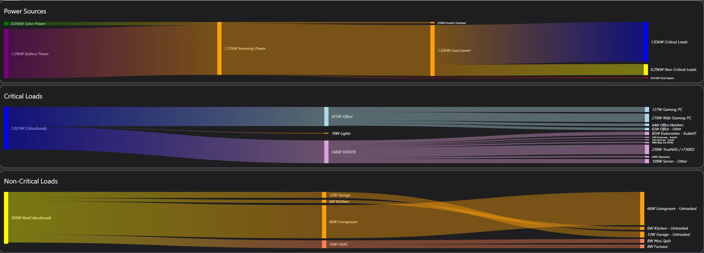
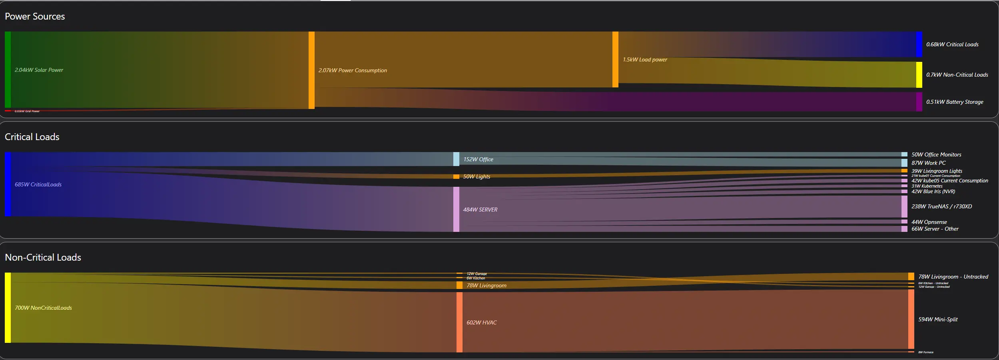
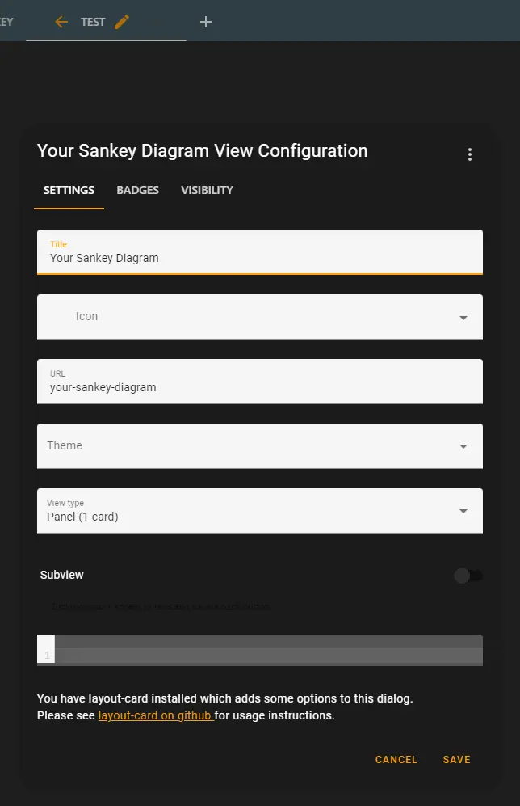
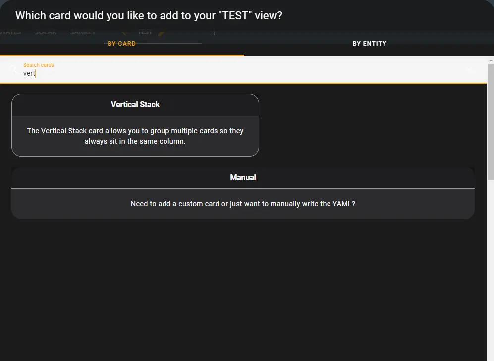
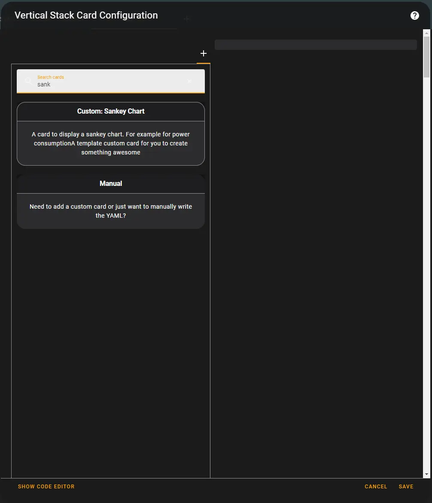
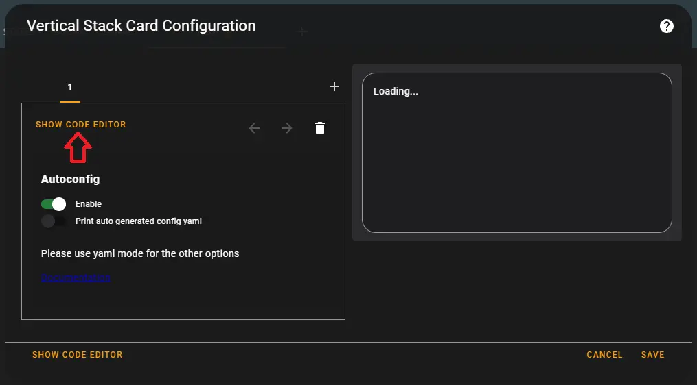
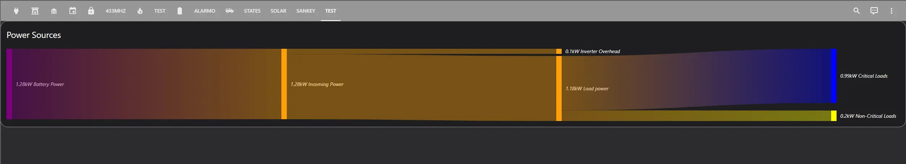

# Home Assistant - Energy Flow Diagram

This is a quite guide on creating a real-time sankey diagram to show your current energy usage.



<!-- more -->

Here is an image from earlier in the day, when the sun was shining a bit more.



## What is the use-case?

The use case for me doing this, was to build a dashboard to quickly identify real time instantaneous power consumption. 

That is- when I realize my energy consumption is higher then I expect, I can glance at this dashboard, and quickly determine which device or circuit is responsible for the additional consumption.

Although, you technically should be able to design this dashboard around looking at energy utilization specified in Kwh/d, I will not be doing that in this post.

## Software Needed

1. Home Assistant.
2. [ha-sankey-chart](https://github.com/MindFreeze/ha-sankey-chart){target=_blank}
  * You can add this using hacs. Look under the frontend section.

## How to collect energy data

For my charts I use a combination of data from multiple different sources.

If you are just curious to read about different solutions for gathering energy data, please see: [Home Assistant - Energy Monitoring Solutions](./../living-posts/home-assistant-energy-monitoring.md){target=_blank}.

### Solar / Grid Data

The top-level production/consumption data is collected by my inverter, which also has strategically placed CT clamps to measure energy going into and from the main meter.

It provides additional metrics for...

1. Total load consumption
2. Consumption for both Critical, and Non-Critical breaker panels. 
3. PV / Solar Production
4. Generator Production
5. Battery Power

I leverage solar-assistant to collect data from my inverter. If you would like to learn more, read [Solar Installation - Part 4 - Monitoring](./../../Solar/solar-part-4-monitoring.md){target=_blank}

### Per-Breaker Data Collection

For collecting data for individual  breakers, there are many solutions you can leverage.

I have a collection of [Energy Monitoring Solutions](./../living-posts/home-assistant-energy-monitoring.md){target=_blank}

I personally, use Iotawatt for per-circuit monitoring. I wrote about its recent installation here: [Solar Installation - Part 4 - Monitoring](./../../Solar/solar-part-4-monitoring.md){target=_blank}

### Per Device Data Collection.

Again, in the [Energy Monitoring Solutions](./../living-posts/home-assistant-energy-monitoring.md){target=_blank} post, there are a few options for smart-plugs with energy monitoring capabilities. 

1. For the data I am collecting for a lot of my servers and computers, I leverage [Tp-link Kasa HS300 strips](https://amzn.to/3Buk5Hx){target=_blank}. I reviewed and documented those here: [Kasa HS300 as Rack-Mounted PDU](./../2022/kasa-powerstrip.md){target=_blank}

Those strips are installed in both my server rack, as well as my office. 

For collecting data from my r730XD, I found [THESE INSTRUCTIONS](https://github.com/genestealer/Home-Assistant-Configuration/blob/master/packages/dell_server/dell_idrac.yaml){target=_blank} for collecting its SNMP data directly via home-assistant.

For my office light switch, I leverage a [Shelly 1PM](https://amzn.to/3ZR9zEm){target=_blank} behind a normal light switch.

For the Entry and Porch lights (Double-switch box), I use a [Shelly 2.5](https://amzn.to/3ZYZpB8){target=_blank}.

Lastly, all of my other lights are  [Inovelli Red](https://inovelli.com/collections/inovelli-red-series){target=_blank} z-wave dimmer switches which self-reports consumption data.

## Creating the visualization

This assumes you have already installed [ha-sankey-diagram](https://github.com/MindFreeze/ha-sankey-chart){target=_blank}! If not, go install it via HACs.

I recommend starting with a blank dashboard panel. 

Afterwards, I recommend setting the dashboard view mode to `Panel (Single Card)`



IF, you want to stack multiple diagrams, such as my version at the top of this post, add a `vertical stack card`



Once you have added the `vertical stack card`, add the `Custom: Sankey Chart`



Next, Click Edit Code.



From this point- everything else will be mostly done with code.

### The Code

I started my diagram with the example provided in the [ha-sankey-diagram](https://github.com/MindFreeze/ha-sankey-chart){target=_blank} repository. 

I will use my top panel as an example for this post.

Under sections, you can have many groups of entities. Imagine each group of entities as a section. The children collection under each entity, defines the links.

Do note, if you don't have individual sensors for `grid_power_in`/`grid_power_out`/`battery_power_in`/`battery_power_out`, but you do have sensors for say, `sensor.grid_power`, then you may need to create a template to split that sensor into others. See [Split Sensor into Negative and Positive Sensors](./hass-split-sensor-negative-and-positive.md){target=_blank}. I had to do this for `sensor.battery_power` and `sensor.grid_power`

``` yaml
type: custom:sankey-chart
title: Power Sources

unit_prefix: k          # You can change this to alter which units are displayed. Leaving it blank/null, will result in the dashboard being displayed in watts. `k` displays values in Kw.
show_names: true
show_icons: false
show_units: true
show_states: true
wide: true
min_state: null         # You can change this value to hide entities which are blow this number. ie, Setting "5", would hide anything below 5kw. (Because- we defined the unit as Kw above)
round: 2                # I chose to round these numbers to two decimal places.
sections:

  # For the first section, I put together all of the energy sources in my home.
  - entities:
      - entity_id: sensor.pv_power              # Solar Production
        name: Solar Power
        color: green
        children:
          - sensor.total_power_in               # In the children section, add links to this object's children.
      - entity_id: sensor.battery_power_out     # Battery Power OUT (Don't use Battery power!)
        name: Battery Power
        color: purple
        children:
          - sensor.total_power_in
      - entity_id: sensor.grid_power_in
        name: Grid Power
        color: red
        children:
          - sensor.total_power_in

  # I created a home-assistant helper, via the GUI, to create a sensor with the sum of sensor.load_power, sensor.battery_power_in, and sensor.grid_power_out
  - entities:
      - entity_id: sensor.total_power_in
        name: Incoming Power
        remainder: losses
        children:
          - sensor.load_power
          - sensor.battery_power_in
          - sensor.grid_power_out
          - losses                        # This is a "special" identifier. More below.     
          
  # The next section, is to split the loads, into a section for critical loads, and non-critical loads. Do note, sensor.grid_power_out is not defined here, and will be passed into the next section.
  - entities:
      - entity_id: losses                 # This is a special type, which shows the "unaccounted/remaining" value, which is not accounted for. See https://github.com/MindFreeze/ha-sankey-chart#entity-types
        type: remaining_parent_state
        name: Inverter Overhead           # My assumption, these losses are likely inverter overhead. The value matches with the amount of overhead I would expect from my inverter.
      - entity_id: sensor.load_power      
        children:
          - sensor.load_power_essential
          - sensor.load_power_non_essential

  - entities:
      - entity_id: sensor.load_power_essential
        color: blue
        name: Critical Loads
      - entity_id: sensor.load_power_non_essential
        color: yellow
        name: Non-Critical Loads
      - entity_id: sensor.grid_power_out
        color: red
        name: Grid Export
      - entity_id: sensor.battery_power_in
        color: purple
        name: Battery Storage
```

After you put all of that together, you will end up with a dashboard like this:



Then- just add more Sankey Charts into your vertical stack, until you have the desired information displayed.

The end result?


For one last example- here is the YAML from my `Critical Loads` panel.

``` yaml
type: custom:sankey-chart
title: Critical Loads
show_names: true
show_icons: false
show_units: true
show_states: true
wide: true
min_state: 5
round: 0
sections:
  - entities:
      - entity_id: sensor.criticalloads
        color: blue
        remaining: untracked_critical
        children:
          - sensor.bedroom
          - sensor.lights
          - sensor.server
  - entities:
      - entity_id: sensor.bedroom
        name: Office
        color: LightBlue
        remaining: Office - Other
        children:
          - sensor.gaming_pc_current_consumption
          - sensor.wife_pc_current_consumption
          - sensor.monitors_current_consumption
          - sensor.internet_current_consumption
          - sensor.work_pc_current_consumption
          - sensor.bedroom_switch_current_consumption
      - entity_id: sensor.lights
        children:
          - sensor.livingroom_ceiling_light_electric_consumption_w
          - sensor.kitchen_light_electric_consumption_w
          - sensor.dining_room_light_electric_consumption_w
          - sensor.front_porch_light_watts
          - sensor.entry_light_watts
          - sensor.back_porch_electric_consumption_w
          - sensor.middle_bathroom_light_electric_consumption_w
          - sensor.middle_bathroom_light_electric_consumption_w
          - sensor.middle_bedroom_electric_consumption_w
          - sensor.bedroom_light_watts
      - entity_id: sensor.server
        color: plum
        remaining: Server - Other
        children:
          - sensor.kube01_current_consumption
          - sensor.kube05_current_consumption
          - sensor.kube06_current_consumption
          - sensor.nvr_current_consumption
          - sensor.kasa_smart_plug_383a_2_current_consumption
          - sensor.truenas_power
      - entity_id: untracked_critical
        type: remaining_parent_state
        name: Untracked
  - entities:
      - entity_id: Office - Other
        type: remaining_parent_state
      - entity_id: Server - Other
        type: remaining_parent_state
      - entity_id: sensor.gaming_pc_current_consumption
        name: Gaming PC
        color: LightBlue
      - entity_id: sensor.bedroom_switch_current_consumption
        name: Office 10G Switch
        color: LightBlue
      - entity_id: sensor.wife_pc_current_consumption
        name: Wife Gaming PC
        color: LightBlue
      - entity_id: sensor.monitors_current_consumption
        name: Office Monitors
        color: LightBlue
      - entity_id: sensor.internet_current_consumption
        name: Optical Media Converter
        color: LightBlue
      - entity_id: sensor.work_pc_current_consumption
        name: Work PC
        color: LightBlue
      - entity_id: sensor.livingroom_ceiling_light_electric_consumption_w
        name: Livingroom Lights
      - entity_id: sensor.kitchen_light_electric_consumption_w
        name: Kitchen Lights
      - entity_id: sensor.dining_room_light_electric_consumption_w
        name: Dining Room Lights
      - entity_id: sensor.front_porch_light_watts
        name: Front Porch Light
      - entity_id: sensor.entry_light_watts
        name: Entry Lights
      - entity_id: sensor.back_porch_electric_consumption_w
        name: Back Porch Light
      - entity_id: sensor.middle_bedroom_electric_consumption_w
        name: Server Room - Light
      - entity_id: sensor.middle_bathroom_light_electric_consumption_w
        name: Middle Bathroom - Light
      - entity_id: sensor.middle_bathroom_light_electric_consumption_w
        name: Middle Bathroom - Toilet Light
      - entity_id: sensor.bedroom_light_watts
        name: Office - Lights
      - entity_id: sensor.kube01_current_consumption
        name: Kubernetes - Kube01
        color: plum
      - entity_id: sensor.kube05_current_consumption
        name: Kubernetes - Kube05
        color: plum
      - entity_id: sensor.kube06_current_consumption
        name: Kubernetes - Kube06
        color: plum
      - entity_id: sensor.nvr_current_consumption
        name: Blue Iris (NVR)
        color: plum
      - entity_id: sensor.truenas_power
        name: TrueNAS / r730XD
        color: plum
      - entity_id: sensor.kasa_smart_plug_383a_2_current_consumption
        name: Opnsense
        color: plum
```


## Summary?

I designed this dashboard mostly for the purpose of having a real-time display of instantaneous power usage in my home. 

This was not designed to track monthly costs, I believe the built-in energy dashboard does a decent-enough job at this already.

But, for the purpose of quickly identifying what in your home is using energy at a particular moment in time, this visualization works amazingly well. 

Overall, I would say I have accomplished my goal.

If, this sounds like a project which may be useful to you, hopefully I have provided the resources you need in order to be successful.