# Pioneer Minisplit control using ESPHome

Around a year and a half ago, I installed a [Pioneer Mini-split and integrated it with Home Assistant](https://xtremeownage.com/2022/03/27/pioneer-mini-split-home-assistant/){target=_blank}

I used a local integration, which had a cloud dependency for the initial setup. And, since installation, it has been working flawlessly. 

However, last week, it completely stopped working and I was unable to reinitialize it. 

So- Today- I will be replacing the midea dongle, with a device running esphome.

<!-- more -->

### Which Units are supported?

From what I have gathered- this may work with these brands (And- maybe more)

* Artel
* Beko
* Carrier
* Comfee
* Electrolux
* Idea
* Midea
* Neoclima
* Pioneer
* Qlima
* Senville

For the purpose of this article, I can only verify this works for my Pioneer WYS 9,000 BTU unit.

## Tools / Hardware needed

To control your mini-split, we will need a ESP processor, with a usb-port, with a 3.3v step down.

### Esp dongle

#### Option 1. Buy pre-made

* [Smartlight AC Wi-fi Module](https://smartlight.me/smart-home-devices/wifi-devices/wifi-dongle-air-conditioners-midea-idea-electrolux-for-home-assistant){target=_blank}
* [CloudFree Ductless HVAC Wi-Fi Module](https://cloudfree.shop/product/ductless-hvac-wi-fi-module/){target=_blank}
    * This is the option I went with. For 15$ shipped, this is cheaper then I could have done it myself.
    * To note- this is the EXACT same module as sold by Smartlight. Just- with quicker shipping in North America.

I will note- the above modules are made in Ukraine. So- this is a very small way of showing a bit of support during the current (as of 2022-2023) war between Ukraine and Russia.

#### Option 2. DIY

If you wish to build your own module, please see the [iot-uni-dongle Github](https://github.com/dudanov/iot-uni-dongle){target=_blank}. This repo offers plans, diagrams, and everything you will need to DIY a module.

### Serial Programmer

If you plan on building your own unit, you will need a serial to USB adaptor for initially flashing it.

With the pre-made unit above- I did not need to flash using serial.

With the pre-made unit above, we can OTA flash it. However, if OTA flashing fails- you will need a serial adaptor to reflash it.

* [DSD Tech USB to TTL Adapter](https://amzn.to/3n3vbP0){target=_blank}

This has been my primary USB to Serial adaptor since 2020. It handles 3.3v, it handles 5v, and in general, it just works.

This DOES use a FTDI chip.

A pair of [Test Hooks](https://www.amazon.com/gp/product/B08M5Z5YFG){target=_blank} will allow you to quickly connect the serial pads to your serial programmer. These came in quite handy when I was reflashing [Sonoff S31 Energy Plugs](./sonoff-s31-low-cost-energy-plug.md){target=_blank} in bulk. 

## Compiling ESPHome Firmware

### Getting Esphome

Assuming you have never used ESPhome before, it is pretty simple to get started.

I personally have a local python install for flashing new devices and testing locally. Once I have validated the new device is able to connect to my network, I copy the configuration file over to my ESPHome docker container where I can then centrally manage my Esphome devices.

If, you are using Home-Assistant with the Esphome addon, you can copy the configurations to there. 

* [Esphome - Getting Started](https://esphome.io/guides/getting_started_command_line.html){target=_blank}
* [Installing Esphome Locally via Python](https://esphome.io/guides/installing_esphome.html){target=_blank}
* [Dockerhub - Esphome](https://hub.docker.com/r/esphome/esphome){target=_blank}

### Creating configuration file for minisplit

I will start building my configuration from the example provided by Esphome.

* [Esphome - Midea Air Conditioner](https://esphome.io/components/climate/midea.html){target=_blank}

If, you use Esphome for building your configuration, it does provide a nice interface with descriptions for attributes

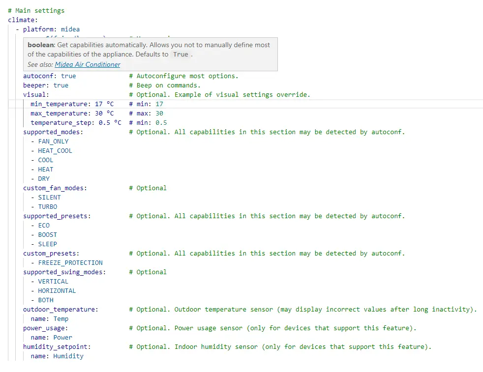

After taking the example provided by ESPHome, and merging in my configuration files- here is the resulting configuration I came up with:

``` yaml title="bedroom_minisplit.yaml"
substitutions:
  devicename: "bedroom_minisplit"
  friendly_name: "Bedroom Minisplit"
  ip_address: 10.100.3.120
  gateway: 10.100.3.1
  <<: !include secrets.yaml

<<: !include common/common.yaml

esphome:
  name: ${devicename}
  friendly_name: ${friendly_name}

esp8266:
  early_pin_init: false
  board: esp12e

# Disable logging over UART (required)
logger:
  baud_rate: 0  

sensor:
  # Wifi Signal
  - <<: !include common/sensor-wifi-signal.yaml

  # Uptime
  - <<: !include common/sensor-uptime.yaml

button:
  # Restart Button
  - <<: !include common/button-restart.yaml

switch:
  - platform: template
    name: Beeper
    icon: mdi:volume-source
    optimistic: true
    turn_on_action:
      midea_ac.beeper_on:
    turn_off_action:
      midea_ac.beeper_off:

status_led:
  pin:
    number: GPIO13
    inverted: yes

# UART settings for Midea dongle (required)
uart:
  tx_pin: 1         # hardware dependant
  rx_pin: 3         # hardware dependant
  baud_rate: 9600

# Main settings
climate:
  - platform: midea
    name: bedroom               # Use a unique name.
    period: 1s                  # Optional
    timeout: 2s                 # Optional
    num_attempts: 3             # Optional
    autoconf: true              # Autoconfigure most options.
    beeper: false               # Beep on commands.
    visual:                     # Optional. Example of visual settings override.
      min_temperature: 15       # Note these values are in C
      max_temperature: 30
      temperature_step: 1       # This defaults to 0.5. I don't have a need for half-degree increments....
    supported_swing_modes:      
      - VERTICAL
      - HORIZONTAL
      - BOTH
```

If, you are curious regarding the contents of some of my common includes- I have created a [basic page detailing my comment components](/pages/esphome/esphome-common/){target=_blank}

After you have your configuration ready- compile it via esphome.

`esphome compile bedroom_minisplit.yaml`

Note- I used compile, instead of run, as I plan on OTA uploading the resulting firmware.

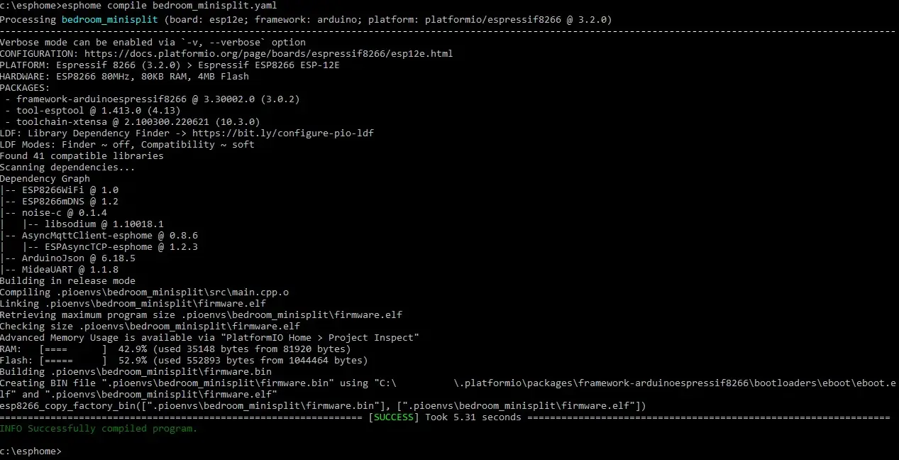

We will need the compiled firmware here in a minute. Take note of the resulting path.

Note- don't plug the module into your computer.

## Installation

To start with, in my Pioneer WYS unit, the module which holds the USB dongle, is held into place by a single phillips screw. Remove the screw and lower the module.

### Modifying USB Port (Dependant on your unit)

This- may not be required, and is dependant on your particular model of Mini-split.

However, My Pioneer WYS series, had a few "extra" grooves on the USB slot.

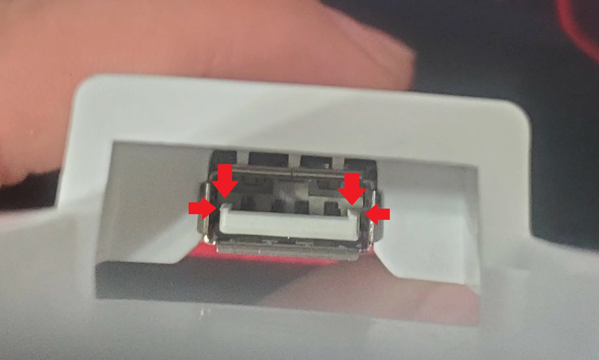

To "fix" this issue, I used a knife to shave off the extra edges, which allowed the ESP module to correctly fit into the USB port.

An exacto-knife would likely be a better tool. However, I only had my pocket-knife handy.

The fix does not need to be perfect, but, you do need to shave off enough of the groove for your unit to properly fit.

### Temporarily Module and Test

Before final reassembly, I wanted to flash my new firmware onto the module, and ensure everything is working as expected.

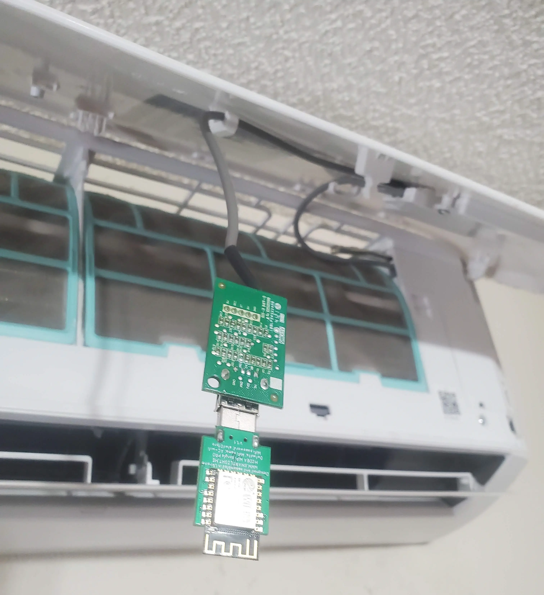

Note- I do not have the plastic enclosure attached right now, as I want to ensure everything works correctly before wrapping the components in the plastic.

### OTA Flashing Directions

Assuming your module works, and was able to correct fit into the USB port- you should now be able to connect to the device's WiFi.

If, you are using the CloudFree/SmartLight module, you will see a new access point named, "AC-Wifi". 

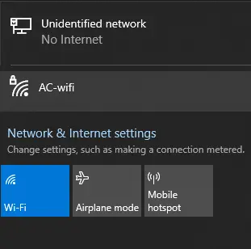

Connect using the password `slwf01pro`

Afterwards, open a browser and navigate to `http://192.168.4.1`

The top section of this page, will list APs which you can connect the unit to. At the bottom, you will see a section named "OTA Update"

Click Choose File, and select the ".bin" file you compiled using ESPHome earlier.

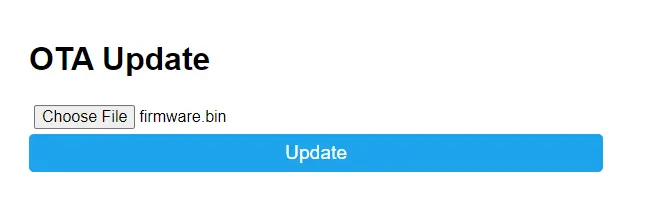

After a bit, the web page will open a prompt letting you know it was successfully flashed.

At this time, I opened a command prompt with a ping to the IP address I specified in the above configuration file.

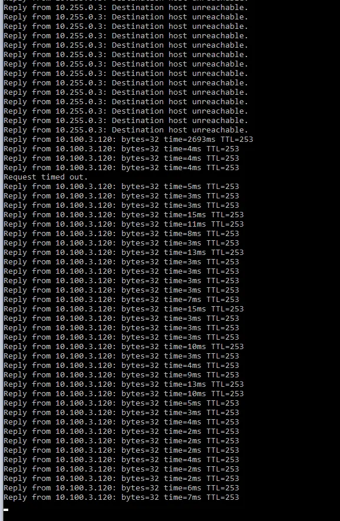

After the device started pinging successfully- I checked the ESPHome dashboard to ensure it was displaying "Online"

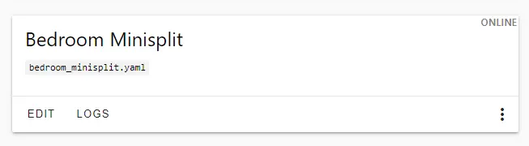

From this point, It was time to reassemble the device.

### Mounting the new ESP Module

The first step- was to reinsert the module into the plastic holder.

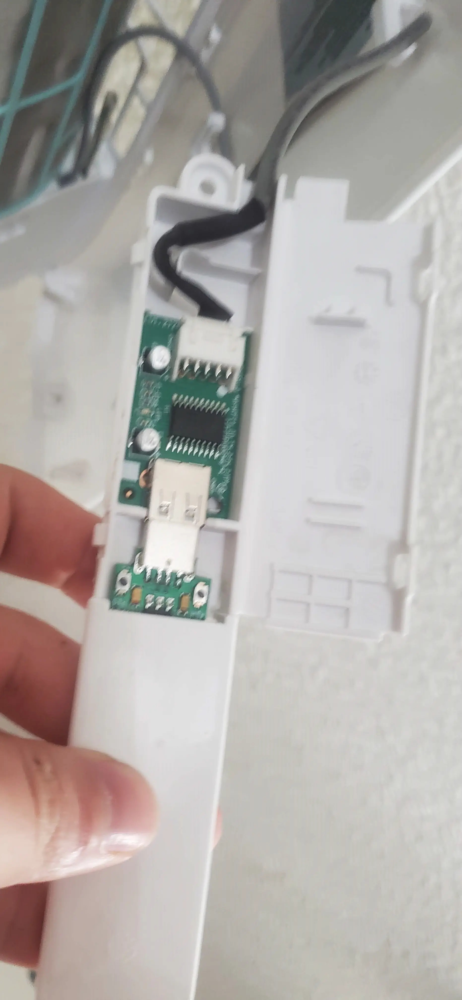

Since, the USB module was pretty small, I left it inserted, and carefully placed it into the enclosure.

Here is the reverse side, after re-attaching the enclosure.

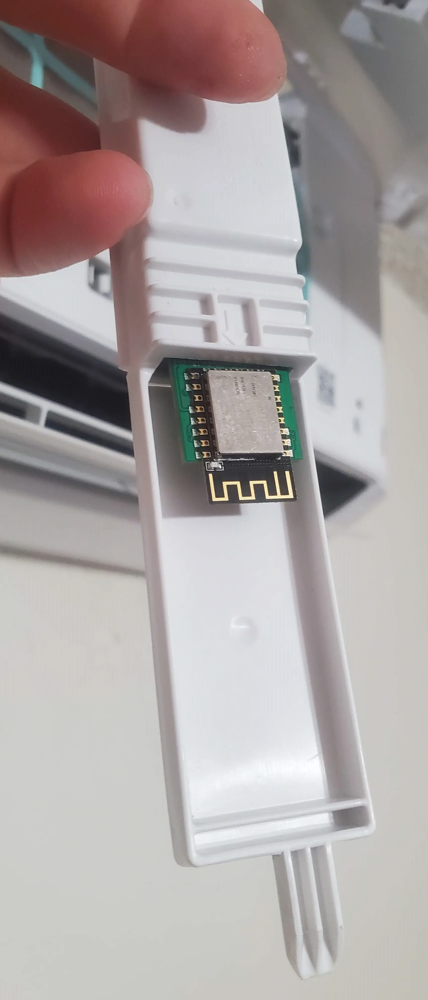

Finally- reattach the plastic enclosure with the single phillips head screw.

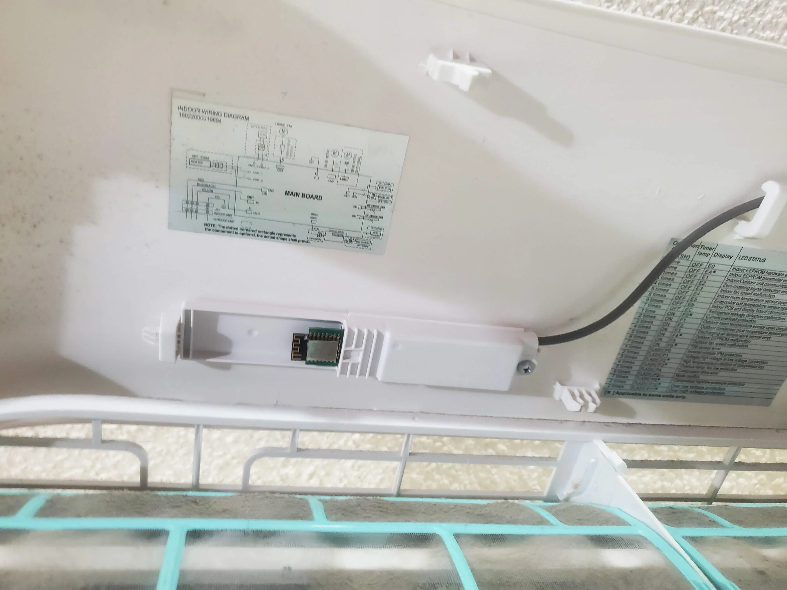

### Add the device to Home Assistant

This, follows the standard process of joining an ESPHome device to home assistant. 

To summarize:

1. Goto Home Assistant
2. Goto Devices / Integrations
3. Click Add Device
4. Select "ESPHome"
5. Type in the IP Address of the device.
6. Enter your encryption key
7. Select the device's Area.
8. You are done!

After- doing those steps, you should see the new device in home assistant.

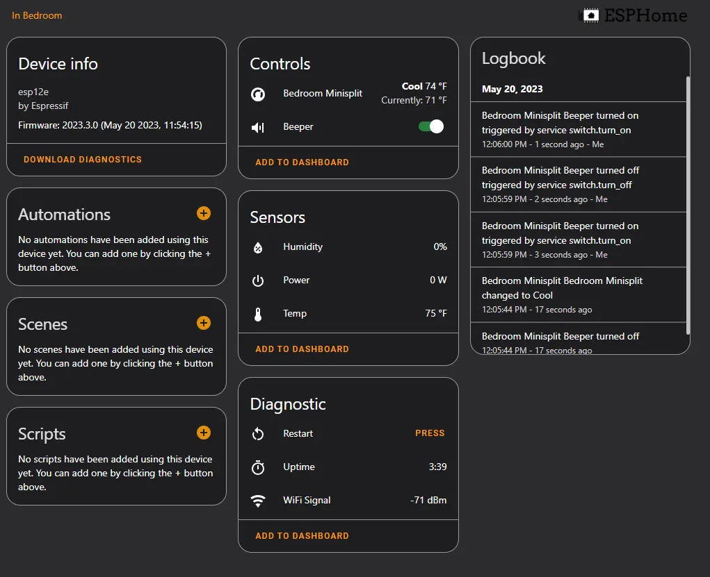

## Next Steps?

After the device is working properly in home assistant- I would recommend adding schedules!

* [Home Assistant - Programmable Thermostat GUI](./../2022/programmable-hvac-part-2.md)


## Why did the old integration fail?

On the plus side, the old method using the midea/pioneer dongle did work FLAWLESSLY for over a year. Not a single issue.

Two weeks ago, however, I woke up to it being 55F in my room and discovered something was not working correctly. 

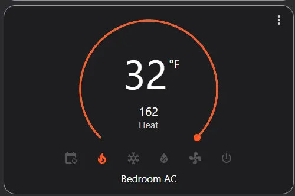

Obviously, something was very wrong with it. 

The first thing I did, was test its wifi connectivity. After validating it could ping, and I was able to open a telnet session to the dongle's port- I check the home assistant logs.

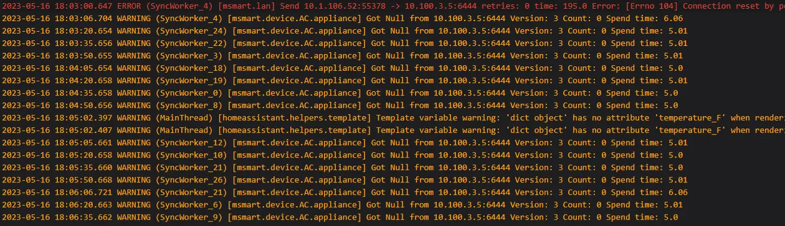

My best guess is the midea/pioneer dongle lost its configuration.

I did temporarily grant the old dongle access to the internet, and attempt to generate a new pair of keys, however, I was unsuccessful. 

After looking at the github and integration, I realized they have not been updated in over a year. After doing more and more research, I discovered the now-recommended approach for integrating with these units, is to use the method outlined in this post.

So- while the unit from CloudFree was in the mail- I Attempted to use the "msmart" app to set schedules on my unit.

The few days suffering through the cloud app reminded me 100% of the reason I do everything full local.

The cloud app would randomly not work. It would end up failing to set schedules. Every change made to a schedule would instead duplicate a new schedule. 

And- every time you opened the app, it would forget you had devices. It was just horrible.

But- I am happy to know my integration is now running firmware locally compiled by me.