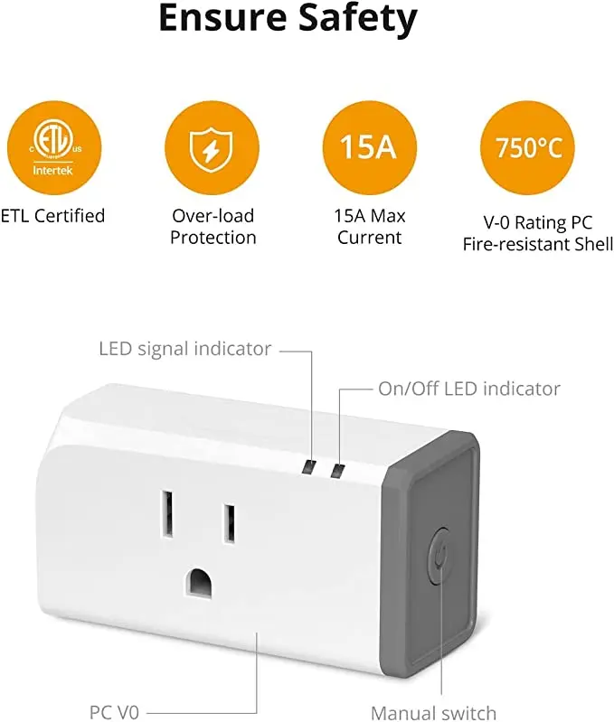
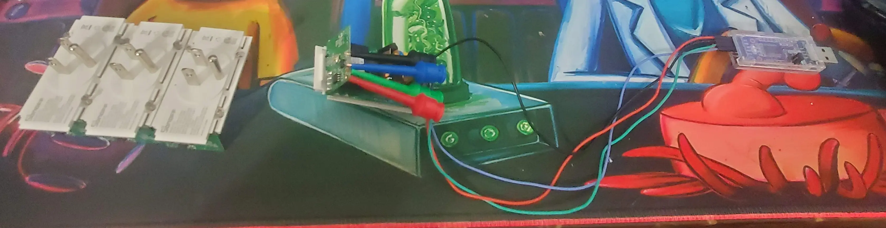
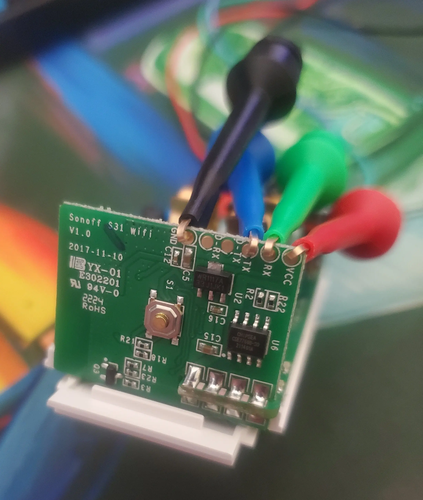
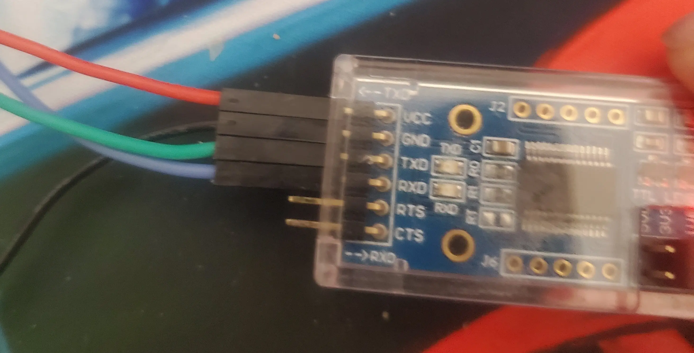
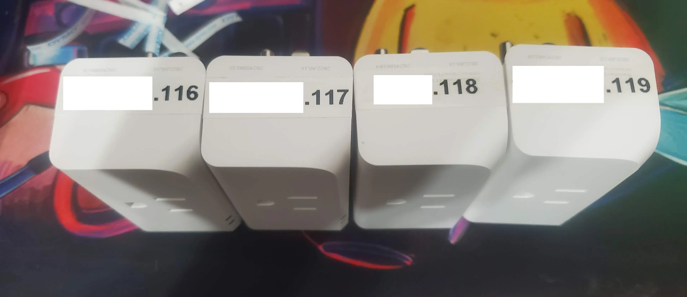

# Sonoff S31 - Low Cost Energy Monitoring

Everyone wants to monitor energy consumption. Everyone wants to automate their home.

The [Sonoff S31](https://amzn.to/3yPSq1T){target=_blank}, is a pretty low-cost way of doing this.

<!-- more -->

## Pros / Cons

### Why choose the Sonoff S31?

1. 15 amp capacity. So, as long as you aren't plugging an air compressor or air conditioner in, it will work.
    * If you need to run a large appliance, I recommend looking at the [Zooz Zen15](https://amzn.to/3JFfhn3){target=_blank}
2. Cheap! Around 5-7$ per plug.
3. Can be flashed to open source firmware, such as ESPHome or Tasmota.
4. Meets UL and CSA 60730-1. CE/FCC/ROHC Certified. Newer versions are UL certified. 

### Cons

1. Some soldering may required to flash these with open source firmware.
    * If you use test-pins (linked below), you can flash these devices without soldering.
2. Some technical ability is required, to flash these with open source firmware. 

## Where to get it?

* [Amazon](https://amzn.to/3yPSq1T){target=_blank}
* [Sonoff](https://sonoff.tech/product/smart-plugs/s31-s31lite/){target=_blank}

## How To Flash it.

### Some tools required

To connect to the UART pins, you will either need to solder on jumper wires, OR, you can use test hooks.

* ~~A soldering iron~~
* [Test Hooks](https://www.amazon.com/gp/product/B08M5Z5YFG){target=_blank}
    * These can be used instead of soldering wires onto the pins. I strongly recommend this route. It is much faster, and there is a greatly reduced chance of lifting a pad.
* A phillips #1 bit. Make sure you have a #1, otherwise, its easy to strip out the screws.
* A Serial Adapter. I have been using this [DSD Tech Adapter](https://amzn.to/3n3vbP0){target=_blank} for the past few years, with no issues. It supports 3v and 5v.

### Firmware Links

I personally, will be running esphome on my plugs.

* [Esphome configuration](https://www.esphome-devices.com/devices/Sonoff-S31){target=_blank}
* [Tasmota Configuration](https://tasmota.github.io/docs/devices/Sonoff-S31/){target=_blank}
* [Espurna](https://github.com/xoseperez/espurna/wiki/Hardware-Itead-Sonoff-S31){target=_blank}

### Flash it.

For a more detailed disassembly, please see [THIS POST](https://www.adventurousway.com/blog/sonoff-s31){target=_blank} I found on the internet. I will be skimming over the basics.

If you like videos:

* [Video - Open Source Home](https://www.youtube.com/watch?v=iffe_rM4Fgg){target=_blank}

#### Step 1. Remove grey end cap

To remove the endcap, squeeze a knife, or sharp edge between the grey cap, and the white body. 

When the corner pops out a little bit, walk the knife around the entire body to remove the cap. Be careful not to break the plastic tabs.

Once the cap has been removed, the two plastic "edges" will slide off. 

Afterwards, the three screws will be exposed.

Use a phillips #1 bit to remove these screws. My screws were on pretty tight, if you do not have the correct screwdriver, you run the risk of stripping these screws.

After the screws have been loosed enough, you can pull the unit out of the body.

#### Connect to serial adapter 

##### The hard way - Via Soldering

!!! warning
    Do **NOT** solder on a header like I did in the following image. If you do, you run a higher risk of pulling one of the pads.

    Instead, solder on loose wires. Be careful to not put extra pressure on the pads. They **WILL** come off, and you will not be able to flash your unit.

    Ask me how I know....

##### The easy way - with test leads

This occurred after I initially published this post, however, I picked up another 4 pack of these plugs.. along with, test leads.

With test leads, just place the leads on the pads.

Closeup on leads attached to pads.

Closeup on serial adapter.

This method was much faster, without the risk of lifting a pad. I was able to disassemble, flash, and reassemble 4 units in under 10 minutes.

#### Step 3. Connect your serial adapter

Pin Connections from Serial Interface TO Sonoff:

* RX -> TX
* TX -> RX
* VCC -> VCC
* GND -> GND

!!! info
    Before you plug the serial adapter in, you will need to hold the button on top of the S31. 

    Continue holding the button for a few seconds AFTER it is plugged in. 

    This is required before the unit will be able to be flashed.

#### Step 4. Flash your firmware

Since I will be using esphome, the command I will need to run is...

`esphome my-s31-config.yaml run`

After it compiles, it will ask you how to connect. If you don't see the option for your serial port adapter, make sure you have the FTDI drivers installed.

Afterwards, it should start uploading the firmware. The unit will automatically restart after it is flashed.

#### Step 5. Flash the rest of them!

I wanted to make sure I could successfully flash one, before starting on the other units.

Since I was successful in flashing the first one, I started the process of disassembling the rest, and flashing them. 

#### Step 6. Reassembly

The reassembly is pretty simple for the most part.

Slide the edges back into place. And, snap the end cap on.

I will note, when you install the end cap, make sure to line up the corner.

I spent a while trying to get the corners on successfully, until I realized I was not lining up the "odd" corner. 

So- if you are having issues putting the end caps back into place, Just- check the corner.

### Add it to home assistant

In Home Assistant, goto integrations.

Search for `Esphome`. Click Add.

Type in the IP Address you provisioned for your device. Poof, you are all done!

I used one of these plugs for monitoring the energy consumption of my deep freezer. Here is a look at that within Home Assistant.

## History

* 2023-03-17 - Post initially published. Flashed 4 units via flashing.
* 2023-03-19 - Second 4-pack arrived. Flashed more more units, using test-leads instead. Much faster.

## Disclaimers

!!! success "Not Sponsored"
    This content is not sponsored or affiliated by Sonoff.

    All products and materials were purchased by me for personal use.

--8<--- "docs/snippets/amazon-affiliate-link-non-sponsered.md"