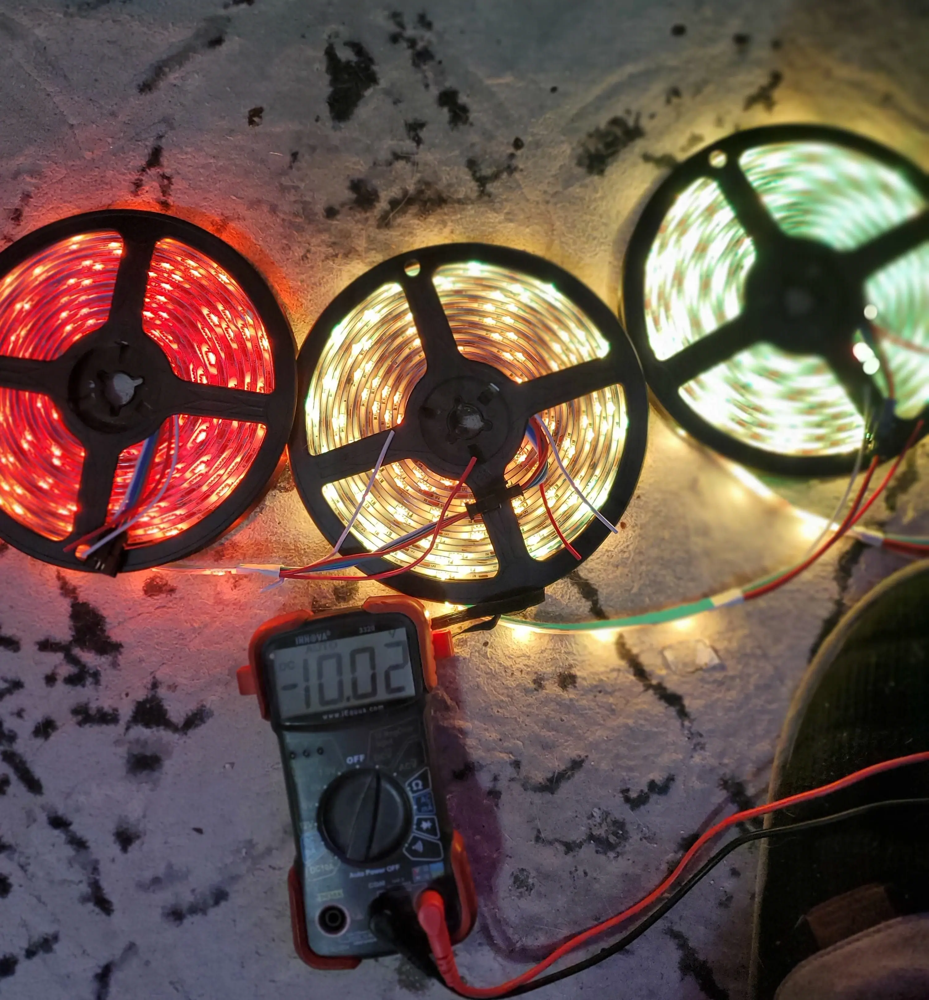

# Home WLED Project - Part 1. Planning

Part 1 of my WLED project.

This section is dedicated to the planning and parts selection of my project.

<!-- more -->

## Planning.

Before you start pulling cable, and running electronics- you first need to identify the estimated power draw / drop, for your LED strips.

In my case, I estimated around 150 foot of WS2815 LED strips to complete the exterior of my house.

I used a few random calculators, such as [this WLED power calculator](https://wled-calculator.github.io/){target=_blank}, and I kept getting back odd results recommending 6awg cable.

Given, 30 LED/Meter WS2815 strips are around 4.6 watts per meter, and I had 50 total meters of strip, I estimated the total power usage to be around...

50 meters * 4.6 meters = 230 watts.

230 watts / 12v = ~20 amps.

Based on wire amp size tables, 14awg copper stranded wire, is capable of carrying 20 amps continuous current, without overheating.

As such, I planned on running a 14awg for each "side" of the front of my house, along with another 12awg run, "Just in case".

I also decided on a 30 amp / 360W PSU, which would be under 80% utilized with the lights at peak brightness.

!!! warning
    Do NOT skip this step!

    If you do not run adequate wire gauge to support your needs, voltage drop WILL cause color accuracy issues!!! 

    You have been warned.

This- is what color accuracy issues will look like:

Color accuracy issues occurs, because it takes much less energy to make "red" light. As your voltage drops, you will have less blue and green, and more red.

This issue is especially noticeable when using 5v LED strips, without proper power injection.

## Parts Needed / Used

1. MAIN Power Supply
    * I picked up this [12V Adjustable, 30amp Power Supply](https://amzn.to/477W5XI){target=_blank}
    * The adjustable voltage, is a handy feature which can help power drop issues in a pinch, up to your LED's rated voltage capacity.
    * (More voltage = Less Amps = Less AWG Needed)
    * I will note, there are 50 other oddly named branded PSUs, which are all likely made in the same factory. 

    !!! info
        IF, you want a higher-quality unit, Look for [Mean Well](https://amzn.to/473R8PQ){target=_blank}. I have heard good things regarding their units.

2. Auxillary Power Supply
    * [12V 15W Power Supply](https://amzn.to/3FA1Ou0){target=_blank}
    * This is used to power WLED itself. I plan on using a relay to switch off the primary power supply when WLED is not on, to save power.
    * This is because- the idle power draw of the big, cheap PSU, is quite high.
3. Wire. Lots of Wire.
    * I Used [this Shirbly 14AWG Cable](https://amzn.to/496Rxml){target=_blank}. For my entire project, I ended up needing three 50ft pieces total.
    * I am happy with the performance of this cable. The wire gauge is up to standards, and the wire itself, is copper.
    * IF you plan on running more LEDs, make sure to get suitable wire gauge for your project. 
    * The only downside to running larger wire then you need, is upfront cost. Larger gauge wire will have fewer resistance losses, and will be able to carry more current, with less drop.
4. [A 5v Relay Module](https://amzn.to/499piDw){target=_blank}
    * Having used lots of electrical components from HiLetGo, they are cheap, and they work.
    * Just- make sure to get a module with an optocoupler, to shield your ESP from the relay. 
    * Also- make sure it triggers on 5v, which is the output voltage of the ESP's GPIOs.

    !!! danger
        ENSURE the relay you choose, is rated for (US)120/(UK)240v, at a suitable amperage for your project.

        This relay WILL be switching mains voltage.

5. [Status LEDs](https://amzn.to/3SbC0vF){target=_blank}
    * Although, not required. I wanted to be able to visually see the status of WLED, when looking at the electrical box.
6. [Flange Spade Terminals](https://amzn.to/3SbZzo9){target=_blank}
    * While, you don't need a 100 pack, a set of good quality COPPER spade terminals came in very handy for this project.

    !!! warn
        Do not buy cheap terminals! They will cause you pain and grief. 

        Spend the extra few dollars, and get copper terminals. Cheap tin/aluminum terminals are worthless.

7. [A 12v Fuse Block](https://amzn.to/49a8qg0){target=_blank}
    * I went with this [6 way fuse block](https://amzn.to/3s7mmXo){target=_blank}
    * As a benefit, it has power distribution for both fused-positive terminals, and negative/ground. This simplified my wiring.

    !!! info
        This is only required, if you don't leverage the on-board power-distribution from a DigUno/DigQuad/etc.

        In my case, I did not use the integrated fuse and power delivery, as I wished to power the micro controller from a smaller, more efficient power supply, which would allow me to turn off the bigger power supply when not in use.

8. [20ga Wire](https://amzn.to/476ELT3){target=_blank}  
    * I used this 20ga silicone wire for my signal. 
    * I also used it for power-injection points.
    * Again, make sure to get COPPER wire, and not CCA (Copper-clad aluminum), tin, etc.
9. A [Junction Box](https://amzn.to/46M7mgC){target=_blank}
    * This one was nice and cheap. Make sure to check the dimensions, and ensure your power supply units will fit.
    * A bit late now, but, using a box [like this one](https://amzn.to/3MjRHNE){target=_blank} would have likely simplified mounting...
        * Also- it has a pretty transparent lid.

### LED Selection.

For this project, I decided to use WS2815 LEDs.

These are...

1. Individually Addressable.
    * Meaning- each LED can be a different color, on/off, etc. This allows you to basically run any pattern or effect you can think of.
2. 12v
    * 12V LEDs will require less frequent power injection.
    * Although, 5v LEDs are safer, you will have to very frequently inject power, to maintain proper color accuracy.
    !!! info
        As a random note, its extremely difficult to start a fire with 5v LEDs.
        12v, however, can start a fire quite easily.
3. Backup Data Channel
    * Meaning- if one LED "dies", the signal will be passed to the LEDs behind it, allowing the rest of the string to keep working.
    * Without a backup data channel, if one LED dies, every other LED behind it, will stop working.
    * I would recommend a backup data channel, as replacing dead LEDs 15 foot in the air, is not fun.

If, you don't trust ordering products from china, [Amazon - BTF-Lighting WS2815](https://amzn.to/3MhFZ5T){target=_blank}

You do get the benefit of being able to *easily* return them, if any issues arise.

If you want to save a bit of money, [Aliexpress - LED Strips](https://www.aliexpress.us/item/2255801136097066.html){target=_blank}

In terms of price, The above amazon link is 30$/5m. The Aliexpress link was 12$/5m. I purchased 50 meters total. 

Make sure to select WS2815. I went with 30 Pixel / Meter strips, which works quite well on the exterior of my house.

For interior projects, such as my desk- 60 pixel/meter works better.

For water proofing, you have three options.

1. IP30 - Basically no water proofing.
2. IP65 - The entire strip is covered in a layer of silicon.
3. IP67 - The entire strip is inside of a silicon sleeve.

I personally chose IP65, as it is easier to work with. The sleeve on IP67 can be quite bulky.

Despite having everything inside of protected channel, I did not want to use IP30... as mother nature will find a way to get water onto your strips.

#### LED Selection Resources

The HookUp, [has a great guide to assist with LED selection](https://www.thesmarthomehookup.com/the-complete-guide-to-selecting-individually-addressable-led-strips/){target=_blank}.

I would highly recommend giving it a read, before pulling the trigger on your own project.

### Controller Selection

I would highly recommend getting a QuinLED DigUno/DigQuad/DigOcta for your WLED projects.

!!! info
    Note- I am not affiliated at all, with quinled, or DrZzs.

    They- just make a quality product, which I use, and enjoy.

These pre-assembled boards have power management features, built in fuses, and basically have the entire micro-controller sorted out for you.

1. DigUno: [QuinLED](https://quinled.info/pre-assembled-quinled-dig-uno/){target=_blank}, [DrZzs](https://www.drzzs.com/shop/dig-uno-diy-rgb-led-controller-w-wled-preassembled/){target=_blank}
    * Can support two separate outputs. Supports up to 20 amps. = 240w @ 12v.
2. DigQuad: [QuinLED](https://quinled.info/pre-assembled-quinled-dig-quad/){target=_blank}, [DrZzs](https://www.drzzs.com/shop/digquad/){target=_blank}
    * Can support 4 outputs. Supports up to 30amps. = 360w @ 12v.

IF, you need more capacity then the DigQuad can offer- look at the Dig-Octa.

[DigOcta - DrZzs](https://www.drzzs.com/shop/digocta-bundle/){target=_blank}

## Testing

After my LEDs arrived, I decided to do a bit of testing to validate the power requirements.

!!! danger
    When testing LEDs on the spool, don't leave them turned on for too long.

    Otherwise, they can and will overheat, potentially causing damage.

#### Test 1. Test each strip.

First, I set my PSU to 12v, and tested each one of the 5m sections of LED.

The goal here, is to ensure each strip works, without any noticeable issues. 

Trust me- issues are much easier to correct when you aren't 15 foot in the air on a ladder.

#### Test 2. Identifying a suitable voltage

Ideally, I wanted to run at a voltage which allowed me to inject power every two 5m segments. (Around 30ft)

With my PSU set at 10v output, color accuracy issues were extremely noticeable after only a single strip. 

Running my PSU at 15v, however, there were no noticeable color accuracy issues after 15m. (Around 50 ft.)

Do note, during this testing, I am only injecting power at the very start of the strip... and the power cable I am using, is extremely thin. ~18awg. Not at all suitable for the task, however, it provided the data I wanted.

The final test I did, was to measure voltage drop through two 5m segments, which ended up with a 4v total drop.

After my testing, I concluded that running 14awg cable, at 12v, and injecting power every 2 segments, would provide acceptable color accuracy.

## Read More

If you wish to follow the home WLED project- please see the [Project Page](./../../../../pages/Projects/WLED-House-Lighting.md)