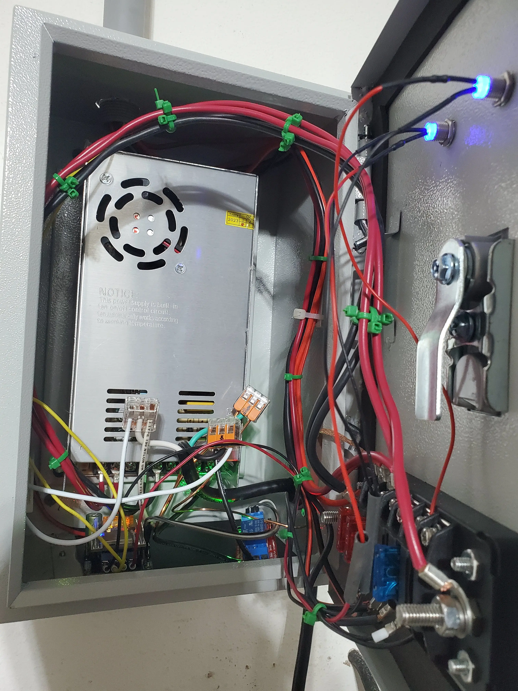

# Home WLED Project - Part 2. Electrical

Part 2 of my WLED project.

In this part, I will go over creating and mounting the electrical box, wiring, and conduit.

<!-- more -->

## Step 1. Identify a suitable egress.

The first step you need to do, is identify a good place for wires to exit your attic-space, where they can easily connect to your LED strips.

## Read More

If you wish to follow the home WLED project- please see the [Project Page](./../../../../pages/Projects/WLED-House-Lighting.md)