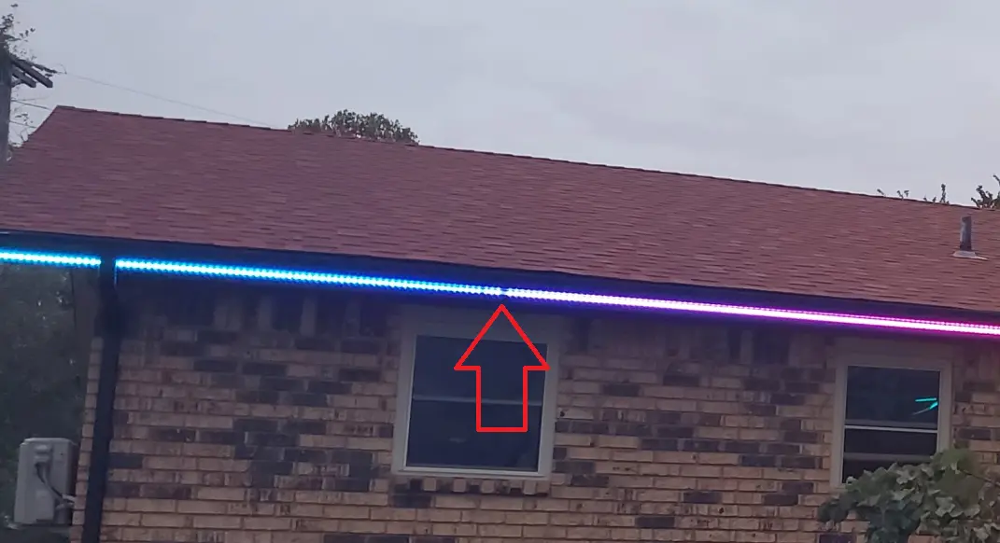
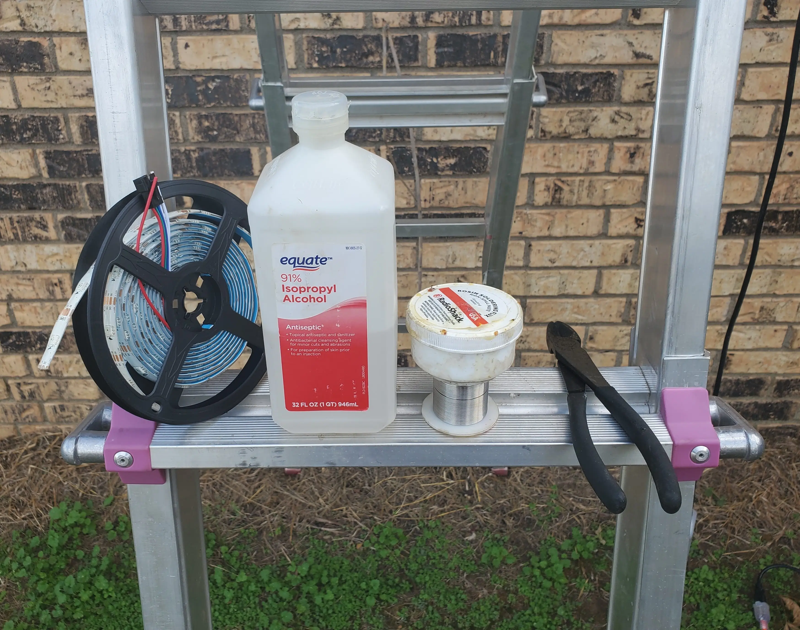
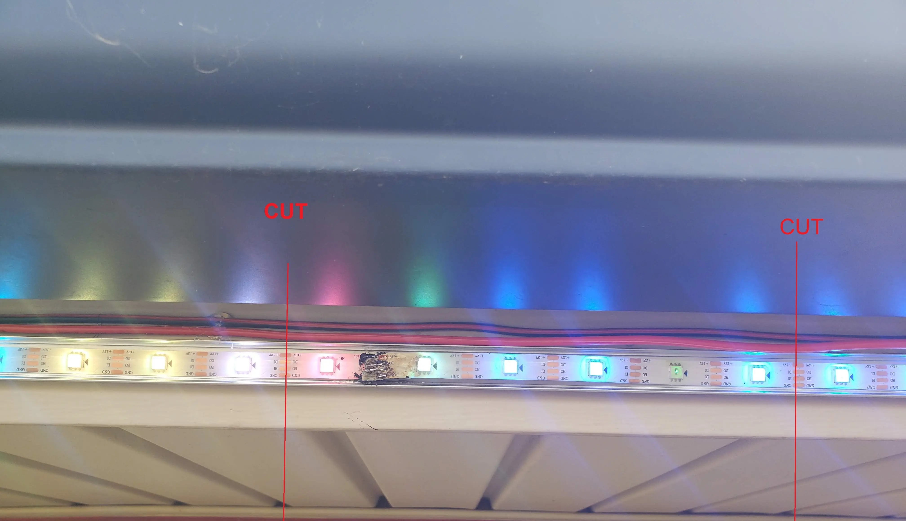
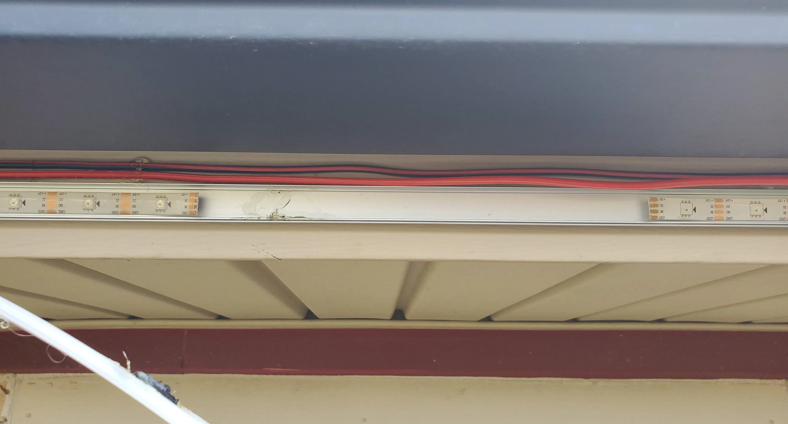
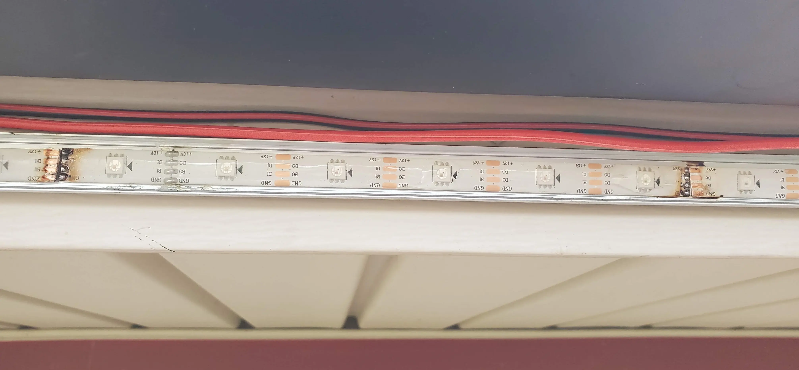
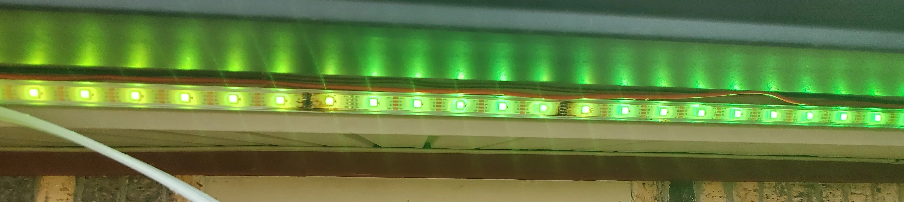
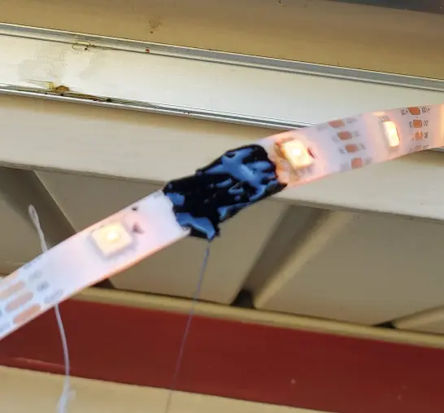
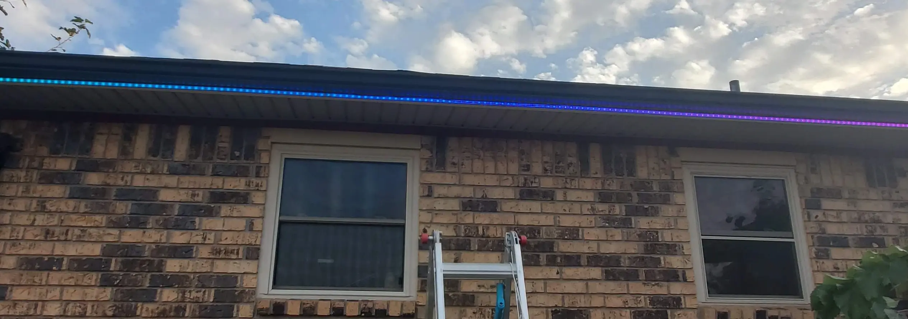

# WLED - Replacing a bad pixel

A very short post, going over the steps on how to fix a broken LED, with WLED.

<!-- more -->

## The Problem / Symptoms

If, you run LEDs strips, eventually you will end up with a bad pixel. 

The symptoms can either be a slight less dim pixel, or, it can literally break every other pixel in the line.

In my case, I didn't get a good picture of it- but, the single bad chip was causing every pixel past it, to occasionally turn into a white strobe-light.

Since, having a beautiful LED setup going.... and having the left side of your house look like a broken strobe-light isn't ideal- I will be going over the steps on how to correct this.

In the above screenshot, the specific pixel causing issues is identified.

## Tools / Parts required.

At a minimum, you will need....

1. A soldering iron.
    * I have had an [X-Tronic](https://amzn.to/40ejhkR){target=_blank} since 2019. It is still going strong. No complaints here.
    * Although, I specifically have the model 3040, which does not appear to be listed anymore.
    * When picking a soldering iron for this, make sure to get one that doesn't have a "station" attached. Having a full "station" is not ideal up on a ladder.
2. Solder (Lead Free)
    * Make sure to get "thin" solder, designed for electronics. Massive pipe solder will not work here.
    * There are a [million different choices](https://amzn.to/3Shrovk){target=_blank}. Just- make sure to get 0.6mm or smaller, ideally.
3. Solder Flux / Paste
    * This is important. You want to find ideally a good "No Clean" flux, such as [THIS](https://amzn.to/497XoI9){target=_blank}
    * In my image, I have some older radio shack flux. I HAVE had issues in the paste of my electronics getting corroded if the flux was not properly cleaned up. 
    * I have rubbing alcohol to help clean up any reside left behind from my paste. 
4. Wire Cutters / Side Cutters.
    * I still have my old craftsman wire cutters, which work quite well.
    * If I were to go shopping for a new pair, I'd fork over the money for a pair of [Klein Cutters](https://amzn.to/3FxmN0f){target=_blank}. I am a big fan of their tools.
5. A knife
    * A knife comes in handy for cutting off the silicon. You can also burn it off with the soldering iron.
6. A small section of replacement LED strip
    * Make sure to get the same type of strip as you are replacing.
    * Ie, don't try to fix a WS2815 strip, with a section of WS2812B. Bad things will happen.
7. A ladder.
    * A foldable / retractable aluminum ladder comes in quite handy.
    * You don't need one... but, unless you are 8 foot tall, you might want a ladder to help with soldering things near the roof.
8. [Liquid Electrical Tape](https://amzn.to/3s9Q8e9){target=_blank}
    * While messy, this has been easy to work with for my entire WLED project.
    * It is used to add some weather-proofing to solder joints, and exposed wires / traces.
## How to fix

### Step 1. Identify the bad pixel, and determine where to cut.

Once you have removed the diffuser/cover, find the bad pixel.

When I pulled mine off, I found two issues.

1. On the left side, it appeared the pads were pulled near one of the solder joints.
2. On the right side, you can see the dim pixel. However, I went one more pixel to the right.

!!! danger
    Make sure to turn your LEDs off, and disconnect the power before cutting.

    Cutting a strip carrying current, generally leads to less then ideal results.

After you have identified the issue- cut right down the middle of the copper pads.

You will be left with a nice empty spot.

### Step 2. Acquire a replacement section

You will need to cut a section of replacement strip, as close as possible to the original width. 

The closer to the same size as you are- the easier it will be to solder.

After you have cut out a new piece, go ahead and tin the pads with fresh solder.

!!! info
    If you have ip65-rated strip, it will be covered in a layer of protected silicon.

    You can use a knife, and gently cut/scrape it away, or, you can burn it away with your soldering iron, and wipe up the residue.

    I personally, had better luck burning it away with my soldering iron. Make sure to wipe off the residue.

### Step 3. Solder the new section into place.

When you are soldering the new section into place, solder flux will greatly help getting the solder to stick to the pads.

If you are having trouble getting the pads to connect, solder on a thin piece of copper wire.

In the end, you hopefully should be left with something lightly prettier then my soldering job. (My soldering in general isn't the best- up on a ladder, its even worse!)

Just- make sure it works!

!!! warning
    Depending on the type of flux you use- make sure to get any excess residue off.

    I have had issues on past projects where residual flux caused accelerated degradation of LED strips, and circuits. 

    The rubbing alcohol you saw at the top of this post, was used to clean the excess flux off. 

### Step 4. Test

Per the above image, make sure you test everything, before sealing it / applying water proofing.

If you turn it on, and your LEDs don't work as expected- go back, identify the problem, and correct it.

### Step 5. Apply weather-proofing.

Since, my particular LEDs are exposed to the elements 24/7/365, I am going to add some weather-proofing on top of my solder joints.

While- I didn't take a picture of the exact segment I am fixing in this post, I borrowed one from another piece of this project.

Apply a generous layer of liquid electrical tape to both sides of the solder joints. This will help protect them from water.

### Step 7. All Done.

(I secured the dangling power-cable after taking this picture.)
