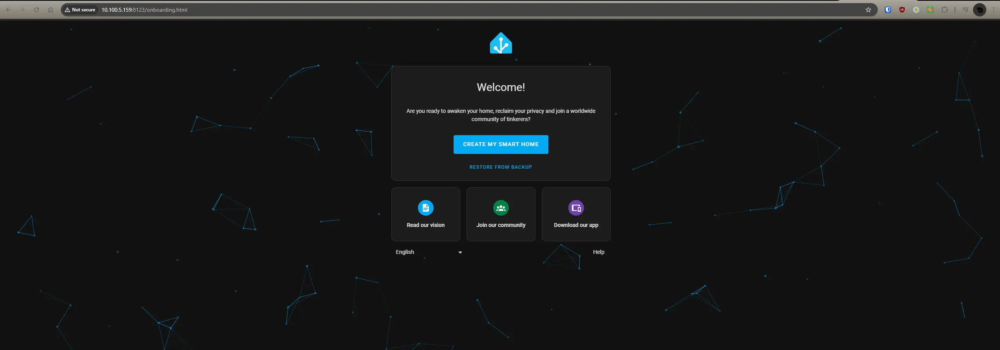

# Proxmox - Install Home Assistant (Script)

Recently, I needed to spin up a HAOS VM for testing an integration I am developing.

I realized- most of the methods, either have multiple steps, and/or are not very transparent.

So- I created a script, which you can fully review, and copy/paste into your Proxmox system to fully install Home Assistant OS into a VM.

You only need to fill out your target storage and network bridge.

<!-- more -->

## Script

``` bash
#!/bin/bash
# Home Assistant VM Setup Script
# This script downloads and sets up a Home Assistant VM on Proxmox using API commands.

##################################################################################
####### Variables you NEED to check and configure.
##################################################################################

HAOS_BRIDGE="vmbr0"                  # Network bridge, defaults to vmbr0. This- should be set to YOUR network bridge.
HAOS_STORAGE="local-lvm"             # Storage for Home Assistant OS
EFI_STORAGE=$HAOS_STORAGE            # Storage where EFI disk will be kept. (Defaults to the same storage as HAOS)

# To get the latest image URL
# Goto https://www.home-assistant.io/installation/alternative
# Copy the URL for "KVM/Proxmox", Paste below. Don't forget quotes.
IMAGE_URL="https://github.com/home-assistant/operating-system/releases/download/12.4/haos_ova-12.4.qcow2.xz" # URL to the VM image

##################################################################################
####### Variables which you can customize, if desired.
##################################################################################

VM_NAME="HomeAssistantVM"            # The name of the created VM.
START_AT_BOOT=true                   # Start at boot (true/false) You typically want to leave this set to true.
START_AFTER_CREATE=true              # Start the VM after this script completes.

##################################################################################
####### VM Resources
##################################################################################

CPU_CORES=4                          # Number of CPU Cores
MEMORY=4096                          # Memory in MB

##################################################################################
####### Optional Variables
##################################################################################

# This will be the generated VM_ID for the new VM.
# It defaults to using the next available VM_ID from the proxmox API.
# You can customize this, but, there is generally no need to.
VM_ID=$(pvesh get /cluster/nextid)  # VM ID, default to the next available ID using the Proxmox API


##################################################################################
####### Do not touch below here!
##################################################################################

# This, is a temporary location where the image will be downloaded, and extracted, before being imported.
# This script contains a cleanup method which deletes this directory after the script either finishes OR fails.
# As such... if you put a persistent directory here- be aware- that it will get deleted after this script exists....
TEMP_DIR=$(mktemp -d)                # Create a temporary directory for the image

##################################################################################
####### Validate Parameters
##################################################################################

# This section exists to validate some of the provided input parameters, and variables.
# It does not validate everything, and is not intended to. However, it does validate a few common items.

# Function to validate storage
validate_storage() {
  local storage_name=$1
  if ! pvesh get /storage/$storage_name > /dev/null 2>&1; then
    echo "Error: Storage '$storage_name' does not exist."
    exit 1
  fi
  echo "Success: Storage '$storage_name' exists."
}

# Function to validate network bridge
validate_bridge() {
  if ! pvesh get /nodes/$(hostname)/network/$HAOS_BRIDGE > /dev/null 2>&1; then
    echo "Error: Network bridge '$HAOS_BRIDGE' does not exist."
    exit 1
  fi
  echo "Success: Network bridge '$HAOS_BRIDGE' exists."
}

# Function to check if VM ID exists
validate_vm_id() {
  if pvesh get /cluster/resources --type vm | grep -wq $VM_ID; then
    echo "Error: VM ID '$VM_ID' already exists."
    exit 1
  fi
  echo "Success: VM ID '$VM_ID' does not already exist."
}

# Validate storage, bridge, and VM ID
echo "Validating storage, network bridge, and VM ID..."
validate_storage $EFI_STORAGE
validate_storage $HAOS_STORAGE
validate_bridge
validate_vm_id

##################################################################################
####### Script Cleanup
##################################################################################

SUCCESS=false

# Cleanup function to remove temporary directory and clean up VM if creation fails
cleanup() {
  echo "Removing temp directory."
  rm -rf $TEMP_DIR
#   if [ ! -z "$VM_ID_CREATED" ]; then
#     echo "Cleaning up VM $VM_ID..."
#     pvesh delete /nodes/$(hostname)/qemu/$VM_ID
#   fi
}

# Ensure the temp directory gets cleaned up
trap cleanup EXIT

##################################################################################
####### Methods / Helpers / etc...
##################################################################################

# Method to download and extract the VM image
#
# This method downloads the Home Assistant OS image from the specified URL and extracts it.
# It uses the following global variables:
# - IMAGE_URL: The URL to download the image from
# - TEMP_DIR: The temporary directory where the image will be downloaded and extracted
download_and_extract_image() {
  local IMAGE_NAME="haos.qcow2"
  local COMPRESSED_IMAGE="$TEMP_DIR/$IMAGE_NAME.xz"
  local EXTRACTED_IMAGE="$TEMP_DIR/$IMAGE_NAME"

  # Download the VM image
  echo "Downloading the VM image from $IMAGE_URL..."
  if ! wget -O "$COMPRESSED_IMAGE" "$IMAGE_URL"; then
    echo "Error: Failed to download the VM image."
    exit 1
  fi

  # Check if the download was successful
  if [ ! -f "$COMPRESSED_IMAGE" ]; then
    echo "Error: Downloaded file $COMPRESSED_IMAGE does not exist."
    exit 1
  fi

  # Expand the compressed image
  echo "Expanding the VM image..."
  if ! unxz "$COMPRESSED_IMAGE"; then
    echo "Error: Failed to extract the VM image."
    exit 1
  fi

  # Check if the extraction was successful
  if [ ! -f "$EXTRACTED_IMAGE" ]; then
    echo "Error: Extracted file $EXTRACTED_IMAGE does not exist."
    exit 1
  fi

  echo "VM image downloaded and extracted successfully to $EXTRACTED_IMAGE."
}

# Method to create the VM using Proxmox API
#
# This method creates a VM on the Proxmox server using the API. It uses the following global variables:
# - VM_ID: The ID for the VM
# - VM_NAME: The name for the VM
# - MEMORY: The amount of memory in MB
# - CPU_CORES: The number of CPU cores
# - HAOS_BRIDGE: The network bridge to use
# - EFI_STORAGE: The storage to use for the EFI disk
# - START_AT_BOOT: Boolean indicating if the VM should start at boot (true/false)
create_vm() {
  echo "Creating the VM..."

  # Construct the API command to create the VM
  VM_ID_CREATED=$(pvesh create /nodes/$(hostname)/qemu \
    -vmid $VM_ID \
    -name $VM_NAME \
    -memory $MEMORY \
    -cores $CPU_CORES \
    -net0 model=virtio,bridge=$HAOS_BRIDGE \
    -boot order=virtio0 \
    -machine q35 \
    -bios ovmf \
    -agent enabled=1,type=virtio \
    -efidisk0 ${EFI_STORAGE}:32,pre-enrolled-keys=0 \
    -onboot $([ "$START_AT_BOOT" = true ] && echo 1 || echo 0)
  )

  # Echo the configuration of the created VM
  echo "VM $VM_NAME (ID: $VM_ID) has been created with the following configuration:"
  echo "Memory: $MEMORY MB"
  echo "CPU Cores: $CPU_CORES"
  echo "Network Bridge: $HAOS_BRIDGE"
  echo "EFI Storage: $EFI_STORAGE"
  echo "Start at Boot: $START_AT_BOOT"

  echo "$VM_ID_CREATED"
}


# Method to import the disk image into the VM
#
# This method imports the downloaded and extracted disk image into the specified VM using the Proxmox API.
# It uses the following global variables:
# - VM_ID: The ID for the VM
# - HAOS_STORAGE: The storage for Home Assistant OS
# - TEMP_DIR: The temporary directory where the image is located
import_disk_image() {
  local EXTRACTED_IMAGE="$TEMP_DIR/haos.qcow2"

  # Check if the extracted image exists
  if [ ! -f "$EXTRACTED_IMAGE" ]; then
    echo "Error: The extracted image $EXTRACTED_IMAGE does not exist."
    exit 1
  fi

  # Import the disk image
  echo "Importing the disk image..."
  if ! qm importdisk $VM_ID $EXTRACTED_IMAGE $HAOS_STORAGE; then
    echo "Error: Failed to import the disk image into VM ID $VM_ID."
    exit 1
  fi

  echo "Disk image imported successfully into VM ID $VM_ID."
}

# Method to configure the imported disk and set the boot order
#
# This method configures the imported disk for the VM and sets the boot order to boot only from the imported disk.
# It uses the following global variables:
# - VM_ID: The ID for the VM
# - HAOS_STORAGE: The storage for Home Assistant OS
post_configure_vm() {
  echo "Configuring the imported disk and setting boot order..."

  # Note- this references disk-1, and not disk-0. 
  # Because disk-0 is the UEFI disk.
  pvesh set /nodes/$(hostname)/qemu/$VM_ID/config \
    -virtio0 ${HAOS_STORAGE}:vm-$VM_ID-disk-1,discard=on \
    -boot order=virtio0

  echo "Post-configuration completed for VM ID: $VM_ID"
}

# Method to start the VM using the Proxmox API
#
# This method starts the specified VM using the Proxmox API.
# It uses the following global variables:
# - VM_ID: The ID for the VM
start_vm() {
  echo "Starting the VM..."

  if ! pvesh create /nodes/$(hostname)/qemu/$VM_ID/status/start; then
    echo "Error: Failed to start the VM ID $VM_ID."
    exit 1
  fi

  echo "VM ID $VM_ID started successfully."
}

# Method to wait for the VM to boot and pull an IP address
#
# This method waits for the specified VM to boot and pull an IP address.
# It uses the following global variables:
# - VM_ID: The ID for the VM
wait_for_vm_ip() {
  local TIMEOUT=60  # Timeout in seconds for obtaining IP address
  local ELAPSED=0   # Time elapsed
  local INTERVAL=5  # Interval between checks
  local STARTUP_TIMEOUT=120  # Maximum time to wait for VM to start
  local IP_ADDR

  echo "Waiting for the VM to start. Press CTRL+C to skip."

  # Wait for the VM to start running
  while [ $ELAPSED -lt $STARTUP_TIMEOUT ]; do
    VM_STATUS=$(qm status $VM_ID | awk '{print $2}')
    if [ "$VM_STATUS" = "running" ]; then
      echo "VM ID $VM_ID is running. Waiting for it to pull an IP address..."
      break
    fi
    sleep $INTERVAL
    ELAPSED=$((ELAPSED + INTERVAL))
  done

  if [ "$VM_STATUS" != "running" ]; then
    echo "Error: The VM ID $VM_ID did not start within $STARTUP_TIMEOUT seconds."
    exit 1
  fi

  ELAPSED=0  # Reset elapsed time for IP waiting

  # Wait for the VM to pull an IP address
  while [ $ELAPSED -lt $TIMEOUT ]; do
    # Check if the VM is running
    VM_STATUS=$(qm status $VM_ID | awk '{print $2}')
    if [ "$VM_STATUS" != "running" ]; then
      echo "Error: The VM ID $VM_ID stopped unexpectedly."
      exit 1
    fi

    # Retrieve network interfaces and filter for the desired IP address
    IP_ADDR=$(pvesh get /nodes/$(hostname)/qemu/$VM_ID/agent/network-get-interfaces | \
              grep -oP '"ip-address":"\K[0-9.]+' | \
              grep -vE '^127\.|^172\.|^10\.0\.' | \
              head -n 1)

    if [ ! -z "$IP_ADDR" ]; then
      echo "Home Assistant is running at: http://$IP_ADDR:8123/"
      return 0
    fi

    sleep $INTERVAL
    ELAPSED=$((ELAPSED + INTERVAL))
  done

  echo "Error: Failed to obtain an IP address for VM ID $VM_ID within $TIMEOUT seconds."
  exit 1
}


##################################################################################
####### Start process
##################################################################################

# Download the VM image
download_and_extract_image

# Create the VM.
create_vm

# Import the disk image
import_disk_image

# Final VM configuration.
post_configure_vm

# Start the VM if specified
if [ "$START_AFTER_CREATE" = true ] ; then
  start_vm
  wait_for_vm_ip
fi

echo "Done! Your Home Assistant VM should now be up and running."
```


## How do I use the script?

``` bash
# SSH to a proxmox host. Create a file in your editor of choice.
# Make sure to update the variables near the top of the script.
root@kube02:~# nano install-home-assistant

# Flag the script as executable.
root@kube02:~# chmod +x install-home-assistant

# Run the script.
root@kube02:~# ./install-home-assistant
```

And.... it will download Home Assistant OS, create a VM, configure the VM, start the VM, and give you the resulting URL.

### Script Output / Result

``` bash
root@kube02:~# ./install-home-assistant
Validating storage, network bridge, and VM ID...
Success: Storage 'ceph-block' exists.
Success: Storage 'ceph-block' exists.
Success: Network bridge 'vlan5' exists.
Success: VM ID '144' does not already exist.
Downloading the VM image from https://github.com/home-assistant/operating-system/releases/download/12.4/haos_ova-12.4.qcow2.xz...
... # Excluded verbose output from wget.
/tmp/tmp.DGM30zNzQb/haos.qcow2.xz                            100%[=============================================================================================================================================>] 340.62M  39.0MB/s    in 9.7s

2024-08-21 14:57:52 (35.1 MB/s) - ‘/tmp/tmp.DGM30zNzQb/haos.qcow2.xz’ saved [357168464/357168464]

Expanding the VM image...
VM image downloaded and extracted successfully to /tmp/tmp.DGM30zNzQb/haos.qcow2.
Creating the VM...
VM HomeAssistantVM (ID: 144) has been created with the following configuration:
Memory: 4096 MB
CPU Cores: 4
Network Bridge: vlan5
EFI Storage: ceph-block
Start at Boot: true
transferred 0.0 B of 128.0 KiB (0.00%)
transferred 128.0 KiB of 128.0 KiB (100.00%)
transferred 128.0 KiB of 128.0 KiB (100.00%)
efidisk0: successfully created disk 'ceph-block:vm-144-disk-0,pre-enrolled-keys=0,size=1M'
UPID:kube02:000C5B04:016CF229:66C646F9:qmcreate:144:root@pam:
Importing the disk image...
importing disk '/tmp/tmp.DGM30zNzQb/haos.qcow2' to VM 144 ...
transferred 0.0 B of 32.0 GiB (0.00%)
... # Remove output from QM Transfer
transferred 31.7 GiB of 32.0 GiB (99.03%)
transferred 32.0 GiB of 32.0 GiB (100.00%)
transferred 32.0 GiB of 32.0 GiB (100.00%)
Successfully imported disk as 'unused0:ceph-block:vm-144-disk-1'
Disk image imported successfully into VM ID 144.
Configuring the imported disk and setting boot order...
update VM 144: -boot order=virtio0 -virtio0 ceph-block:vm-144-disk-1,discard=on
Post-configuration completed for VM ID: 144
Starting the VM...
UPID:kube02:000C5D17:016CF676:66C64704:qmstart:144:root@pam:
VM ID 144 started successfully.
Waiting for the VM to start. Press CTRL+C to skip.
VM ID 144 is running. Waiting for it to pull an IP address...
QEMU guest agent is not running
QEMU guest agent is not running
QEMU guest agent is not running
Home Assistant is running at: http://10.100.5.159:8123/
Done! Your Home Assistant VM should now be up and running.
Removing temp directory.
root@kube02:~#
```



## Error Handling

This script does have basic error handling. Very basic.

For example- If you do not pick a valid storage.

``` bash
root@kube02:~# ./install-home-assistant
Validating storage, network bridge, and VM ID...
Error: Storage 'local-lvm' does not exist.
```

And, it validates the network bridge.

``` bash
root@kube02:~# ./install-home-assistant
Validating storage, network bridge, and VM ID...
Error: Network bridge 'vmbr03' does not exist.
```

Note, it only validates network, and storage for the host you are logged into.

Finally, it will validate the VM_ID does not already exist (By default, it selects a new, unused VM ID from the proxmox api)

``` bash
Success: VM ID '143' does not already exist.
```

It does not check cluster members, shared/clustered storage/etc. Only- if the network/storage exists on the CURRENT host.

I don't recommend trying to find errors. You will find them.

