# Hacking a cheap KVM with IP Control

I picked up a PiKVM a few months back. I finally got to use it earlier this week when [Comparing Link Speed to Power Consumption](../../Technology/2025/2025-02-22-LinkSpeed-Vs-PowerConsumption.md){target=_blank}.

But- it only works for a single PC. I need a solution for all four SFFs/Micros in my rack.

So... I picked up a cheap Display Port KVM for 70$, and hacked it to be controllable via Home Assistant.

<!-- more -->

## The Goal

The goal is simple. I want to be able to control a KVM switch from Home Assistant.

For- the immediate need, I will control a KVM switch behind PiKVM, allowing me to remotely access and control all 4 PCs in my rack, which do not have iDrac.

For the future need, I'd love to automate the KVM in my office. But- before touching my more expensive KVM switch, I wanted to test a proof of concept with a cheap one.

### Hardware Used

[4 Port DisplayPort KVM Switch](https://amzn.to/3Qznf3S){target=_blank}[^amazon]

There is nothing fancy here. Costed me 70$

It is a simple DP 1.2 KVM. I don't even think it supports EDID emulation.

[Espressif D1 Mini](https://amzn.to/4ie72N3){target=_blank}[^amazon]

Cheap, effective micro controller. I just ordered another 20 ESP32-C3s for future projects. Can pick these up from 99 cents to a few bucks each.

Even an older ESP8266 will be fine for this project. There are no special requirements.

I had an old crusty one laying around, which I ended up using.

### Tools Used

A soldering iron. Solder. Flux.

A screwdriver.

Basic hand tools.

A multimeter.

## Execution

First step, was to unpack the switch.

Right away- you can notice I have four HDMI cables........ in a box for a DisplayPort KVM.

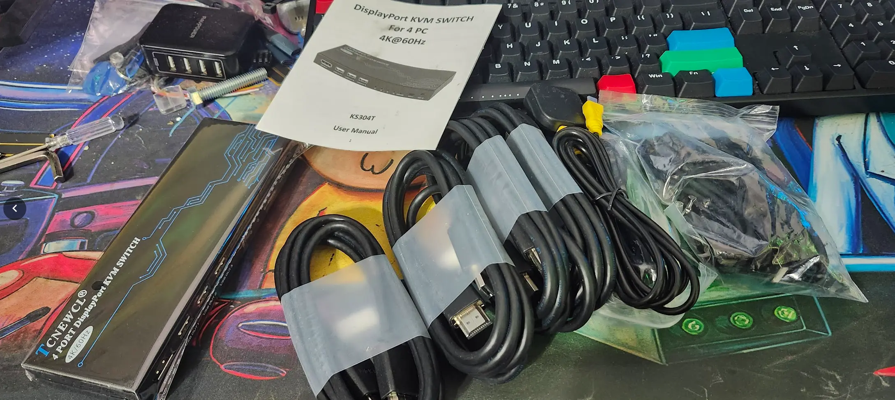

Next, we need to remove the cover. Two phillips #2 head screws on each side.

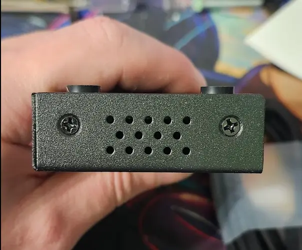

Afterwards, we can see the interior.

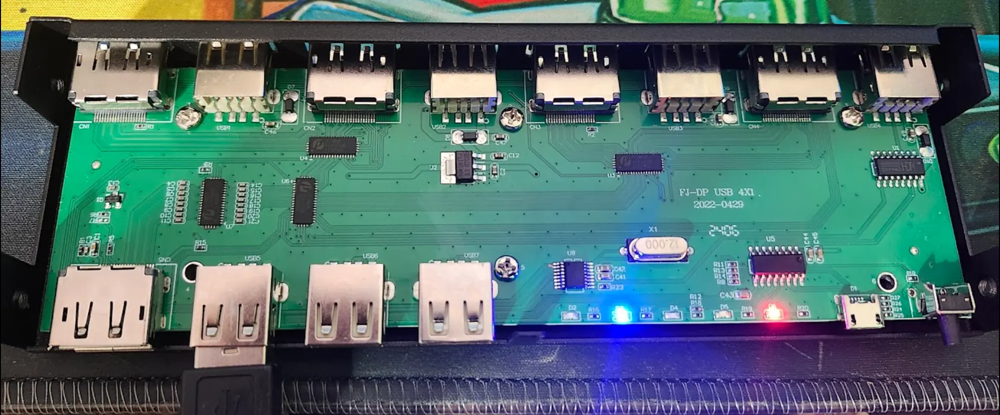

### A slight bit of reverse engineering

The layout is extremely simple. 

We can see Four switching chips. And- follow the traces.

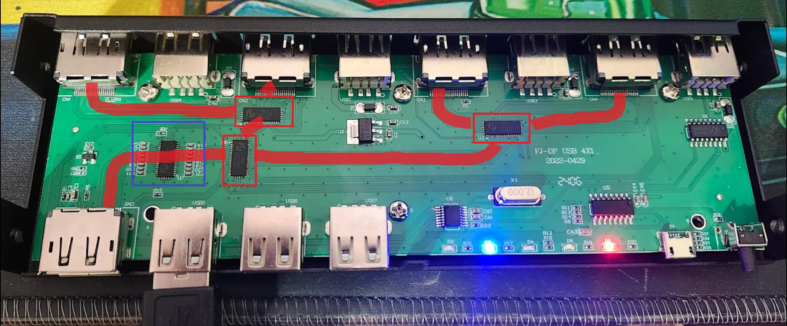

So, each pair of DP ports, goes into a switch. Then the pair of switches, goes into another switch.

This circled area, is where my interest is. This is the area where the buttons, and control hardware are.

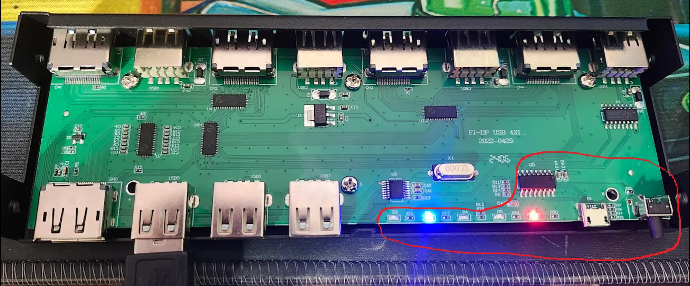

So- just need to tie into the correct traces in order to activate the desired outputs.

I started with this [Cheap Oscilloscope](https://amzn.to/4igKImd){target=_blank}[^amazon] that I picked up for 30$. I wouldn't recommend one.

I used my automotive multimeter instead....  Don't buy one of these. Its not even a good toy.

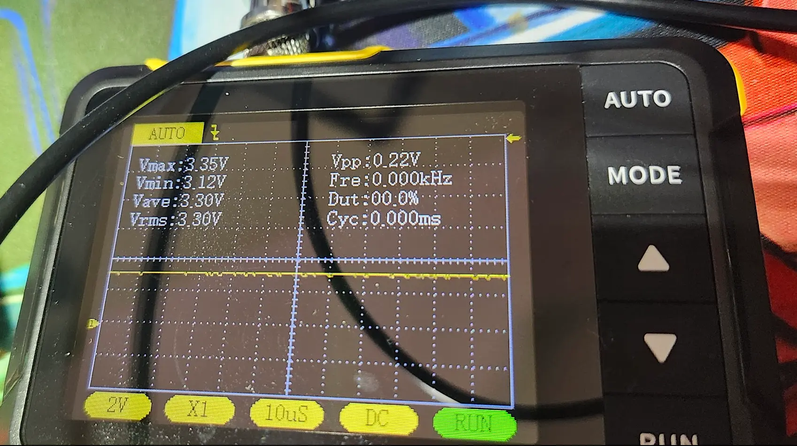

So- to determine which pins did what- I simply toggled the outputs and probed the chip using my multimeter. 

As well, I had this suspicion the included remote, did not actually use USB. I decided to open it up. 

A knife was the easy tool here. Slide in in, and wedge the case apart.

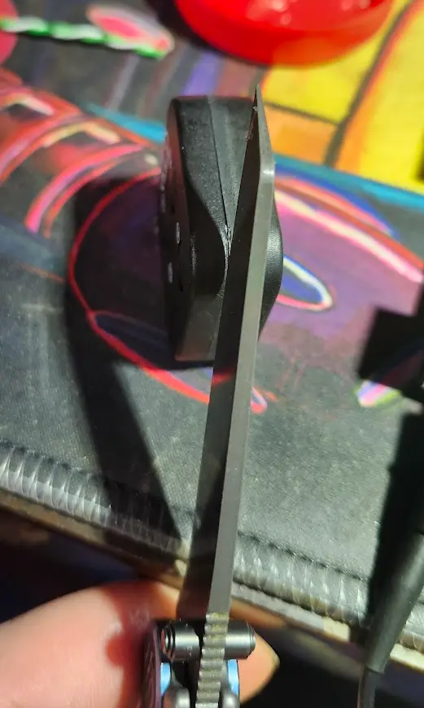

Low and behold- No circuitry for USB. Just a simple remote. 

When you press a button, it pulls that line low.

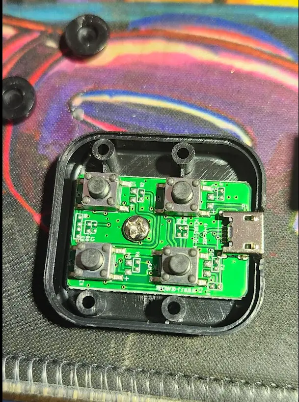

### Soldering Connections

I planned on using ESPHome from the start. now, I just need to start adding connections.

For wire, I used a piece of copper CAT6 I had laying around. 

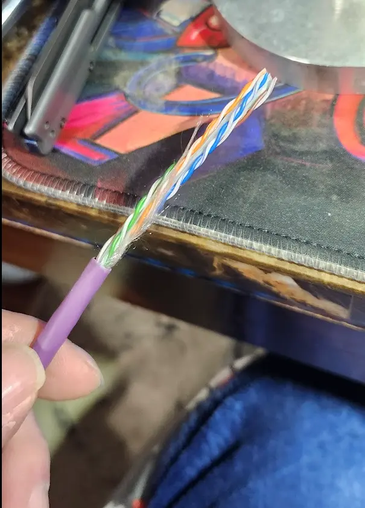

After a while, I had a lovely rat's nest of wire.

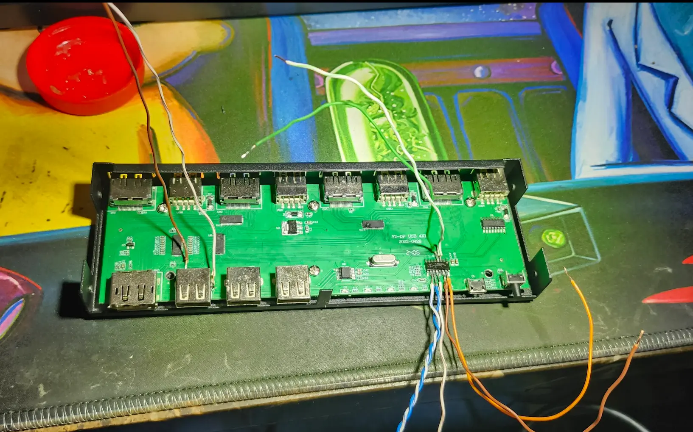

I felt this was a good time to test everything.

<iframe width="560" height="315" src="https://www.youtube.com/embed/_0zhT6DVztw" frameborder="0" allowfullscreen></iframe>

### Adding the ESP

Next, I decided to go ahead and add the ESP.

NORMALLY, I would use a ESP32-C3, however, I am currently out of stock apparently. This old crusty d1 mini was all I had laying around.

To attach it, a bit of hot-glue worked just fine.

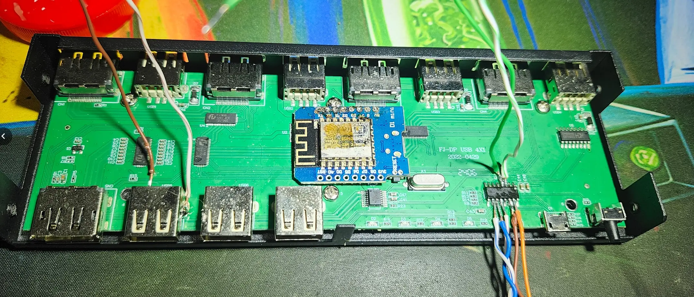

From this point, It was just a matter of trimming, and soldering the rest of the connections.

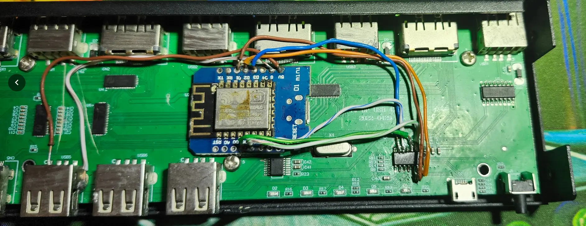

For ground, I soldered a wire to the USB port, which is grounded.

For 5v, I soldered onto the 5V pin of USB Port 1. (5v is shared across all of the ports).

!!! info
    Yes- I know- my soldering looks like 💩

    Minus- this website- nobody will ever physically see this again.

    And- despite the looks, it will function the same now, as it will in 5 years from now.

At this point, all of the physical modifications are done.

Once you have initially flashed the ESP, you can reassemble the case.


### To Do...

Add ESPHome Config.

``` yaml
substitutions:
  devicename: "rack_kvm"
  friendly_name: "Rack KVM"
  pc_1: Kube01
  pc_2: Kube05
  pc_3: Kube06
  pc_4: Kube04

packages:
  common: !include common/package-common.yaml

esp8266:
  board: d1_mini
  #variant: esp32

output:
  - platform: gpio
    pin: D1
    id: pc1_switch
    inverted: true

  - platform: gpio
    pin: D2
    id: pc2_switch
    inverted: true

  - platform: gpio
    pin: D5
    id: pc3_switch
    inverted: true

  - platform: gpio
    pin: D6
    id: pc4_switch
    inverted: true

globals:
  - id: action_in_progress
    type: bool
    restore_value: no
    initial_value: 'false'
  - id: last_selected_pc
    type: int
    restore_value: no
    initial_value: "1"  # Default to PC 1

button:
  - platform: template
    name: "Switch to ${pc_1}"
    id: pc1_button
    on_press:
      - if:
          condition:
            lambda: return !id(action_in_progress);
          then:
            - lambda: id(last_selected_pc) = 1;
            - lambda: id(action_in_progress) = true;
            - output.turn_on: pc1_switch
            - delay: 500ms
            - output.turn_off: pc1_switch
            - delay: 500ms
            - lambda: id(action_in_progress) = false;

  - platform: template
    name: "Switch to ${pc_2}"
    id: pc2_button
    on_press:
      - if:
          condition:
            lambda: return !id(action_in_progress);
          then:
            - lambda: id(last_selected_pc) = 2;
            - lambda: id(action_in_progress) = true;
            - output.turn_on: pc2_switch
            - delay: 500ms
            - output.turn_off: pc2_switch
            - delay: 500ms
            - lambda: id(action_in_progress) = false;

  - platform: template
    name: "Switch to ${pc_3}"
    id: pc3_button
    on_press:
      - if:
          condition:
            lambda: return !id(action_in_progress);
          then:
            - lambda: id(last_selected_pc) = 3;
            - lambda: id(action_in_progress) = true;
            - output.turn_on: pc3_switch
            - delay: 500ms
            - output.turn_off: pc3_switch
            - delay: 500ms
            - lambda: id(action_in_progress) = false;

  - platform: template
    name: "Switch to ${pc_4}"
    id: pc4_button
    on_press:
      - if:
          condition:
            lambda: return !id(action_in_progress);
          then:
            - lambda: id(last_selected_pc) = 4;
            - lambda: id(action_in_progress) = true;
            - output.turn_on: pc4_switch
            - delay: 500ms
            - output.turn_off: pc4_switch
            - delay: 500ms
            - lambda: id(action_in_progress) = false;


binary_sensor:
  - platform: gpio
    pin:
      number: D3
    name: "Bit 0"
    id: bit_0
    internal: true

  - platform: gpio
    pin:
      number: D7
    name: "Bit 1"
    id: bit_1
    internal: true


text_sensor:
  - platform: template
    name: "Active PC"
    id: active_pc
    lambda: |-
      // I incorrectly soldered one of the pins.
      // Instead, of redoing it- just adding simple logic here.
      // bit_1 works correctly, bit_0 does not. So- we store the last selected pin
      // If, the last selected pin is in a state allowed by bit_1, we display it. Otherwise, return unknown.
      // This, works just fine even when cycling using remote, or button on KVM.
      // Fake it, till you make it.
      if (!id(bit_1).state) {
        // Bit 1 OFF - Valid options: PC 1 or PC 3
        if (id(last_selected_pc) == 1) return std::string("${pc_1}");
        if (id(last_selected_pc) == 3) return std::string("${pc_3}");
      } else {
        // Bit 1 ON - Valid options: PC 2 or PC 4
        if (id(last_selected_pc) == 2) return std::string("${pc_2}");
        if (id(last_selected_pc) == 4) return std::string("${pc_4}");
      }
      // Invalid state detected
      return std::string("Unknown");
```

Assembled KVM.

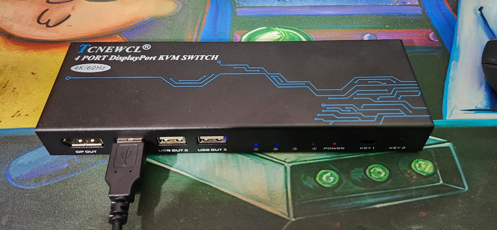

Mess of wires in the rack...

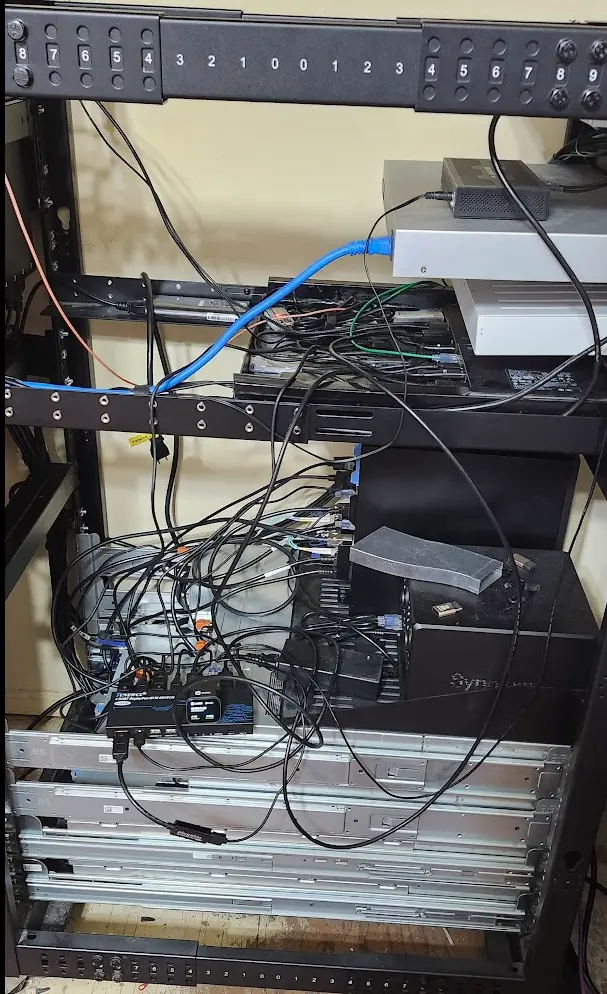

Youtube testing final solution using PiKVM:

<iframe width="560" height="315" src="https://www.youtube.com/watch?v=_XnbofQxTtU" frameborder="0" allowfullscreen></iframe>


## Footnotes

[^amazon]:
    --8<--- "docs/snippets/amazon-affiliate.md"