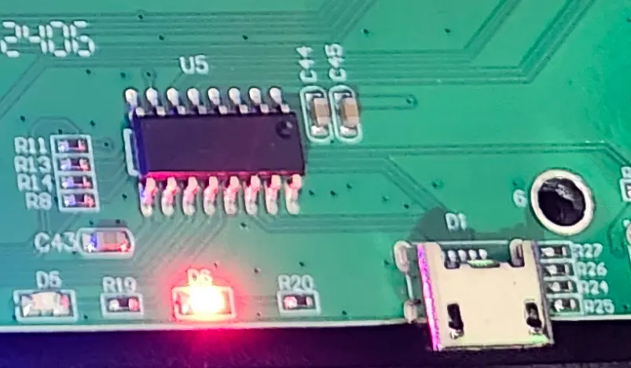

# Hacking a cheap KVM with IP Control

I picked up a PiKVM a few months back. I finally got to use it earlier this week when [Comparing Link Speed to Power Consumption](../../Technology/2025/2025-02-22-LinkSpeed-Vs-PowerConsumption.md){target=_blank}.

But- it only works for a single PC. I need a solution for all four SFFs/Micros in my rack.

So... I picked up a cheap Display Port KVM for 70$, and hacked it to be controllable via Home Assistant.

<!-- more -->

## The Goal

The goal is simple. I want to be able to control a KVM switch from Home Assistant.

For- the immediate need, I will control a KVM switch behind PiKVM, allowing me to remotely access and control all 4 PCs in my rack, which do not have iDrac.

For the future need, I'd love to automate the KVM in my office. But- before touching my more expensive KVM switch, I wanted to test a proof of concept with a cheap one.

### Hardware Used

[4 Port DisplayPort KVM Switch](https://amzn.to/3Qznf3S){target=_blank}[^amazon]

There is nothing fancy here. Costed me 70$

It is a simple DP 1.2 KVM. I don't even think it supports EDID emulation.

[Espressif D1 Mini](https://amzn.to/4ie72N3){target=_blank}[^amazon]

Cheap, effective micro controller. I just ordered another 20 ESP32-C3s for future projects. Can pick these up from 99 cents to a few bucks each.

Even an older ESP8266 will be fine for this project. There are no special requirements.

I had an old crusty one laying around, which I ended up using.

### Tools Used

A soldering iron. Solder. Flux.

A screwdriver.

Basic hand tools.

A multimeter.

## Execution

First step, was to unpack the switch.

Right away- you can notice I have four HDMI cables........ in a box for a DisplayPort KVM.


Next, we need to remove the cover. Two phillips #2 head screws on each side.


Afterwards, we can see the interior.


### A slight bit of reverse engineering

The layout is extremely simple. 

We can see Four switching chips. And- follow the traces.

!!! info
    As a random note I learned recently- For DisplayPort, its pretty rare to see switching ICs with more then 2 channels.

    Turns out, the differential pairs used, are extremely sensitive to issues, and interference. 

    I went down a rabbit hole researching the effort to build a homemade modular KVM switch, and this would be a huge challenge.

    I FIGURED, this could be handled by a simple FPGA, used to switch between the inputs, and outputs. However, this requires specialized hardware on the FPGA which.... $$$$$$$


So, each pair of DP ports, goes into a switch. Then the pair of switches, goes into another switch.

This circled area, is where my interest is. This is the area where the buttons, and control hardware are.


So- just need to tie into the correct traces in order to activate the desired outputs.

I started with this [Cheap Oscilloscope](https://amzn.to/4igKImd){target=_blank}[^amazon] that I picked up for 30$. I wouldn't recommend one.

I used my automotive multimeter instead....  Don't buy one of these. Its not even a good toy.


I also had this suspicion the included remote, did not actually use USB, and was instead just pulling lines high/low.

I decided to open it up, and have a look.

A knife was the easy tool here. Slide in in, and wedge the case apart.


Low and behold- No ICs for USB signaling.

When you press a button, it pulls that line low.

This means... all four traces must be running into the IC, allowing setting individual inputs.

### Thought process

You don't need a degree in electrical engineering to fully reverse engineer this.

The only **useful** tool I used for this, was a simple automotive multimeter I have had for years. Not even a fancy one. A 30$ one from Walmart.

#### Triggering Specific PC

Knowing there is no actual USB connection- follow the pines from the "USB" port, to the IC. Use your tester to double-check the connection is made when you press buttons 1-4 on the remote. 

Do note- some of these traces go under the IC, and hit pins on the top side of it.



After you identify where all four pins are- boom. Your done here.

#### Detect Active PC

Now- for a stretch goal, I wanted to detect which PC was currently active. 

HOWEVER, I ran into an issue.

!!! info "D1 Mini Pinout & Limitations"

    The D1 Mini I was using, only has a few usable pins. [D1-Mini Pinout Reference](https://lastminuteengineers.com/wemos-d1-mini-pinout-reference/){target=_blank}

    D1, D2, D5, D6, D7. This gives 5 useful pins.

    D8 will cause boot to fail if pulled high.

    D3, D4 will cause boot to fail if pulled low.

    Do note- I did use pin D3 later in this post- which did successful fail to work.  

    So- be aware of the special pin limitations!

Since, we only have 5 usable GPIOs, and four of them were just taken up to trigger individual outputs- This means we can't just attach a GPIO to each of the four LED pins.

Instead- I identified two pins which were responsible for setting the switch chips. 

Those two pins, can successfully identify PC 1 - 4.  (Boolean logic)

* 0, 0 = PC 1
* 0, 1 = PC 2
* 1, 0 = PC 3
* 1, 1 = PC 4

I decided to use those.

#### Power

For Power- I soldered a ground wire to one of thee USB port frames. I previous verified they all share a common ground.

For +5v, I soldered to the +5v pin on USB5.

### Soldering Connections

I planned on using ESPHome from the start. now, I just need to start adding connections.

For wire, I used a piece of **copper** CAT6 I had laying around. 

!!! info
    I will note.... there is already proper 22AWG cable in the mail.

    But- solid-copper CAT6 did the job just fine. Make sure to use a bit of flux when initially tinning the wire.


After a while, I had a lovely rat's nest of wire.


I felt this was a good time to test everything.

<iframe width="560" height="315" src="https://www.youtube.com/embed/_0zhT6DVztw" frameborder="0" allowfullscreen></iframe>

Since everything tested as expected... lets move forward.

!!! warning
    Do- be careful when working with the pads under the IC.

    They can be pulled easily.... (**cough, I pulled the pad for the LED for PC 2)

### Adding the ESP

Next, I decided to go ahead and add the ESP.

NORMALLY, I would use a ESP32-C3, however, I am currently out of stock apparently. This old crusty d1 mini was all I had laying around.

There was a bit open spot right in the middle, this looked ideal.

To attach it, a bit of hot-glue worked just fine.


From this point, It was just a matter of trimming, and soldering the rest of the connections.


For ground, I soldered a wire to the USB port, which is grounded.

For 5v, I soldered onto the 5V pin of USB Port 1. (5v is shared across all of the ports).

!!! info
    Yes- I know- my soldering looks like 💩

    Minus- this website- nobody will ever physically see this again.

    And- despite the looks, it will function the same now, as it will in 5 years from now.

At this point, all of the physical modifications are done.

Once you have initially flashed the ESP, you can reassemble the case.

## ESPHome Firmware

So, next up, I needed to come up with some ESPHome Firmware.

### Details

#### Outputs

We have four outputs, one for each PC we want to control.

Notes:

1. `inverted=true`: All of the buttons, switches, etc work by pulling the line low. We need to do this on the ESP Side too.
2. Interlock: 
    - While testing, I noticed if two switches were toggled at the same time, it would soft-lock the KVM until you power cycled it.
    - I added an interlock which only allows a single output to become active at the same time.


We need to do the same here.

``` yaml
output:
  - platform: gpio
    pin: D1
    id: pc1_switch
    inverted: true
    interlock: &pc_select [relay1, relay2]

  - platform: gpio
    pin: D2
    id: pc2_switch
    inverted: true
    interlock: *pc_select

  - platform: gpio
    pin: D5
    id: pc3_switch
    inverted: true
    interlock: *pc_select

  - platform: gpio
    pin: D6
    id: pc4_switch
    inverted: true
    interlock: *pc_select
```

#### Inputs

And- we have two inputs. The two inputs are between the target IC, and the DP switches. Only two inputs are needed to tell us the exact PC activated.

``` yaml
  binary_sensor:
    - platform: gpio
      pin:
        number: D3
      name: "Bit 0"
      id: bit_0
      internal: true

    - platform: gpio
      pin:
        number: D7
      name: "Bit 1"
      id: bit_1
      internal: true
```

#### Current PC Logic

So, I did want the ability to see which PC was selected at a given time, hence, the two inputs above.

HOWEVER- I did incorrectly solder ONE of the inputs to the incorrect pin on the IC. So, I decided to perform a work-around.

I am storing the last selected state in a global variable. If- the currently selected input, is not allowed by the single functioning output, we will return "Unknown" instead.

Perfect? No. But- now you know so you can do better then I did.

``` yaml
  globals:
    - id: last_selected_pc
      type: int
      restore_value: no
      initial_value: "1"

  text_sensor:
    - platform: template
      name: "Active PC"
      id: active_pc
      lambda: |-
        // I incorrectly soldered one of the pins.
        // Instead, of redoing it- just adding simple logic here.
        // bit_1 works correctly, bit_0 does not. So- we store the last selected pin
        // If, the last selected pin is in a state allowed by bit_1, we display it. Otherwise, return unknown.
        // This, works just fine even when cycling using remote, or button on KVM.
        // Fake it, till you make it.
        if (!id(bit_1).state) {
          // Bit 1 OFF - Valid options: PC 1 or PC 3
          if (id(last_selected_pc) == 1) return std::string("${pc_1}");
          if (id(last_selected_pc) == 3) return std::string("${pc_3}");
        } else {
          // Bit 1 ON - Valid options: PC 2 or PC 4
          if (id(last_selected_pc) == 2) return std::string("${pc_2}");
          if (id(last_selected_pc) == 4) return std::string("${pc_4}");
        }
        // Invalid state detected
        return std::string("Unknown");
```

#### Click Button Logic

When, you click the button inside of home assistant.... two things occur:

1. It sets the last select PC into the global variable.
2. It pulls the GPIO low for a half second, and then releases.

``` yaml
  button:
    - platform: template
      name: "Switch to ${pc_1}"
      id: pc1_button
      on_press:
        then:
          - lambda: id(last_selected_pc) = 1;
          - output.turn_on: pc1_switch
          - delay: 0.5s
          - output.turn_off: pc1_switch
          - delay: 0.5s

    - platform: template
      name: "Switch to ${pc_2}"
      id: pc2_button
      on_press:
        then:
          - lambda: id(last_selected_pc) = 2;
          - output.turn_on: pc2_switch
          - delay: 0.5s
          - output.turn_off: pc2_switch
          - delay: 0.5s

    - platform: template
      name: "Switch to ${pc_3}"
      id: pc3_button
      on_press:
        then:
          - lambda: id(last_selected_pc) = 3;
          - output.turn_on: pc3_switch
          - delay: 0.5s
          - output.turn_off: pc3_switch
          - delay: 0.5s

    - platform: template
      name: "Switch to ${pc_4}"
      id: pc4_button
      on_press:
        then:
          - lambda: id(last_selected_pc) = 4;
          - output.turn_on: pc4_switch
          - delay: 0.5s
          - output.turn_off: pc4_switch
          - delay: 0.5s
```

### Finished Firmware

??? info "ESPHome Config (Click to expand)"
    ``` yaml
    substitutions:
      devicename: "rack_kvm"
      friendly_name: "Rack KVM"
      pc_1: Kube01
      pc_2: Kube05
      pc_3: Kube06
      pc_4: Kube04

    packages:
      common: !include common/package-common.yaml

    esp8266:
      board: d1_mini
      #variant: esp32

    output:
      - platform: gpio
        pin: D1
        id: pc1_switch
        inverted: true

      - platform: gpio
        pin: D2
        id: pc2_switch
        inverted: true

      - platform: gpio
        pin: D5
        id: pc3_switch
        inverted: true

      - platform: gpio
        pin: D6
        id: pc4_switch
        inverted: true

    globals:
      - id: last_selected_pc
        type: int
        restore_value: no
        initial_value: "1"

    button:
      - platform: template
        name: "Switch to ${pc_1}"
        id: pc1_button
        on_press:
          then:
            - lambda: id(last_selected_pc) = 1;
            - output.turn_on: pc1_switch
            - delay: 0.5s
            - output.turn_off: pc1_switch
            - delay: 0.5s

      - platform: template
        name: "Switch to ${pc_2}"
        id: pc2_button
        on_press:
          then:
            - lambda: id(last_selected_pc) = 2;
            - output.turn_on: pc2_switch
            - delay: 0.5s
            - output.turn_off: pc2_switch
            - delay: 0.5s

      - platform: template
        name: "Switch to ${pc_3}"
        id: pc3_button
        on_press:
          then:
            - lambda: id(last_selected_pc) = 3;
            - output.turn_on: pc3_switch
            - delay: 0.5s
            - output.turn_off: pc3_switch
            - delay: 0.5s

      - platform: template
        name: "Switch to ${pc_4}"
        id: pc4_button
        on_press:
          then:
            - lambda: id(last_selected_pc) = 4;
            - output.turn_on: pc4_switch
            - delay: 0.5s
            - output.turn_off: pc4_switch
            - delay: 0.5s


    binary_sensor:
      - platform: gpio
        pin:
          number: D3
        name: "Bit 0"
        id: bit_0
        internal: true

      - platform: gpio
        pin:
          number: D7
        name: "Bit 1"
        id: bit_1
        internal: true


    text_sensor:
      - platform: template
        name: "Active PC"
        id: active_pc
        lambda: |-
          // I incorrectly soldered one of the pins.
          // Instead, of redoing it- just adding simple logic here.
          // bit_1 works correctly, bit_0 does not. So- we store the last selected pin
          // If, the last selected pin is in a state allowed by bit_1, we display it. Otherwise, return unknown.
          // This, works just fine even when cycling using remote, or button on KVM.
          // Fake it, till you make it.
          if (!id(bit_1).state) {
            // Bit 1 OFF - Valid options: PC 1 or PC 3
            if (id(last_selected_pc) == 1) return std::string("${pc_1}");
            if (id(last_selected_pc) == 3) return std::string("${pc_3}");
          } else {
            // Bit 1 ON - Valid options: PC 2 or PC 4
            if (id(last_selected_pc) == 2) return std::string("${pc_2}");
            if (id(last_selected_pc) == 4) return std::string("${pc_4}");
          }
          // Invalid state detected
          return std::string("Unknown");
    ```

## Final Product

The final product- does exactly what it was expected to do.

Nothing fancy or over the top here.


After sitting it in the rack and connecting all four pairs of DisplayPort / USB cables.... I had a mess of wires to cleanup and organize later.

My rack, [Stays well organized, typically](../../Technology/2024/2024-12-28-homelab-2024.md){target=_blank}


Here is a video of it in action.

<iframe width="560" height="315" src="https://www.youtube.com/embed/_XnbofQxTtU" frameborder="0" allowfullscreen></iframe>

## Q&A, Issues, etc.

### Why does it take so long to switch between PCs?

The reason there is such a long delay when switching devices is due to the lack of EDID emulation.

The delay when switching between PCs on a cheap KVM switch happens because it physically disconnects and reconnects the display each time you switch. 

Without EDID emulation, each PC thinks the monitor has been unplugged and replugged, causing it to reinitialize the display settings.

With EDID emulation, the KVM switch presents a constant virtual display to each connected PC, making the system believe the monitor is always connected. This helps to prevent resolution changes, window repositioning, and eliminates the delay caused by display detection during switching.

### Your Soldering is horrible


### Why didn't you use a HDMI KVM, they are cheaper & easier to work with.

Because the PCs I want to put behind this KVM, don't have HDMI. Dell SFFs/Micros are mostly DisplayPort.

Since, the JetKVM is HDMI-based, there is a DisplayPort to HDMI converter between the KVM, and the JetKVM.

### You can get KVM switches much cheaper blah blah...

This is one of the cheapest DP switches available on Amazon. 

And- to my knowledge, there is "0" home-assistant integrated KVM switches available for purchase.

Especially not for the price I built this one. 70$ for DP switch + 1.50$ for D1 mini.

### The ESP is not going to get reception without an external antenna.

I tested and flashed it in my office, which is one of the furthest areas from my Access points.

As well, it will live the rest of its life inside of my server rack, which has an access point 5 ft away.

Besides, its fine.

* **WiFi Signal**: -53 dBm

## Next Steps?

The next stage of this process will be to automate the KVM(s) in my office.

I want to be able to fully configure my desk, using home assistant scenes and automatons.

Notice- I said KVM(s) <-- "(s) being the key word. 

If- you want to know more- expand the spoiler.

??? "More Details"
    Three monitors. Three PCs. Turns out, 4x4 KVMs are expensive. 
    
    2x2 KVMs are cheap. I picked up this [CKL 2x2 DisplayPort KVM for 30$ today](https://amzn.to/41jnCnU){target=_blank}[^amazon]

    Its only DisplayPort 1.2- but, that won't be a problem here.

    Two massive 32" screens, for work and play, and a single 24" screen which is great for watching email/chats/videos/etc.

    The left 32" screen, also is used by my wife's gaming PC whenever we are gaming.

    The top 24" screen, and right 32" screen, are work/personal only.

    Since... a picture says 1,000 words, here is a diagram of what I want to accomplish:

    ``` mermaid
    graph TB
    subgraph "Monitors"
        1["32in 1440p@144hz LG"]
        2["32in 4k@60hz Philips"]
        3["24in 1080p@60hz Dell"]
    end

    subgraph "KVMs"
        K1["2x2 DP KVM-1"]
        K2["2x2 DP KVM-2"]
        K3["2x2 HDMI KVM-3"]
    end

    subgraph "Computers"
        C["Wife's Gaming PC"]
        A["Gaming/Personal PC"]
        B["Work PC"]

    end

    A & B ==> |2x DP| K1
    A & B --> |1x HDMI| K3
    K1 --> |1x DP| 2 & K2
    C --> | 1x DP| K2
    K2 --> | 1x DP| 1
    K3 --> | 1x HDMI| 3
    ```

    This, enables the following use-cases:

    1. "Working": All three monitors connected to work PC.
    2. "Gaming/Personal": "All three monitors connected to Gaming/Personal PC.
    3. "Gaming with Wife": Left monitor connected to Wife's PC. Right two monitors connected to Gaming/Personal PC.
    4. "Work Hybrid": Both 32" screens on work PC. 24" Screen watching personal PC. (Watching NVR, Events, etc....)
    5. "Personal Hybrid": Both 32" screens on personal PC. 24" screen watching work PC. ("Watching emails, long running processes, etc.)

    This setup allows the 24" screen to be independently switched between Work/Game.

    It also allows the left 32" screen to be independently switched between the Wife's PC, and Game/Work.

    Now- the above is easily handled with a matrix, or multi-view KVM switch, however a pair of cheap 30$ KVMs made a lot more financial sense to me, then picking up a single 400$ multi-view capable KVM.

    Finally- I will be doing that automation without any disassembly or modification to the KVMs. It will be handled through the remote port, which is a standard 3.5mm audio jack. Will still use ESP Home though.


## Footnotes

[^amazon]:
    --8<--- "docs/snippets/amazon-affiliate.md"