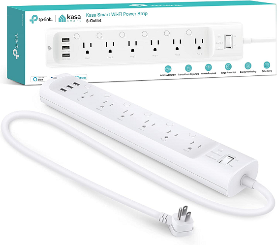

# Home Assistant - Energy Monitoring Options

A quick post going over the best options for taking advantage of home assistant's [energy monitoring features](https://www.home-assistant.io/blog/2021/08/04/home-energy-management/){target=_blank}. 

To note- you don't have to use home assistant with these products. But, these products were specifically chosen due to some level of integration with home assistant.

<!-- more -->

!!! error "Warning"
    Mains voltage is dangerous. Incorrect handling of mains voltage can cause injury or death.
    You should ideally have a licensed electrician install any of the devices listed in this article.

    I am not responsible for any death, injury, or loss of property incurred.

## Products

Products will be split into these categories.

1. [Products which provide per device/circuit entire-home monitoring, typically from sensors located in your mains panel.](#per-circuit-monitoring)
2. [Products which only monitor energy entering or leaving the home, typically through CT clamps on the mains.](#mains-monitoring)
3. [Smart Plugs and/or Devices with build in reporting](#Individual-Device-Monitoring)

### Per Circuit Monitoring

These products will typically have support for monitoring multiple circuits, and generally also include provisions for monitoring the mains.

All of these products will be mounted in, or near your mains panel.

#### Iotawatt

This is a wifi-based device, which has support for up to 14 CT Clamps.

!!! information "My personal experiences"
    I picked up one of these units after cooking my [CircuitSetup](#circuitsetup). It has been running since fall of 2021, with zero issues at all.

    The device itself, can operate fully independant of your internet, and home-automation software. It has a simple web-gui to display both real-time, and historial data.

    The interface itself, is very easy to configure as well.

    If- you want per-circuit monitoring, this product would be my recommendation. 

Home Assistant integration is provided via [Native Iotawatt Integration](https://www.home-assistant.io/integrations/iotawatt/){target=_blank}

Links: 

* [Iotawatt Website](https://iotawatt.com/){target=_blank}

#### CircuitSetup

This is a circuit board which you can add your own ESP32 to, and monitor up to 42 seperate channels, in real-time, at 16-bit resolution.

Overall, the price isn't unreasonable. 

!!! warning
    This option may not be the most DIY friendly option, as you are provided with a circuit board for which you need to flash, maintain, and mount.

    If you are not comfortable flashing esphome, I would recommend other options.

!!! information "My personal experiences"
    This was the orignal solution I personally acquired for doing per-circuit monitoring in my house. After getting everything setup initially, It was working fine. 

    However- I decided to acquire another add-on board. During the process of installing it, I slotted the ESP incorrectly (not hard to do...), which fried all of the add-on boards rendering this solution non-usable.

    After opening a support ticket on Sept 13th, 2021, this issue was never resolved. Shortly after, I picked up an [Iotawatt](#iotawatt)

Links: 

* [CircuitSetup.us](https://circuitsetup.us/shop){target=_blank}

#### GreenEye Residential

This is one of the few options on this list supporting ethernet AND wifi. It also supports complete local control as well.

Based on what I have seen, there is not a cloud component to this option which is always a plus… at least for me.

If you need to monitor a large number of circuits, and you don’t want to put together your own firmware this product is likely your best option… as the cost is quite reasonable when you look at other solutions to monitoring 20+ circuits.

As another positive note this unit can also monitor pulse sensors from your energy meter.

In my opinion, this product is a very attractive choice if you wish to monitor a large number of circuits. It does not require ANY diy, other then installation. It is essentially a plug and play module, with a native integration. It has its own server as well for configuration and display of data.

Links: 

* [Vendor Page](https://www.brultech.com/greeneye/){target=_blank}
* [Vendor Store](https://www.brultech.com/store/){target=_blank}
* [Native Home Assistant Integration](https://www.home-assistant.io/integrations/greeneye_monitor/){target=_blank}

#### Sense

!!! warning "Warning, Cloud-Reliant"
    WARNING- This product is dependant on its vendor's cloud.

    Home assistant functionality is provided via cloud-polling

This device is advertised as being able to monitor your entire home, and to even distinguish different devices.

It even has an OFFICIAL integration built-in.

The downsides- This is dependant on cloud-polling. It is also quite pricey compared to the other options. I have heard a few times- its detection of specific devices may or may not work well.

In my OPINION- it only senses at the mains level, and does not have sensors on a per-circuit basis. So- if you have a house with lots of electrical noise. Multiple AC units. Multiple Fridges. A mini server room like me. A shop containing welders and lathes- I don’t imagine its detection is going to work that well. But- if you have a 2 bedroom apartment, with a very standard setup- it will prob work very well. But- at the 300$ price point- that is a bit pricey compared to some other options. I have seem mixed feedback. It works extremely well for some, but, not so well for others. 

Based on what I have seen from others, and my own conclusions, I would recommend choosing another product.

Links: 

* [Purchase on Amazon](https://amzn.to/3fU0NjE){target=_blank}
* [Vendor Link](https://sense.com/){target=_blank}
* [Native Home Assistant Integration](https://www.home-assistant.io/integrations/sense/){target=_blank}

#### Emporia Vue

Per-circuit monitoring, with support up to 16x 50amp circuits.

This is THE most cost-effective option for per-circuit energy monitoring. For around 120$ shipped, including 8 50amp CT clamps for individual circuits, and 2x mains clamps- you cannot beat the price. But- this price, comes with a catch.

!!! warning "Warning, Potentially Cloud-Reliant"
    Out of the box, as shipped, this product is 100% depedant on Emporia's cloud. More below.

!!! information "How to flash with ESP Home for Local Control"
    If you do not wish to be dependant on the vendor's cloud, which without notice, can stop working- A reddit user has created a guide on how to flash this device to leverage ESP Home, for full local control.

    If you are not a DIY friendly user, I would recommend another product. However, if you are not scared of soldering, and flashing firmware- 

    [View the guide HERE](https://gist.github.com/flaviut/93a1212c7b165c7674693a45ad52c512){target=_blank}

Overall- I am against any product which relies on a vendor's servers to function. I am a very strong proponent of full, local control. As such, unless you plan on flashing this device to ESP Home using the links provided- I would recommend another product. However- if you do flash to Esp home, the price / functionality is unbeatable by anything else on this list.

Links:

* [Buy on Amazon](https://amzn.to/3AMQXsf){target=_blank}
* [Vendor Website](https://www.emporiaenergy.com/){target=_blank}
* [3rd Party Home Assistant Integration](https://github.com/magico13/ha-emporia-vue){target=_blank}
* [Flashing to ESPHome](https://gist.github.com/flaviut/93a1212c7b165c7674693a45ad52c512){target=_blank}

### Mains Monitoring

These products are intended to only monitor the current going through the mains. This is generally used to determine how much energy your residence is consuming.

#### Shelly EM

The Shelly EM provides current monitoring using CT Clamps. It also enables the ability to switch high current loads, using contactors. 

This device uses Wifi for communication, and can monitor up to TWO 120amp circuits.

** Home Assistant Integration Options **

1. Built-in MQTT.
2. Home Assistant's [Shelly Integration](https://www.home-assistant.io/integrations/shelly/){target=_blank}
3. Flashing [ESPHome](https://www.esphome-devices.com/devices/Shelly-EM){target=_blank} to this device.

Links: 

* [Purchase on Amazon](https://amzn.to/2VMRDP2){target=_blank}
* [Shelly EM](https://www.shelly.cloud/en-us/products/product-overview/em-120a){target=_blank}

#### Aeotec Home Energy Monitor

This is a z-wave based solution which monitors the current passing through your mains.

Integration with home assistant is provided through the native [z-wave integration](https://www.home-assistant.io/integrations/zwave_js/){target=_blank}

Links: 

* [Purchase on Amazon](https://amzn.to/3sapQ7d){target=_blank}
* [Aeotec Product Description](https://aeotec.com/products/aeotec-home-energy-meter/){target=_blank}

#### IAMMeter

I am not very familiar with this product, however it comes at a ~90$USD Price-point for monitoring a single phase. Or- 160$ USD for monitoring a three-phase house, or split-phase setup (This is what is typical in US households).

A bit pricy, IMO based on the alternatives here, however, it does offer din-rail mounting, which can make for a very clean setup if you have a seperate nearby box with din-rails.

On a strong-positive note, it does have a native integration with home assistant, which makes setup in HA a piece of cake. [Vendor HA Documentation](https://www.iammeter.com/docs/homeassistant){target=_blank}

Links: 

* [Product Link](https://www.iammeter.com/){target=_blank}
* [Native Home Assistant Integration](https://www.home-assistant.io/integrations/iammeter/){target=_blank}

### Individual Device Monitoring

This section is dedicated to plugs and strips with energy monitoring, and devices which report their own energy consumption.

#### Kasa HS300

The Tp-link Kasa is a 6-port power strip with individually controlled and metered outlets.

I have been using these units for some time now, and I can personally say- they work very nicely.

I do recommend isolating these devices from the internet, and using home assistant to control them. They do work fully local when used this way.

You can read my personal review / installation here: [Using Kasa HS300 as Rack Mounted PDU](./../2022/kasa-powerstrip.md){target=_blank}

Links:

* [Purchase on Amazon](https://amzn.to/3Buk5Hx){target=_blank}
* [Native Home Assistant Integration](https://www.home-assistant.io/integrations/tplink/){target=_blank}

#### Sonoff S31

The Sonoff S31 is a low cost plug, which can report back energy utilization as well. This plug is UTL certified, and rated for up to 15 amps.

As a bonus, you CAN flash these plugs with either esphome or tasmota.

!!! warning
    Do not get the S40 plugs expecting them to be an upgraded version of the S31!

    The S40 plugs cannot be flashed to esphome or tasmota.

Links:

* [Purchase on Amazon](https://amzn.to/3FxeRwz){target=_blank}
* [Manufacturer Website](https://itead.cc/product/sonoff-s31/){target=_blank}
* [Esphome Configuration](https://www.esphome-devices.com/devices/Sonoff-S31){target=_blank}
* [Tasmota Configuration](https://tasmota.github.io/docs/devices/Sonoff-S31/){taget=_blank}
* [Here is a guide I found for flashing these](https://www.adventurousway.com/blog/sonoff-s31){target=_blank}
* [Here is my post for these](./../2023/sonoff-s31-low-cost-energy-plug.md){target=_blank}

#### Zooz Zen15

This product, is advertised as a smart plug capable of handling large 110v appliances. 

If you have ever tried to control your air-compressor with a typical smart relay, you will understand why this is important.

Due to this product's pricing, It is best suited for controlling large appliances such as Microwaves, Air conditioners, etc. I wouldn't advise using this for a lamp.

Note, this product also leverages z-wave. As such, make sure you have a z-wave network! This also means, it works completely local, with no internet dependency at all.

Links:

* [Purchase on Amazon](https://amzn.to/3JFfhn3){target=_blank}
* [Manufacturer Website](https://www.getzooz.com/zooz-zen15-power-switch/){target=_blank}

#### Shelly 1PM

The Shelly 1PM is a small form "smart switch" intended to be mounted either inside of devices, or small enough to be mounted in a typical 1 gang switch box.

These devices can easily be flashed to either Esphome or Tasmota, using the exposed serial pins.

I have personally, used these for years. Without a single complaint.

Links:

* [Purchase on Amazon](https://amzn.to/3ZR9zEm){target=_blank}
* [Manufacturer Website](https://www.shelly.cloud/en/products/shop/shelly-plus-1-pm-2-pack/shelly-plus-1-pm){target=_blank}

#### Shelly 2.5

Need two inputs and outputs? The Shelly 2.5, like the Shelly 1PM, also has power monitoring. But, the 2.5 has two inputs, and two outputs.

Also, like the Shelly 1PM, these units can be flashed to esphome or tasmota very easily.

I have two of these still in use, with no issues to report.

Links: 

* [Purchase on Amazon](https://amzn.to/3ZYZpB8){target=_blank}

### My Personal Recommendations

For my personal recommendations- I present to you, a flow-chart.

Overall, I cannot say enough positive things about my [Iotawatt](#iotawatt) though. It.. just works.

As a note- I do not have personal experience with Emporia, Aeotec, or Greeneye. I do have personal experience with Iotawatt, and Shelly.

