# How to upgrade Rancher + K3s

This post outlines the steps needed to upgrade rancher + k3s.

<!-- more -->

## Step 1. Establish a back out plan.

### Take snapshots of servers (If Virtual)

!!! danger
    Don't skip this step. If something goes wrong- reverting to snapshots will save you a ton of time.

Visit your hypervisor- and take snapshots of Rancher, and your Master Server(s).

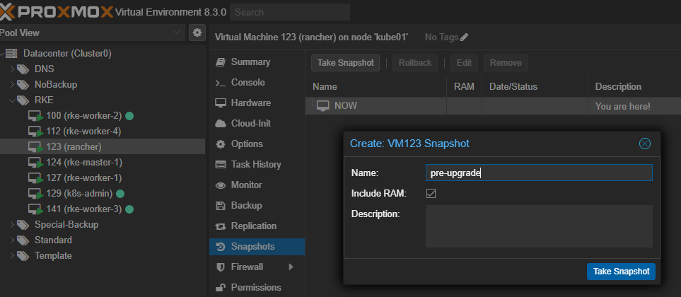

!!! warn
    Make sure to snapshot BOTH master servers, AND rancher.

### Verify backups.

Verify you do have current backups of both rancher, and your master servers.

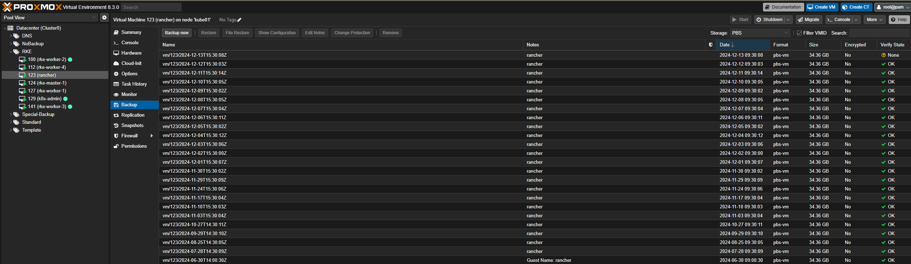

I personally went ahead and kicked off a fresh backup, just in case.

## Step 2. Upgrade rancher (Assuming docker install)

!!! danger
    Make **SURE** you have backups, and snapshots before upgrading rancher!!!!!

!!! info
    This guide assumes, you are running rancher in docker, on a dedicated host.

[Rancher: How to upgrade docker-based install](https://ranchermanager.docs.rancher.com/getting-started/installation-and-upgrade/other-installation-methods/rancher-on-a-single-node-with-docker/upgrade-docker-installed-rancher){target=_blank}

To upgrade rancher, I created [THIS SCRIPT](./assets/upgrade-rancher-script.sh) a while back, and it still meets my needs.

It- is not a very fancy script, however, it has done the job for nearly two years now.

When you run the script, it will copy all of the settings from the old container, to a new container, and download the latest version.

[upgrade-rancher.sh](./assets/upgrade-rancher-script.sh)

``` bash
root@rancher:~# ./upgrade-rancher
Current containers:
rancher
Current container: rancher
Enter the old container name (press Enter for default 'rancher'):
Enter the new container name (press Enter for default 'rancher'): rancher-1
Old container name: rancher
New container name: rancher-1
Are you ready to proceed? (yes/no): yes
rancher
latest: Pulling from rancher/rancher
4090dd5519fe: Pull complete
fbf3740af50e: Pull complete
4f4fb700ef54: Pull complete
94fd9502e569: Pull complete
451dfc562e17: Pull complete
6e583e29a207: Pull complete
cc0a56ef82a2: Pull complete
89cea98ebea0: Pull complete
6148b58cef71: Pull complete
7dfba7080371: Pull complete
43424839d54c: Pull complete
24b29490e7ed: Pull complete
0c7566f78e63: Pull complete
a700d88b4142: Pull complete
ee4b1b5ca508: Pull complete
75db2bb94dbc: Pull complete
b0207ea527d7: Pull complete
af222a29d613: Pull complete
755323881e8e: Pull complete
6aeab77af983: Pull complete
Digest: sha256:5301612358bb16e81549880e29a73a1214d9e353c2a94fb719b2cf158640e887
Status: Downloaded newer image for rancher/rancher:latest
docker.io/rancher/rancher:latest
8314650afefad0b7a858424ba2c21a4ab091f381fe7a89aff6868a7240de65f7
Press Enter to remove the old container 'rancher'...
Removing the old container 'rancher'...
rancher
root@rancher:~#
```


After running, we will need to wait a while for rancher to start up. You can monitor the progress using `docker logs rancher-1 -f` (just- replace with the name of your new rancher container.)

``` bash
root@rancher:~# docker logs rancher-1 -f
INFO: Running k3s server --cluster-init --cluster-reset
2024/12/13 19:46:23 [INFO] Rancher version v2.10.0 (df45e368c82d4027410fa4700371982b9236b7c8) is starting
2024/12/13 19:46:23 [INFO] Rancher arguments {ACMEDomains:[] AddLocal:true Embedded:false BindHost: HTTPListenPort:80 HTTPSListenPort:443 K8sMode:auto Debug:false Trace:false NoCACerts:false AuditLogPath:/var/log/auditlog/rancher-api-audit.log AuditLogMaxage:10 AuditLogMaxsize:100 AuditLogMaxbackup:10 AuditLevel:0 Features: ClusterRegistry:}
2024/12/13 19:46:23 [INFO] Listening on /tmp/log.sock
2024/12/13 19:46:23 [INFO] Waiting for server to become available: Get "https://127.0.0.1:6444/version?timeout=15m0s": dial tcp 127.0.0.1:6444: connect: connection refused
2024/12/13 19:46:25 [INFO] Waiting for server to become available: Get "https://127.0.0.1:6444/version?timeout=15m0s": dial tcp 127.0.0.1:6444: connect: connection refused
2024/12/13 19:46:27 [INFO] Waiting for server to become available: Get "https://127.0.0.1:6444/version?timeout=15m0s": dial tcp 127.0.0.1:6444: connect: connection refused
2024/12/13 19:46:29 [INFO] Waiting for server to become available: Get "https://127.0.0.1:6444/version?timeout=15m0s": dial tcp 127.0.0.1:6444: connect: connection refused
2024/12/13 19:46:31 [INFO] Waiting for server to become available: Get "https://127.0.0.1:6444/version?timeout=15m0s": dial tcp 127.0.0.1:6444: connect: connection refused
2024/12/13 19:46:33 [INFO] Waiting for server to become available: Get "https://127.0.0.1:6444/version?timeout=15m0s": dial tcp 127.0.0.1:6444: connect: connection refused
2024/12/13 19:46:42 [INFO] Running in single server mode, will not peer connections
2024/12/13 19:46:42 [INFO] Applying CRD features.management.cattle.io
2024/12/13 19:46:58 [INFO] Creating embedded CRD clusterrepos.catalog.cattle.io
2024/12/13 19:46:58 [INFO] Updating embedded CRD clusterrepos.catalog.cattle.io
2024/12/13 19:46:58 [INFO] Updating embedded CRD clusterroletemplatebindings.management.cattle.io
2024/12/13 19:46:58 [INFO] Updating embedded CRD globalroles.management.cattle.io
2024/12/13 19:46:58 [INFO] Updating embedded CRD globalrolebindings.management.cattle.io
2024/12/13 19:46:58 [INFO] Updating embedded CRD projects.management.cattle.io
2024/12/13 19:46:59 [INFO] Updating embedded CRD projectroletemplatebindings.management.cattle.io
2024/12/13 19:46:59 [INFO] Updating embedded CRD roletemplates.management.cattle.io
2024/12/13 19:46:59 [INFO] Updating embedded CRD clusterproxyconfigs.management.cattle.io
2024/12/13 19:46:59 [INFO] Updating embedded CRD uiplugins.catalog.cattle.io
2024/12/13 19:46:59 [INFO] Applying CRD navlinks.ui.cattle.io
2024/12/13 19:46:59 [INFO] Applying CRD podsecurityadmissionconfigurationtemplates.management.cattle.io
2024/12/13 19:46:59 [INFO] Applying CRD clusters.management.cattle.io
2024/12/13 19:46:59 [INFO] Applying CRD apiservices.management.cattle.io
2024/12/13 19:46:59 [INFO] Applying CRD clusterregistrationtokens.management.cattle.io
2024/12/13 19:46:59 [INFO] Applying CRD settings.management.cattle.io
2024/12/13 19:46:59 [INFO] Applying CRD preferences.management.cattle.io
2024/12/13 19:46:59 [INFO] Applying CRD features.management.cattle.io
2024/12/13 19:46:59 [INFO] Applying CRD operations.catalog.cattle.io
2024/12/13 19:46:59 [INFO] Applying CRD apps.catalog.cattle.io
2024/12/13 19:46:59 [INFO] Applying CRD fleetworkspaces.management.cattle.io
2024/12/13 19:46:59 [INFO] Applying CRD managedcharts.management.cattle.io
2024/12/13 19:46:59 [INFO] Applying CRD clusters.provisioning.cattle.io
2024/12/13 19:46:59 [INFO] Applying CRD clusters.provisioning.cattle.io
2024/12/13 19:46:59 [INFO] Applying CRD rkeclusters.rke.cattle.io
2024/12/13 19:46:59 [INFO] Applying CRD rkecontrolplanes.rke.cattle.io
2024/12/13 19:46:59 [INFO] Applying CRD rkebootstraps.rke.cattle.io
2024/12/13 19:46:59 [INFO] Applying CRD rkebootstraptemplates.rke.cattle.io
2024/12/13 19:46:59 [INFO] Applying CRD rkecontrolplanes.rke.cattle.io
2024/12/13 19:46:59 [INFO] Applying CRD custommachines.rke.cattle.io
2024/12/13 19:46:59 [INFO] Applying CRD etcdsnapshots.rke.cattle.io
2024/12/13 19:46:59 [INFO] Applying CRD clusters.cluster.x-k8s.io
2024/12/13 19:47:00 [INFO] Applying CRD machinedeployments.cluster.x-k8s.io
2024/12/13 19:47:00 [INFO] Applying CRD machinehealthchecks.cluster.x-k8s.io
2024/12/13 19:47:00 [INFO] Applying CRD machines.cluster.x-k8s.io
2024/12/13 19:47:00 [INFO] Applying CRD machinesets.cluster.x-k8s.io
....
```

As a note, you will likely see a ton of errors.... AFAIK, this is somewhat normal....

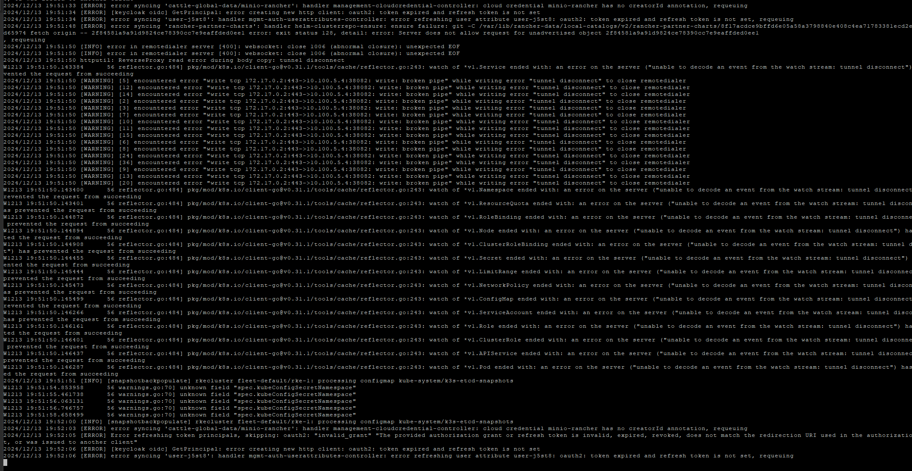

Also- you will not see a log which indicates its ready. But- the number of errors scrolling by will decrease.


### Error: "File Exists"

If- you notice errors like this:

``` bash
2024/12/13 19:47:26 [ERROR] error syncing 'partner-extensions': handler helm-clusterrepo-ensure: ensure failure: git -C management-state/git-repo/partner-extensions/3ff55af926408daaca3b5bedc48d479d95cae4f43ade3df4a8c9dc7e65732db1 reset --hard FETCH_HEAD error: exit status 1, detail: error: update_ref failed for ref 'HEAD': cannot lock ref 'HEAD': Unable to create '/var/lib/rancher/management-state/git-repo/partner-extensions/3ff55af926408daaca3b5bedc48d479d95cae4f43ade3df4a8c9dc7e65732db1/.git/HEAD.lock': File exists.
```

There- are dozens of tickets open on the issue- yet, it still exists... I have a script which can clean up locks.

[remove-locks.sh](./assets/remove-locks.sh)

``` bash
root@rancher:~# ./remove-locks
Only one container found: rancher. Do you want to proceed? (y/n): y
sh: line 1: ps: command not found
Removed lock file: /var/lib/rancher/management-state/git-repo/rancher/4b40cac650031b74776e87c1a726b0484d0877c3ec137da0872547ff9b73a721/.git/objects/maintenance.lock
Removed lock file: /var/lib/rancher/management-state/git-repo/rancher/4b40cac650031b74776e87c1a726b0484d0877c3ec137da0872547ff9b73a721/.git/index.lock
Removed lock file: /var/lib/rancher/management-state/git-repo/rancher-ui-plugins/7f344bdf57f2a834863d74b13cf2f7f6f263870470794cc5902e6a7114600d83/.git/index.lock
Removed lock file: /var/lib/rancher/management-state/git-repo/partner-extensions/3ff55af926408daaca3b5bedc48d479d95cae4f43ade3df4a8c9dc7e65732db1/.git/HEAD.lock
Removed lock file: /var/lib/rancher/management-state/git-repo/partner-extensions/3ff55af926408daaca3b5bedc48d479d95cae4f43ade3df4a8c9dc7e65732db1/.git/refs/heads/main.lock
Removed lock file: /var/lib/rancher-data/local-catalogs/v2/rancher-rke2-charts/675f1b63a0a83905972dcab2794479ed599a6f41b86cd6193d69472d0fa889c9/.git/index.lock
Removed lock file: /var/lib/rancher-data/local-catalogs/v2/rancher-charts/4b40cac650031b74776e87c1a726b0484d0877c3ec137da0872547ff9b73a721/.git/index.lock
Removed lock file: /var/lib/rancher-data/local-catalogs/v2/rancher-partner-charts/8f17acdce9bffd6e05a58a3798840e408c4ea71783381ecd2e9af30baad65974/.git/index.lock
```

### Finishing up...

After a while, the rancher interface should start responding. Once you reach this step- we are done upgrading rancher.

## Upgrade Kubernetes

After rancher has been upgraded- it is time to upgrade kubernetes. This will be executed via rancher.

Inside rancher, goto the cluster management screen. Then we want to "Edit Config" for the cluster being upgraded.

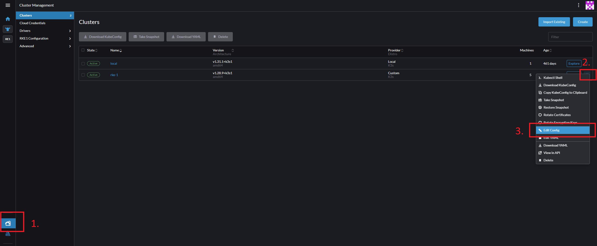

On the next screen, you will have a dropdown showing the current version, and allowing you to select the version you wish to migrate to.

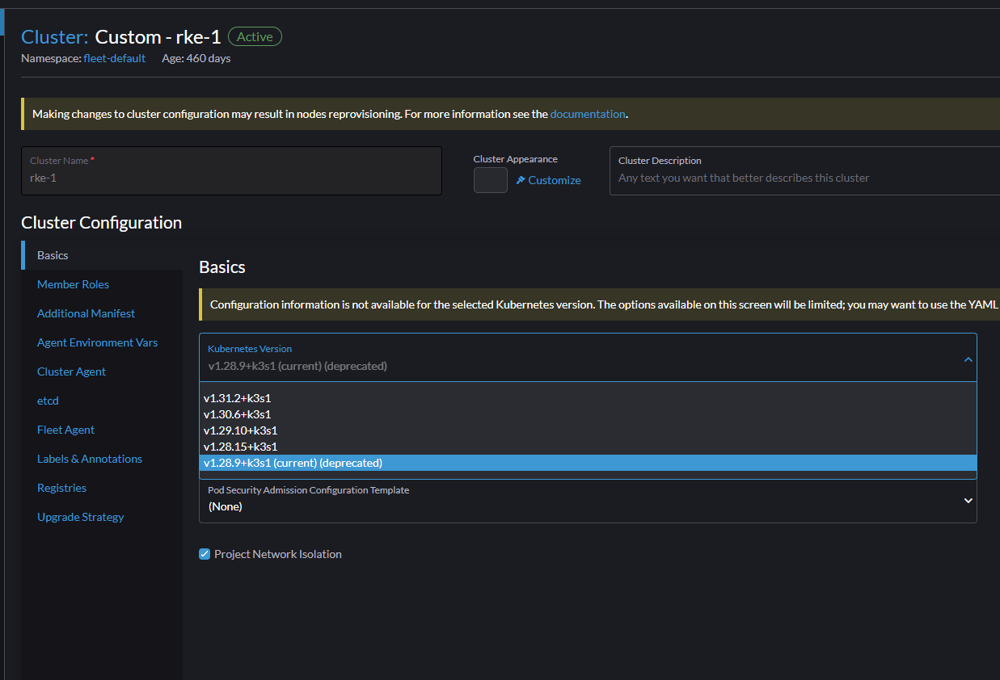

For this guide- I will be jumping ahead multiple major versions, going from version 1.28.9, up to 1.31.2

!!! danger
    Yet again, MAKE SURE YOU HAVE BACKUPS!!!!!!!!!!!!!!

    I cannot stress this enough.

After, choosing your desired version, click save in the bottom right.

You may see this warning popup as well. Validate your addons still have the expected configuration.

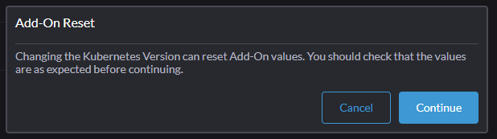

After saving- the cluster should start bootstrapping itself, and will go through the upgrade process.

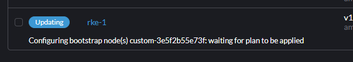

You can click on the cluster, and look at the machines tab to have a high-level overview of the current progress.

This- will give a brief summary of which machines are updating.

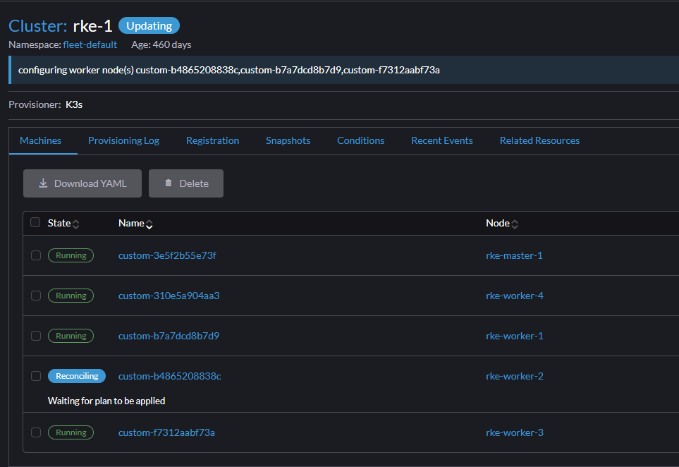

If, you want more indepth logs, select "Provisioning log"

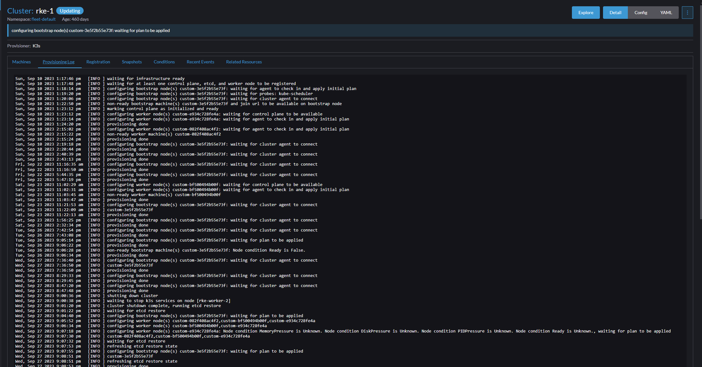

At this point, we are just waiting on everything to finish, and show green. This process took oh, around 5 minutes for me.

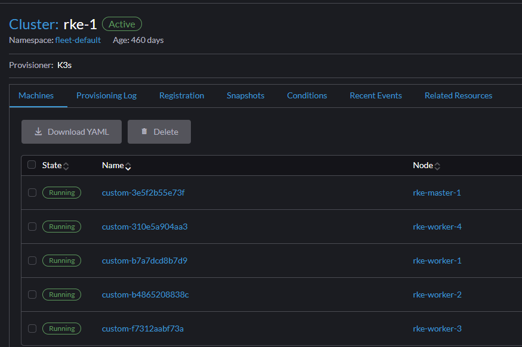

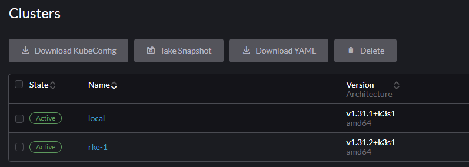

## Next steps?

Assuming your cluster successfully upgraded- now is a good time to go through and ensure all of your charts, and workloads are updated.

I find a tool such as [k9s](https://k9scli.io/) is also handy for identifying any potential issues.

Thats it for this guide.