# The Hoodcat Chronicles

This- is the tale of hood-cat. The cat who decided to break into my house, assert dominance over my cat, pee on my chair, and make himself at home.

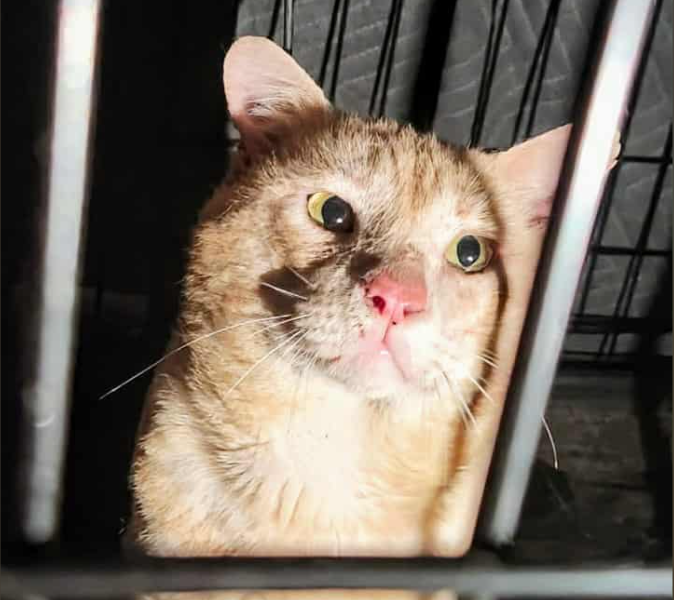

<!-- more -->

## Thursday

Thursday morning, my wife wakes me up frantic that her cat, Leia, is missing.

The door between the kitchen and garage was open, along with the garage door open.

Clumps of Leia's fur, were found all throughout the kitchen. 

When we went into the garage looking for the cat, an unknown orange cat was sitting on the freezer in the garage, and quickly left.

After searching high and low, I finally located Leia who was cowering under the freezer.

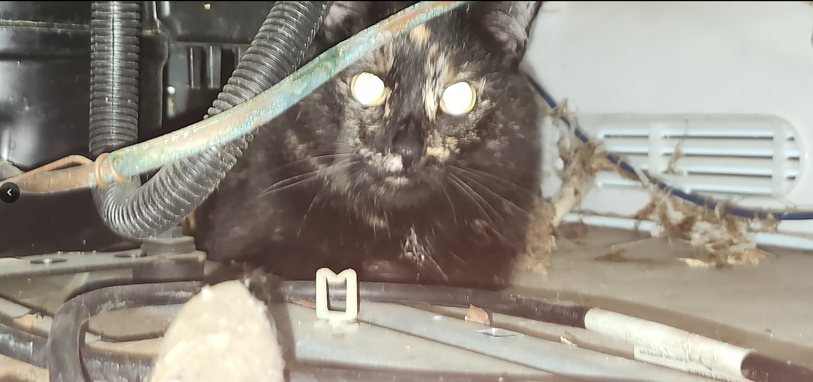

Investigation of Leia, identified she had a wound on her rear-right leg, causing a minor limp.

So.... What happened?

Well, at this point, I decided to pull up the security camera footage.

For- those who read this blog- you may have noticed my [FADD / Cat Taser](../../Home-Automation/2023/cat-taser.md){target=_blank} post in the past. Due to this project- I have cameras watching areas where we want to limit... cat movement. 

### Early Morning

So, the first thing I noticed, was Luke (My dumbass cat) decided to come into the house as well, shortly after I went to sleep around midnight.

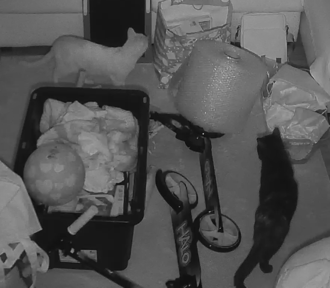

Luke, was converted to an outside kitty, after demonstrating... to not be very responsible. He would get the zoomies at nighttime, and literally jump and crawl on EVERYTHING in sight. His guilt every morning would instantly give away, he did something he shouldn't have. So- he became an outside cat.

#### 0400

Around 0411, Leia was spotted outside of the garage.

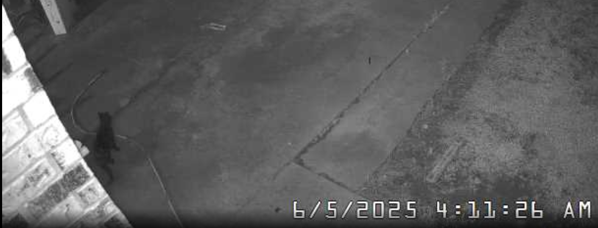

At 0418, Hoodcat can be seen sneaking into the garage.

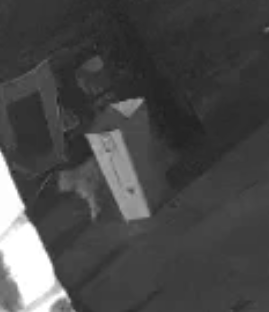

#### 0430

At 0430, Hoodcat was detected by indoor cameras.

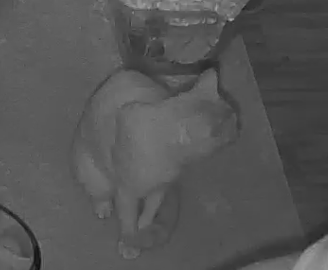

Now- while I don't have every inch of the house covered in cameras, I did have enough footage to determine what was happening.

Shortly after making his appearance, Hoodcat was seen trying to get under my chair. The importance here- That is one of Leia's hiding spots.

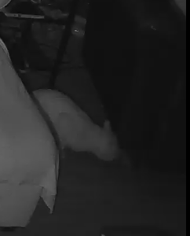

He then, proceeded to look at, and smell everything. Climbing on top of the furniture, the kitchen. etc.

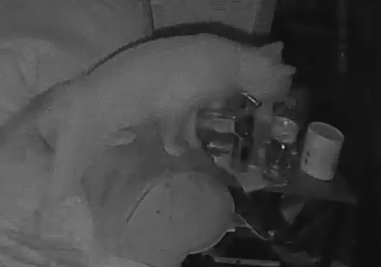

After, he sat in Leia's favorite spot- she did not like this, and a standoff ensued.

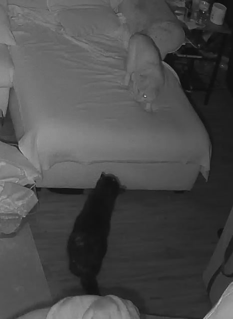

After, 5 minutes of intense glaring, growing, and aggressive tail-swatting..... Hoodcat leaped.

Leia, being an indoor cat, since being rescued as a kitten, and having no combat experience, took the decision to run and hide.

They disappeared into the Kitchen area, where I do not have adequate coverage to determine exactly what happen.

However, I did notice Luke was watching, and cowering.

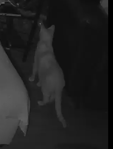

For, the next hour, he remained hidden, often peeking around objects, but, not allowing his presence to be seen.

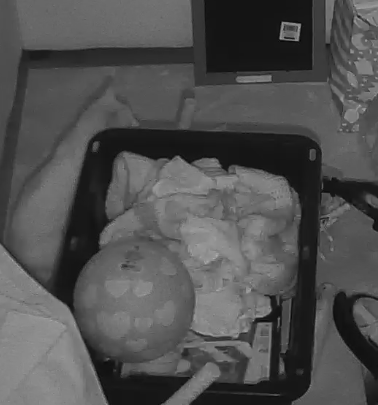

Occasionally, he would peek around the corner to look, but, would go cower back behind cover. 

Despite having lived here in the family, he provided zero support to Leia while defending the territory. He instead, cowered while hoodcat deemed this territory as his. 

#### 0600

Around 0600, we woke up, at which point they were in the garage. 

Hoodcat gracefully walked out of the garage at 0605 when the sound of people was heard.

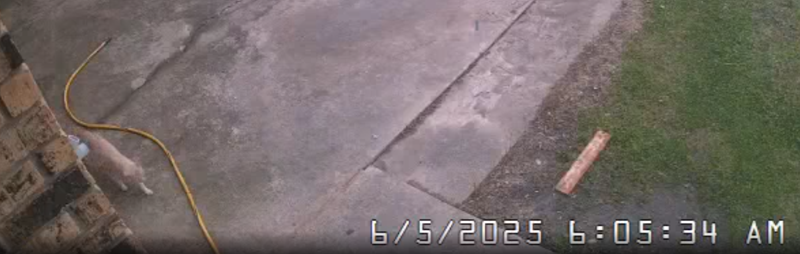

This- leads back to the earlier story- of my wife waking me, and finding the cat cowering under the freezer as hoodcat asserted dominance on top of the freezer.

Further investigation yielded Hoodcat had marked my garage, and my chair, with his atrocious scent.

### The Plan

At this point, Hoodcat had racked up multiple charges.

1. Breaking and entering.
2. Assault.
3. Kidnapping.
4. Vandalism.

Indeed, this would not be allowed to slide. So, I needed to formulate a plan to ensure hoodcat was brought to the proper authorities.

I decided to build a trap for hoodcat. After taking inventory of options- I was left with a dog crate, some scrap metal, zip-ties, and ratchet straps.

So, I built a trap.

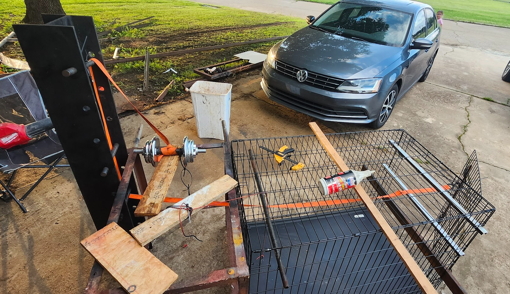

The principal is simple. Unbalanced pieces of wood holds the weight of a 20lb barbell.

Stepping onto the mat, where the food is located, pulls a piece of wire connected to the unbalanced wood.

Unbalanced wood topples, which causes the weight to fall.

The weight is connected to the door via a ratchet strap.

Pieces of metal are behind the door, this is to help absorb the force of the door slamming to avoid deforming the kennel.

Zero permanent modifications were performed. This is all zip-ties.

### Thursday Night

So, while digging through footage watching the trap, I noticed something interesting.

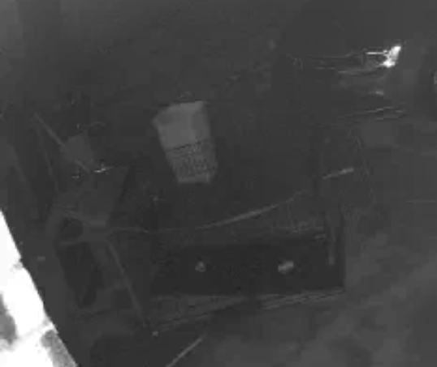

Notice- there are two pieces of meat.

And... then there was one.

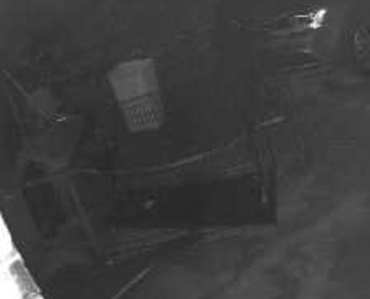

What happened??!? Did the trap not work?

After digging through the footage, I found a Possum put her head in the door, grabbed the piece of meat, and left. The lack of greed, saved this possum from capture.

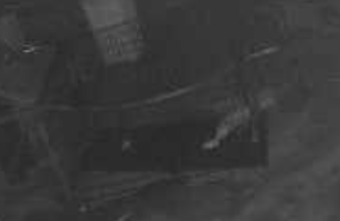

At 1000, I noticed my dumbass cat, Luke, trying to get the meat.

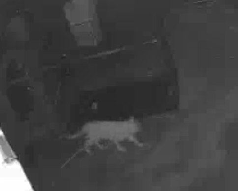

In his infinite wisdom, he also decided to jump on top of the trap, which of course, triggered it to close.

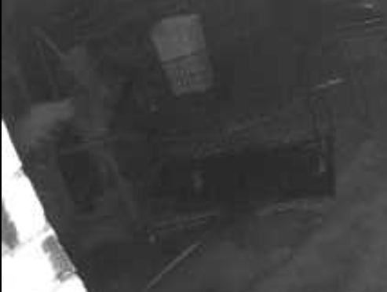

I called him to the door, and put him somewhere more secure for the night to keep him from being captured.

Afterwards, I had to reset the trap mechanism.

At 11:54pm, Hoodcat showed up, curious about the smell of fresh turkey.

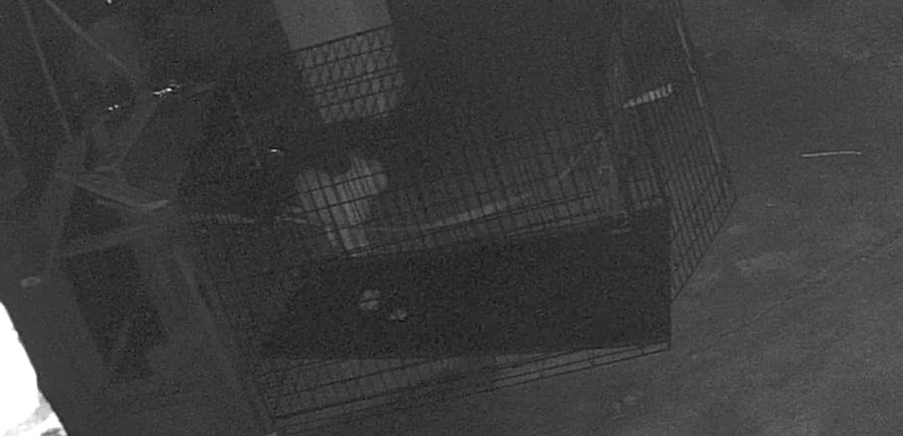

Interestingly, he laid near the cage for about 10 minutes.

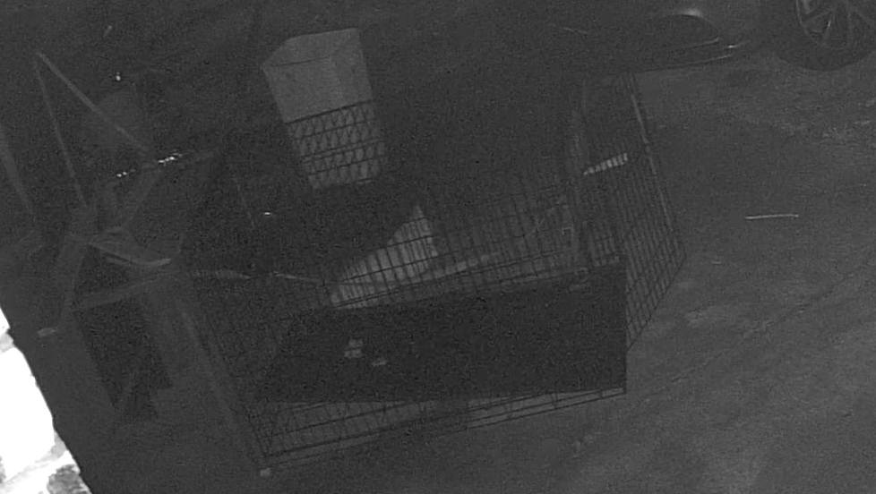

And, then another cat showed up. I'm going to refer to this cat as Lackey.

Hoodcat watched as lackey investigated the trap, and eventually became trapped inside.

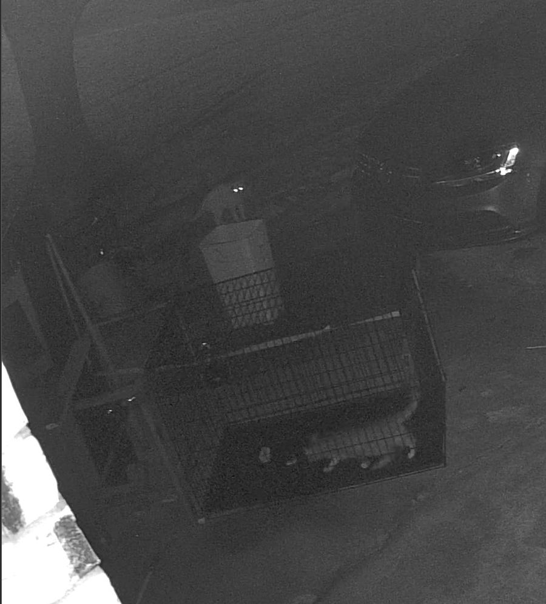

Hoodcat watched for a couple of minutes, until walking away, leaving Lackey trapped.

## Friday Early Morning

After a while had passed, Hoodcat did return to try and save his comrade.

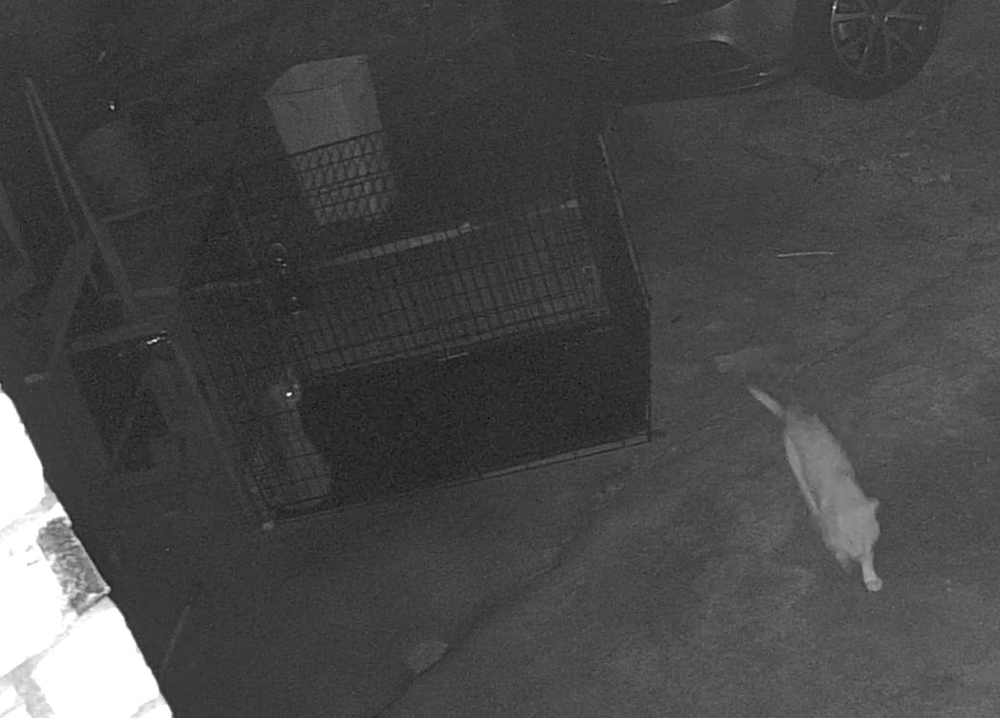

However, the trap door would not budge. He again left, which left Lackey sad and lonely. She kept look hoping he would return to save her. But, he never came.

Lackey DID attempt to escape, multiple times. And even practiced flying aerobics, but to no avail.

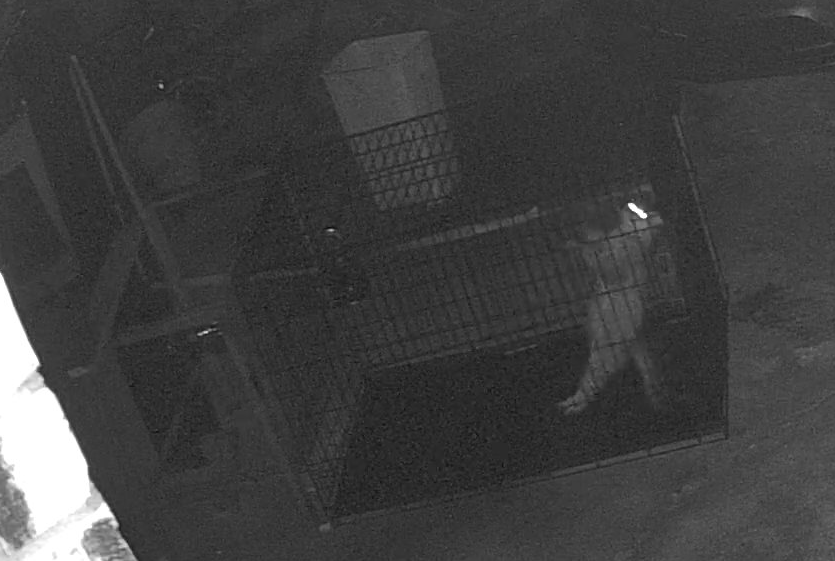

She even practiced for a career in tight-rope walking.

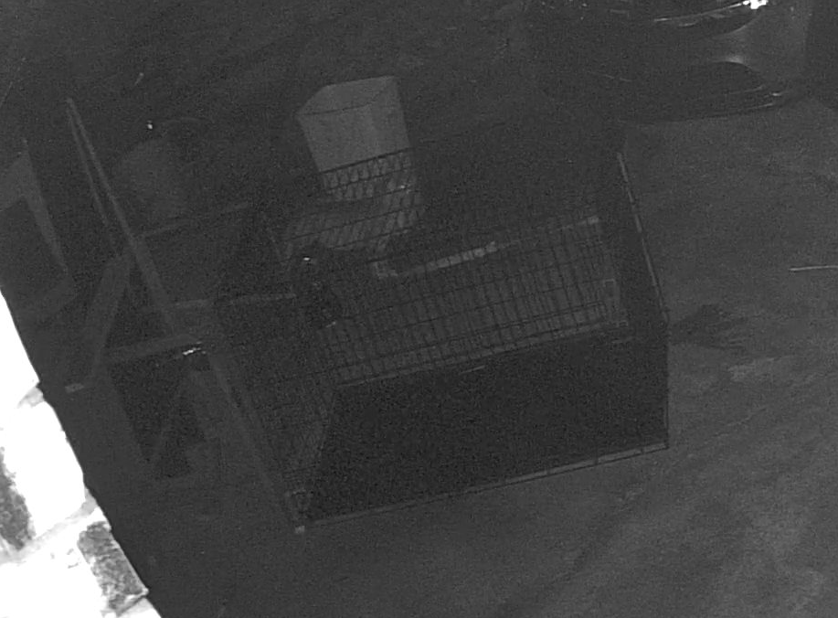

0430 on Friday morning, heavy thunderstorms came through the area, which terrified lackey.

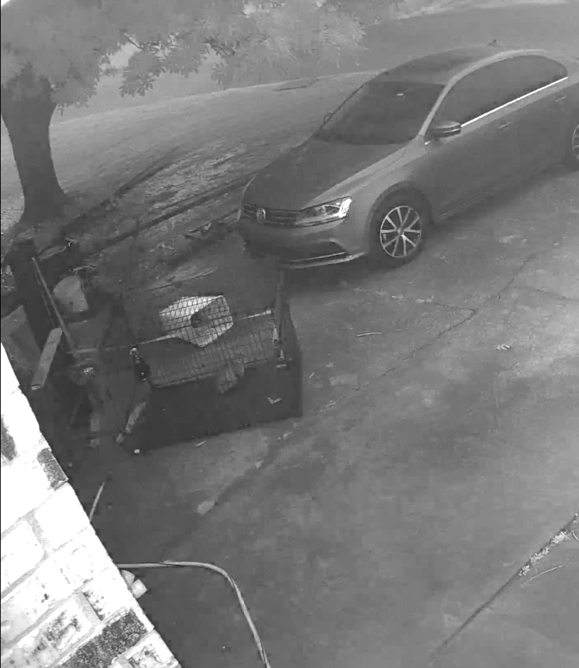

These storms also woke me up, at which point I provided additional shelter to Lackey.

### Morning

That morning I went to interview Lackey to attempt to determine the hiding location of hoodcat.

Lacky, was visibly shaken from the storms this morning. 

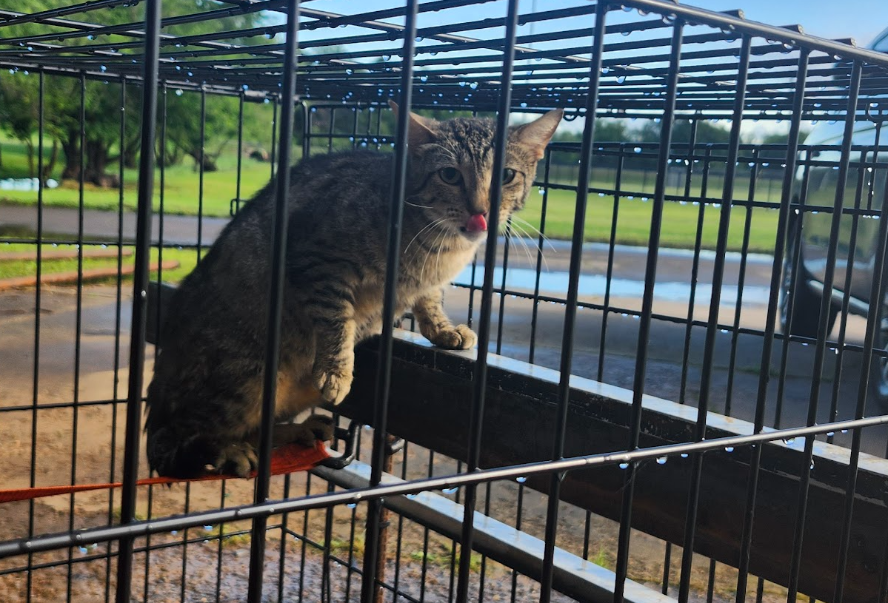

#### Lackey's Interrogation

No time was wasted interrogating Lackey to find Hoodcat's hidden lair.

<iframe width="626" height="1112" src="https://youtube.com/embed/OcX2GuWRQ4o?feature=share" title="Lackey's Interrogation" frameborder="0" allow="accelerometer; autoplay; clipboard-write; encrypted-media; gyroscope; picture-in-picture; web-share" allowfullscreen></iframe>

However, Lackey became silent when questioned on the whereabouts of hoodcat.

A few hours later, Lackey was turned over to the local authorities.

As of right now Lackey is pending adoption, with high chances of being adopted. 

Lackey was checked for a chip, and provided proper vaccinations.

### Friday Night

Around 10pm on Friday night, Hoodcat made his appearance again. However, the trap did not properly trigger, leaving him free to leave.

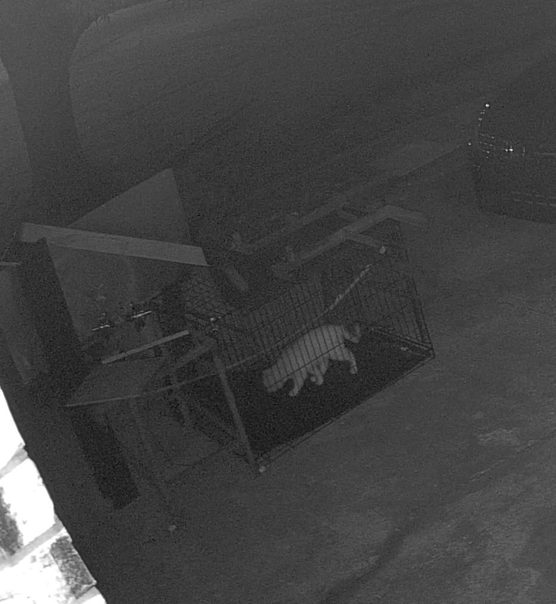

Around 10:30pm, I reset the trap, and rebaited it.

## Saturday

### Early Morning

Shortly after midnight, another cat had become trapped.

Was it hoodcat? No. It was just my dumbass cat again.

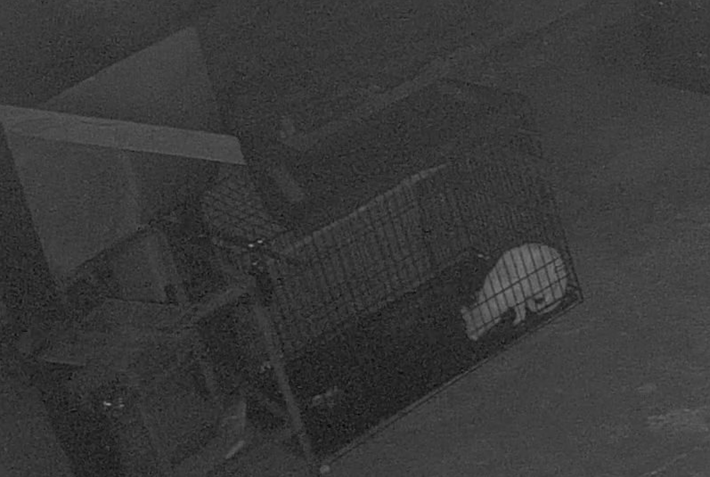

Lucky for him, My wife woke up and checked the cameras around 4am, and let him out before heavy storms again hit the area.

### Saturday Night

Well, Saturday night around 11:30pm, Hoodcat showed up. 

However, this time, the trap was ready for him.

<iframe width="900" height="700" src="https://youtube.com/embed/3GuSGlC3JCk?feature=share" title="Lackey's Interrogation" frameborder="0" allow="accelerometer; autoplay; clipboard-write; encrypted-media; gyroscope; picture-in-picture; web-share" allowfullscreen></iframe>

Without a hitch, hoodcat had been captured.

Once captured, Hoodcat did not make a noise. Not even a single meow for help.

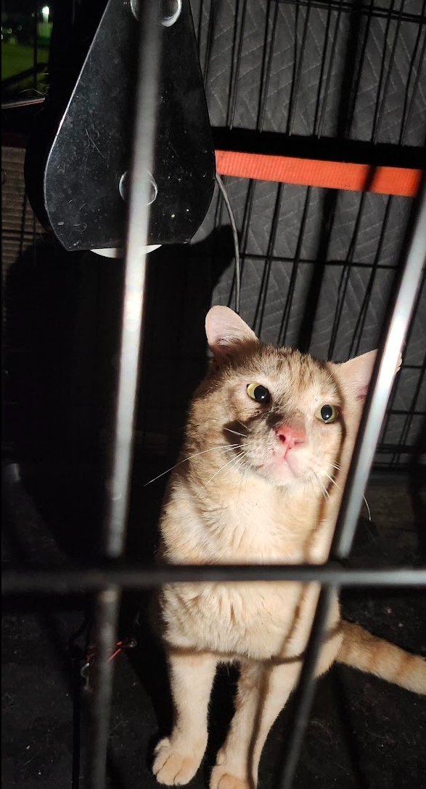

As it was 11:30 at night, Hoodcat's holding cell was relocated to the garage, until the correct authorities could be contacted in the morning. Food and water were provided.

## Sunday 

After further investigation of hoodcat, it was determined he was not a domesticated cat.

Not a single meow was given. Only a growl.

Initially, the plan was to turn hoodcat over to animal control. However, this would have indeed mean hoodcat would have likely been euthanized after a few weeks. 

After careful deliberation, it was determined hoodcat would go live out the rest of his days as a farm cat, on a farm in a remote area.

His transport was arranged Sunday, and upon arriving to the location, a feeding area was provided.

As soon as his carrier was opened, he sniffed the food, and shot off into the fields.

I would imagine, after 5 or 10 minutes worth of running, and seeing nothing but empty fields- He realized the gravity of his situation, and eventually returned to the location where food and water were provided.

While, hoodcat will not have the happiest ending, this does ensure he has the power to make his own ending rather then a game over provided to him after he would eventually fail to be re-homed.

The end.