# Shop Table - Part 1

Part one of my shop-table project. This occurred in Oct 2024.

Here is the end result. A simple, sturdy table.

<!-- more -->

## Introduction

### Auctions

Occasionally I enjoy going to property auctions. I can generally pick up a good amount of scrap metal, tools, and parts for a reasonable price.

One of these auctions, was a farm, where I obtained a decent trailer full of metal scrap, and a few tools.

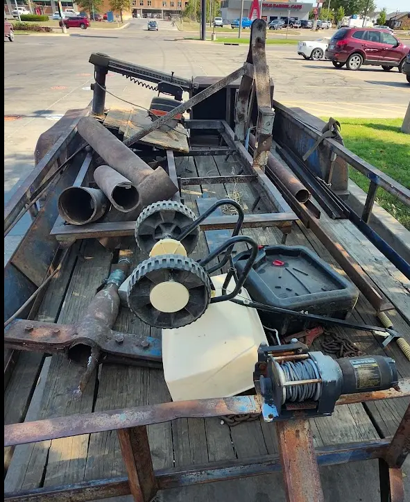

There WAS a table auctioned off at the site, however, when its bidding price went above 600$, I stopped bidding. The table was bigger then I was looking for, and required... a forklift to be moved.

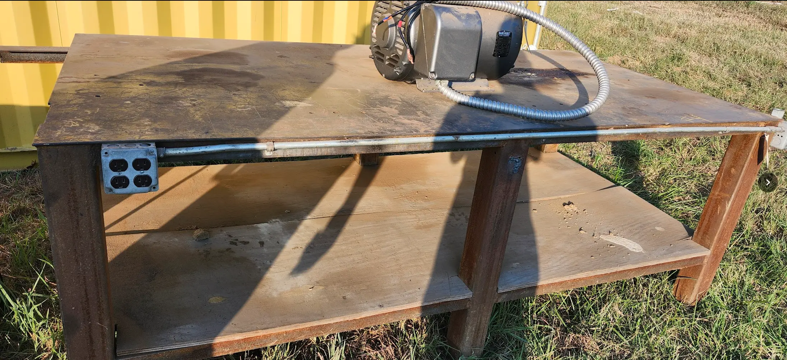

However, I did leave with a healthy assortment of angle-iron, and flat plate.

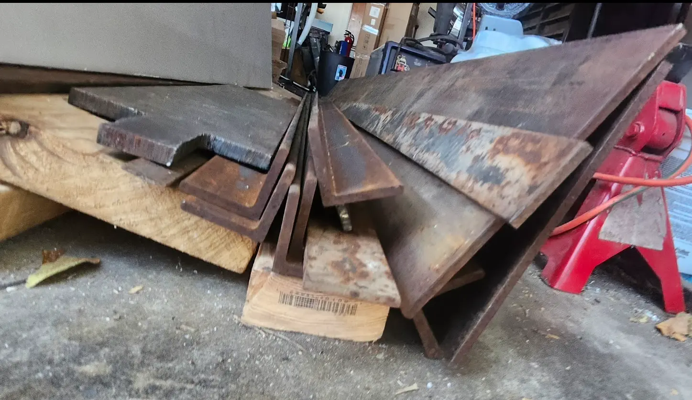

Here is another view of some of the materials I collected from this auction.

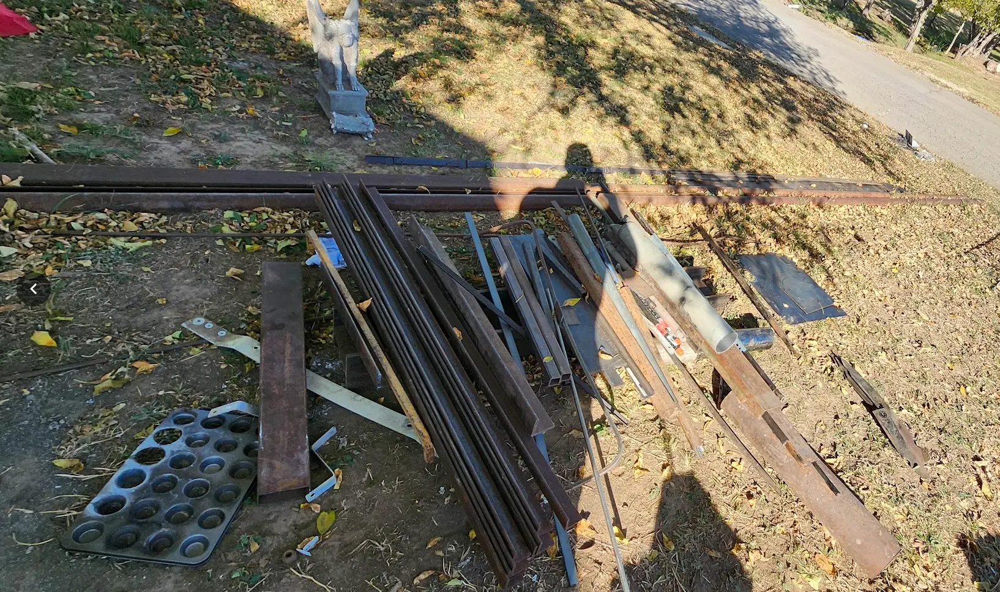

I did also pick up a solid steel I-beam for 15$.

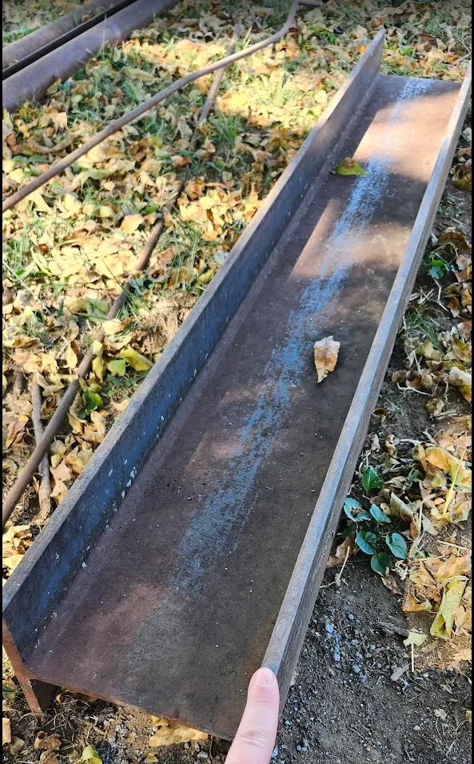

### The Goal

With the auction details out of the way- My goal was simple. I wanted to build a table for my shop.

The requirements-

1. Must be sized as to not take up my entire shop floor. My shop, is the 2-car garage on my house.
2. Must be sturdy. Needs to be able to withstand at least a half-ton of weight.
3. Must tolerate hammering and beating. This table will be used.

While- I planned on getting a piece of steel sheet for the top of my table, the bidding went above what I was willing to pay.

Through, after taking inventory, I did feel, I had plenty of materials laying around to build a table.

So- thats what I did.

### Tools Used

I'm not going to go into super-depth regarding all of the tools used, however, I will list out the big items.

1. **AHP AlphaTig**: [Amazon](https://amzn.to/3FTsKZe){target=_blank}
    - I have the 2017 AlphaTig model. After 7 years of owning it, I still really enjoy this machine.
    - I use it for Tig and Stick from 20 amps, up to 200 amps. Zero complaints.
    - There have been a lot of improvements since my 2017 model, I'd highly recommend one of these units.
    - The price/features is hard to beat.
2. **Dewalt 14in Chop Saw**: [Amazon](https://amzn.to/3HBVZAp){target=_blank}
    - I couldn't tell you what year I picked up my chop-saw, but, it was pre-2017.
    - It works just as well now, as it did nearly a decade ago.
    - I have cut angle-iron, 3" structural tubing, bars of aluminum. You name it. It does it.
    - For blades, I typically use [14" Abrasive Disks - Amazon](https://amzn.to/3FK5i0B){target=_blank}
        - These are cheap, and effective.
        - I do have a carbide blade for cutting metal, however... It did not last too long.
3. **Primeweld CUT50D**: [Amazon](https://amzn.to/4mW91bY){target=_blank}
    - I picked this up in April of 2020. At the time, this was one of the cheapest available plasma cutters available.
    - I'll admit- My expectations were not very high for this unit. However, I have owned it for 5 years, and it has logged hundreds of hours, without any issues or faults.
    - The current units, have a lot more options. Mine only has a single physical knob for amperage.
    - I did recently (2025) swap out the torch head, for a [PT31 - Amazon](https://amzn.to/4jT9kSh){target=_blank}. I did this, because the consumables are cheaper, and easier to acquire.
4. **Dewalt Angle Grinder**: [Amazon](https://amzn.to/3ZtmJcx){target=_blank}
    - I have been using this angle grinder for the best part of the last decade. The handle finally broke off, to which I just created a single handle made from square tube. Its still kicking.
5. **Flap Disks**: [Amazon](https://amzn.to/43TQNPF){target=_blank}
    - I have found these cheap flap disks, to be amazing when working with metal.
    - I use a combination of 40 grit, and 120 grit disks. 40 grit when doing heavy shaping, or grinding. 120 grit for making it look pretty.
6. **Rust-Oleum 215215**: [Amazon](https://amzn.to/4jNEoCW){target=_blank}
    - I have been using this spray paint for many of my steel based projects.
    - Works great for minor surface rust. You will want to grind and remove any heavy rust though.

## Building the table

I started this, by cutting the steel plate into three sections to get my desired length and width.

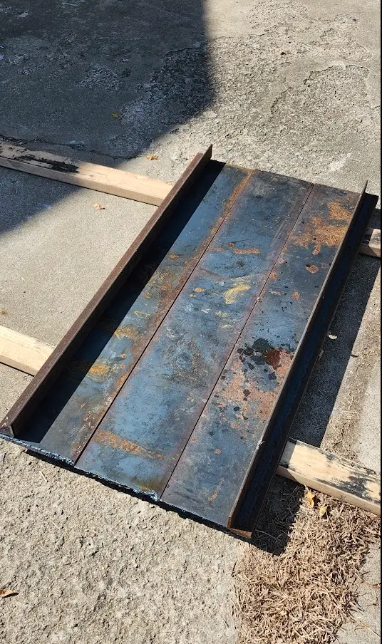

Since, I knew I had quite a few of these cuts to do, and drawing straight lines is hard, I did fabricate a small.... "guide" for my tig torch.

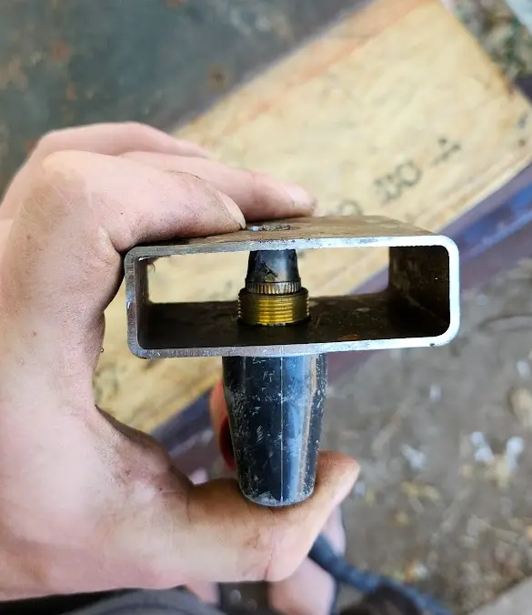

More or less, you put the torch in, and slide it against a board or piece of metal. And, you get a straight cut.

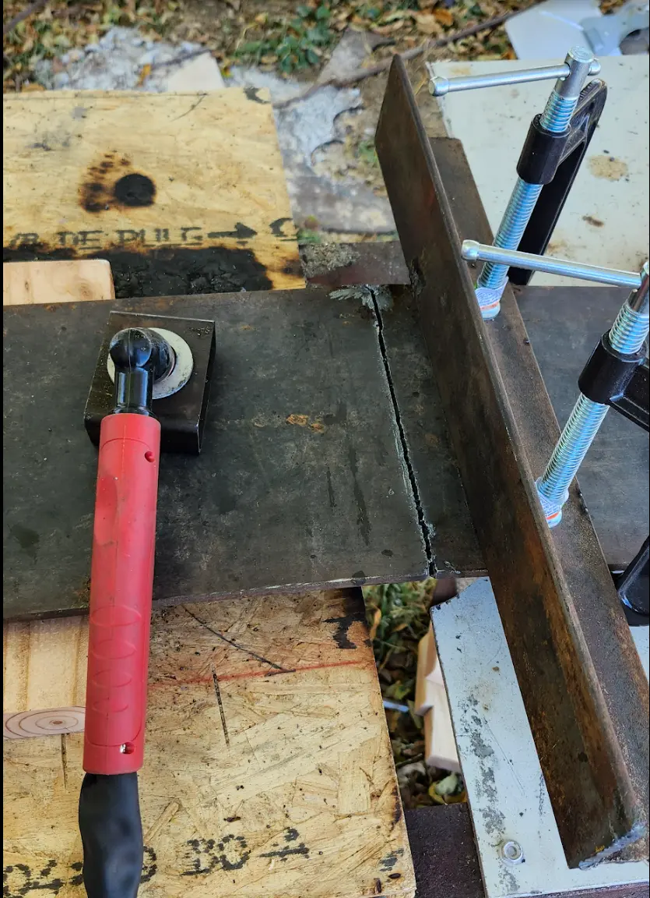

With, the plate cut, I started building a frame using 1/4" angle-iron.

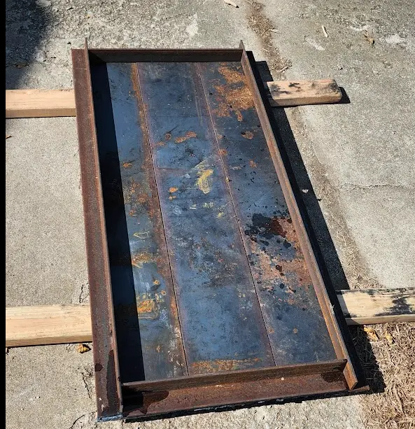

One important detail here- I intended on the flat side of the angle iron to be on the OUTSIDE of the table.

The reason- It makes it much easier to use clamps on the outside perimeter of the table.

For cutting the angle-iron, I used my chop-saw.

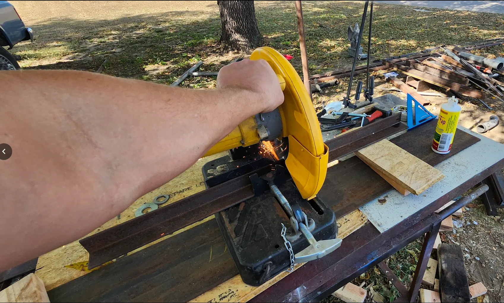

I did, trim the edges with my torch.

After this was done, I cut a few pieces of angle-iron to make ribs across the middle.

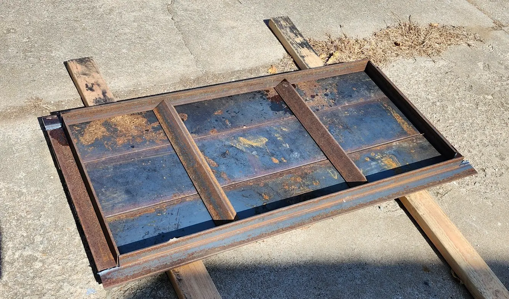

Here is a close-up picture of how the edges will be aligned. Nothing has been welded at this point. 

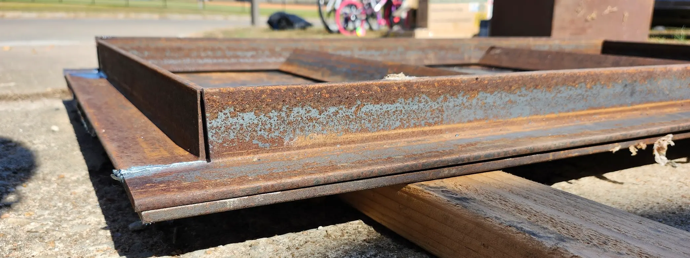

With everything cut, at this point, I started welding all of the seams... My welds here, are less then ideal.

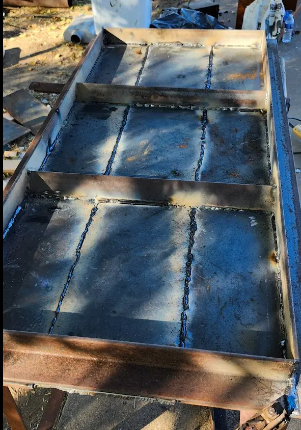

!!! warn
    I did- make a critical mistake during this process. 

    I did not control my heat, which allowed one of the pieces of plate to warp slightly.

Most of the welding was done using 6011/7018 welding electrodes.

For the legs, I used 2 3/8 drill-string. 

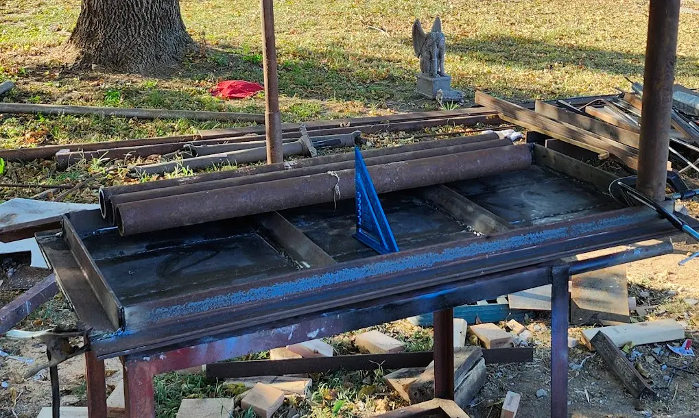

And, after a bit of leveling, measuring, clamping and welding... I had all four legs attached.

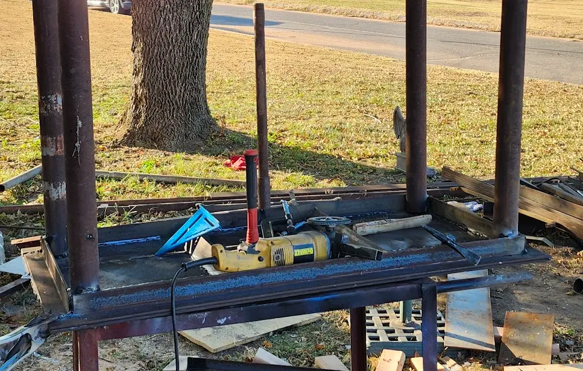

After the welding was done, I used flap-disks and my angle-grinder to smooth out the welds, and remove any remaining rust. I then added a coat of rustoleam rust-reformer primer.

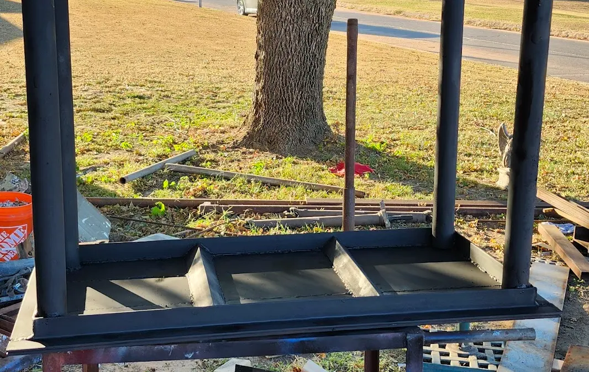

And.... after a day of work, I had a functional table.

## Next Steps?

Since- its 2025 now, and I finally just wrote this post... You can skip to [Part 2](./../2025/Shop-Table-Part2.md) where I added wheels and some tooling mounts.