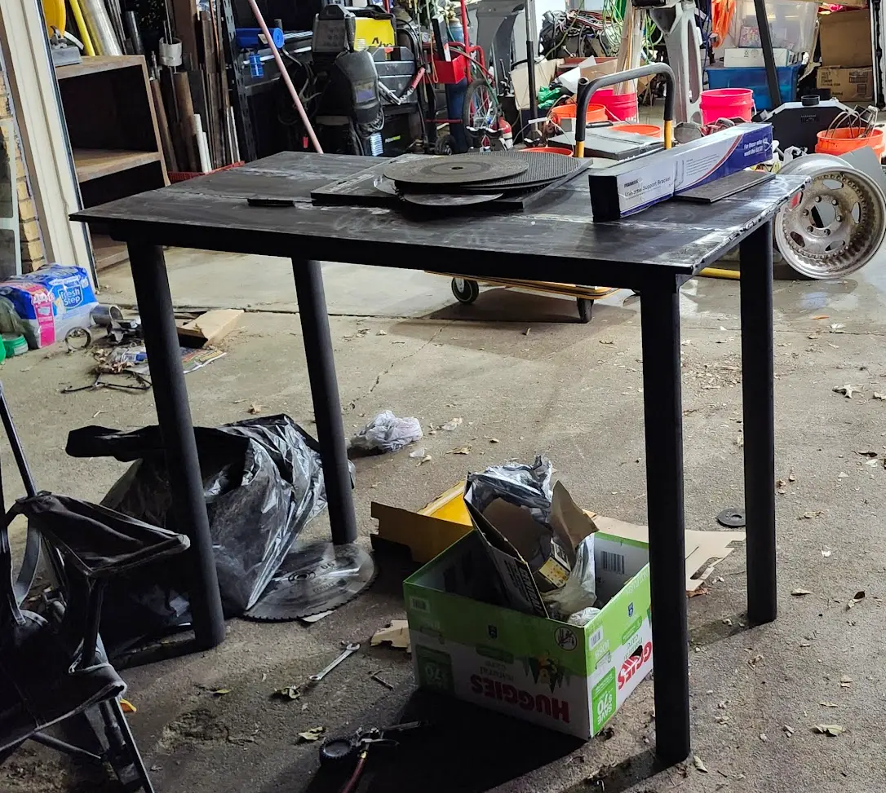

# Shop Table - Part 2 - Wheels & Tool Mounts

In [Part 1](../2024/Shop-Table-Part1.md){target=_blank}, I built a solid steel shop table from plate and angle-iron.

This- was the end result. A simple, solid table.

Well, Today, I added a few... changes to this table. I added wheels, and solid tool mounts.

<!-- more -->

## Introduction

The table has proved itself quite handy. I have used it for everything from building the [DIN-rack for my networking closet](../../Technology/2025/din-closet-1.md){target=_blank}, all the way up to building a [press from an steel I-beam.](../2024/Pneumatic-Press.md){target=_blank}.

However, I really wish it was easier to move. Due, to its weight, its not exactly portable.

After stewing on the idea for months, I finally decided to do a few upgrades.

With, a positive recommendation from a friend, I decided to use these [Ratcheting Casters](https://amzn.to/4dZFDO1){target=_blank}

I decided on these, because they are pretty easy to level the table when needed, and because when leveled, the table will not be resting on the wheels, allowing me to work on heavy projects without the table moving around.

I ALSO went ahead and added a mounting system for my Vise, Anvil, and Bench Grinder. To do this, I used a simple [bumper hitch receiver from Harbor Freight.](https://www.harborfreight.com/3500-lb-step-bumper-receiver-69673.html){target=_blank}.

At a cost of 15-20$, these met the need. To achieve a 3/4 ton rating, these must be able to endure quite a bit more force before deforming. So, there should be zero issues with strength.

### Tools Used

I'm not going to go into super-depth regarding all of the tools used, however, I will list out the big items.

1. **AHP AlphaTig**: [Amazon](https://amzn.to/3FTsKZe){target=_blank}
    - I have the 2017 AlphaTig model. After 7 years of owning it, I still really enjoy this machine.
    - I use it for Tig and Stick from 20 amps, up to 200 amps. Zero complaints.
    - There have been a lot of improvements since my 2017 model, I'd highly recommend one of these units.
    - The price/features is hard to beat.
2. **Dewalt 14in Chop Saw**: [Amazon](https://amzn.to/3HBVZAp){target=_blank}
    - I couldn't tell you what year I picked up my chop-saw, but, it was pre-2017.
    - It works just as well now, as it did nearly a decade ago.
    - I have cut angle-iron, 3" structural tubing, bars of aluminum. You name it. It does it.
    - For blades, I typically use [14" Abrasive Disks - Amazon](https://amzn.to/3FK5i0B){target=_blank}
        - These are cheap, and effective.
        - I do have a carbide blade for cutting metal, however... It did not last too long.
3. **Primeweld CUT50D**: [Amazon](https://amzn.to/4mW91bY){target=_blank}
    - I picked this up in April of 2020. At the time, this was one of the cheapest available plasma cutters available.
    - I'll admit- My expectations were not very high for this unit. However, I have owned it for 5 years, and it has logged hundreds of hours, without any issues or faults.
    - The current units, have a lot more options. Mine only has a single physical knob for amperage.
    - I did recently (2025) swap out the torch head, for a [PT31 - Amazon](https://amzn.to/4jT9kSh){target=_blank}. I did this, because the consumables are cheaper, and easier to acquire.
4. **Dewalt Angle Grinder**: [Amazon](https://amzn.to/3ZtmJcx){target=_blank}
    - I have been using this angle grinder for the best part of the last decade. The handle finally broke off, to which I just created a single handle made from square tube. Its still kicking.
5. **Flap Disks**: [Amazon](https://amzn.to/43TQNPF){target=_blank}
    - I have found these cheap flap disks, to be amazing when working with metal.
    - I use a combination of 40 grit, and 120 grit disks. 40 grit when doing heavy shaping, or grinding. 120 grit for making it look pretty.
6. **Rust-Oleum 215215**: [Amazon](https://amzn.to/4jNEoCW){target=_blank}
    - I have been using this spray paint for many of my steel based projects.
    - Works great for minor surface rust. You will want to grind and remove any heavy rust though.
7. **Metal Marker**: [Amazon](https://amzn.to/3Tne1sA){target=_blank}
    - This works well for writing on metal, even nasty rusty metal.
8. **Spring Loaded Center Punch**: [Amazon](https://amzn.to/403EIX5){target=_blank}
    - I ordered this March 2018. It still works very well.
    - For the price paid, I have zero complaints.

## Adding casters

First, I needed to cut some plate to bolt the feet to. I dug a piece of steel plate out of the mud, and used it.

I used my flap disks to remove the rust from the plate, and then traced the outline of the castors using a paint marker.

With, the plate cleaned up, I used my homemade plasma guide to start cutting each of the pieces out.

And, after a while.... I had 4 flaming hot steel pads ready to go.

Not pictured- I used my spring-loaded center punch to mark where I needed to drill the holes to mount the feet.

After marking each of the plates, I brought them over to the drill press and started drilling out the holes.

Note- the oil can. Keep your drill bits cool and lubricated, and they will last a lot longer.

Next, I welded the feet onto the table. E-7018 was used here.

And.... kept welding.... until all four pads were securely attached.

There SHOULD be a finished image here, However, I originally did not plan on writing a blog post for upgrades to my shop table, or even building the shop table.

But- its wet and rainy outside, and I felt it would be a good time to catch up on writing some of my blog posts. 

## Adding Vertical Tool Mount

As noted in the introduction, I picked up a pair of [bumper hitch receivers](https://www.harborfreight.com/3500-lb-step-bumper-receiver-69673.html){target=_blank} which I planned on using as tool mounts.

Sadly, I did a very horrible job of taking pictures to document this.

First- I used flap disks to knock off the layer of surface rust which had accumulated on the top of the table.

Then- I measured a section for the hitch, and cut it out using the plasma torch.

Here is a photo showing the hitch test-fitted. 

The piece of rusty tube here was used to level the mount. 

The table was completely leveled earlier (not pictured), and then I added the piece of square tube, and leveled it, to ensure the mount was completely level.

Next, I welded the hitch into plate.

As a note, you can see two of my magnetic levels in this photo. I have a total of four of these.

These are [Empire EM71.8 True Blue Magnetic Levels](https://amzn.to/3FRxWwN){target=_blank}. I originally discovered these at home depot, and became a huge fan of them.

The hammer seen, is a [2lb Crescent Engineer Hammer](https://www.crescenttool.com/all-tools/construction-hand-tools/striking-struck/hammers/chfeng40-2-12-lb-fiberglass-engineer-hammer){target=_blank}. I picked this up at home depot. It has quickly became one of my favorite hammers around the shop.

Finally, after a bit more grinding and sanding, I added a thin coat of paint.

## Adapting vise to vertical mount

The first tool I planned to adapt, was a new/old vise I had picked up from an old building we were cleaning out.

I needed to get it cleaned up, and get a base plate fabricated which would adapt it to the new mount.

### Cleaning the Vise

The first step, I actually needed to clean the vise. It was pulled out of a old building which was falling apart, and was covered in dirt, grease, grime, etc.

Sadly- I did not have a before picture... but, I will note, I had no idea it was blue. That is how dirty it was.

So- I used my pressure washer to blast most of the grime off.

I then decided to fully disassemble the vise, clean it out, and re-grease it.

One interesting feature about this vise- It had a hardened steel "top" running full length.

This- feature will come in quite handy for a few of my projects.

After fully disassembling, everything was again pressure washed, and left to dry in the sun.

I did, find the bolt which holds the vise nut in plate, was compromised/broken. I replaced this with a new grade 8 bolt.

One last thing not pictured- I used some fine-grit sand paper to lightly sand the rust from the hardened surfaces of the vise. After knocking up the surface rust, I coated everything with light oil to prevent it from rusting in the future.

### Fabricating a vise mount

To make the base plate, I used the same rusty piece of plate I pulled out the mud earlier that day. I traced an outline of the vises base onto it using the paint marker.

Next, I used my plasma cutter to cut the plate.

Afterwards, I did a bit of basic grinding and smoothing, and put the vise's base onto the plate.

Not pictured- I used my spring-loaded center punch to mark where I needed to drill the holes.

Since.... the plate did not exactly fit the cross-slide vise on my drill press, I used clamps to hold it onto a piece of wood while drilling. Again, make sure to keep those drill bits lubed up!

With the plate drilled, I test-fitted a piece of square tubing, and slide it into the table mount.

And, a quick test fit.

  

### Finishing the Vise Mount

Next up, I ran a weld around the inside of the plate to join the base to the square tubing

I DID need the vise to sit flush on top of the table. While, two of the nuts/bolts wouldn't interfere, the third would. 

To, work around this, I decided to weld studs into the plate to ensure there would not be interference.

After... a quick trip the the hardware store, I picked up new grade 5 nuts and bolts. 

I then, cut the head off of the bolts, leaving just a threaded insert. I used a 3 1/2" cutting disk with my pneumatic cutoff tool.

The nuts / thread were installed onto the vise, and the vise was clamped to the base-plate before welding in the studs.

After welding, I used flap disks to grind down the welds to a flat finish.

Not pictured- I also ran a bit of weld on the bottom side of the plate. I was careful to not go overly thick here, as it may cause interference issues.

Here is the top side of the mounting plate. 

I gave the mount a quick coat of spray paint.

At this point, the vise mount is basically completed.

Here, is a photo showing it laying on the ground.

### Adding set screw

I did notice, there was a bit of wobble from the receiver hitch. I did want to add a set-screw to eliminate all movement.

To make this, I used a piece of rusty rebar, along with threaded rod (a bolt with the head chopped off), and a nut.

The rebar was welded to the threaded rod.

The threaded rod was sized so that it could be easily turned. 

Here is the temporary mock up, before welding.

For mocking this, I used an additional nut inside of the hitch to hold everything steady.

And, finally, the nut was welded onto the receiver hitch, and everything was tightened up, and given a coating of black rust-paint.

While this was a very simple solution, I can confirm, it removed ALL of the wobble from the vise mount.

It is also very quick to loosen to allow for tool removal.

## Adding a horizontal tool mount

In addition to mounting my vise to this work table, I also wanted to be able to mount a few other tools as well.

In the first case- A simple bench grinder. In the current state, my bench grinder sits on the floor, and is secured to my table using wood clamps. This is not ideal, and I wanted a proper solution for this problem.

With my 2nd receiver hitch, I decided to mount it horizontal under the table top.

I used my paint marker to trace lines where to cut.

And, with the angle-iron cut, the mount fits quite nicely.

Not pictured- The table was turned upside down, and the mount was welded into place.

Note- The mount is NOT flush with the outside of the table, rather, its recessed allowing it to be out of the way when not needed. This- can be seen in later images.

## Adapting Bench Grinder to Horizontal Mount

Since the horizontal mount was now welded in, the next task was to develop a mounting base for it.

I decided to use a piece of 1-ft plate for the base. The same square tube as earlier will be used as well.

I disassembled the grinder, to remove the base. With the base removed, I was able to use my spring-loaded center-punch to mark where to drill holes.

(Not Pictured), After marking the holes, The holes were drilled, and the base was mounted to the plate.

Next, I laid the plate onto the square tube, to start mocking up a good position for it.

The bench grinder is NOT flush against the table by design. This allows the cord to more gracefully come down.

The grinders base was unbolted, and then a line was drawn where to cut the square tubing.

The square tubing was cut using my chop saw. I also used the chopsaw to clean up the edges of the plate slightly.

After, everything was welded together, and given a coating of black rustoleam

And, voila. My bench grinder is now securely mounted to the table.

(Also- not pictured- A hole was drilled through the square tubing, allowing a bolt to hold the square tube to the receiver hitch.)

Here is a photo of the backside. Note the gap, which allows the cord room.

## Conclusion

While, nothing drastic, these small changes added a ton of usability to my shop table.

I do- give my apologies for not including photos for some steps as the original intentions did not involve writing a blog post for this.

But... due to less then desirable weather- here I am catching up on old blog posts!