# How to start your A/C compressor off-grid.

Starting your A/C compressor generates a massive inrush current. Many inverters will have issues getting the motor spinning.

In the case of my 3.5Ton unit, the starting current can be upwards of 60 amps @ 220v.

This post, describes how to install a soft-start, which will allow your compressor to easily start off-grid, or via a smaller generator.

<!-- more -->

## Introduction

The day my system was fully installed, one of the tests I performed, was attempting to start the A/C compressor off-grid. 

Well, when I tested this, there were a lot of horrible noises, dimming lights, and beeping noises. It wasn't a very successful test.

There is, actually a pretty easy / simple way to resolve this, by using a soft-start cap.

For this test, I went with a unit produced by Micro-air, rated for up to a 6-ton compressor.

### Why you might want to do this:

IF, you intend on running your A/C comrpessor either via generator power, or via off-grid solar, there is a good chance your inverter or generator will have issues starting it, without dimming lights.

If you have a permanently installed 30kwh Generator, you likely don't need to worry about this.

But, if your generator is ranted for under 12,000 watts, this will likely help you.

As well, if plan on running a large A/C compressor, off-grid on solar alone- this will help you. Without it- my unit wouldn't successfully start on solar/battery alone.

Lastly, these units will improve the efficiency and lengthen the life of your compressor's motor by reducing the inrush current when starting the motor.

### Parts / Tools Needed.

#### Soft-start

[Micro-Air 368 Soft-Start (Max 6-ton, 220v)](https://amzn.to/41PGM4c){target=_blank}, [Manufacturer Link](https://www.microair.net/collections/easystart-soft-starters/products/easystart-368-6-ton-soft-start-motor-starter-for-115-and-230v-ac-motors?variant=22060231884884){target=_blank}

This is the unit I went with. I ordered through the exact same link, as it had next-day delivary. If you order through the manufactuer, you may save 20$, however, you don't get next day shipping!

For RVs, see the 364.

[Micro-Air 364 Soft-start (For RVs, 110v)](https://amzn.to/3JfFiJl){target=_blank}

#### Tools Needed

1. Not required, but a cordless drill helps a lot. If you don't have one
    * I would recommend the [Milwaukee M18 Fuel Drill](https://amzn.to/3kHZomh){target=_blank}, if you want a high-quality drill. Seriously, this thing is great.
2. Most HVAC units use 1/4" screws. If you don't have a set of hex nut drivers, they come in handy. 
    * [Milwaukee Magnetic Nut Driver Set](https://amzn.to/3IUQzgT){target=_blank}. 
    * [Cheap/Generic Set](https://amzn.to/41L2Pcl){target=_blank} is also an option.
    * A normal socket, or 1/4" screwdriver will work too.
3. You will likely want a ratcheting crimper. This will allow you to make proper, secure crimps. 
    * [Klein 3005CR Wire Crimping Tool](https://amzn.to/3yfmNi0){target=_blank} This is the high quality option.
    * There are cheaper versions available, however, based on my research, you will only save 10 bucks.
4. You may need a pair of wire cutters. 
    * [Klein D248-8 Pliers](https://amzn.to/3kM1DVq){target=_blank} This is the high quality option that will last you forever.
    * [Cheap Pliers](https://amzn.to/3ZeZtg5){target=_blank} These work too. All depends on what kinda tools you want to buy.
5. Spade connectors. In my case, 12AWG was the proper size. You may need 10, 12, or 14AWG depending on your installation.
    * [12-10 AWG Spde Connectors](https://amzn.to/3ZMjDhv){target=_blank}
6. Wire Nuts. I needed a single, 12AWG wire-nut. I picked it up from my local hardware store for 10 cents.
    * [Wire Nuts](https://amzn.to/3SQ9lKK){target=_blank} if you prefer Amazon.

At a minimum, you will need wire cutters, a crimping tool, and a multi-meter.

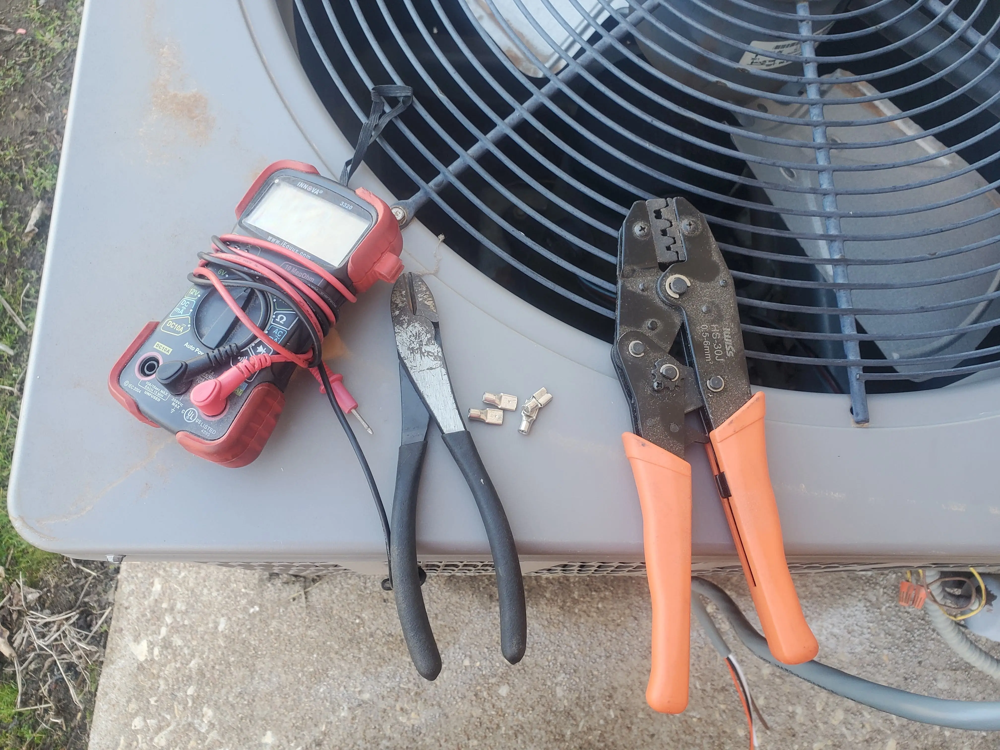

##### Hardware to mount easy-start unit.

To mount my unit, I visited my local hardware store and picked up some 1/4" nuts, bolts, washers, and lock washers. If you take this option, make sure you also have a suitable drillbit. Overall, it costed around $1.50 to buy the hardware I needed.

You can also use [1/4" stainless self-tapping screws](https://amzn.to/3YvOnCo){target=_blank}

A [Center punch](https://amzn.to/3ZooW6U){target=_blank} comes in handy for marking your holes and getting the hole started. I have had this exact one since 2018, and it still works well.
  
## Getting Started

!!! danger
    The electrical wiring inside of your A/C unit can **kill you**. Even when the power is disconnected, there can be residual energy stored in its start capacitor. This can kill you.

    If you are not qualified to work on electrical circuits, you should call a licensed electrician, or HVAC specalist to perform the installation for you.

    I am not responsible for injury, death, or loss of property which may occur. This unit works well for me, however, your results may vary.

### Step 1. Disconnect Power

Near most A/C units, there will be a box, containing either a disconnect blade, or a breaker. Remove the disconnect / shut the breaker off.

In the example of mine, you would want to flip the breaker downwards, so that it displays "Off"

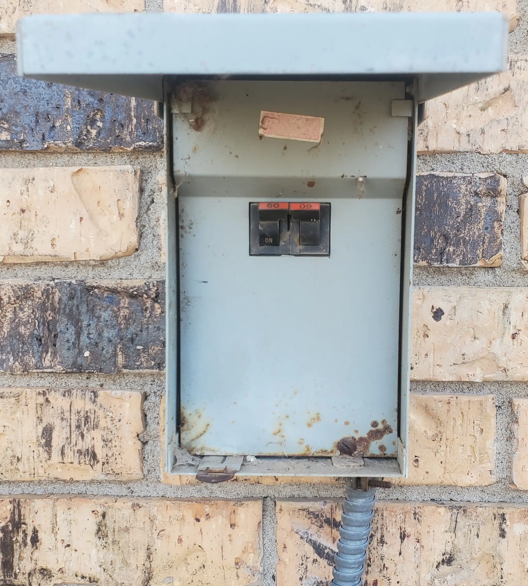

### Step 2. Remove "Access" panel / Identify suitable mounting location.

Look for where the power cables come into the A/C unit. You should see a corner/side panel which can be easily removed with a few screws. Remove it.

Next up, you will need to identify a suitable location to mount the soft-start unit.

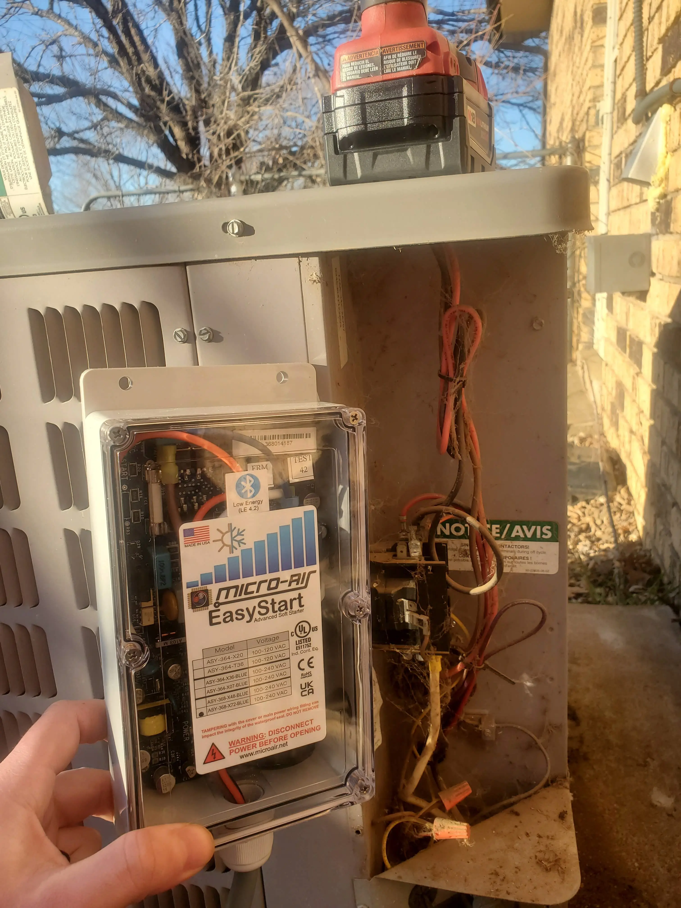

In my case, the box is larger then the available area on the inside of the access panel. Since the unit is water proof, and is rated for outdoor mounting/use, I decided to mount it directly to the access panel.

After ensuring the hardware wouldn't come into contact with any of the electronics on the other side of the panel, I used my center-punch to mark where the holes should be. Then, I drilled holes, and mounted the unit with 1/4" hardware.

Do note, I did use lock washers here. Since the A/C unit vibrates a lot, I felt these would help keep the unit secure.

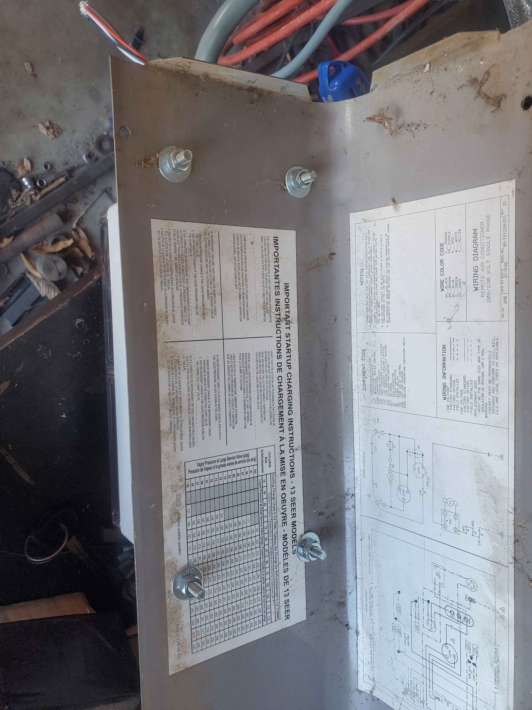

### Step 3. Clean the unit

After removing the access panel cover, My unit was a mess covered with spiders, spider webs, dust, etc.

I used my leaf blower to clean up everything a bit.

Before cleaning-

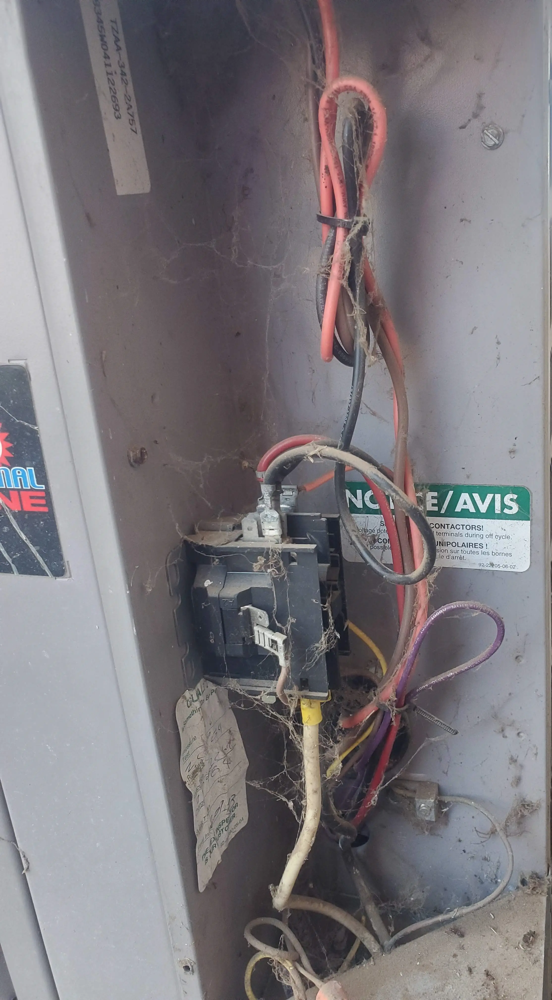

After cleaning and removing some of the wire ties.

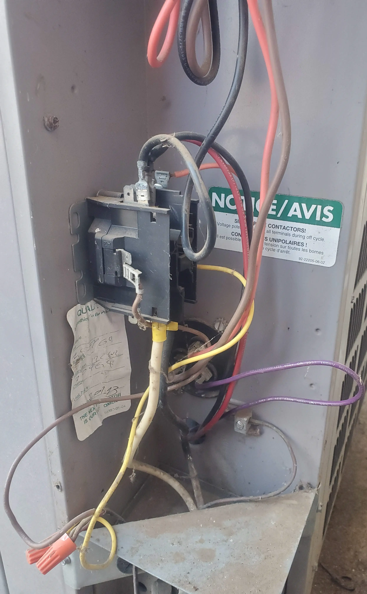

### Step 4. Wiring

The next step took the longest. You will need to double-check the wiring diagram of your unit (usually written on the cover).

So, for my unit, here is the wiring diagram:

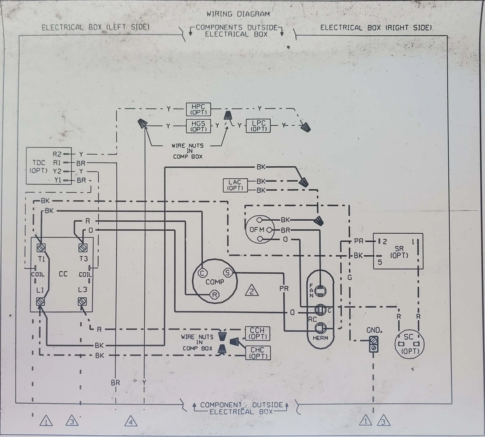

Hopefully somebody appreciates the perspective transform done here in Gimp! I am not the best photographer..

Next, we will need the [easy-air's instructions](https://www.micro-air.com/support-documents/residential/current/EasyStart_HomeResidential_Installation_Guide.pdf){target=_blank}.

Also, you might check if they have [a brand-specific installation manual for your unit](https://www.micro-air.com/kb-easystart/articles_installation/easystart_Home_Brand_Specific_Wiring_Diagrams.cfm){target=_blank}

After reading over the installation manual, here is my annotated wiring diagram.

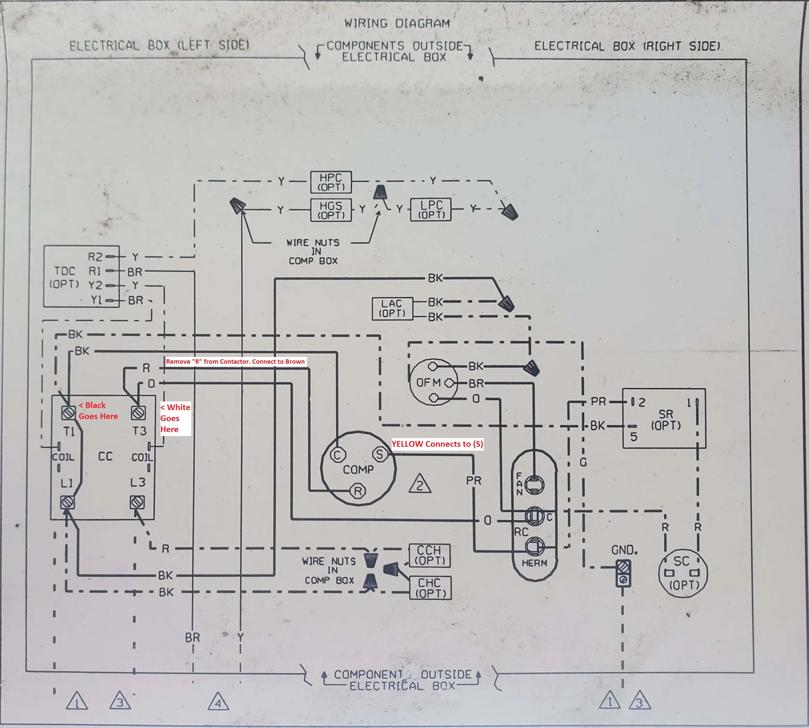

To summerize the connections-

1. Black wire connects to a spare location on the left side of the contactor.
2. Remove the "Red" wire from the right side of the contactor, going to the compressor. Then, wirenut it togather with the "Brown" wire from the soft-start. Note, Your compressor wire may not be red.
3. Connect the "White" wire from the soft-start, to the right side of the contactor.
4. The "Yellow" wire from the soft-start, will need to connect to the "HERM" terminal of your capacitor. For my unit, there was a purple wire connected to one of the spots on this terminal.

For, anyone confused as to what is what- here is a slightly annotated diagram.

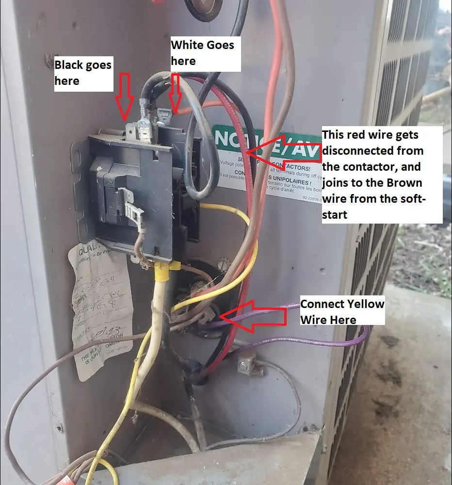

!!! warning
    If any of these steps are confusing or you are not 100% absolutely sure on what to do, you should stop what you are doing and call a licensed electrician or HVAC professional.

    Again, all of these wires can carry enough energy to kill you. If you incorrectly wire this, it can cause a fire which can damage your property.

    As well, incorrectly wiring anything can result in a 8,000$ repair bill for your now broken A/C compressor.

!!! danger
    Before touching **ANYTHING**, Make **SURE** the power is turned off to this unit.

    I used a multimeter to probe all of the terminals for residual current. The capacitor can carry current even when this unit is not powered.

    **IT CAN KILL YOU!!!!!**

Here is my install after performing the required connections

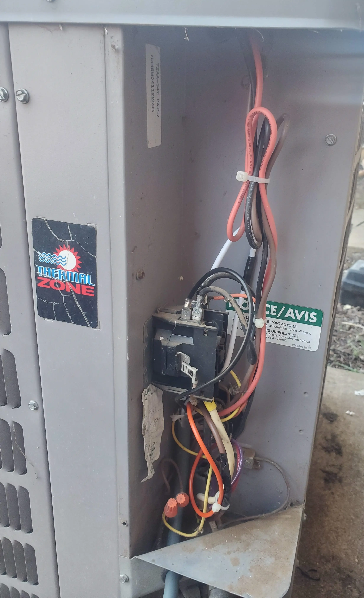

After crimping the proper spade connectors on, making the connections and ensuring everything was securely fastened, I added new zip-ties to keep all of the wires from moving around.

The last piece here, is to reinstall the cover.

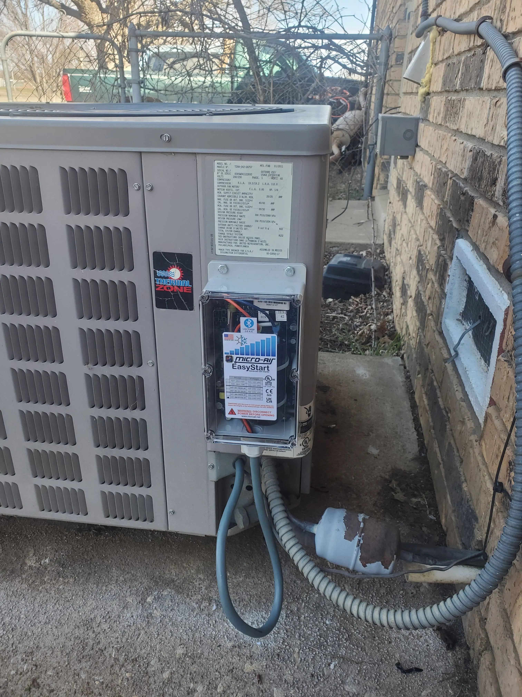

Note, I left the cable long by design. This allows the cover to still be removed, and placed on the ground.

If, this long cable bothers you, you are free to cut your cable to a shorter length.

## Testing

### Letting the unit "Learn"

My unit recommends at least 5 starts while connected to the grid for the unit to "learn".

So, over the course of a few hours, I let the unit run normally while it collected data.

Start 1:

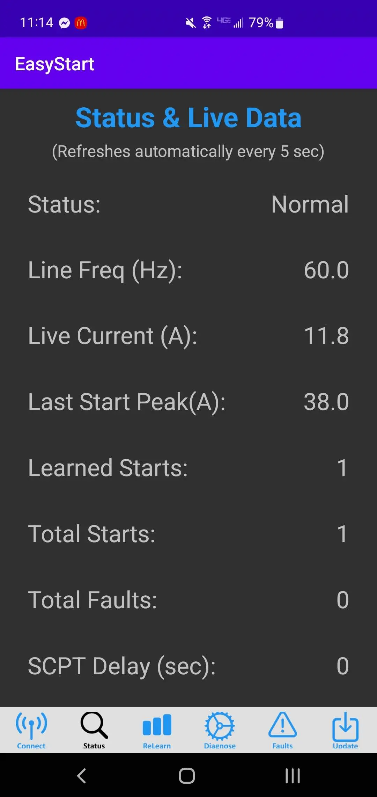

And- after letting the unit work normally for a while-

Start 7:

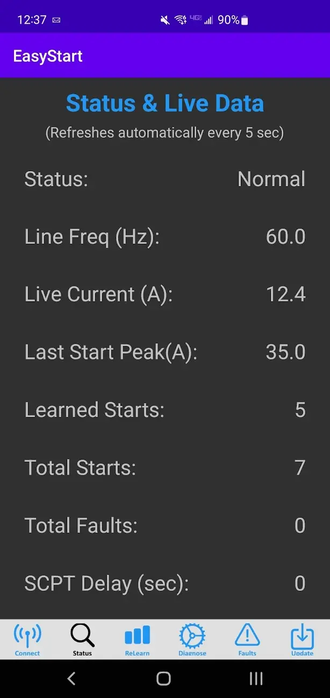

Compared to the nearly 80 amp start surge this unit was drawing before installing this unit, 35 amps is a massive improvement. 

Since- the unit has now completed its recommended learning period, lets see if it works on solar!

### Testing Off-Grid

The testing plan was pretty simple.

I flipped the grid disconnect breaker off. After doing this, my automatic transfer switch will shift all of the loads in my house to run on the inverter using a combination of battery power and solar energy.

Afterwards, I just needed to turn the A/C compressor on.

<iframe width="626" height="1112" src="https://www.youtube.com/embed/VgmHhiBG_z0" title="Starting AC Compressor on Solar" frameborder="0" allow="accelerometer; autoplay; clipboard-write; encrypted-media; gyroscope; picture-in-picture; web-share" allowfullscreen></iframe>

And- as you can see in my poorly edited video, it works!

## Conclusion?

Overall, it took me around 45 minutes to install this unit. I took my time, and triple-checked all of the connections.

The installation process was easy, and the unit worked as expected with nothing else needed.

After letting the unit "learn" 5 starts, it had no issues at all starting up the compressor off-grid.

In addition to now being able to run my A/C compressor off-grid, this unit should also extend the lifetime of my compressor's motor due to a reduction in the startup surge.