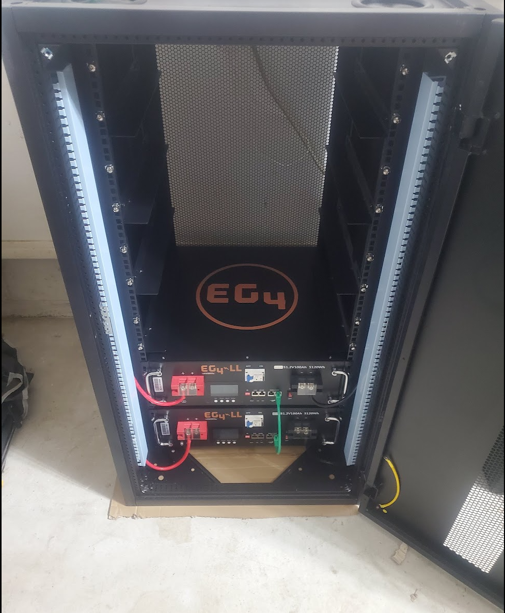
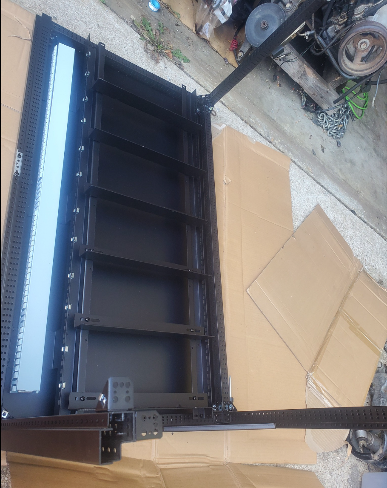
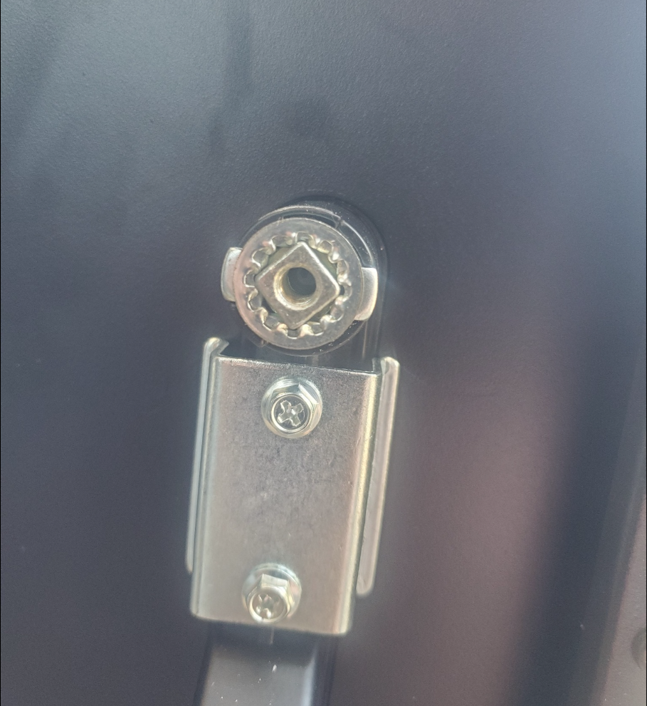
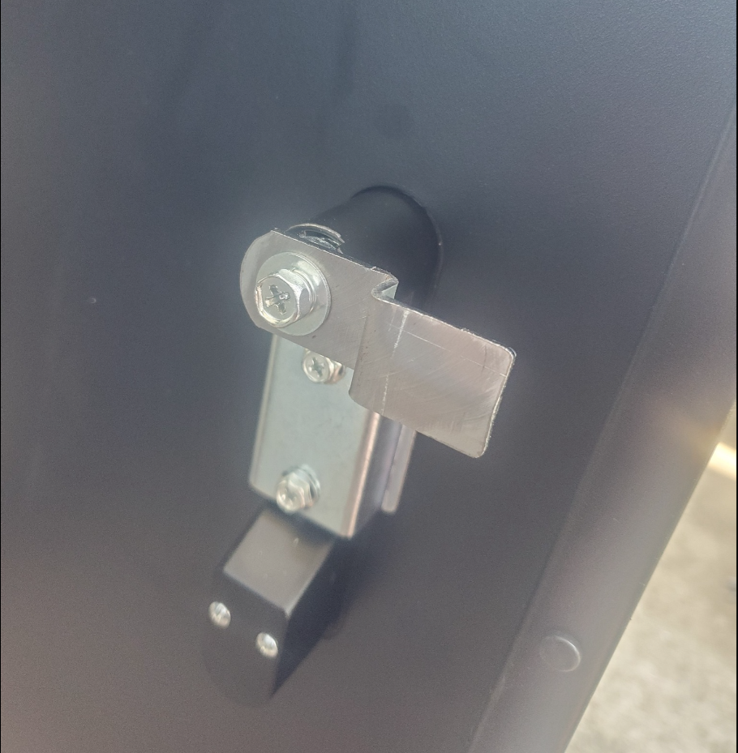
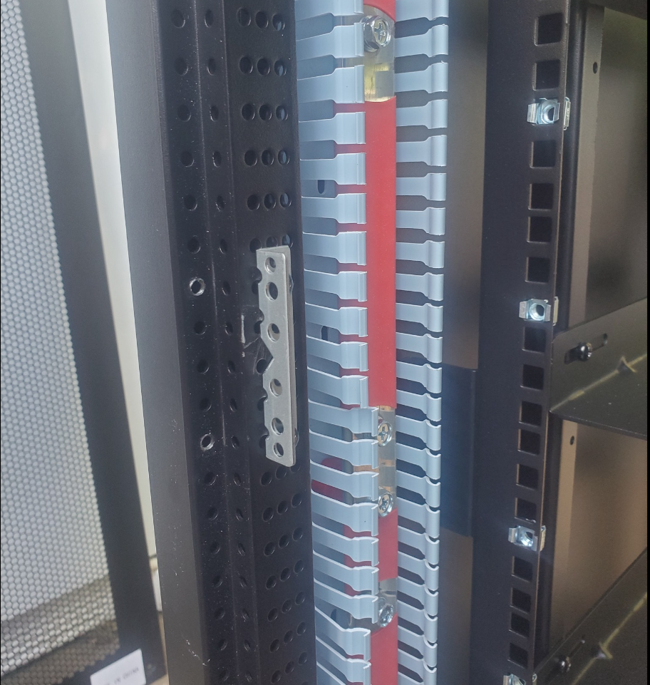
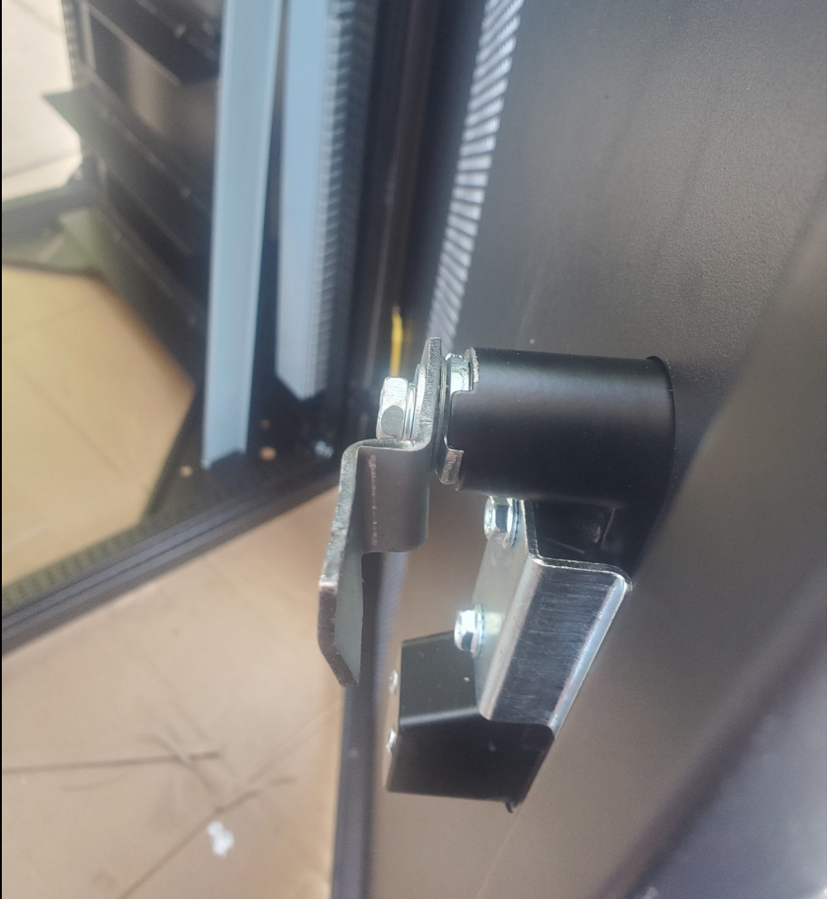
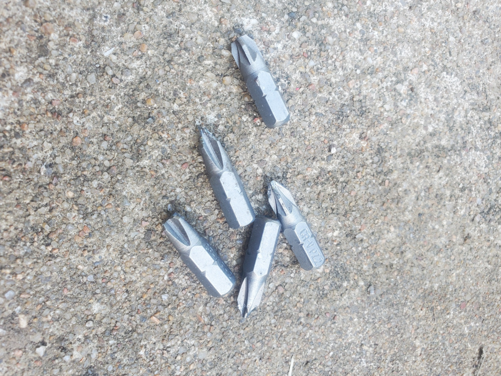

# EG4 Rack Review

As apart of the [Home Solar Project](./solar-part-1-introduction.md), I purchased and assembled an EG4 battery rack.

This post outlines the process of assembly, issues I encountered, and my final opinions.

<!-- more -->

## Overview

This rack itself, is constructed from 16ga steel, and is extremely sturdy after it is assembled. 

While, I did not take step by step pictures of assembling this rack, here is an image before the sides were bolted togather.

### Issue #1 - Door Lock/Latch Clearances

After getting the rack assembled, I noticed the door lock clearances were really bad. With the door shut, there was nearly 3/4″ of play. If you pulled the door hard enough, it would open regardless of being locked.

While, my intentions isn’t to build a perfectly secure cabinet for my batteries- I did want the door to shut nice and snug, instead of flapping around in the wind.

The first step to fixing this issue- I added an extra washer on the back of the lock. As it came, there was just a hair too much play for my taste, which makes it sound “Jingly” if you rattle the door. But- this little washer I had laying around, worked perfectly to take up the extra slop.

After adding the extra washer, this took nearly all of the slop out of the locking mechanism.

Next, I moved the “Latch”

In the below pictures, the holes on the left, are where the latch was originally mounted. After crawling in the rack from the back, I realized I could move the bracket back a bit- and still have plenty of clearances.

Because, the once very loose fit, was now an extremely tight fit, I took a pair of channel locks, and slightly bent the locking lever, so that it could more easily “catch” the “latch”

Looking in the rack from the back, You will notice- it is now an extremely tight fit, and will not rattle at all.

The extra bend, helps to ensure the lever can easily catch the backside of the latch.

Overall, this minor tweak took me 10 minutes to figure out- and removes essentially all of the “noise” from the door.

My expectations aren’t to make a perfectly secure door… but, rather, to just remove the noise from it, and to make it shut tightly.

### Issue #2 - #2 Phillips bits

If- you are like me, and you buy a bunch of cheap tools from Amazon and Harbor Freight- because you don’t want to pay the premium for a well made tool- Do yourself a favor and buy extra #2 bits.

You will need them. 🙂

I only broke 5 #2 Philips bits!

### Recommended Tools

#### A good drill

Make sure you have a good drill.

I personally use a [Milwaukee M18 Fuel 1/2″ Drill](https://amzn.to/3D07JZd){target=_blank}. I found for this- the best torque setting was “20”. Any more, and it would snap the bits in half. Any less, and the screws wouldn’t be fully tightened.

#### #2 Phillips Bits

AFTER breaking 5 of my chinesium #2 Philips bits- I went ahead and ordered a few dewalt #2 bits. I have had great luck with all of my tools and bits from Dewalt… Given, there are 25 of them, for only ~50 cents each- I imagine the quality has to be at least a step above the cheap ones I broke assembling this rack. It never hurts to have a few extra bits laying around.

* [Amazon – DeWalt #2 Phillips Bits – 25 count](https://amzn.to/3RlWHSa){target=_blank}

#### Drill bit extension

Lastly- the cheap extensions… I had a few no-name ones, which were hardly magnetic, which got sloppier for each screw I drilled. I picked up a few DeWalt replacements for 3$ each.

## Final Verdict? 4/5

The rack itself, has a heavy, sturdy construction of 16ga steel.

The instructions, are nearly non-existent for assembly though. I essentially had to figure out most of the details myself, which wasn’t too hard, given there are only so many parts included.

I did have to tweak the door mechanism to properly shut, without rattling. However, this was a pretty easy tweak.

Once the rack was assembled, the battery slid in with no issues, and very good tolerances.

Overall, I would recommend it.