# Lessons learned from a local disaster

Continuation of the [home solar project](../../../pages/Projects/Solar-Project.md). 

Around Midnight, Saturday June 17th, a very strong storm passed over my house, and hit my town and surrounding areas with a 115mph wind gust. 

Power was out for around two and a half days, in which case, I powered my house fully off-grid.

While- this doesn't sound like a huge deal- do note, I was able to maintain climate control in my home, along with my ENTIRE rack of servers.

<!-- more -->

## Responding to the Crisis

While this might not seem extraordinary, it's important to note that I managed to maintain climate control within my home and sustain the operation of an entire rack of servers throughout the power outage.

Recognizing the impending storm's severity, I proactively initiated the battery charging process about an hour before it hit. Normally, the batteries would accumulate surplus solar energy during the day and discharge only to a minimum of 50% capacity.

I adjusted the inverter settings to enable the battery charging at a full 10,000 watts from the grid, which was a significant enhancement from the previous limit of 5,000 watts.

When the grid went down during the event, my house seamlessly transitioned to battery power, demonstrating a flawless performance of the system.

## A Day-by-Day Account

### The first night

The first night, the only change I did, was to turn off the central HVAC unit (but, I left the mini-split in the bedroom running)

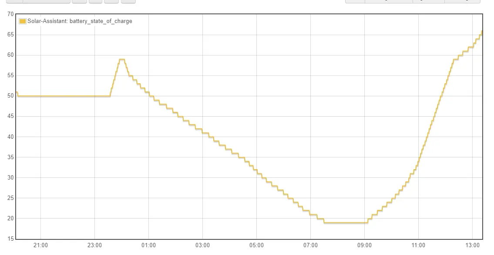

And- everything worked pretty well throughout the night. HOWEVER- I un-mistakenly had the inverter configured to completely shutoff when the battery reached 20%.

### Day 1

This led to a significant reduction in available power by around 7:20 am. Fortunately, my servers are equipped with a dedicated UPS featuring a 2.4 kWh battery capacity, enabling them to remain operational.

* Correction Applied: Lowered the low-battery shut-off to 10% capacity.

Typically, the batteries are configured to never deplete below 50% charge during standard usage. Therefore, the low-battery shut-off should ideally engage only when a complete grid failure occurs.

After taking a coffee break, my initial step was to start the generator. Since solar energy production tends to pick up between 8 am and 9 am, this move was strategic.

Although configuring the inverter to accept generator power required considerable tinkering, I eventually succeeded. Consequently, the generator began recharging the batteries.

* Correction Applied: Generator settings have been configured. However, this will become obsolete in a future step.

As the generator operated and the batteries began to replenish, the sun emerged, contributing solar energy as well.

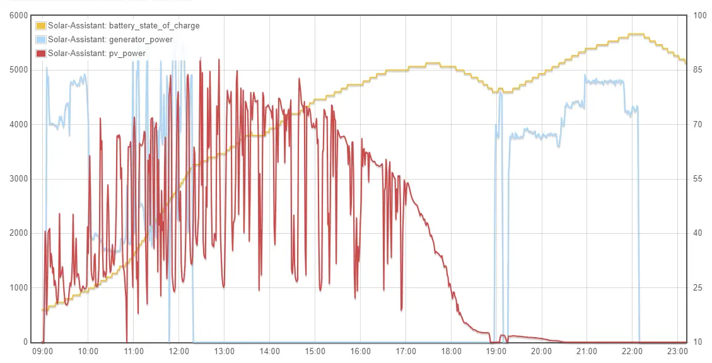

Several hours later, when the photovoltaic (PV) output had risen significantly, I deactivated the generator. This allowed solar production to take over and supply power to all the loads.

To ensure that the batteries were optimally charged for the night, I decided to run the generator again after PV production ceased in the evening. This continued until around 10 pm, effectively achieving a battery charge level of approximately 95%.

### Day 2

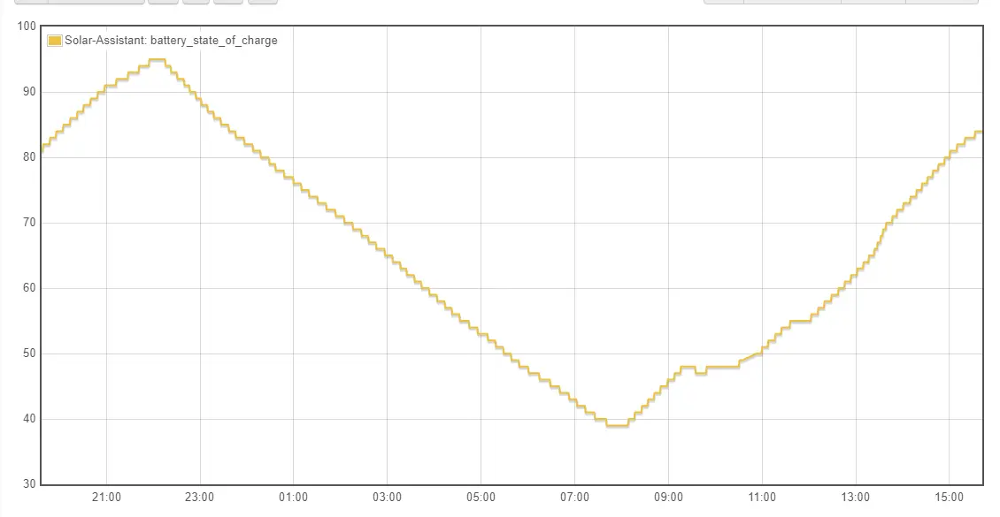

Day two was off to a much better start, since the batteries were properly charged the night before. 

However- something was different about Monday. It was going to be much hotter.

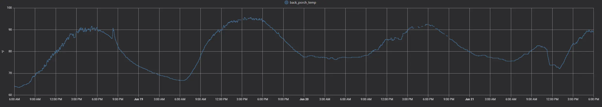

As you can see- Sunday night was night and cool, and the high temps on Sunday, were under 90 degrees. So, running a ceiling fan in the living areas was plenty to keep the temp maintainable. 

As such- I have not turned on the central AC unit at all.

But, with temps reaching nearly 100 degrees out, that would not be an option for today.

As with the previous day, I started the generator up in the morning to give a quick boost until the sun came out.

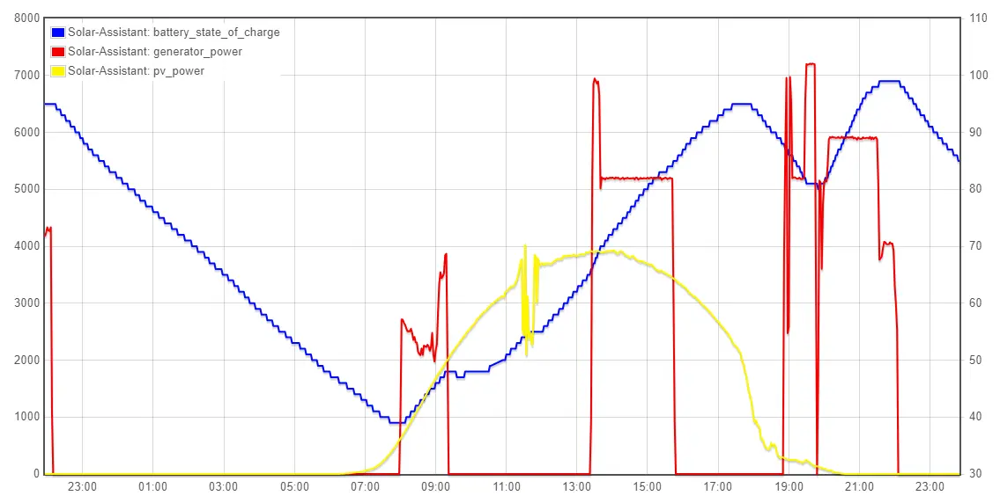

However, this time, I also fired up the generator around noon, to provide enough energy to run the central 3.5ton HVAC.

While- I can run the big AC on nothing but battery and solar, it would quickly drain my battery.

But, since the solar was producing a healthy 4kw, combined with the 5-6kw from the generator, this was plenty of capacity for running the central AC unit, while still pushing extra energy into the batteries.

Day 2 Load Consumption

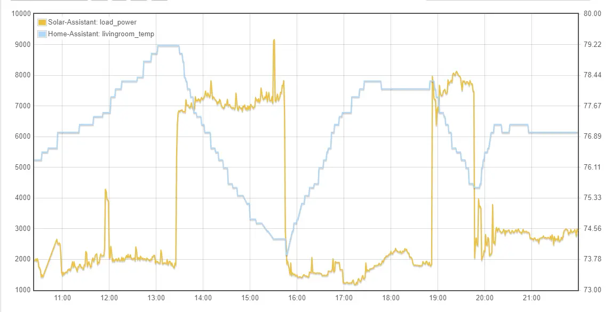

After running the unit for nearly three hours, it was able to drop the overall temps from around 80F, down to a more manageable 74F.

However, after shutting the AC off, the temp quickly snuck back up.

So- around 7PM, the generator was fired back up to both cool the house down, and to charge up the batteries.

After running the generator until a bit after 10pm, the batteries were charged up to around 95% and ready to go another day.

### Day 3

By this point, managing battery life at nighttime was not a huge deal. However- with all of the extra heat outside, the mini-split had to work harder to keep the bedrooms at a decent temp. 

As well, at this point, I had some of my neighbors loads (Fan, Fridge, etc) running off of my battery power at night. 

However- the night still ended with a reasonable amount of spare capacity. 

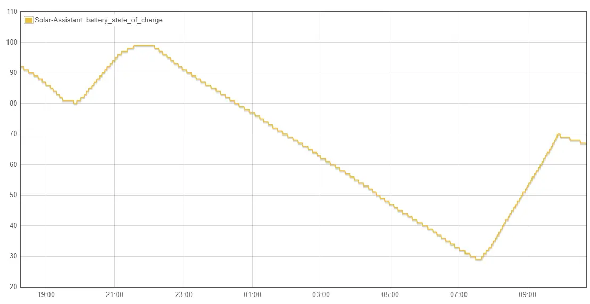

As I did on previous days- I started the day by firing up the generator to put some charge into the batteries.

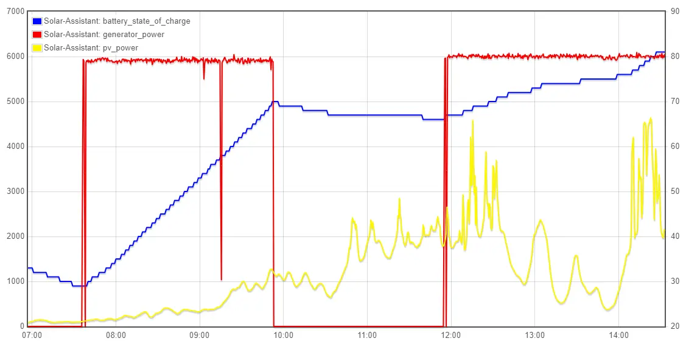

Since- today was pretty cloudy, solar production was not off to a good start. Despite the clouds, the temps were not affected at all.

So, the generator was fired up again around noon, to allow the primary AC to run.

And- around 3-ish PM, the grid was restored and I turned off the generator.

## Problems Encountered

### Generator power is VERY noisy.

This- is one of the first issues I encountered. I had to adjust the settings on my inverter to even allow it to connect to the generator, due to its noise.

I have been asked a few times- What do you mean by noise?

To demonstrate this- I will provide a few pictures.

##### Inverter Power

The first picture, is what the frequency looks like under inverter / battery power alone.

The sol-ark 12k inverter, produces a very clean sine wave. Notice- the maximum difference is 0.04hz.

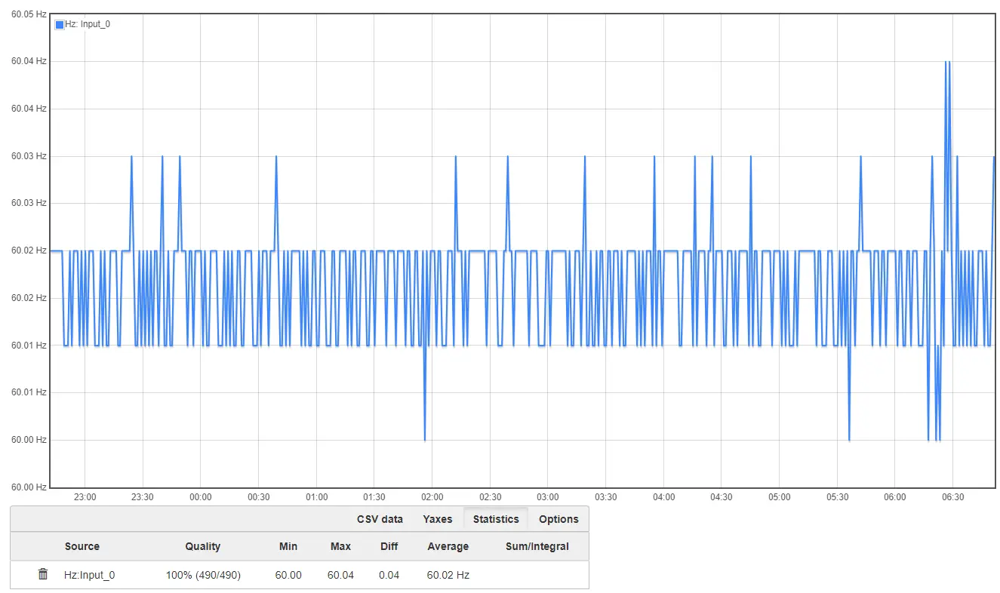

##### Grid Power

Next up, this is standard grid power.

This- is a full day worth of grid power. Notice, the maximum deviation, is only 0.10hz.

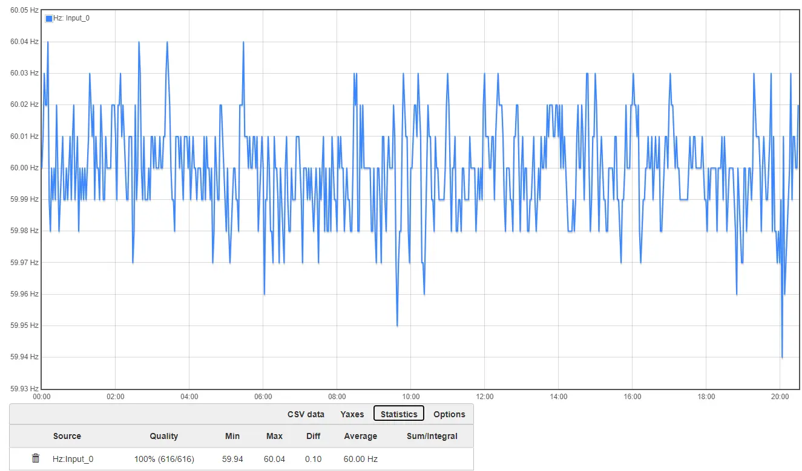

While- this looks quite noisy compared to inverter power... Just wait.

##### Generator Power

This chart starts off using inverter-only power, until around noon. After which, the generator was turned on. 

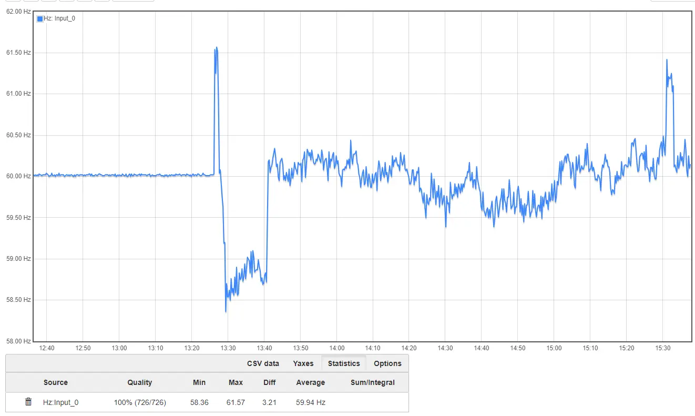

Notice- the generator's signal is extremely noisy.

Lets look at a larger picture.

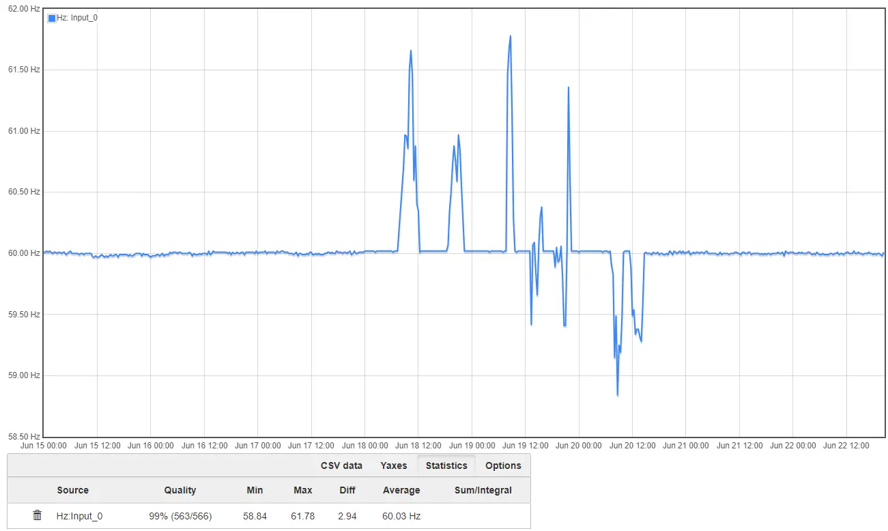

The slightly wiggly line up until the 18th, is grid power. The mostly solid flat line pieces afterwards, are inverter power.

The MASSIVE spikes everywhere, is the frequency when operating under generator power.

I did- however, manage to clean up the signal a bit by the 3rd day.

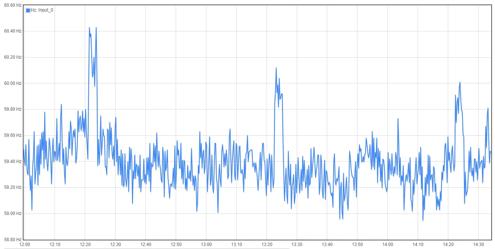

I was able to do this by placing a mostly static 6kw load on the generator. Running the generator at 5kw, placed its frequency much closer to 60hz, however, did not provide enough juice for the AC compressor.

This was managed by a few settings on my inverter.

1. A firmware update was completed. This corrected/fixed a lot of the generator related functionality. Before this update- generator peak shaving did not work correctly.
2. This allowed me to configure peak shaving for my generator input. What this means- I place a 5kw peak shaving setting. Any loads > 5kw, would instead be aggregated from battery power, allowing the generator to stay very close to 5kw.
    * While- not perfect, this did allow the frequency to remain somewhat consistent.
3. The firmware update also allowed me better control over charging the battery from the generator. This mean, when I didn't have 5kw of loads, the remaining capacity would instead be used to charge the batteries, keeping the load consistent. 

#### How to fix this / WHY is this a problem?

The generator's power quality issue stems from the fact that when the inverter receives power from the grid or generator, it doesn't convert it but directly routes it to the connected loads. This design doesn't suit smaller generators like the Harbor Freight Predator, as these inverters are generally optimized for larger generators.

To address this problem, the solution involves not sending the generator power to the inverter. Instead, a more effective approach is to convert the generator's 240V AC power into clean DC power through inversion.

A suitable solution for this scenario is offered by Signature Solar. They have a 5kW 48V charger available, which seamlessly integrates into this configuration. This charger provides the required functionality to rectify the generator power's noise issue and ensure a stable power supply.

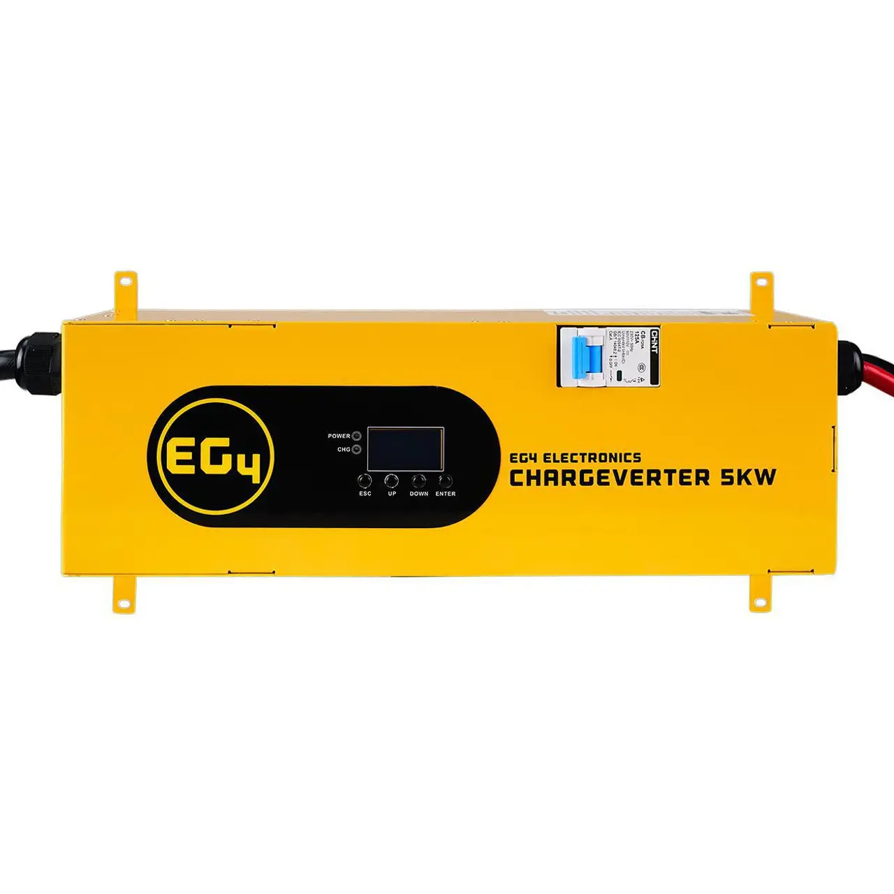

##### Upsides

1. Generator wiring and logic becomes extremely easy. If the generator is turned on, power gets automatically sent to the batteries.
2. When the generator is off, the charger becomes inactive / dormant. 
3. I can very easily fine-tune the amount of energy I wish to pull from the generator, up to 5,000 watts.
4. All of the electronics inside of the house will receive a very clean, pure sine wave, even when the generator is running.

##### The downsides

1. Slight efficiency losses from inverting the power twice. (Generator AC -> DC To Battery/Inverter -> AC to House)
2. Slightly reduced generator capacity. Going through the inverter, I can load the generator far in excess of its actual capacity. 
    * During testing while off-grid, I did manage to load the 7,200 watt rated generator at 7,000 watts for around... 30 minutes before it tripped its circuit breaker.
    * This- is not a massive disadvantage, as the generator is likely to run more efficiently at around 50-80% of its rated capacity. Running at full capacity, it was chugging fuel pretty quickly...

### Limited Battery Capacity 

With 20kwh of battery capacity- there is only so much you can run from battery.

#### Server Loads

While most households can comfortably function on 20kWh of energy throughout a day, my specific situation is unique due to the presence of a full rack of servers dedicated to hosting various services. These services include my personal website, https://lemmyonline.com/, and my NVR, among others.

Collectively, the servers in my setup consume around 400-700 watts of power, operating non-stop to provide both internal and external services. Although the option to downsize is available, such a move would unavoidably result in diminished functionality in other essential aspects.

Nonetheless, I have made improvements to the setup by ensuring that all critical operations are now handled within my Kubernetes cluster. This strategic arrangement grants me the flexibility to power down my substantial "BIG" server, which accounts for a load of 300-400 watts. The remaining servers then operate at a mere 10-20 watts each, dedicated to running the Kubernetes cluster, firewall, home automation, NVR, and more.

It's worth noting that the larger server also hosts a significant volume of content, exceeding 100 terabytes. Fortunately, this content can generally tolerate being shut down overnight without issue.

In totality, my server rack shoulders the responsibility for more than half of the off-peak power consumption.

#### HVAC Loads

Sleeping inside when its 80 degrees, also is not very pleasant. Running the mini-split consumes another 200-600watts depending on the amount of heat which needs to be removed.

#### Work

I work from home. For me to work, I need computers, and monitors working. During work hours, this consumes a healthy chunk of energy. 

#### Battery Summary

While- 20kwh of storage is not ideal in my case, it is enough to keep everything powered throughout the night. In more critical circumstances, I can now power off the big server as well to save energy. 

As such, I did not feel significant changes needed to occur here. 

### Limited PV/Solar Capacity

Presently, my roof is equipped with 5kW solar panels, theoretically capable of generating about 5kW of power. However, several factors have led to a reduction in the actual power production:

1. Cloudy and overcast skies.
2. [Smoke from wildfires in Canada](https://www.nytimes.com/interactive/2023/us/smoke-maps-canada-fires.html){target=_blank}
3. Other environmental conditions.

As a result of these influences, my solar panels were producing approximately 3kW to 4kW of power during this particular event.

Shown below is a chart detailing the production over the past week:

It's worth noting that the day following the storm, there was an unusually high spike in production. This could possibly be attributed to the storm dispersing the atmospheric smoke.

Throughout the rest of the week, production remained modest due to the factors mentioned above.

Fortunately, this level of production is sufficient to power a significant portion of my house. Essential operations like running servers, work computers, dishwashers, dryers, and washing machines can all function with this level of solar output. The main exception is the central HVAC unit, which requires more power than the available solar production can provide.

#### Significance of the Main HVAC

It's important to emphasize the significance of maintaining a functional main HVAC system. It's worth noting that my household includes not only myself but also my wife and young children.

During periods of heat advisories when the outdoor temperature exceeds 90 degrees Fahrenheit, the air conditioning (AC) becomes crucial. This is particularly true given the heat generated by the multitude of electronics necessary for my work and various projects.

The main issue arises due to the energy demands of the AC compressor itself. It draws a substantial 3.5 to 4 kW of power, with an additional 500W required to operate the furnace blower. Consequently, the overall energy consumption for running the HVAC amounts to approximately 4-5 kW.

However, the challenge lies in the fact that my solar panels generate around 3-4 kW of power. Moreover, considering the other typical daily loads of 1.2 to 2 kW, the collective energy demand surpasses the available solar power production. In total, running both the AC and other essential appliances would consume between 5 to 7 kW of energy.

Although this arrangement is feasible, it would deplete the batteries at a swift pace, a situation that isn't ideal considering their importance for nighttime power needs. Therefore, the key lies in enhancing the solar panel capacity or employing alternative power solutions to ensure the reliable operation of the main HVAC system and maintain indoor comfort for my family.

#### How to fix this?

Well- I gave my solar installer a call to inquire about adding 3kw more capacity to my roof. However, I was unsatisfied with the best offer they were able to provide me.

As such, unless I install a new array myself, I will not be expanding my PV capacity soon.

