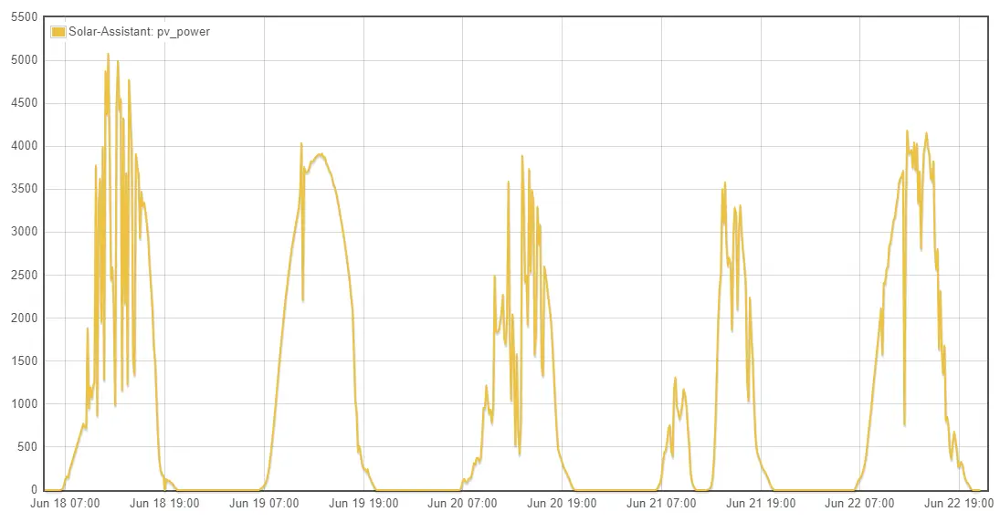

# Lessons learned from a local disaster

Continuation of the [home solar project](/pages/Projects/Solar-Project). 

Around Midnight, Saturday June 17th, a very strong storm passed over my house, and hit my town and surrounding areas with a 115mph wind gust. 

Power was out for around two and a half days, in which case, I powered my house fully off-grid.

While- this doesn't sound like a huge deal- do note, I was able to maintain climate control in my home, along with my ENTIRE rack of servers.

<!-- more -->

## What happened?

** Add content here.

The night of the event- Around an hour before, after hearing lots of the weather reports on the radio- I felt it would be smart to start charging the batteries up. 

Normally, the batteries will charge with excess solar during the day, and then release as needed (but, only down to 50%)

After setting my system to charge up the batteries- I was able to bring the state of charge from 50-60% in roughly 30 minutes. 

* Item Corrected: I have modified the inverter to charge from grid at a FULL 10,000 watts. It was previously only set to charge around 5,000 watts from the grid, maximum.

During the event, the entire grid went down, and my house instantly switched over to battery power. This worked flawlessly.

## Timeline

### The first night

The first night, the only change I did, was to turn off the central HVAC unit (but, I left the mini-split in the bedroom running)

And- everything worked pretty well throughout the night. HOWEVER- I un-mistakenly had the inverter configured to completely shutoff when the battery reached 20%.

### Day 1

This, resulted in most of the power being shutoff around 7:20am. My servers, however, have a dedicated UPS with 2.4kwh of battery capacity, and were able to continue running.

* Item Corrected: Low-battery shut-off moved down to 10% capacity.

During normal operation, the batteries will never drain below 50%. So, in theory, the low-battery shut-off should only take effect when complete loss of grid has occurred. 

After, drinking some coffee, my first action was to fire up the generator as solar production doesn't really pick up until between 8am and 9am.

It took a lot of fiddling to get the inverter properly configured to accept the generator power- but, after doing so- I was able to get the batteries charged up.

* Item Corrected: Generator settings properly configured... Although- this will become unneeded in a future step.

After the generator was running, and battery was flowing into the batteries- the sun also managed to come out and produce some solar.

After a few hours when the PV output was up quite a bit, I went ahead and turned off the generator, allowing solar production to power everything, and run the loads.

I felt it would be best to ensure the batteries were completely charged up before going to bed, So, that evening after PV production had ceased, I fired up the generator and let it run until around 10pm.

This, was enough to get around 95% state of charge.

### Day 2

Day two was off to a much better start, since the batteries were properly charged the night before. 

However- something was different about Monday. It was going to be much hotter.

As you can see- Sunday night was night and cool, and the high temps on Sunday, were under 90 degrees. So, running a ceiling fan in the living areas was plenty to keep the temp maintainable. 

As such- I have not turned on the central AC unit at all.

But, with temps reaching nearly 100 degrees out, that would not be an option for today.

As with the previous day, I started the generator up in the morning to give a quick boost until the sun came out.

However, this time, I also fired up the generator around noon, to provide enough energy to run the central 3.5ton HVAC.

While- I can run the big AC on nothing but battery and solar, it would quickly drain my battery.

But, since the solar was producing a healthy 4kw, combined with the 5-6kw from the generator, this was plenty of capacity for running the central AC unit, while still pushing extra energy into the batteries.

Day 2 Load Consumption

After running the unit for nearly three hours, it was able to drop the overall temps from around 80F, down to a more manageable 74F.

However, after shutting the AC off, the temp quickly snuck back up.

So- around 7PM, the generator was fired back up to both cool the house down, and to charge up the batteries.

After running the generator until a bit after 10pm, the batteries were charged up to around 95% and ready to go another day.

### Day 3

By this point, managing battery life at nighttime was not a huge deal. However- with all of the extra heat outside, the mini-split had to work harder to keep the bedrooms at a decent temp. 

As well, at this point, I had some of my neighbors loads (Fan, Fridge, etc) running off of my battery power at night. 

However- the night still ended with a reasonable amount of spare capacity. 

As I did on previous days- I started the day by firing up the generator to put some charge into the batteries.

Since- today was pretty cloudy, solar production was not off to a good start. Despite the clouds, the temps were not affected at all.

So, the generator was fired up again around noon, to allow the primary AC to run.

And- around 3-ish PM, the grid was restored and I turned off the generator.

## Problems Encountered

### Generator power is VERY noisy.

This- is one of the first issues I encountered. I had to adjust the settings on my inverter to even allow it to connect to the generator, due to its noise.

I have been asked a few times- What do you mean by noise?

To demonstrate this- I will provide a few pictures.

##### Inverter Power

The first picture, is what the frequency looks like under inverter / battery power alone.

The sol-ark 12k inverter, produces a very clean sine wave. Notice- the maximum difference is 0.04hz.

##### Grid Power

Next up, this is standard grid power.

This- is a full day worth of grid power. Notice, the maximum deviation, is only 0.10hz.

While- this looks quite noisy compared to inverter power... Just wait.

##### Generator Power

This chart starts off using inverter-only power, until around noon. After which, the generator was turned on. 

Notice- the generator's signal is extremely noisy.

Lets look at a larger picture.

The slightly wiggly line up until the 18th, is grid power. The mostly solid flat line pieces afterwards, are inverter power.

The MASSIVE spikes everywhere, is the frequency when operating under generator power.

I did- however, manage to clean up the signal a bit by the 3rd day.

I was able to do this by placing a mostly static 6kw load on the generator. Running the generator at 5kw, placed its frequency much closer to 60hz, however, did not provide enough juice for the AC compressor.

This was managed by a few settings on my inverter.

1. A firmware update was completed. This corrected/fixed a lot of the generator related functionality. Before this update- generator peak shaving did not work correctly.
2. This allowed me to configure peak shaving for my generator input. What this means- I place a 5kw peak shaving setting. Any loads > 5kw, would instead be aggregated from battery power, allowing the generator to stay very close to 5kw.
    * While- not perfect, this did allow the frequency to remain somewhat consistent.
3. The firmware update also allowed me better control over charging the battery from the generator. This mean, when I didn't have 5kw of loads, the remaining capacity would instead be used to charge the batteries, keeping the load consistent. 

#### How to fix this / WHY is this a problem?

The reason the generator power is noisy- When the inverter receives either grid power, or generator power, it does not invert it. 

Rather, it passes it directly through to the loads. I do believe most of these inverters are designed with a much larger generator in mind, and not a harbor freight predator.

As such, the method to fix this- is by not sending the generator power to the inverter. Rather- instead, we can invert the 240v AC from the generator, into nice, clean DC power.

Signature solar, happens to sell a 5kw 48v charger which will work perfectly in this setup.

##### Upsides

1. Generator wiring and logic becomes extremely easy. If the generator is turned on, power gets automatically sent to the batteries.
2. When the generator is off, the charger becomes inactive / dormant. 
3. I can very easily fine-tune the amount of energy I wish to pull from the generator, up to 5,000 watts.
4. All of the electronics inside of the house will receive a very clean, pure sine wave, even when the generator is running.

##### The downsides

1. Slight efficiency losses from inverting the power twice.
2. Slightly reduced generator capacity. Going through the inverter, I can load the generator far in excess of its actual capacity. 
    * During testing while off-grid, I did manage to load the 7,200 watt rated generator at 7,000 watts for around... 30 minutes before it tripped its circuit breaker.
    * This- is not a massive disadvantage, as the generator is likely to run more efficiently at around 50-80% of its rated capacity. Running at full capacity, it was chugging fuel pretty quickly...

### Limited Battery Capacity 

With 20kwh of battery capacity- there is only so much you can run from battery.

#### Server Loads

While- most households could actually go most of a day on 20kwh with ease- in my particular case- I have a rack full of servers hosting things.

Things like this website. Things like https://lemmyonline.com/, My NVR... etc. 

All together, I have around 400-700 watts of energy, running 24/7 providing services both internally, and externally.

While downsizing is an option, it cannot be done without loss of functionality in other areas.

However, one area I have improved on after the fact, is ensuring all critical loads are running in my kubernetes cluster.

This, allows me the flexibility to shutting down my "BIG" server (which is responsible for 300-400w of overall load). The remaining servers will only sip around 10w-20w each to run my kubernetes cluster, firewall, home automation, NVR, etc.

Although- my big server, also hosts over 100 terabytes worth of content. But, this content will generally be OK, shut-down overnight.

Altogether, my server rack is responsible for over half of the off-peak power load.  

#### HVAC Loads

Sleeping inside when its 80 degrees, also is not very pleasant. Running the mini-split consumes another 200-600watts depending on the amount of heat which needs to be removed.

#### Work

I work from home. For me to work, I need computers, and monitors working. During work hours, this consumes a healthy chunk of energy. 

#### Battery Summary

While- 20kwh of storage is not ideal in my case, it is enough to keep everything powered throughout the night. In more critical circumstances, I can now power off the big server as well to save energy. 

As such, I did not feel significant changes needed to occur here. 

### Limited PV/Solar Capacity

I currently have 5kw of panels installed on my roof, which theoretically, will produce, around 5kw. 

However, a few factors are driving this production down.

1. Clouds / Overcast skys
2. [Smoke in the atmosphere from the fires in Canada](https://www.nytimes.com/interactive/2023/us/smoke-maps-canada-fires.html){target=_blank}
3. etc.

So, during this event, my panels were generally producing around 3kw to 4kw.

Here- is a chart of my last weeks worth of production:

Do note- on the day after the storm, production was abnormally high. Perhaps- the storms blew away smoke in the atmosphere? 

The rest of the time, production was rather lackluster due to the above potential causes.

For running 99% of the house, this is plenty of production.

I could run the servers, my computers for work. The dishwasher/dryer/washing machine could run. 

Everything, except the main HVAC.

#### Why was the main HVAC important?

Do note, I am not a single person living in a basement.

I have a wife, and young children. 

When, there is a heat-advisory outside, and its 90+ degrees out- the AC is needed. Especially, when you consider the amount of heat being produced by all of the electronics required for my occupation, and other projects.

The reason the main HVAC is an issue- the AC Compressor itself, draws around 3.5 - 4kw of energy, along with another 500w to run the furnace blower. This equals around 4-5kw total energy to run the HVAC.

This is a problem, because I am only producing 3-4kw of solar power. (Don't forget the other 1.2kw to 2kw of loads during the day!) Running the AC along with the other normal loads would consume around 5-7kw of total energy.

Again- this can run, however, it would suck the batteries down pretty quickly.... and I need those for nighttime!

#### How to fix this?

Well- I gave my solar installer a call to inquire about adding 3kw more capacity to my roof. However, I was unsatisfied with the best offer they were able to provide me.

As such, unless I install a new array myself, I will not be expanding my PV capacity soon.

