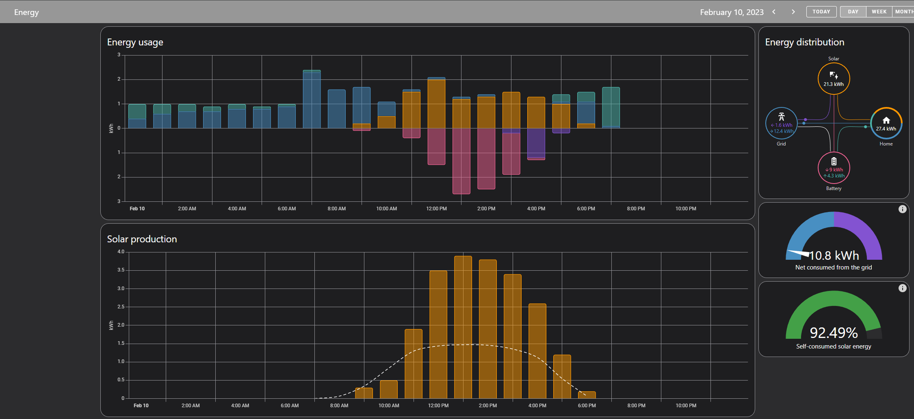
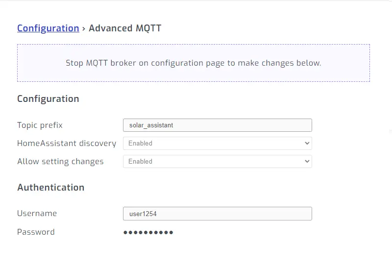
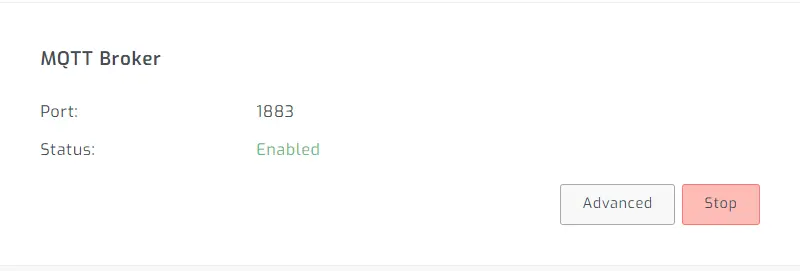
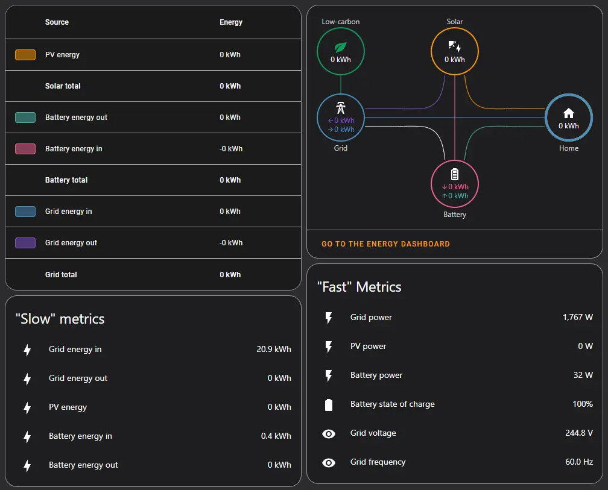
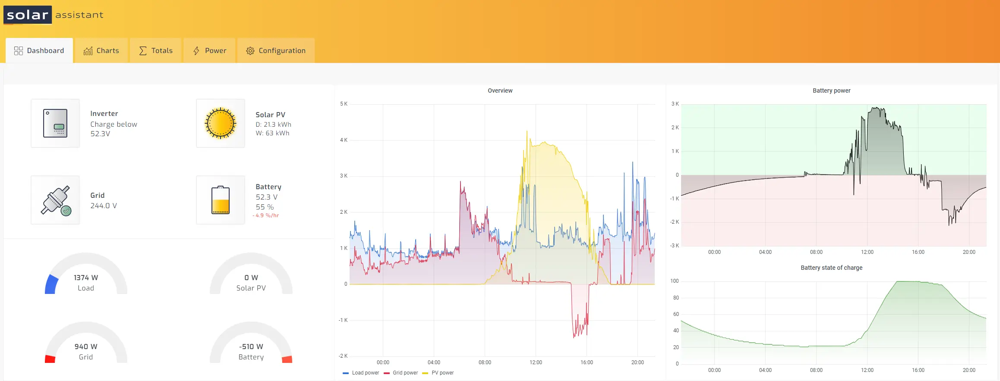

# Installing Solar-Assistant

Per my [home solar project](../../../pages/Projects/Solar-Project.md), I needed a method to collect data from both my batteries and inverters, in near-real-time, with no dependency on the internet.

Since, my inverter's connection relies on cloud applications to move data around, I decided to give [Solar Assistant](https://solar-assistant.io/){target=_blank} a try after reading of its support for the solark-12k.

Finished Energy Dashboard:


<!-- more -->

## Required Hardware

For the required hardware, you can either acquire it from [Solar-Assistant's Shop](https://solar-assistant.io/shop){target=_blank}, or, you can acquire it via Amazon.

I elected to go with Amazon, since the solar-assistant.io store claims to ship from South Africa. I didn't really want to wait a few weeks.

### Product Links Used Here

This is the exact hardware I decided to use after reviewing solar-assistant's supported hardware:

1. [Orange Pi 3 LTS](https://amzn.to/3ZYwOfR){target=_blank}
2. [Generic USB RS485 Adapter](https://amzn.to/3R17W3a){target=_blank}
    * Note- I orignally had [this unit](https://amzn.to/3J8GtdW){target=_blank}, however, during troubleshooting steps, I replaced it with another adapter.
    * I personally prefer the first one with the blinking tx/rx lights. It assisted with debugging. Also- the case on the bottom adapter started to fall apart. 
3. [Samsung MicroSD](https://amzn.to/3R0Ejil){target=_blank}
    * Note, You really only need a 16G MicroSD card. I just happened to have a pile of 256G ones laying around. So- if you want to save a few bucks, you can get a smaller one.
    * A 64G card will never run out of room for this use-case.
4. [Ethernet Splitter](https://amzn.to/3XyQzZQ){target=_blank}
    * If... your inverter is reading the status of your battery, this will allow you to "split" the serial connection and allow solar-assistant to read your inverter, while your inverter reads your battery.
    * If, you don't plan on using your inverter to read the serial data from your battery, you can skip this item. In my case, my inverter does not have support for reading [my battery](./solar-part-2-batteries.md){target=_blank}.
    * As such- this won't be of much use to me.
5. [Solar-Assistant License](https://solar-assistant.io/shop/products/software){target=_blank}


## Install / Configuring Solar-Assistant with Solark-12k Outdoor

### Sol-ark configuration.

IF, you happen to have a solark-12k outdoor model- reading these two line items will save you potentially weeks of troubleshooting.

1. Set Battery BMS mode to "00"
2. Under Parallel Options, set the modbus ID to "1", it defaults to "0"
    * If you forget this, you will receive a lot of CRC Errors.... and- its not going to work.
3. Plug your cable into the BATTERY MONITORING port. The "modbus" port is... not enabled, unless you have a different firmware which enables it.

Thats it! (It took me quite a while to get those settings correct...)

Here is a very helpful page I found in the manual, after digging for a while:


If, you are unsure of which port to plug your cable into, here is a picture.


### Serial Wiring

The plug on the solark uses typical RJ45/Ethernet wiring. Of the 8 wires in the cable, you can use either Orange+OrangeStripe, or Brown+BrownStripe. Both pairs are essentially the same. As well, green+greenStripe are both ground.

Blue / Blue Stripe are both CAN bus.

1. Solid Orange goes to "A+" pin.
2. Striped Orange goes to "B-" pin.
3. Solid Green goes to GND pin.

## Home-Assistant Integration

We will integrate solar-assistant to home-assistant using MQTT as the medium. It supports publishing its data to its local MQTT server, seamlessly.

### Step 1. Enable MQTT.

Under the configuration tab of your solar-assistant, at the bottom, you will find the MQTT options.

Click "ADVANCED" to open up the settings.



Set a topic prefix, ensure home-assistant discovery is enabled. And optionally decide if you want to allow changing settings via MQTT/Home-Assistant.

I went ahead and generated a random username and password combination.

After that is done, from the main configuration page, enable/start the MQTT service.



At this point, solar-assistant will be running ITS OWN EMBEDDED mqtt server.

The next step- is to get data from its MQTT server, into our mqtt server.

### Step 2. Setup MQTT Broker

IF, you are using home-assistant's embedded MQTT server, I recommend using [Solar-Assistant's Home-Assistant MQTT Broker Setup Guide](https://solar-assistant.io/help/home-assistant/broker-setup){target=_blank}

The directions I am going to provide, are specific to running Mosquitto MQTT via Kubernetes.

#### Kubernetes Configuration

First of all, lets create a configmap containing the various configuration files we need to expose to mosquitto MQTT.

``` yaml title="mqtt_configs.yaml"
kind: ConfigMap
metadata:
  name: mqtt-configs
  namespace: home-automation
apiVersion: v1
data:
  solar_assistant.conf: >
    connection SolarAssistant

    remote_username your_user_goes_here

    remote_password your_password_goes_here

    address 10.1.2.3 <-- Put the IP of your solar-assistant here.

    topic # in

    topic solar_assistant/# out    
  mosquitto.conf: >
    persistence true

    persistence_location /mosquitto/data/

    include_dir /mosquitto/config/conf.d

    listener 1883 0.0.0.0

    password_file /etc/mosquitto/password_file
  password_file: >
    ## Contents Obmitted.
```

In the above configuration, the secret needed is the `solar_assistant.conf` file. It contains the configuration needed to broker messages from the solar-assistant mqtt server, to this local mqtt server.

If- you don't know how to configure a password file, please see [The Official Documentation](https://mosquitto.org/documentation/authentication-methods/){target=_blank}

For obvious security purposes, the contents of my file will not be included here.

Next up, you will optionally need persistent storage. If you do not want/need persistent storage, update the mosquitto.conf file above, set `persistence false` and remove the `persistence_location`

``` yaml title="mqtt_data.yaml"

apiVersion: v1
kind: PersistentVolumeClaim
metadata:
  name: mqtt-data
  namespace: home-automation
spec:
  storageClassName: longhorn
  accessModes:
    - ReadWriteOnce
  resources:
    requests:
      storage: 2Gi
```

2G is likely overkill for this need. Adjust as you please.

Finally, here is the stateful set manifest

``` yaml title="mqtt.yaml"
apiVersion: apps/v1
kind: StatefulSet
metadata:
  labels:
    app: mqtt
  name: mqtt
spec:
  replicas: 1
  serviceName: mqtt
  selector:
    matchLabels:
      app: mqtt
  template:
    metadata:
      labels:
        app: mqtt
    spec:
      volumes:
        - name: data
          persistentVolumeClaim:
            claimName: mqtt-data
        - name: config
          configMap:
            name: mqtt-configs
            defaultMode: 420
      containers:
        - name: mqtt
          image: eclipse-mosquitto:latest
          volumeMounts:
          - name: data
            mountPath: "/mosquitto/data"
          - name: config
            mountPath: "/mosquitto/config/mosquitto.conf"
            subPath: mosquitto.conf
          - name: config
            mountPath: "/mosquitto/config/conf.d/solar-assistant.conf"
            subPath: solar_assistant.conf
          - name: config
            mountPath: "/etc/mosquitto/password_file"
            subPath: password_file            
          ports:
          - name: mqtt
            containerPort: 1883
          - name: websocket
            containerPort: 9001
---

apiVersion: v1
kind: Service
metadata:
  name: mqtt
spec:
  selector:
    app: mqtt
  ports:
    - name: mqtt  
      port: 1883         
      protocol: TCP    
      targetPort: mqtt
    - name: websocket  
      port: 9001         
      protocol: TCP    
      targetPort: websocket
  type: LoadBalancer
  loadBalancerIP: 10.140.5.6 ##Set your own exposed IP here. Or, change to nodeport. or- however you wish to expose MQTT.
```

At this point, you should have all of the pieces required to configure this within Kubernetes.

To note- this was not intended to be the end-all guide on how to configure MQTT in kubernetes. Just- enough information for you to update your MQTT instance to work.

### Step 3. Update Home-Assistant MQTT Integration

From home-assistant, goto settings -> integrations.

Assuming, you already have a MQTT integration configured, click on your existing integration and click configure.

Then, at the top, click `RE-CONFIGURE MQTT`.

Click Next.

Make sure the checkbox to `Enable Discovery` is checked. Submit the changes, if any.

### Step 4. Wait, and Confirm

Wait a bit, and home-assistant should automatically discover all of the sensors, switches, etc from solar-assistant.

## Configure Energy Dashboard

For this piece, I followed the [Directions from Solar-Assistant](https://solar-assistant.io/help/home-assistant/energy){target=_blank}

After following the directions, you should end up with something like this:


Now- before you get excited to go and see your fancy energy dashboard.... You need to wait. It will take an hour or two before home-assistant starts displaying data on its energy dashboard.

While you are waiting, feel free to build out a few real-time dashboards.



In the above dashboard, you can see the energy dashboard panels still shows no data at all. (Even an hour later!)

On the bottom, I setup two sections. "Fast" metrics, and "Slow" metrics.

The kWh metrics are pretty slow to update. Since, the energy usage dashboards are also pretty slow to update, this is not an issue.

The "fast" metrics, have update intervals in the seconds. If you wish to build a real-time dashboard, use these!

After, waiting an hour or two- you should be presented with a working energy dashboard.


Here is a screenshot of solar-assistant's home page

