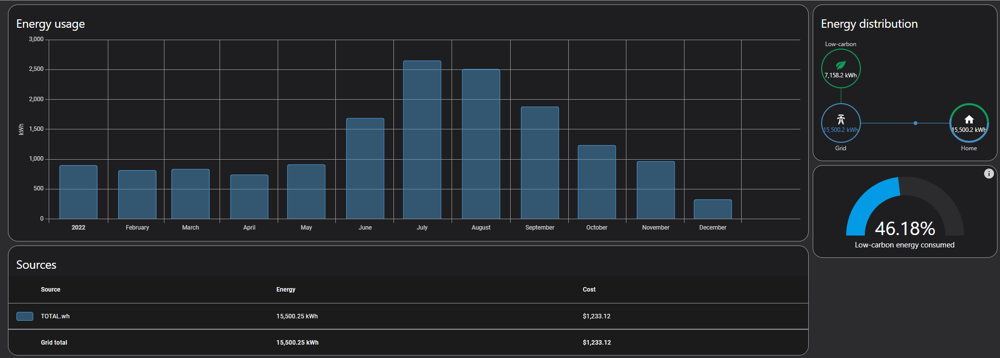

# Home Solar Project - Introduction

One of my projects I have been working on over the last two years, is adding solar panels to my house to offset some/most of my electrical usage.

Here are the goals I wish to accomplish, and how I plan on accomplishing them:

<!-- more -->

1. Reduce my electricity bill by 75-100%.
2. I want my electric to work when the main grid goes down (happens… pretty frequently.)
    * For my servers, computers, and networking devices- Failover needs to happen in UNDER 5ms.

## Goals

### Goal 1 - Reducing Energy Bill

Last year, I installed an Iotawatt, to start tracking my energy utilization. It has done a fantastic job, and gives me very good data, which also integrates extremely well into home assistant.

If, you don’t have a solution for tracking your energy, and would like options, Please see [Home Assistant – Energy Monitoring Options.](./../../Home-Automation/2022-11/home-assistant-energy-monitoring.md/)

Looking at this year's[^1] worth of utilization-

[^1]: Note, image captured on 2022-12-10, As such, month of december is not yet completed.

As can see, I average around 1Mwh of utilization for most months, which shoots up to 2-3mwh during the hot summer months. As well, This year, we had outside temps > 105F for over a month straight. It.. was a pretty hot year.

Knock on wood, the [minisplit I installed earlier](https://xtremeownage.com/2022/03/27/pioneer-mini-split-home-assistant/){target=_blank} this year, drastically reduced the amount of cooling I needed for my house. Without it- my bills would have been **MUCH** higher.

That being said, lets figure 1,500Kwh as the average usage per month. This equals…

1,500 * 0.08c = 120$ of electricity.

So, the first thing to do, is calculate the “Solar hours per day”, using a tool such as THIS. For my location, this gives me around 5.31 peak hours per day average for the entire year.

Figuring, 5kw worth of installed panels-

5kw * 5.31 peak hours = 26.55kwh average daily production.

Skipping back to above, our average usage per month was 1,500kwh.

1,500kwh / 30 days = 50kwh daily utilization.

Based on reviewing the last years worth of data, this should be enough capacity to offset nearly everything during non-peak cooling months. During peak cooling months (June, July, Aug), I usage between 80-120Kwh per day.

However, I also will receive around 7 hours of peak sunlight per day during those months, but, I will still come up pretty short here. But- I have a plan for this…

#### Improved Insulation

Since, my house was built in the 1970s, its insulation is not the best in the world. Its cellulose is old, and packed down, and likely is not working as good as it should.

As apart of this project, I will be reinsulating the attic from its…. current 6 inches, up to a foot and a half. This should drastically reduce the amount of heating AND cooling required for my house.

My homes, during the peak cooling months, this should hopefully reduce the amount of energy required by 20-40%.

### Goal 2 - Improved self-reliance / Off-grid backup

For most people, this really wouldn’t be an issue. However, I work out of my house. I host many public projects out of my house (This website being one of them.).

Me being able to power on my computer, and work, is what keeps my bills paid. If I don’t have electricity, I can’t work.

As such, one of the goals I want to accomplish here- is being able to keep my house “online” when the grid drops.

NORMALLY, people don’t have too many issues with the grid dropping. However, where I live- this is a bigger issue then I would like to admit. We have lots of small 1-2 hour outages throughout the year. As such, I would like to be able to power my house on battery for around one hour, before I have to pull out my generator.

Also- while I do have a generator, and can power my house from it- it is not ideal… as it takes a bit of time to pull it out, get it set up, etc…. and its pretty noisy. My end goal, is to only have to fire it up, for outages longer then a few hours. To reach this goal, I will be starting with 5Kwh total battery storage. This should give plenty of buffer. 

During peak cooling months, this gives enough time to pull out the generator and start it. (My A/C generally draws around 6+ kw)

During non-peak cooling months, this should give me 5-20 hours of total runtime, depending on what all loads are engaged. (Obviously, running the dryer wouldn’t be a good idea while running on battery).

#### The Plan

A pretty simple solution was found for providing `always-on` capabilities for my computers. A `critical loads` panel will be leveraged, connected directly to the inverter. During power-drops or outages, the specific inverter I will be using is capable of switching from grid, to battery power in under 6ms.

For the rest of the house, the main panel will be located behind an automation transfer switch. This switch, should be able to switch the mains panel from grid, to battery power in under 500 milliseconds.

For starting out, I will be leveraging only 5.12kwh worth of LiFePO4 batteries. While- this is not enough capacity for long-term battery backup of my house- this gives me between 1-3 hours in order to turn on the generator, which will be connected to the inverter in order to charge the batteries, and carry the load.