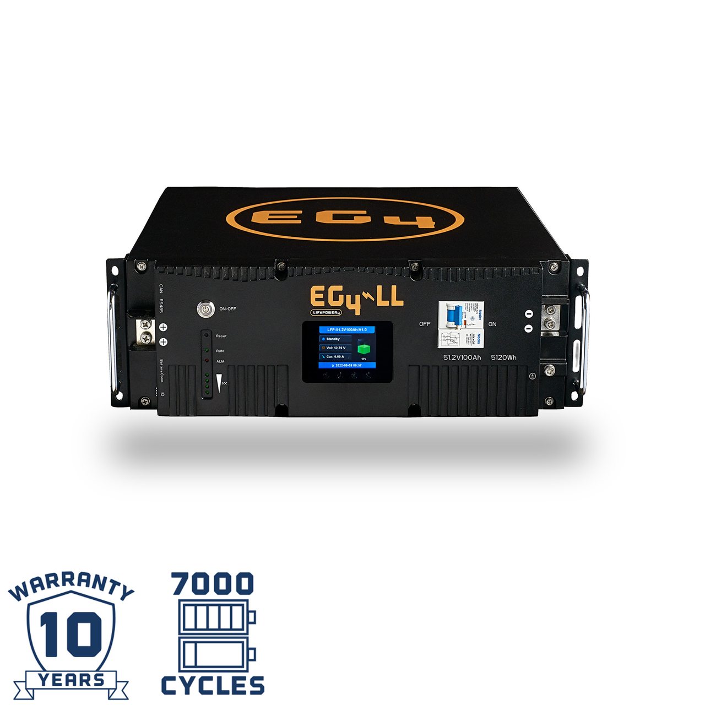
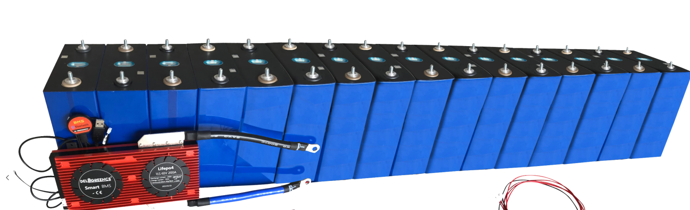

# Home Solar Project - Battery Selection

For the second part of my [Home Solar Project](./solar-part-1-introduction.md), I researched possible solutions and ordered batteries.

This post, describes some of the decision making process I went through.

<!-- more -->

## Options evaluated

I evaluated most of the commonly available options. For most of these options, I did include a video review, if you are interested.

### Ampere Time 48v 100ah battery - 5.12Kwh

#### 351$ / kwh

* [Purchase on Amazon](https://amzn.to/3AKOD6u){target=_blank}
* [Will Prowse Review (YouTube)](https://www.youtube.com/watch?v=FQUhjDkQY5Q){target=_blank}

Last year, I actually put together a [portable power supply / UPS](https://xtremeownage.com/2021/06/12/portable-2-4kwh-power-supply-ups/){target=_blank} for my servers using this battery. I have no issues or complaints- it works exactly as expected. It has great capacity, for a pretty good price.

This is a pretty cost-effective option, given the capacity.

I will note- Chins batteries are basically identical.

### EG4-LL 48v

#### 341$ / kwh

* [Purchase at Signature Solar](https://signaturesolar.com/eg4-ll-lithium-battery-48v-100ahd){target=_blank}
* [Will Prowse Review (YouTube) (OLDER Version)](https://www.youtube.com/watch?v=wMJbbXPD0JA){target=_blank}

The EG4-LL batteries are 48v rack-mountable batteries, with a total of 5.12kwh per battery. The form factor leads to being able to put together a quite dense storage solution, which doesn’t require nearly as much footprint as opposed to using the above batteries.

One of the features which really sold me on these batteries- They offer multiple solutions for communication. You can chain the batteries communication ports together, which can be connected to your inverter, allowing all of the components to talk together.

As well, the batteries include a LCD panel, which displays lots of useful information such as individual cell voltages, temps, etc. There is also LEDs to display the current battery state of charge.

The price here, works out to 341$ per Kwh of storage. While, this is more than the above Ampere Time battery- this battery has MANY more usable features.

I will note, these batteries are the same as Gyll.

I also have a post on [Assembling the EG4 Rack](./eg4-rack-assembly.md){target=_blank}

### DIY / Build your own

#### 120-200$ / kwh

Building your own battery packs is a topic I see very frequently…. and, for good reason.

Why? Because you can generally build a complete system for FAR cheaper then you would otherwise be able to do.

If, you were to want to take this route, the cells are generally 3.2 volts each. I would recommend building 48v cell packs to reduce the amount of copper required to connect everything together, and to improve the overall efficiency. (48v inverters are generally smaller and cheaper as opposed to 12v).

So, 48/3.2 = 16 cells needed in series to hit 48v. = 51.2v maximum.

For around 3,500$, I found a random seller on aliexpress, selling 32 * 280ah cells. This would be good enough to put two strings in parallel, for a total of…

51.2v * 280 ah * 2 sets = 28.672 kwh of capacity, for 3,500$.

Your total cost here, would be around 122$ per kwh, which is under half of the above solutions.

BUT, there are a few more things to factor in.

You would need… a good BMS, bus bars, and a mounting solution.

You also have to wait months for a boat to arrive from china, you have to HOPE all of your cells arrived un-damaged, and unbloated…. and, overall, you have to accept the risk.

In the event you do received damaged cells, getting replacements or refunds may be a huge ordeal. Having to ship cells back to China, generally means…. its cheaper to just accept the loss.

In addition to the above risks- you will also be paying between 100$ -> 500$ for a good BMS solution.

* [Will Prowse Assembling Bank(YouTube)](https://www.youtube.com/watch?v=atYZ4RtUJhU){target=_blank}
* [More Will Prowse](https://www.youtube.com/watch?v=vSYoai8BhIE){target=_blank}
* [Will Prowse - Why people aren't buying raw cells](https://www.youtube.com/watch?v=ICPDTq-ePP4&feature=emb_title){target=_blank}

## Other Options

### Battle-Born

* [Buy at Battleborn](https://battlebornbatteries.com/product-category/all-batteries/lifepo4-batteries/){target=_blank}
* [Teardown - Will Prowse](https://www.youtube.com/watch?v=G5E30u-66VI){target=_blank}

I really have never heard anything negative regarding the quality of capabilities of battle born. If you are adding solar to an RV, these are likely one of your best choices due to the inclusion of heating elements in the batteries. However- for the bulk-capacity needed for a home- This solution isn’t very cost-effective.

The 12v heated cells, are… around 790$ / kwh, which is around double of some of the other options.

### Victron

Like battleborn- Victron produces high quality components. Also- like battle born, these components have a premium price tag.

Having used Victron components in my previous Portable Power Supply / UPS, the Victron components were extremely flexible, and easy to use. They also integrated extremely well with other systems.

But- for the bulk storage needs of my house- I cannot afford the price premium here. If price was not a factor, I would likely opt for Victron, due to all of its potential integrations.

### Storz

#### 1,500 – 2,000$ / Kwh ESTIMATED

So, originally when I reached out to my solar installer, Their recommended battery was the Storz 10kwh.

While, I have not heard anything negative around these batteries…. and they do have a great warranty (15 years), I felt they were a bit pricy.

While, I cannot find any publicly available information, and I was unable to get the exact price of this solution, I estimate their 10kwh solution would cost between 15-20,000$.

I don’t know how much was parts / labor / etc., so, this is just a ballpark estimate…

### Tesla Powerwall

#### 851$ / kwh

The Tesla Solarwall, has 13.5 kWh of capacity, and costs around 11,500$.

This option has fancy apps you can look at on your phone to see its performance. While, this option has a few fancy features- I don’t like the idea of the battery / inverter / everything being an AIO solution. I like the idea of being able to choose a different vendor’s inverter depending on the price / features / availability.

As well, Tesla has been receiving a lot of negative press lately regarding warranties, shoddy solar installations, etc. In the end, I will pass on this option.

### 2022 Ford F-150 Lightning

#### 407$ / kwh

Wait- this is a truck, not a battery... right?

Correct. However- I felt this actually deserved a place on this post. Why? 

Because it offers bi-directional energy transfer. 

[Post from FORD](https://www.ford.com/support/how-tos/electric-vehicles/home-charging/f-150-lightning-intelligent-backup-power-faqs/){target=_blank}. Home-backup features are literally being provided as a feature supported by Ford.

It has a ~10kwh inverter on board, with 98kwh of battery capacity. As such, it makes a competitive alternative. (And, it doubles as a truck!)

Also- Why the 2022 model specifically? Because the 2023 model doubled in price, for the same capacity. (Went from 39k MSRP to 52k MSRP)

$39,974 MSRP / 98 Kwh battery = 407$ per Kwh.

## What did I choose?

In the end, I went with the EG4-LL batteries.

I felt it has the best balance of available features, performance, and warranty. I wanted something that looked nice, and I really enjoyed the rack-mount enclosure also offered by Signature Solar.

While, I debated on the cheaper Ampere Time / Chins batteries- I really liked the idea of a simple, dense rack of batteries in the garage. And- while the EG4-LifePower4 batteries offered a better price, I like the idea of the extra features offered by the EG4-LL batteries.

I… am a sucker for features.

[^1]: Prices / Price per Kwh listed is as of December 2022