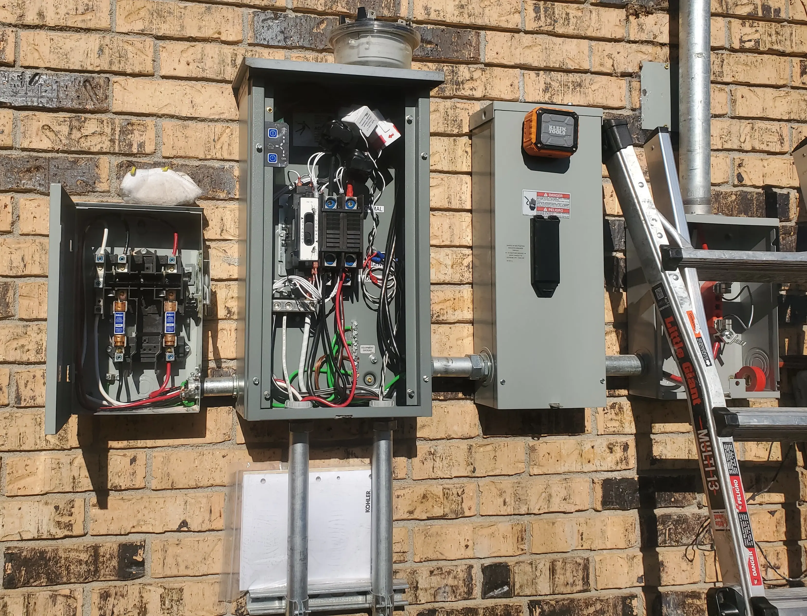

# Home Solar Project - Project Installation

Installation of my [home solar project](./../../../pages/Solar-Project.md).

<!-- more -->

## Finished Product

I will start this post out with the finished product, and save a few pictures of the installation for later on.

### Garage

#### Batteries

The black box on the left, is my [EG4 Battery Rack](./eg4-rack-assembly.md){target=_blank}. At this time, it contains a pair of 5,120wh 48v EG4-LL batteries for a total of ~10kwh of storage.

These batteries are wired in parallel. The rack contains a bus bar on the left/right.

Interior view:

#### Back Wall

On the back wall- starting from left to right-

1. Solark-12k inverter.
2. The top-middle box, is the critical loads panel.
  * Everything in this panel, is fed directly from the inverter. In the event of grid loss, this panel will be switched over to battery/inverter in around 4ms.
3. The far right box, is my main panel.
  * This panel, will also be fed in the event grid power is lost. However, it takes slightly longer for the ATS to redirect power to here.
4. The small grey box under the channel, on the left, is a "passthrough" box. This allows cables to travel under the house, to a box on the exterior/back wall of the house.
5. The small white-ish box under the channel on the right, is the "tigo optimizer"
  * It talks to the panel, collects data, and... "does stuff"

#### Inverter

A quick glimpse inside of the inverter.

Lots of people were questioning why so many conduits ran into the inverter. While- yes- fewer could have technically been used... This is nicer to look at.

The inverter does offer a nice display, which will show all of the critical details at a glance. You can also drill into battery status, panel status, etc.

Regarding the 1.72kw of solar production- its a cloudy day, in the middle of winter. Temps are below freezing. Given- this panels are rated at 5kw, this is pretty good output.

#### Main / Backup Panel

A quick shot with both the backup panel (left) and main panel (right) open. Nothing too fancy in here.

The 60amp breaker in the middle-right of the backup panel, feeds the emergency input of the automatic transfer switch. When power flips off- this breaker will feed the main panel.

The 50 amp plug on the bottom-right of the main panel, is an extra hookup for my welders / plasma cutters / etc.

### Exterior Wall

Going over the exterior wall- From left to right (Ignore the bottom, for now.)

1. Solar rapid-shutdown switch. This switch will disable all solar production. Required by code.
2. Automatic transfer switch.
  * It will switch between grid power, when available, and inverter output when grid is unavailable. Completely automatic in both directions.
3. Grid-disconnect switch.
  * This will disconnect the entire house from the grid. Also- required by code. 
  * Useful to have when working on the electrical system. Before- completely killing energy required calling the electrical company to come out and remove the meter.
4. Meter. Measures energy bi-directionally.

The crooked box on the right, is the OLD ADSL box from my ISP, which needs to be removed from the side of my house.

The grey box on the bottom, is the passthrough box, containing circuits / cable going from the garage to this exterior wall. Do note- the two locations are around 20 foot away.

### The Roof

The solar panels.

Do note, this picture was taken before everything was completed. 

As such, you can see what is inside of the passthrough box.

## The Installation

The entire installation process took two and a half days to complete.

### Day 1. Mounting Hardware & PV Panels

For day 1, all of the electrial hardware was mounted in both the garage, and exterior of the house. Wiring between these locations was completed as well.

A seperate crew installed all of the solar panels and hardware on the first day.

Here is how the garage looked after the first day of work.

Here is a shot of the exterior wall, after the first day.

Note, the new meter box is not connected to anything yet. The old meter box is in the way!

### Day 2. Relocating Mains & Removing Old Hardware

Day two, was mostly spent with a team of 4 electricans "relocating" my old mains panel.

The day started out with my utility company disconnecting the mains from my house, so that work on the main panel could begin.

To- give you an idea of why I elected to move the mains panel- lets have a look at it!

Now, this is AFTER most of the wiring had been removed from it. I am reluctant to show the "before" picture- because it was a literal deathtrap of wiring.

The best I can figure, this box has been in place for the last 50 years. It was past-due to be upgraded.

I will note, this process took the most time of this project. This is also a step most people will not need to worry about.

But, due to the location, and condition of my mains panel, I felt it was best to go ahead and upgrade this.

Everything inside of the main panel was eventually removed.

The panel was put back into place, and screwed shut. There are no electrical components remaining inside of it.

After all of the circuits were pulled up into the attic- they were rerouted into a jbox, sitting above the conduit going into the new mains box. This junction box, has romex coming in from the attic, which is spliced into THHN/THWN, which then runs down the conduit into the panels.

THHN/THWN, in laymans terms, is single-strand wire, without the insulation jacket.

For the exterior of the house, most of the wiring here was completed on day 2. A mast/weatherhead was also installed after the old meter box was removed.

The mains were reconnected to the new meter around 6pm in the evening.

Here is a mid-day shot of the work on the exterior, on day 2. Note, the new mast was already installed, the old meter removed. The visible CT clamps are directly connected to the inverter.

### Day 3. Finishing Up.

There were only around 3-4 hours of work left to be completed on the final day. For this final day, only two crew members were required.

The generator plug was added to the exterior of the house, and connected to the inverter.

The crew finished up programming the inverters/optimizers/panels. Everything was tested and labeled.

We tested...
1. To ensure the automatic transfer switched worked as expected.
  * The critical loads remained powered the entire time.
  * When a generator is connected, it would automatically start charging the batteries, and provide passthrough to the home.
  * The automatic transfer switch automatically reset when grid power was restored.
2. Ensured all of the breakers were correctly labeled.
3. Communication was working properly between the various components.

The remaining crew members were able to make pretty quick work of the remaining items, and left around noon after validating the system was working as expected. 

## The overall experience?

While- I cannot remember names to save my life- The entire crew was very pleasent to work with.

I had a lot of questions, they were able to anwser all of the questions. As well, we were able to easily handle a few on the fly modifications as required for this project.

The crew showed up on time, and was hard at work all day, until late in the evening. Power was only cut on the 2nd day, when the mains were being relocated.

When crew members were inside of the house- they were very considerate of the surroundings. They knocked before entering the house, despite me telling them the door is open.

And, note once did any of the members present any bad attitude at all, even after crawling around in my attic all day pulling wire. (It is not a very pleasant place.)

Lastly- there was no mess left behind. Everywhere they went- was swept clean. No trash was left behind.

Overall- a very good experience. I would highly recommend. 5/5