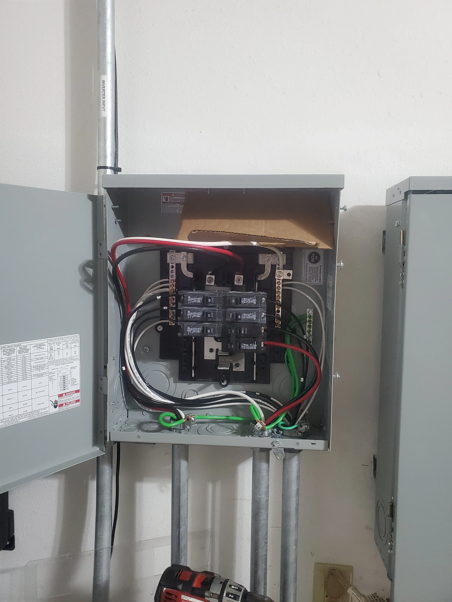
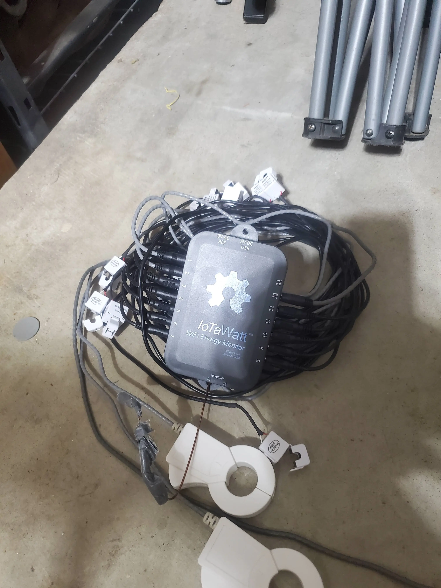

# Home Solar Project - Adding Monitoring and Data Collection

Part 4 of the [home solar project](../../../pages/Projects/Solar-Project.md). Adding monitoring tools and hardware.

Will be adding Iotawatt for per-circuit energy monitoring, and solar-assistant for monitoring the performance of my inverter / batteries. 

<!-- more -->

## Planning

Previously, I have used Iotawatt with great success. The interface works well, and getting data into home assistant has been extremely easy.

If you are interested in eithe this solution, or seeing other potential options for home energy monitoring, Please check out [Home-Assistant Energy Monitoring Options](./../Home-Automation/living-posts/home-assistant-energy-monitoring.md){target=_blank}.

As I still have the hardware and software ready for this- I will be re-implementing this.

Next up, for monitoring the performance and metrics of my inverter / batteries, I decided on Solar-Assistant.

## Part 1. Adding a new electrical box

For this project, I want to add a new sub-panel to help keep everything better organized. I don't want to end up in a scenario, where there is essentially a rat's nest inside of my mains panel.

For reference- here is what I don't want to do:

(Also, to give you an idea of why I elected to replace my mains panel during this project)

Since, I will need CT Clamps in both my main, and secondary panels, it would be best to have a new box connected directly to both panels.

### Tools Used

For the installation, I really only needed a few tools.

!!! info "Affiliate Links Used"
    This post **DOES** include Amazon affiliate links. If you found this content useful, please consider buying the products displayed using the provided links.

    You will pay the same amount as normal, however, it does provide a small benefit to me. This benefit is usually used to purchase other products and hardware for which I can review / blog about.

    I do not display advertisements on this site. As such, the only compensation from this service, comes from affiliate links. I do not ask for, or even accept donations. 

#### Sawzall, or other way to cut conduit to size.

I have really enjoyed all of my Miluakee tools. I recently added the saw-zall to my collection, for the purpose of cutting up scrap for smelting I do on the side.

For this project, it came in extremely handy for cutting the conduit to size.

* [Amazon - Milwaukee M18 Fuel - 2821-20](https://amzn.to/3KgpkiY){target=_blank}
* [Amazon - Milwaukee 42-22-1129 - Sawzall Blade Set](https://amzn.to/3Z0C5CE){target=_blank}

For drilling holes in the metal boxes, you will need a drill, and some hole-saw bits. Again, I **strongly** recommend milwaukee if you don't already have a suitable drill.

* [Amazon - Milwaukee M18 Fuel - 2903-20 Drill](https://amzn.to/3YWn6cI){target=_blank}

Since, I frequently find myself drilling large holes (building dashboards for race-cars, installing mini-splits, etc....) I personally picked up the 49-22-4185

* [Amazon - Milwaukee 28 piece bi-metal hole saw kit](https://amzn.to/41hIknB){target=_blank}

However, if you didn't want to buy a full set, you can also buy a single 1" hole-saw bit. Just- make sure to get the arbor/bit with it.

#### Hand Tools, Crimpers, Pliers, etc.

For crimping / terminating CAT5/CAT6, I **HIGHLY** recommend the klein crimper.

* [Amazon - Klein VDV226-110 Crimper / Stripper](https://amzn.to/3k1YNvl){target=_blank}

This crimper, makes very easy work of crimping cable. The days of having to redo crimps, and bad crimps are all over! I get a PERFECT crimp every single time.

Just- don't forget the push through connectors to go with, Trust me... It makes a world of difference.

* [Amazon - Klein Pass-through RJ45](https://amzn.to/3IzTdtz){target=_blank}

Neither of these tools are required. You can also use a generic crimper. But- trust me, if you find yourself terminating cable quite frequently- these tools are WELL worth it.

As well, if you don't already have a good set of wire cutting pliers- Klein makes a very high quality set.

* [Amazon - Klein Wire Cutters](https://amzn.to/40Zh8tD){target=_blank}

A pair of flush cutters comes in handy too, when you need to trim something with extra percision. These are also useful for removing hang-nails. (the ones on your fingers.)

* [Amazon - Klein Flush Cutters](https://amzn.to/3YWtD7h){target=_blank}

If you don't already have a file, you may want to pick up one, in addition, to a deburring tool. This will be needed when you cut the conduit.

The deburring tool, removes the sharp points left over. You don't want sharp points left inside of your conduit when passing through cables carrying electricity.

#### Hardware Used

I ordered all of my hardware from home-depot. I would recommend... picking everything up in the store.

If you choose deliver to your home, there is a good chance you will receive 20 seperate shipments, with random pieces missing in the middle. Home depot has not been the most effective at delivering items....

This is the box which I will mount all of my hardware into.
* [Weigmann Box - Gray](https://www.homedepot.com/p/WIEGMANN-N1-WEIGMANN-12-in-H-x-12-in-W-x-6-in-D-Carbon-Steel-Gray-Screw-Cover-Wall-Mount-Box-1-Pack-SC121206RC/202067045){target=_blank}

Since, I will need electric to power my hardware, I also picked up a box to hold an outlet.

* [Steel City - Utility Box](https://www.homedepot.com/p/Steel-City-1-Gang-4-in-2-1-8-in-D-New-Work-Metal-Utility-Box-5837112-25R/202590841){target=_blank}
* [Steel City - Utility Box Cover](https://www.homedepot.com/p/1-Gang-Steel-Utility-Duplex-Receptacle-Cover-58C7-25R/202590846){target=_blank}
* [15 Amp Outlet](https://www.homedepot.com/p/Leviton-15-Amp-Residential-Grade-Grounding-Duplex-Outlet-White-R52-05320-00W/202066670){target=_blank}
* [Knockout Connector / Strain Relief](https://www.homedepot.com/p/RACO-1-2-in-Knockout-NMSC-Connector-5-Pack-2711B5-HD/317127853){target=_blank}

For the conduit work, I already had a piece of 1" EMT conduit. However, here are links:

* [1" EMT Conduit - 10ft](https://www.homedepot.com/p/1-in-x-10-ft-Electric-Metallic-Tube-EMT-Conduit-101568/100400409){target=_blank}
* [EMT Compression Connectors](https://www.homedepot.com/p/RACO-1-in-Insulated-EMT-Compression-Connector-1-Pack-2914-8/316989733){target=_blank}

Finally, we need hardware to mount the box to the wall. Since, I wanted my add-on box to resemble the rest of the hardware installed, I decided to mount it using struct channel.

* [12ga Strut Channel - 2 ft](https://www.homedepot.com/p/Superstrut-2-ft-12-Gauge-Half-Slotted-Metal-Framing-Strut-Channel-Silver-Galvanized-ZA12HS2EG/205328679){target=_blank}
* [Struct Channel Spring Nuts](https://www.homedepot.com/p/Superstrut-3-8-in-Strut-Channel-Spring-Nut-5-Pack-ZA1003-8EG-10/100179881){target=_blank}
* [3/8" bolts](https://www.homedepot.com/p/Everbilt-3-8-in-16-x-1-in-Zinc-Plated-Hex-Bolt-25-Pack-800820/204281551){target=_blank}

All togather, the hardware costed me 112$ after-tax, including a lot of extra items which I didn't not use/need.

!!! warning
    Make sure to go pick up these items in person....

    I personally, have not had the best experiences with home depot's shipping. I have previously received damaged items, which needed to be return, or just not received items at all.

    From this particular order, two of the items in my order were never received. 

## Planning and Execution

After doing a bit of measuring, I cut 1" holes into the bottom of the new add-on box for the conduit. I cut out 2 6" sections of conduit to go into the bottom.

For cutting conduit, I used a my vice to hold the tubing, and then cut it to length using a sawzall.

!!! warning
    Make sure to properly debur the inside of the conduit after cutting it! Sharp, pointy metal does not get along with live electrical cables!!!

    As well, in order to properly fit into the connectors, you will need to file the outside of the conduit smooth.

Then, using the connectors, I mounted these to the bottom of the add-on box. After these sections were mounted to the new box, I was able to mock up where I felt the box would be best.

I felt this position would give direct access to both panels for installing CT clamps, as well as, allowing me to run another conduit to the duct below. 

For drilling holes into the box (When you don't have a knockout in the ideal location), use a center punch to make a small dimple, then let your hole-bit do the rest of the work. Here is a picture after drilling the middle hole.

Next up, it was time to plan out and mark the locations for installing the rails.

I started by attaching the rails using the 3/8" bolts, and spring nuts. To cut the rails, I again, used the sawzall.

After these rails were mounted, I was able to put the box into place, and mark the location on the wall where the rails would need to be attached.

### Drilling into the mains panels

Everything up to this point, has been executed with very little risk, and has remained outside of the mains panels.

!!! danger
    If you do not know EXACTLY what you are doing, Hire a licensed electrician.

    Live electricity **WILL** kill you.

But- now, it was time to drill holes into the mains panel.

After opening the panels, you will need to remove the covers.

Since, metal filing and live electricity has a large potential of causing issues, I used a piece of cardboard with a magnet taped on the back to catch and/or deflect metal shavings from the interior of the panel.

!!! info
    If you place your magnet inside of a plastic bag, it makes it much easier to seperate the shavings from the magnet.

Here is what this looks like from back a few steps

For the critical-loads panel, the same steps were taken.

### Running Middle Conduit

After drilling holes into both panels, I mounted the new box, and leveled it. Leveling the box is extremely important.

Once the box was leveled, I measured the length from the box, to the duct on the bottom, and then cut a piece of conduit.

After mounting the conduit into the add-on box, I leveled it. Make sure to level it on BOTH sides.

After the conduit was perfectly level, I traced around it using a sharpie.

Finally, I used a center punch to make the center of the hole, used a magnet+cardboard to keep shavings out of the duct, and drilled a hole.

After this point, the box was leveled, all of the connectors were tightened, and everything was properly secured.

Not shown-

I installed a single outlet into the add-on box to provide power for the hardware used for data collection. It was wired into a dedicated breaker on the critical-loads panel, which is on battery-backup. Since we are using a metal box, make sure to tie the ground into the metal box.

## Reinstalling Iotawatt

The first step here- was to acquire my existing Iotawatt hardware.

After mapping out which circuits I wanted to monitor- I started connecting the CT Clamps and routing the cables.

After I was happy with the routing, I checked the Iotawatt website to verify all of the clamps were reporting correctly. Do note, the direction of clamps DOES matter.

If, you notice a "reverse" icon next to any of your loads, or, you notice something weird, such as circuits using negative electricity, you likely have a clamp installed backwards.

Either, you can reinstall the clamp facing the correct direction, or Iotawatt can reverse it for you in software. I elected to point my clamps in the correct direction.

For any 220v loads, you will need to select the "double" option to more accurately report energy consumption.

## Not shown - Solar-Assistant

During this time, I also installed my solar assistant into this add-on box.

If, you wish to read more, there is a seperate post: [Installing Solar-Assistant](./solar-assistant.md)

Cat6 was ran between my serial adaptor, and my inverter via the middle-conduit channel. The middle channel's primary use is for holding data lines. As such, there is no electrical lines running down the middle conduit.

## Final Thoughts

At this point after installing Iotawatt and Solar-assistant, the only work left to do, was to start re-assembling all of the panels, and picking up my tools.

### Wifi connectivity?

For connectivity, I am using wifi for both the solar-assistant, as well as Iotawatt. 

While, the majority of the internet will tell you.... you cannot mount a wifi appliance inside of a metal box and expect it to work- I will tell you- the internet is not always correct.

For reference, as of the time of this post, everything has been running for over a week, with no issues at all.

Here is what unifi says:

I will note, the u6 pro is actually the furthest away AP in my house. There is an AP literally on the other side of the wall from these devices. I'd say- the u6 pro is around 20-25 feet away, through multiple sheetrock walls.

## The END result.

For the end result, I have quite a few dashboards in various systems.

### Home-Assistant

First up, is the home-assistant energy dashboard

This dashboard is fantastic for giving me a quick glance into what the overall status was for a given day. As well, I can quickly view a weeks worth of consumption.

As well, I have a dashboard for my [Office Kiosk](https://xtremeownage.com/2022/07/08/fire-tablet-as-home-assistant-kiosk/){target=_blank} to show quick stats at a glance.

### Solar-Assistant

Solar-assistant provides both real-time reporting as well as historical data reports.

Here is the main screen, which gives real-time data.

Here is the totals screen, which keeps daily / monthly aggregations

In addition to containing reporting capabilities, solar-assistant also integrates extremely well with home-assistant, and even exposes functionality for home-assistant to change inverter parameters and operating modes.

### Iotawatt

Iotawatt contains  both a simple interface for showing current real-time data:

As well as a data reporting interface

Like solar-assistant, its onboard data collection is a massive benefit. Both of these devices will store potentially decades worth of data on-board.

So, if your historial data ever gets purged due to retention from home assistant, influx, or prometheus, having all of your data retained on these devices is a very nice benefit.

These devices BOTH will function completely stand-alone as well, with no network connectivity.

## Conclusion

I am very satisfied with how this project turned out. 

To me, the installation job looks great, and the data I have been collecting, has been very valuable from a planning standpoint.

Lastly- this data will be crucial for calculating the on-going ROI to determine if this project is worth it.

For those wondering if its worth it- I will let you know in about a year.