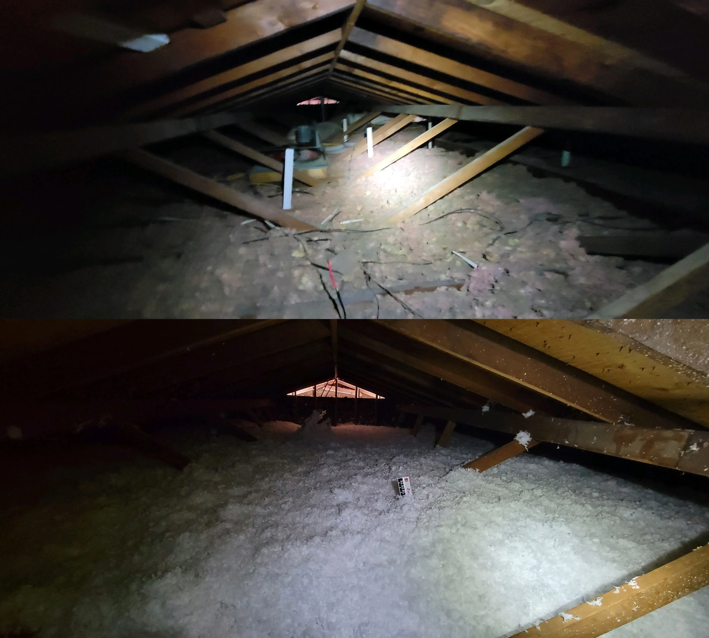
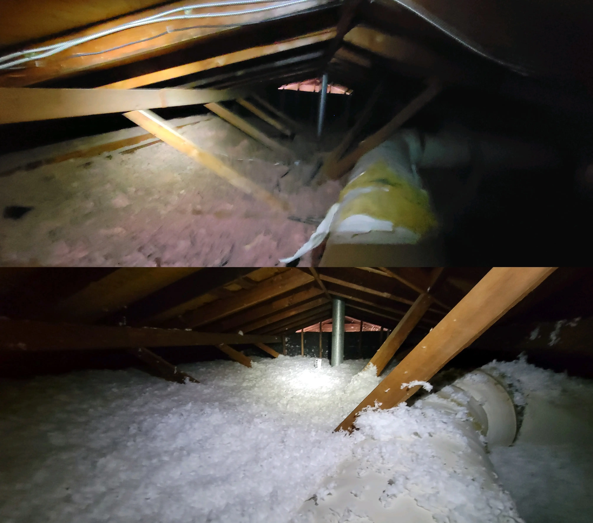
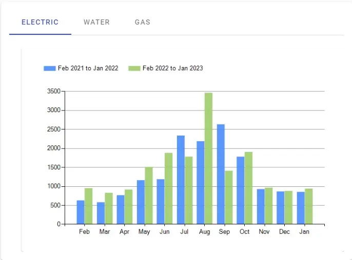
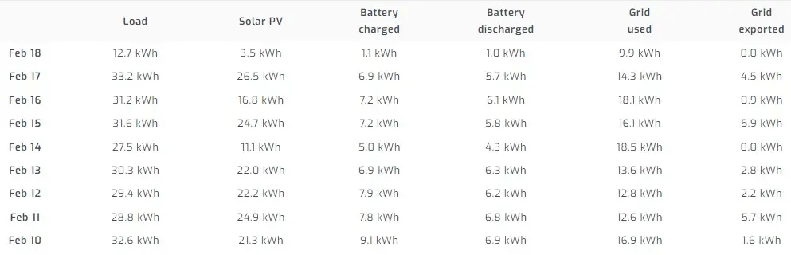
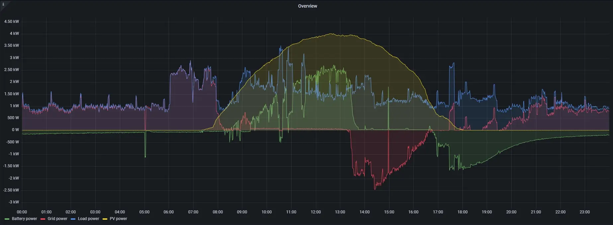

# Home Solar Project - Next Steps

Continuation of the [home solar project](../../../pages/Projects/Solar-Project.md). 

<!-- more -->

## Current State

As of the creation of this post, my system is technically "complete", and there are no additional items planned for changes/removal via my installer.

### Adding more insulation

As apart of the contract with my solar-installer, the insulation in my attic was brought up to 20 inches.

To give an idea, areas of my attic barely had 2-3 inches.

Here are a few before/after shots. In the before shots.

Facing East

Facing West

I imagine the impact from this will be extremely noticable, especially once it starts warming up outside. During the summer of last year- we experienced average termps of 100-110F every single day, for nearly two months.

My A/C was running constantly, leading to over 3Mwh of consumption, per month.

For reference, here is my electrical usage for the last two years.

3.5Mwh = 3,500Kwh * 0.08c/Kwh = 280$ worth of electricity.

## Future Projects

### Adding more battery

The net-metering agreement with my utility provider, is not the  best.

When I consume energy from the grid, it costs me 0.08c/kwh.

When I push excess energy back to the grid, I receive 0.03c/kwh.

So, it is in my best interest to be able to store all of my production into battery, and release when needed.

To visualize this trend- here is daily stats coming from [solar-assistant](solar-assistant.md).

As you can see, during the heating season, I pretty consistently consume around 30Kwh of energy per day.

The issue in the metrics here- See the grid exported column. If we are pulling energy from the grid, AND, exporting energy to the grid- we don't have enough battery storage.

To better demonstrate this, here is a graph I setup in Grafana, showing yesterday's data.

The gred area, is grid usage. Notice- during the early morning hours, my battery is essentially empty (I have a 40% reserve set), and most of my energy is pulled from the grid.

When the sun comes out (yellow area), by around noon-1pm, my batteries are fully charged, at which point I start dumping excess production to the grid. (Red area below the center)

Well, when the sun starts going down, battery usage ramps up. The problem is- After 4-6 hours, the battery is hitting my reserve limit of 40%, at which point, battery consumption tapers off, and grid usage climbs.

From 10pm to 8am, the bulk of my power comes from the grid.

Since- I know my daily off-season energy consumption is 30-34kwh, My plan is to scale my DC system up to 30kwh of total capcity. This should be enough to allow me to store/release my energy all night.

(Also- to scale beyond 30kwh, I would need to add an additional battery rack.)

So- in the next month or two, look forward to seeing the addition of 4 new 48v 5kwh batteries.

### Estimating ROI / Savings

As the year goes on, I will be estimating the savings / ROI of this solution. However, it will take a full year before I can get an accurate anwser as to, "Was this worth it".

I think the summer will tell a very interesting picture- especially when I am able to produce a lot more energy, for a longer duration.

And- since, lots of sun generally means, lots of heat, I think this should offset a large chunk of the HVAC consumption.

But- only time will tell. Stay tuned.