# 10/40G Home Network Upgrade Project and Costs

This is the original documentation for when I deployed 10G out to my network.

<!-- more -->

This post was migrated from the old wordpress site, mostly unaltered from its original form.

## Disclaimers

--8<--- "docs/snippets/ebay-affiliate.md"

--8<--- "docs/snippets/amazon-affiliate.md"

## How much did it cost??

Prices includes shipping and tax, except for the last two rows. Amazon did have free shipping through.

| Part | Quantity | Price | Source |
|------|----------|-------|--------|
| [Mellanox MCX311A-XCAT CX311A ConnectX-3 EN Network Card 10GbE SinglePort SFP+](https://ebay.us/yr6urN){target=_blank} | 1 | $40.61 | eBay |
| [Dell 3 meter QSFP+ Passive Direct Attach Cable DAC Dell DDWP2](https://ebay.us/NxkONa){target=_blank} | 1 | $37.12 | eBay |
| [Mellanox ConnectX-3 VPI 40 / 56GbE Dual-Port QSFP Adapter MCX354A-FCBT High Pro](https://ebay.us/u64qVS){target=_blank} | 1 | $53.48 | eBay |
| [SFP+ 10G 10Gbps 10GbE Passive DAC Direct Copper Cable 5m New In Bag](https://ebay.us/KdSupn){target=_blank} | 1 | $13.81 | eBay |
| [BROCADE ICX6610-48P-E 48-PORT 1G RJ45 PoE+ 8x 1G SFPP 4x 40G 2xP/S 1x FAN SWITCH](https://ebay.us/XFKgCe){target=_blank} | 1 | $152.83 | eBay |
| [Lenovo Intel X540-T2 10Gb Dual Port Adapter 49Y7972 Low Profile G46477-003](https://ebay.us/W0mIzD){target=_blank} | 1 | $54.57 | eBay |
| [6COM 10GBase-T SFP+ Transceiver, RJ45 Copper Module](https://amzn.to/3kQPVpw){target=_blank} | 2 | $91.68 | Amazon |
| [SFP+10GBASE-T Transceiver Copper RJ45 Module](https://www.amazon.com/gp/product/B089CWVHX4/ref=ppx_yo_dt_b_asin_title_o01_s00?ie=UTF8&psc=1){target=_blank} | 2 | $74.00 | Amazon |
| [MikroTik CSS610-8G-2S+in](https://amzn.to/3nvvOi4){target=_blank} | 1 | $103.99 | Amazon |
| Total | | **$622.09** | |

One third of the cost, was for 10GBase-T RJ45 10G Modules. If I had instead obtained fiber or SFP NICs, the price would have been quite a bit lower. Nearly one half of the cost, was because I purchased two new switches to support 10/40G NIC. I upgraded both my core switch, as well as the switch in my office/bedroom to 10G capable switches.

If you didn't need a 10/40G capable switch, the price will be much lower. As well, if you leverage SFP+ NICs instead of 10GBase-T, the price will be much lower.

## Testing Setup

### Network Configuration

Everything is done over the DEFAULT 1,500 MTU side. I did NOT utilize Jumbo frames, or 9,000 MTU settings anywhere. While, this could certainly improve performance, I did not want to try to rearrange the vlans/laggs on my firewall to try and put a 9,000MTU vlan, on TOP of a 1,500MTU default vlan.

As well, I did no configuration of transmit or receive buffers. I don't even know what they are configured to. I did not touch them, or even look at them.

This is NOT a clean room test. I did not stop ANY services on my network while performing these tests. I am not publishing a magazine here, and I just wanted basic, real-world test results. I did no configuration on any of the NICs. I did not try to maximize performance at all. I plugged the NIC into my PC, gave it an IP address, and started testing.

As well, I did not disable any caching. In the real world, my server will still have 128GB of ram.

### Devices Utilized

#### My PC

refers to my Gaming PC. Unraid has long since been retired, and all services are running on my server now. It is using a ConnectX-3 NIC for 10G, with a DAC connecting to my office/bedroom switch. For 1G testing, it utilizes the intel ethernet port on its motherboard.

#### My Server

refers to my Dell R720XD. Its specs:

CPU: Dual Xeon E5-2695v2 (Total of 24 cores, 48 threads)

RAM: 128GB DDR3 ECC

Spinning Array: 8x8TB seagate exos. 2 hot spares. Raid Z2

NVMe Array: Dual 1TB samsung 970 evo. Mirrored.

NIC: ConnectX-3 with QSFP+ DAC to core switch at 40Gbit/s

#### My Firewall

refers to my opnsense firewall, hosted on a HP SFF z240 PC, with a quad core i5, 8gb of ram. It utilizes a X540 based 10GBase-T Dual Port NIC, with both links in a single LACP.

## Network Diagram

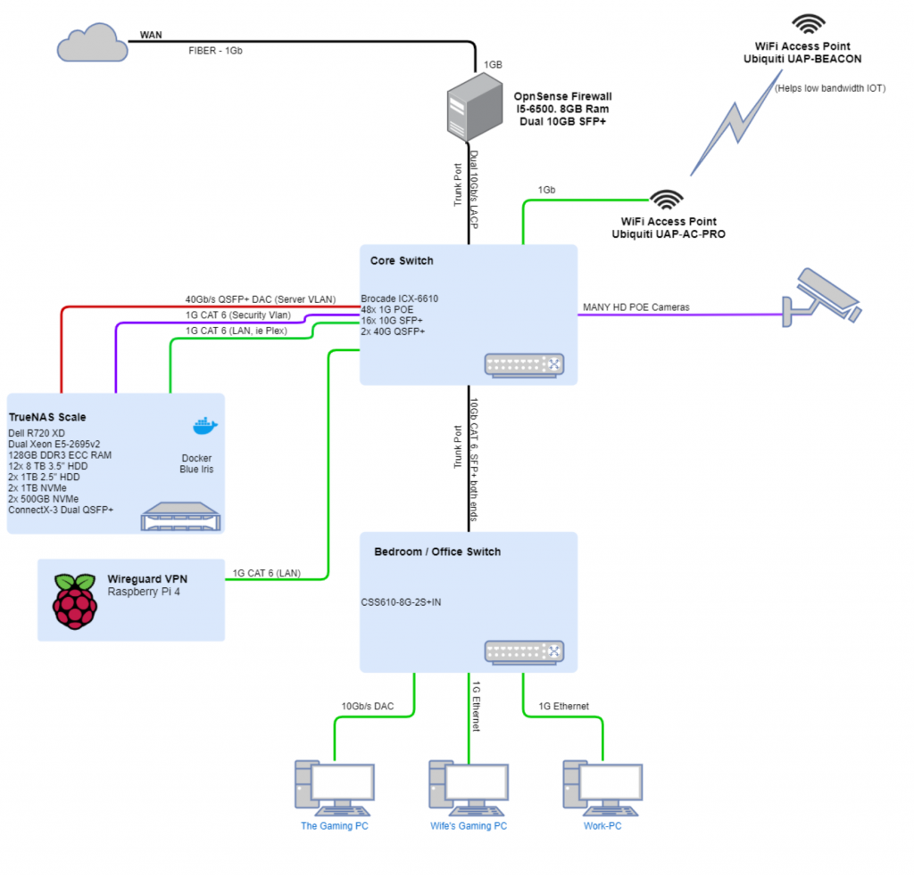

SMB/ISCSI performance was performed between “The Gaming PC, at the bottom left”, and “My server” on the left.

Also- as noted in the diagram, the links are my existing CAT 6, with the exception of two DACs.

## Testing

### Network Speedtest

The first round of tests I wanted to perform- just simple network speed testing.

#### PC to Firewall

After initially connecting the 10G NIC, and running a speedtest (hosted on my server, which is connected to the core switch with a 40G link), I noticed I was only pulling about 2Gb/s.

Edit- The cause of poor firewall performance was due to the power savings configuration it had at the time. After adjusting the power savings configuration, it does full speed no problem now.

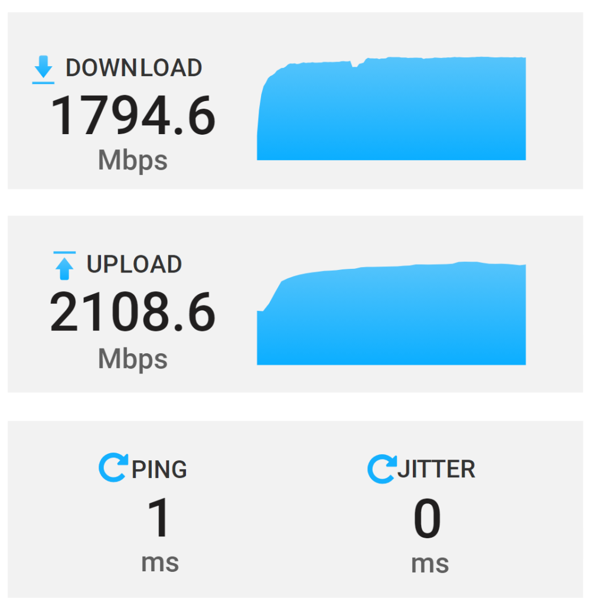

It appears my poor quad core i5, cannot process more then 2Gbit/s while applying rules/IPS/ACLs/etc… However- that is still an extremely respectable amount of throughput for full stateful inspection, DPI, IPS/IDS.
I then, ran iperf tests, and again, only got about 1.5Gbit/s.

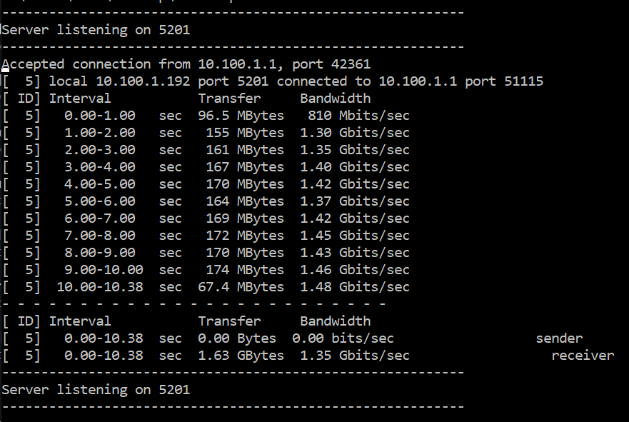

So, at this point, I am going to test throughput directly from my windows client, to my server, over its vlan without the firewall involved. BUT, first- another issue….

#### PC to Server

The first test- was to simply run my docker-speed test. Right off the bat, it did a solid 10Gbps, with a default network MTU of 1,500.

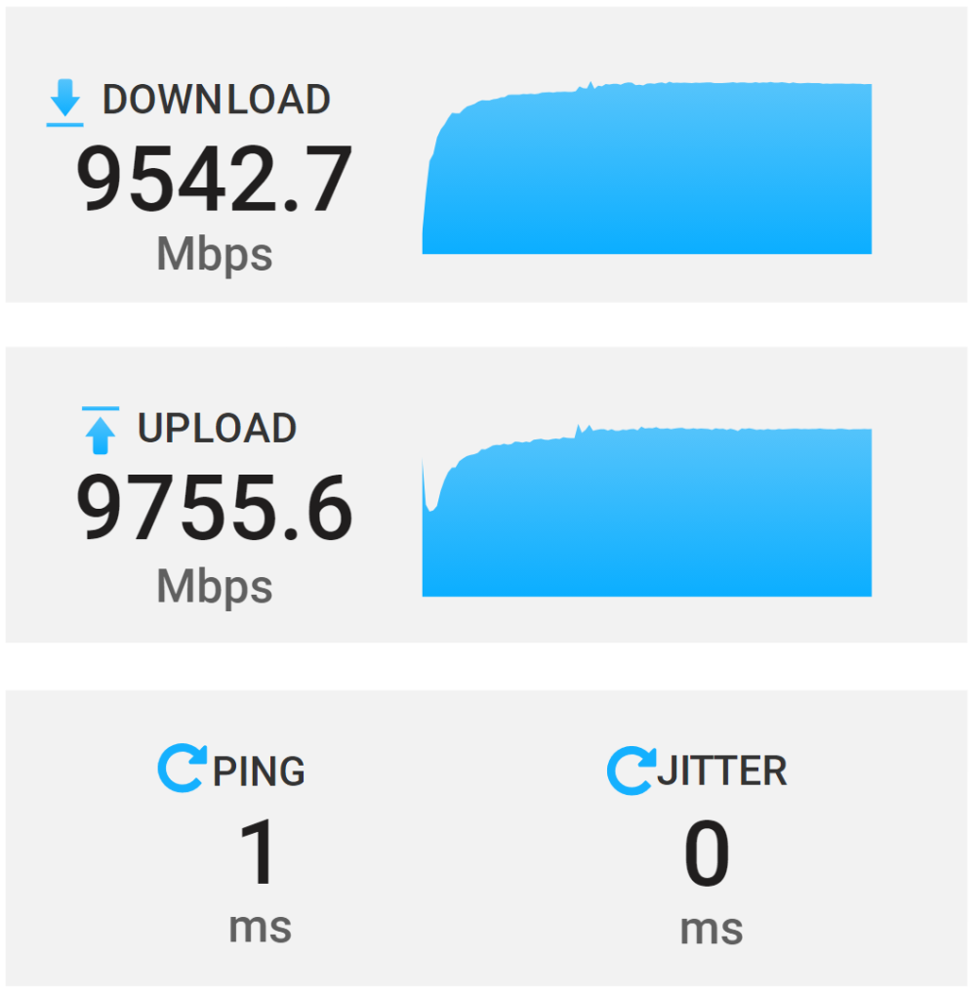

On the core switch, I was able to confirm 98% utilization in both directions.

Now that I am certain that I am able to get full performance between my PC, and the server, let’s do some more testing!

### Server 40G Testing

A few days ago, I did post a [thread on reddit](https://www.reddit.com/r/homelab/comments/pfyxf6/){target=_blank}, showing that I was able to fully utilize the LAGG between my firewall, and my server.

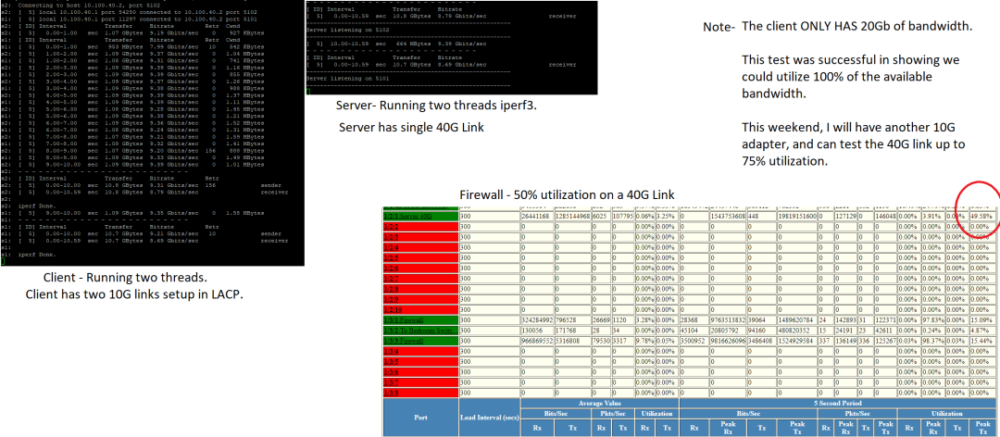

Original tests performed a few days ago.

Since- I was able to use up to 20 gigabits of the connection, I did not feel the need to do further testing all the way up to 40- because, lets face it- even 10G for the most part is complete overkill.

## Testing SMB / File Share Performance

### 10G SMB Performance to Spinning disk array.

First- I mapped a drive to a share hosted on my server’s spinny disk array, over the 10G network.

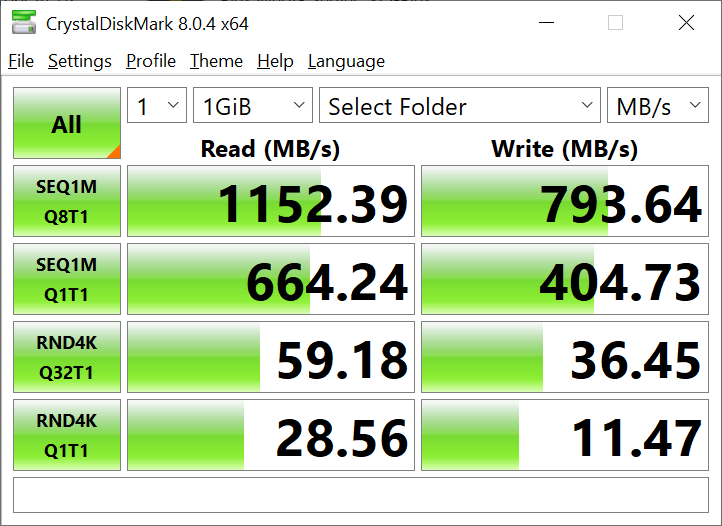

My first thoughts while watching this test- Holy crap. It’s actually pulling FULL 10G performance to my array of SPINNING DISKs. Note- I did NOT stop any services while performing this test. My NVR was still recording. My Plex is currently streaming, and all of the other 50 or so docker containers are still active.

### 1G Performance to spinning disk array

As- I had already done the 10G test, I really just expected 1/10th of the throughput from its test. Well, I was in for a surprise.

The test actually came in, underperforming, in my opinion. Remember- this is hitting the exact same destination. Only- over a 1G link instead of 10G.

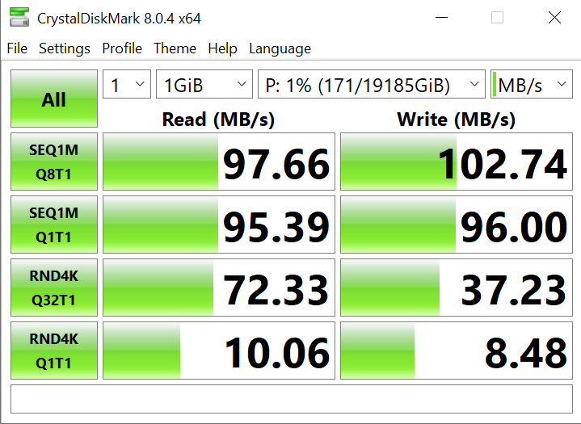

Throughout the tests, I did keep an eye on the server’s stats. CPU remained very reasonable.

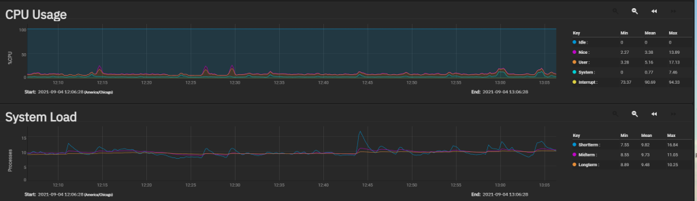

Disk I/O showed something interesting. It showed I could likely use quite a bit more bandwidth before my array became a bottleneck. I imagine each of my exos drives could do a fair amount more I/O. 76MB/s is nothing.

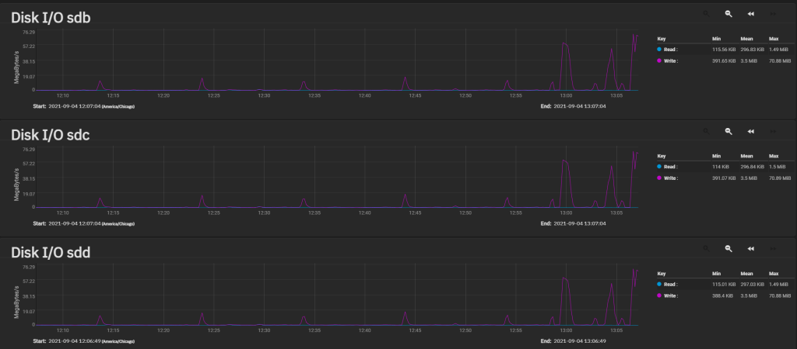

But- let’s move on to testing out the performance of SMB hitting my NVMe pool.

### 10G SMB Performance to NVMe Array

My initial expectations was that I would achieve roughly the same LARGE sequential speeds (since the 10G adaptor is the bottleneck here), but, the smaller/random tests would prove much better.

The reality is- write speeds were better- but, not by a huge factor.

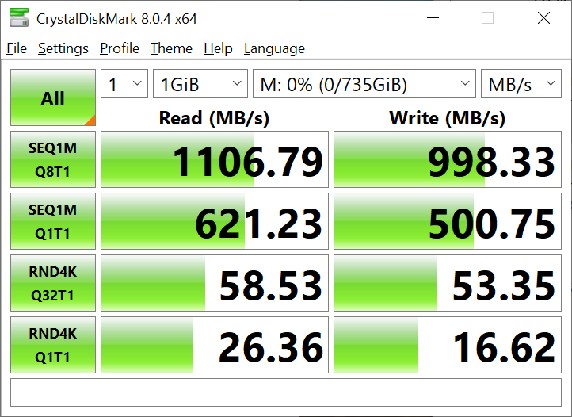

### 1G SMB Performance to NVMe Array.

My expectations here- were to essentially see the exact same results I saw for the spinny disk array.

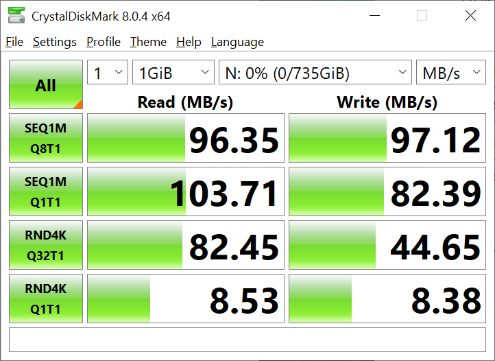

### Total Results

|                    |                  | Large Sequential |                 | Random 4k |
|--------------------|------------------|------------------|-----------------|-----------|
|                    |                  | Read MB/s        | Write MB/s      | Read MB/s | Write MB/s |
| 10G SMB Spinning Array |                  | 1152             | 793             | 59        | 36        |
| 1G SMB Spinning Array  |                  | 97               | 102             | 72        | 37        |
| 10G SMB NVMe           |                  | 1106             | 998             | 58        | 53        |
| 1G SMB NVMe            |                  | 96               | 97              | 82        | 44        |

All results added togather.
In my opinion- The bottleneck to my array is currently the 10G ConnectX-3 adaptor on my workstation. Based on really no difference between NVMe and Spinning disk performance, I am going to write down the network as the root bottleneck.

One thing I was curious about- many people over on r/TrueNAS and r/HomeLab will tell you- you cannot get full 10G performance over SMB, without extensive tuning.

I am here, with evidence, to say, that is a lie. I was able to pull 1,150MB/s, which comes out to 9.2 Gigabits per second. Granted, I could tweak the MTU sizes, and send/receive buffers, and push that number closer to 9.5 – 9.8Gb/s, however, I am perfectly satisfied with pulling 9.2Gb/s. While- I actually want to skip iScsi testing due to the impressive results I received for SMB testing, I have commited to it… So, lets get started…

## Testing ISCSI Performance

### Testing Setup

The first step in order to test iScsi performance, was to configure a few zvols, and a few iscsi connections.

I created a 15G zvol on both my NVMe array, and my Spinning disk array.

The volume was formatting with GPT table, and NTFS file system with a quick format. Windows file/folder compression was not enabled.

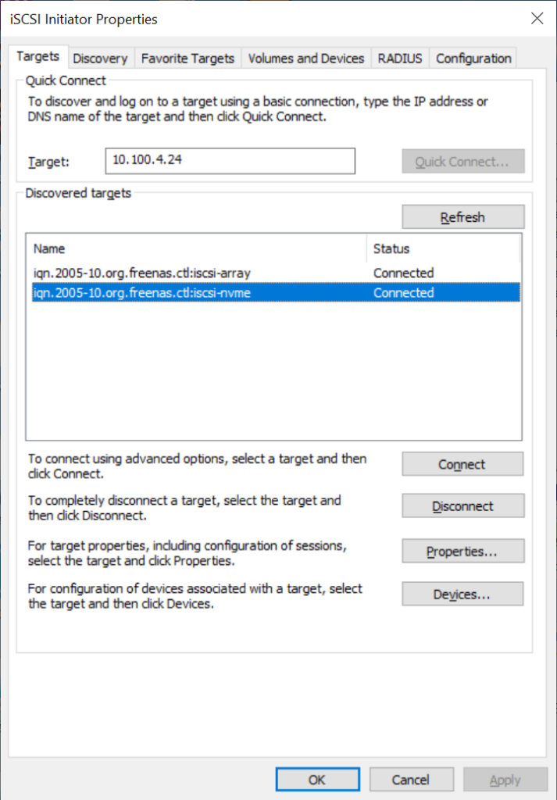

### 10G ISCSI to Spinning Array

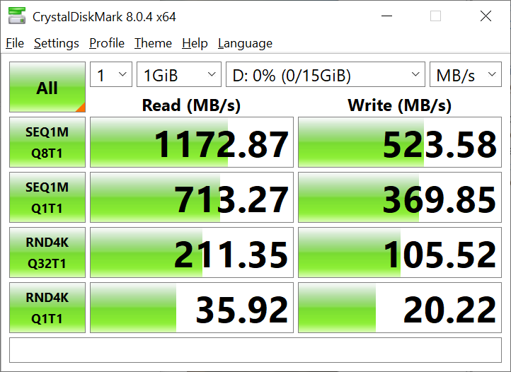

### 10G ISCSI to NVMe Array

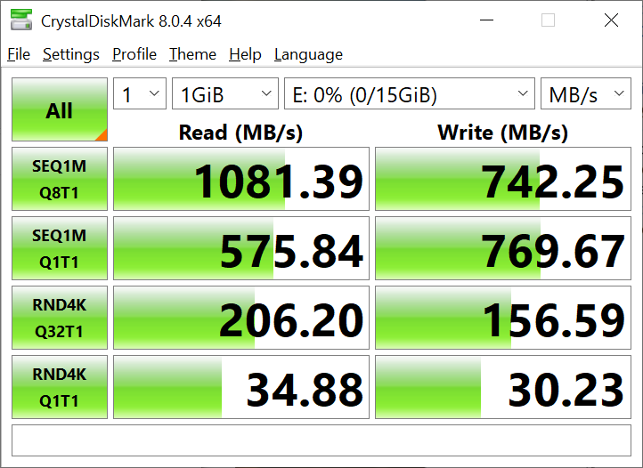

### 1G ISCSI to Spinning Array

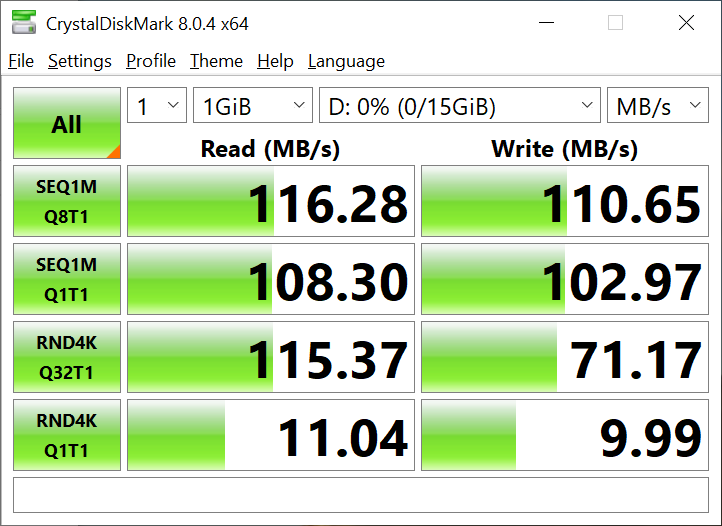

### 1G ISCSI to NVMe Array

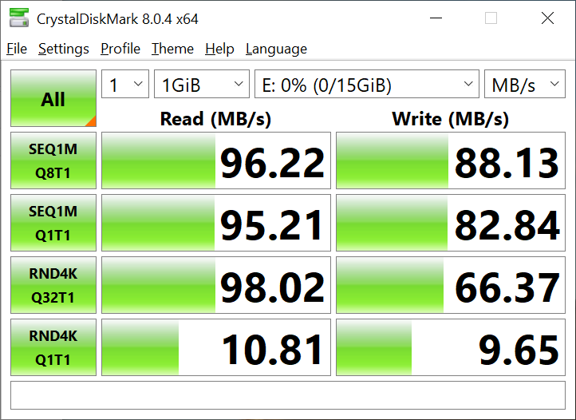

## Overall Results

|                         | Seq Read MB/s | Seq Write MB/s | RND Read MB/s | RND Write MB/s |
|-------------------------|---------------|----------------|---------------|----------------|
| 10G ISCSI Spinning Array | 1172          | 523            | 211           | 105            |
| 10G SMB Spinning Array    | 1152          | 793            | 59            | 36             |
| 10G SMB NVMe              | 1106          | 998            | 58            | 53             |
| 10G ISCSI NVMe Array      | 1081          | 742            | 206           | 156            |
| 1G ISCSI Spinning Array   | 116           | 110            | 115           | 71             |
| 1G SMB Spinning Array     | 97            | 102            | 72            | 37             |
| 1G SMB NVMe               | 96            | 97             | 82            | 44             |
| 1G ISCSI NVMe Array       | 96            | 88             | 98            | 66             |

## What did I learn?

1. My 10G NIC is the bottleneck to accessing my storage. In the future, I want to run a dedicated 40G link for my gaming PC.
2. ISCSI performs marginally better than SMB, which surprised me. I expected it to greatly outperform SMB. However, my bottleneck is still my 10G network adaptor. With a faster 40G NIC in the future, we may see different results.
3. I now want to store my Steam library on an SMB share, for my less frequently played games. My local 500G NVMe is getting pretty full.
4. Oddly enough, random writes are interesting. ISCSI always wins here, regardless of connection.
5. For sequential writes, SMB seems to perform better.
6. Overall, I expected better performance from the NVMe array compared to the spinning array. Also, I did not expect my spinning array to perform EFFORTLESSLY over 10G.
7. 10G NICs and Modules use a lot of electric. They get very hot and like to run up my electric bill.
8. A Brocade switch also likes to increase my electric bill. It uses 100w more than the switch it replaced (which was also doing POE).

## What theories were debunked?

1. You do NOT need to use a 9,000 MTU, and do extensive tuning to achieve 90% 10G performance. However, tuning will get you closer to achieving 100% performance.
2. A cheap i5-based machine CAN do full IDS/DPI/ACL on 2 gigabits of traffic per second. It does not take a $5,000 firewall to do this.
3. You CAN INDEED successfully run 10G over existing Cat6. You do NOT need Cat7/Cat8/fiber unless you are running longer distances. This is for a 40-foot run which goes under the crawl space of my house. If you are indeed planning on running 10G or more over cable, and you are in the process of laying the cable, do go ahead and use Cat6a/Cat7 however.
4. A Z2 (RAID 6) array, with a bunch of big, large disks, can indeed saturate 10G. Many claim you need to run RAID 10, SSDs, etc., to come close to 10G performance. In my testing, I believe I can come close to saturating 20G from my spinning array.
5. You do NOT NEED NVME/SSDs for 10G. 40G, Likely. But, I will get around to testing that in the future.
6. (Added after this was posted) Oh, you are just getting close to 10G speeds because you are just testing the cache! Nope. 32G test files produce pretty much identical results over iSCSI to my array over 10G. I didn’t run all of the tests because I don’t want to spend 30 minutes waiting.

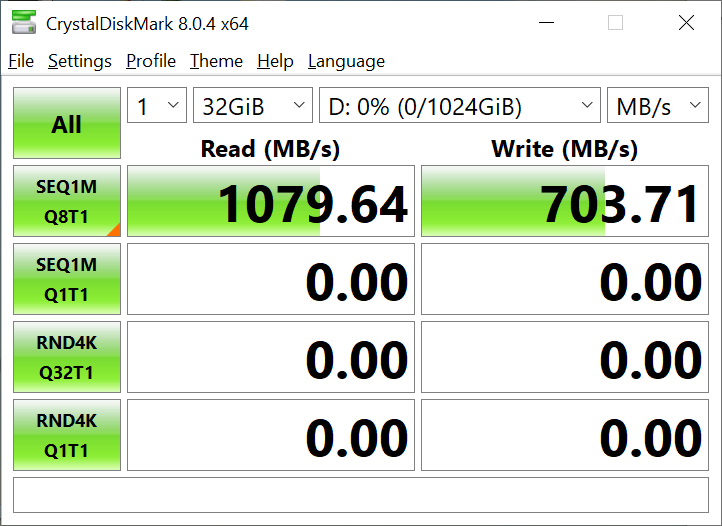

