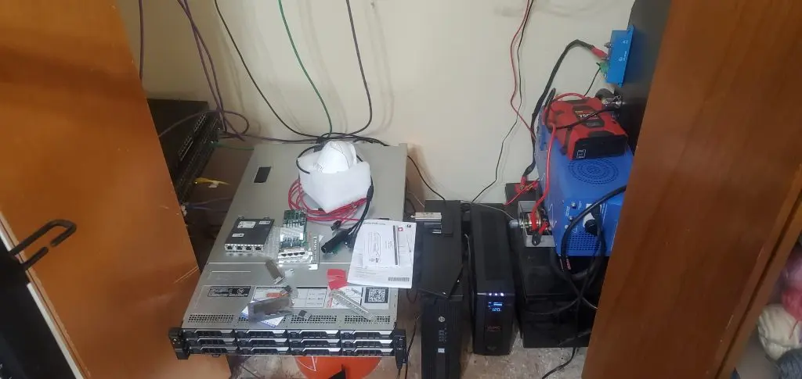
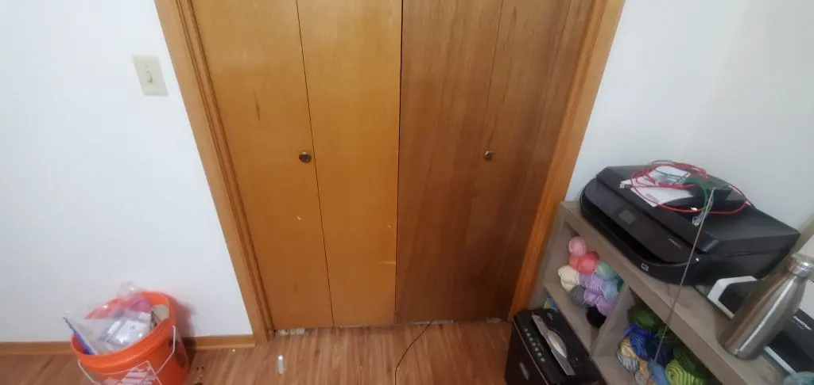
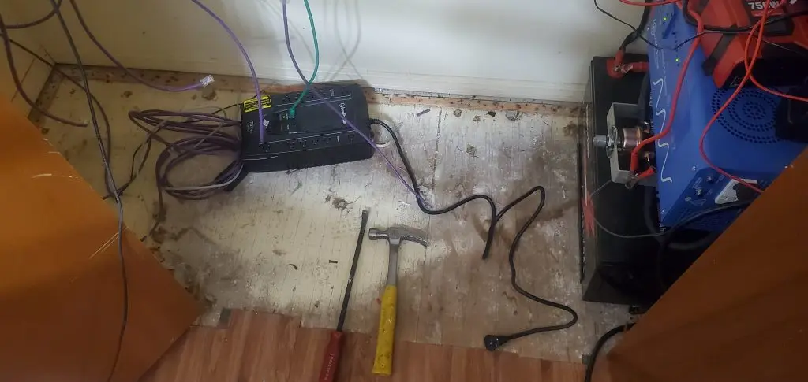
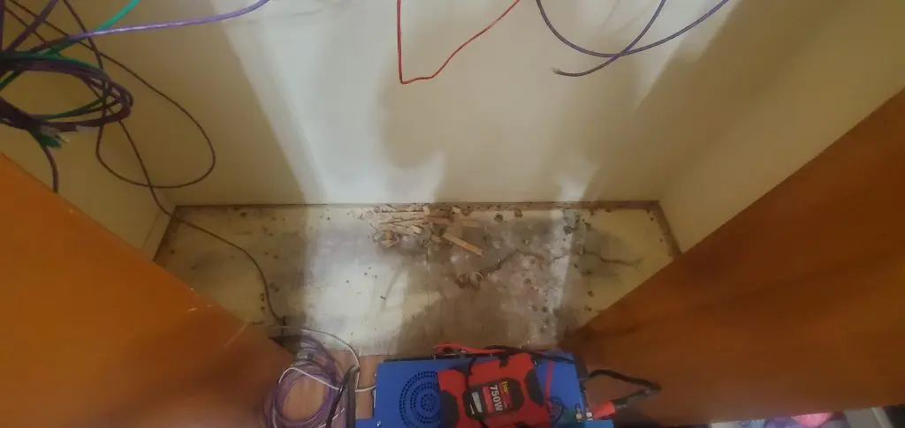
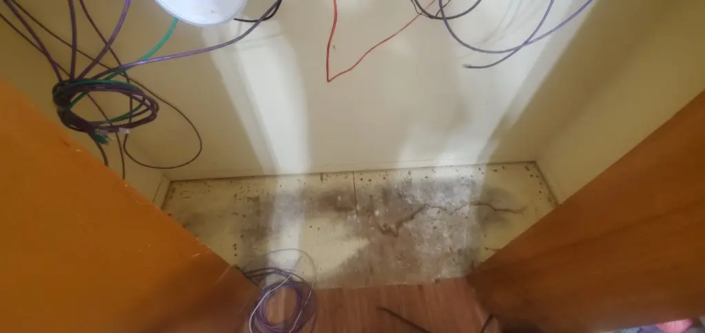
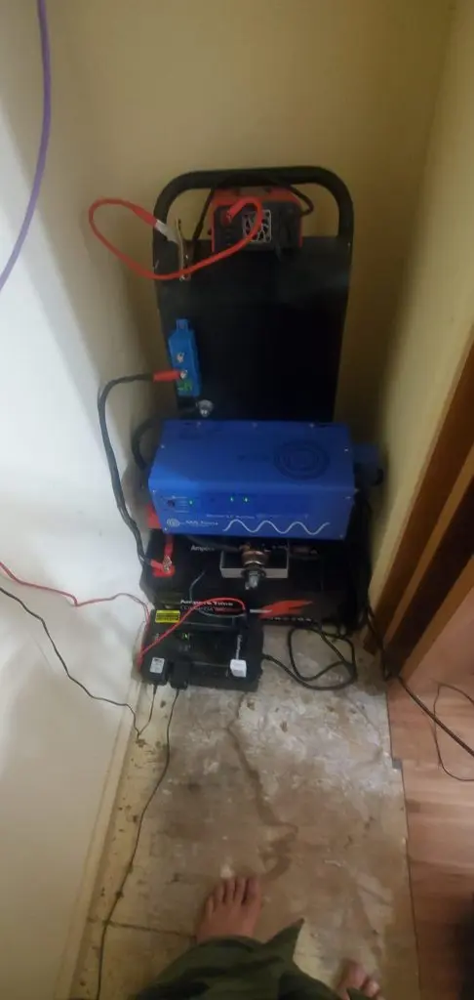
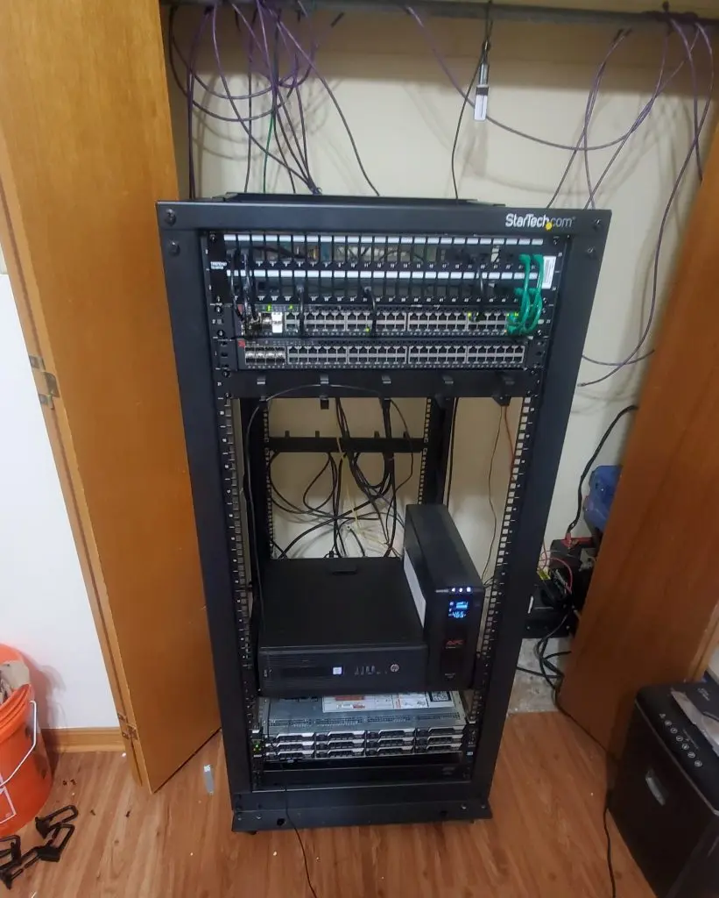
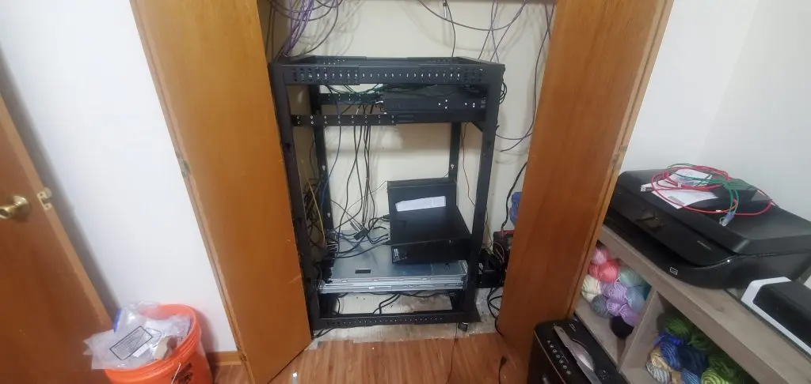

# Rack em up - Adding a proper rack

I have a few pieces of enterprise gear for my home network. I have my server, a few 10/40G POE switches, and some other odds and ends. So far, its been stacked on boxes and buckets inside of my spare bedroom’s closet.

So, over the last two weeks, I started a project to clean everything up a little bit.

<!-- more -->

!!! info
    This post was originally published in 2021, and has been adopted to this static-site from wordpress.

--8<--- "docs/snippets/amazon-affiliate.md"

--8<--- "docs/snippets/ebay-affiliate.md"

## Before and After

### Before

As you can see in the above picture…. its a bit of a mess. 

My switch on the left is sitting on a cardboard box. 

My server lives on top of a 5gal home depot bucket…. and everything else is just “in there”.

### After

After - Rack pulled out of the closet.

After, Rack neatly inside of the closet.

And- as a bonus, the closet doors can even close now!

(Although, as of re-publishing this in 2023- there is far too much heat generated to leave the doors closed now...)

## Parts / Links used in this article

1. [Startech.com 25U Open Frame Rack](https://amzn.to/2ZS0L74)
2. [48 port patch panel](https://amzn.to/3q5Gxl5) (FRONT, TOP Patch Panel)
   - [CAT6 Keystone Jacks](https://amzn.to/3nSw5La)
   - [6in Patch Cables. Green & Black](https://amzn.to/3k3pRHa)
3. [24 Port Patch Panel](https://amzn.to/3GSyT3C) (REAR, TOP, incoming connections connect here)
   - [CAT6 Keystone Jacks](https://amzn.to/3nSw5La)
4. [3ft CAT6a THIN cables](https://amzn.to/3GShdF7) – connect rear patch panel to front patch panel
5. [Extra Cage Nuts](https://amzn.to/3bKrIvT)
6. [2x Brocade ICX6610 Switches](https://ebay.us/GkhRi9) – 2x40G QSFP+ ports, 16x 10G SFP+ ports, 48x 1G POE ports.
7. [Wiring loop shelf](https://ebay.us/eGQNfj).
8. [HP Z240](https://ebay.us/PeJ7uC) – (OPnSense Firewall, 1G WAN, 2x 10G LAN)
9. [Homemade 2.4Kwh UPS](https://xtremeownage.com/2021/06/12/portable-2-4kwh-power-supply-ups/)
10. [APC 1500VA UPS](https://amzn.to/2ZPjb8m). Buffers power while the big inverter fails over. Also- triggers my servers to shutdown after it has been on battery power > 15 seconds.
11. [Dell R720XD](https://ebay.us/2nSqb1) – 24c/48t, 128G RAM, 10x8TB Drives + 2x1TB 970 evo + 2x500G 970 evo + 2x 2.5" 1TB + 40G NIC
12. 2x [APC AP9562](https://ebay.us/1Tk7t2) – One for each PSU in multi-PSU devices.

## The Process

### Cleaning up the closet

So, the first goal, was to pull everything out of the closet, and remove the left-over spike strip from whenever this closet had carpet once upon a time.

As you can see in the below image, spike strip was around the entire perimeter. It could… be bad if a power cord got pinched on top of this. So- the tools required for this job- Just a simple hammer and pry-bar.

After a bunch of beating and prying spike strip, Half way there…..

And… done. Used the trusty shop-vac to clean up all of the remaining dust, fragments, etc.

### Populating the rack

So, after the closet was cleaned up, my first goal was to move my [2.4Kwh](https://xtremeownage.com/2021/06/12/portable-2-4kwh-power-supply-ups/){target=_blank} UPS into the closet. If you have interest in building your own portable 2.4Kwh (or bigger) UPS, feel free to click that link. So far, it has worked fantastically, without issues.

!!! info
    As of Dec 2023, this UPS is still in place, and still works perfectly.

And, knock on wood, it fit into this space perfectly. The smaller UPS is used for a few smaller devices not mounted on my rack.

## Finished

And, next, through the magic of…. editing, here is the final photo of the rack already populated.

From Top to bottom:

1. [Startech.com 25U Open Frame Rack](https://amzn.to/2ZS0L74)
   - [48 port patch panel](https://amzn.to/3q5Gxl5) (FRONT, TOP Patch Panel)
     - [CAT6 Keystone Jacks](https://amzn.to/3nSw5La)
     - [6in Patch Cables. Green & Black](https://amzn.to/3k3pRHa)   
2. [24 Port Patch Panel](https://amzn.to/3GSyT3C) (REAR, TOP, incoming connections connect here)
   - [CAT6 Keystone Jacks](https://amzn.to/3nSw5La)   
3. [3ft CAT6a THIN cables](https://amzn.to/3GShdF7) – connect rear patch panel to front patch panel
4. [2x Brocade ICX6610 Switches](https://ebay.us/GkhRi9) – 2x40G QSFP+ ports, 16x 10G SFP+ ports, 48x 1G POE ports.
5. [Wiring loop shelf](https://ebay.us/eGQNfj).
6. [HP Z240](https://ebay.us/PeJ7uC) – (OPnSense Firewall, 1G WAN, 2x 10G LAN)
7. [APC 1500VA UPS](https://amzn.to/2ZPjb8m). Buffers power while the big inverter fails over. Also- triggers my servers to shutdown after it has been on battery power > 15 seconds.
8. [Dell R720XD](https://ebay.us/2nSqb1) – 24c/48t, 128G RAM, 10x8TB Drives + 2x1TB 970 evo + 2x500G 970 evo + 2x 2.5" 1TB + 40G NIC
   - 2x [APC AP9562](https://ebay.us/1Tk7t2) – One for each PSU in multi-PSU devices.
     - Note: the 2nd unit arrived and was installed after these images were taken. It sits right under the server.

And- when I need to “hide” the rack… it fits nicely into the closet!

And- of course, the closet doors still shut.

## FAQs / Comments

**Q: Why are you using two separate patch panels?**

A: Due to how my rack slides in/out of the closet, the cables come into the rear of my rack. To allow me to pull the rack OUT of the closet to perform maintenance, I wanted the cables coming in at the rear to give plenty of space.

**Q: Will it get too hot in the closet?**

A: Absolutely. The door will remain open until a proper ventilation system is created.

**Q: Will the “THIN” patch cables work for POE / 10G?**

A: I was curious myself. Turns out, none of my POE devices are having issues, and all of the 10G links are working without issue, and no packet errors are reported on the switches.

A note- My expectations for the startech rack were not very high, as it was pretty cheap. I was half-way expecting to receive a flimsy rack, not suitable for my heavy servers. I was pleasantly surprised, the build quality is actually…. pretty nice. The parts are thick and solid.

!!! info
    Edit from Dec 2023- This rack has held up perfectly fine, with no issues at all.

    Would strongly recommend. The thin patch cables have been absolutely fantastic. I still love these. A new post will be coming soon hopefully of the changes over the last few years.

## Future Ideas / Projects

1. Cleanup some of the CAT6 in the closet. I have drops coming from both the floor, and ceiling. It would be nice to make this a bit… neater. Its a mess still.
    * As of 2024 - Issue is worse! Now there is also multiple fiber runs coming through the floor! But, is better organized now.
2. Apply SOME form of flooring to the closet. The old plywood is not easy on the eyes.
    * Yup. This is still ugly too.
3. It would be nice to have rails on the floor, to allow the rack to slide into and out of the closet with ease, every time.
    * This likely isn't going to ever happen.

## Disclaimers

A random note- you are viewing this website from the server in the bottom of that rack.

This is not a sponsored post. There was no financial incentive behind ANY of the products used in this article.

Affiliate links are present, however, they do not at all affect your pricing in any way.