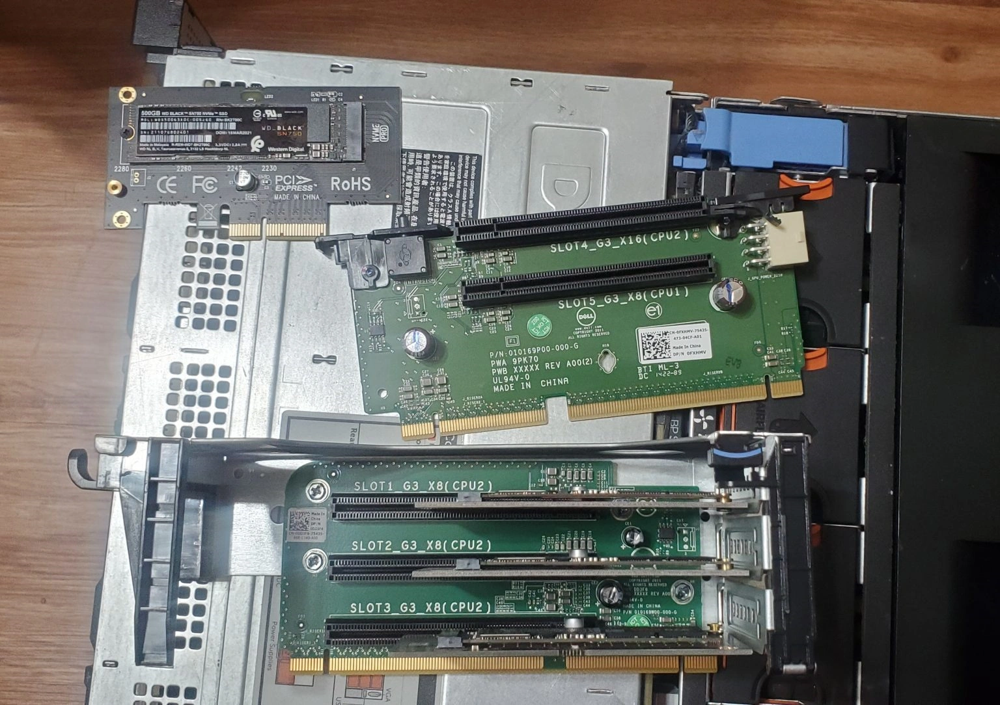

# Adding "Bifurcation" to a Dell R720XD

Wait, the R720XD doesn’t support bifurcation?

And- you would be correct by saying that.

However- There are special PCIe cards you can acquire, which will perform the bifurcation.

Credit for this idea goes to [THIS POST](https://forums.servethehome.com/index.php?threads/multi-nvme-m-2-u-2-adapters-that-do-not-require-bifurcation.31172/){target=_blank} which was brought to my attention by a fellow redditor. (I couldn’t find the comment from a month ago..)

As a note- this isn't specific to the R720XD, this guide/hardware should work in any hardware with the proper PCIe slots, which does not support bifurcation out of the box.

<!-- more -->

If your hardware does support native bifurcation, I would recommend using it, with something such as the [ASUS Hyper M.2](https://amzn.to/3Zn1dnM){target=_blank}. However, this hardware should still work even if you do have on-board bifurcation as well.

## Why Bifurcate?

By default, without bifurcation, you can use one PCIe slot, for one device. This means, despite having a16 lane slot, you can only use a single NVMe (which only requires 4 lanes). With bifurcation, you can use all 16 lanes for 4 individual devices.

My r720XD has… 6 usable PCIe slots. Two are 16 lanes, the rest are 8 lanes. My current needs involves 4x NVMe devices, a dual port 40G NIC, and a USB 3.1 type-c card. In my current setup, this consumes all of my available slots, despite having many free lanes.

Bifurcation isn’t only for NVME, however, this is generally the most popular use for it.

I would explain exactly how this works with a non-bifurcation motherboard…. however, I would just be repeating what I read from the [original Serve The Home post](https://forums.servethehome.com/index.php?threads/multi-nvme-m-2-u-2-adapters-that-do-not-require-bifurcation.31172/){target=_blank}. So, please look at the original post.

I will note- what I am doing below, isn’t actually bifurcation. But, PCIe switching. If you are more interested to know the technical details, I recommend you read the [PEX 8748 Product Brief](https://docs.broadcom.com/doc/12351855){target=_blank} or [PEX 8724 Product Brief](https://docs.broadcom.com/doc/12351849){target=_blank}.

## Getting Started

1. <https://www.aliexpress.com/item/1005001344675103.html>{target=_blank}
    * This is the one used for now.
2. <https://www.aliexpress.com/item/1005001889076788.html>{target=_blank}
    * I picked up this one as a backup.

Regarding shipping, both cards ended up arriving at my house in the same package, only 2 weeks later. For- shipping from China, I was quite amazed at how quickly they arrived. Packaging was good.

To note, the cards did seem to go out of stock. However, see the [Serve The Home post](https://forums.servethehome.com/index.php?threads/multi-nvme-m-2-u-2-adapters-that-do-not-require-bifurcation.31172/){target=_blank} for other potential cards.

### Step 1. Remove the old hardware

I started the process by removing all of the riser boards from my server. As you can see, I had a lot of adaptors using an entire PCIe slot for a single NVMe drive before.



Next- I started removing the NVMe adaptors from the risers.


After a few minutes…. I had my pile of NVMe devices ready to go into the new card.


After removing the 6 screws on the back of the new device, I installed all 4 of my NVMe devices. The backside of the aluminum cover does have heat-sink pads, which hopefully should help keep my devices running a tad cooler.


And… all buttoned up, ready to be installed.


The final part of this process, was to re-install all of the devices into the chassis.


After adding everything back into the chassis, I still have three open PCIe slots.

In the future, when I decide to add more stripes to my NVMe/Flash pool, I will move the USB Type-C adaptor over to the half-width slots. But, for now, this is fine.

If the mspaint labels are not readable, the card on the left is the new quad NVMe switch, in the middle, I have a dual port 40Gbit ConnectX-3 NIC, with a USB 3.1 Type-C on top. The riser on the right has all three slots completely empty.

## Does it boot?

Yes!

TrueNAS booted right up, without issues. My existing Flash/Cache pools were imported right away, without any issues at all.

As well, all of the NVMe disks were detected just like nothing had changed.


## Does it perform?

Without going too deep into benchmarks….

### iSCSI Benchmark

iSCSI across my flash pool benchmarked exactly the same as in my [Previous Benchmarks](https://xtremeownage.com/2021/12/12/reducing-power-consumption-without-reducing-performance/#final-iscsi-results){target=_blank} after removing my brocade ICX-6610.


As noted before, I am bottlenecked by my 10Gbe connection. I have still not tracked down the issue limited all of my iSCSI write speeds to 570MB/s.

(Edit from 2023- This post came before I upgraded to 40GBe)

### FIO Sequential Benchmark

``` bash title="FIO Benchmark"
truenas[/mnt/Cache]# fio --name=seqread --rw=read --direct=1 --ioengine=libaio --bs=8k --numjobs=8 --size=1G --runtime=600  --group_reporting
seqread: (g=0): rw=read, bs=(R) 8192B-8192B, (W) 8192B-8192B, (T) 8192B-8192B, ioengine=libaio, iodepth=1
...
fio-3.25
Starting 8 processes
seqread: Laying out IO file (1 file / 1024MiB)
seqread: Laying out IO file (1 file / 1024MiB)
seqread: Laying out IO file (1 file / 1024MiB)
seqread: Laying out IO file (1 file / 1024MiB)
seqread: Laying out IO file (1 file / 1024MiB)
seqread: Laying out IO file (1 file / 1024MiB)
seqread: Laying out IO file (1 file / 1024MiB)
seqread: Laying out IO file (1 file / 1024MiB)
Jobs: 8 (f=8)
seqread: (groupid=0, jobs=8): err= 0: pid=1319720: Sat Jan  8 11:52:23 2022
  read: IOPS=686k, BW=5361MiB/s (5622MB/s)(8192MiB/1528msec)
    slat (usec): min=3, max=661, avg= 9.33, stdev=20.50
    clat (nsec): min=661, max=59010, avg=878.93, stdev=459.30
     lat (usec): min=4, max=664, avg=10.34, stdev=20.69
    clat percentiles (nsec):
     |  1.00th=[  748],  5.00th=[  764], 10.00th=[  772], 20.00th=[  780],
     | 30.00th=[  788], 40.00th=[  796], 50.00th=[  804], 60.00th=[  812],
     | 70.00th=[  828], 80.00th=[  844], 90.00th=[ 1020], 95.00th=[ 1352],
     | 99.00th=[ 1656], 99.50th=[ 1960], 99.90th=[ 9792], 99.95th=[11456],
     | 99.99th=[15936]
   bw (  MiB/s): min= 5423, max= 5743, per=100.00%, avg=5583.70, stdev=23.59, samples=16
   iops        : min=694204, max=735222, avg=714713.00, stdev=3019.26, samples=16
  lat (nsec)   : 750=0.84%, 1000=89.04%
  lat (usec)   : 2=9.66%, 4=0.31%, 10=0.06%, 20=0.09%, 50=0.01%
  lat (usec)   : 100=0.01%
  cpu          : usr=17.78%, sys=82.04%, ctx=47, majf=16, minf=153
  IO depths    : 1=100.0%, 2=0.0%, 4=0.0%, 8=0.0%, 16=0.0%, 32=0.0%, >=64=0.0%
     submit    : 0=0.0%, 4=100.0%, 8=0.0%, 16=0.0%, 32=0.0%, 64=0.0%, >=64=0.0%
     complete  : 0=0.0%, 4=100.0%, 8=0.0%, 16=0.0%, 32=0.0%, 64=0.0%, >=64=0.0%
     issued rwts: total=1048576,0,0,0 short=0,0,0,0 dropped=0,0,0,0
     latency   : target=0, window=0, percentile=100.00%, depth=1
Run status group 0 (all jobs):
   READ: bw=5361MiB/s (5622MB/s), 5361MiB/s-5361MiB/s (5622MB/s-5622MB/s), io=8192MiB (8590MB), run=1528-1528msec
root@truenas[/mnt/Cache]#
```

Based on FIO, I am receiving the full expected performance from a single drive. But- this doesn’t tell me if I am receiving full performance from multiple drives. SO…. lets benchmark my Flash pool, which is mirrored across two NVMes on this card.

``` bash
truenas[/mnt/Flash]# fio --name=seqread --rw=read --direct=1 --ioengine=libaio --bs=8k --numjobs=24 --size=1G --runtime=600  --group_reporting
seqread: (g=0): rw=read, bs=(R) 8192B-8192B, (W) 8192B-8192B, (T) 8192B-8192B, ioengine=libaio, iodepth=1
...
fio-3.25
Starting 24 processes
seqread: Laying out IO file (1 file / 1024MiB)
seqread: Laying out IO file (1 file / 1024MiB)
seqread: Laying out IO file (1 file / 1024MiB)
seqread: Laying out IO file (1 file / 1024MiB)
seqread: Laying out IO file (1 file / 1024MiB)
seqread: Laying out IO file (1 file / 1024MiB)
seqread: Laying out IO file (1 file / 1024MiB)
seqread: Laying out IO file (1 file / 1024MiB)
Jobs: 24 (f=21): [R(8),f(1),R(6),f(2),R(7)][-.-%][r=7881MiB/s][r=1009k IOPS][eta 00m:00s]
seqread: (groupid=0, jobs=24): err= 0: pid=1663699: Sat Jan  8 12:06:40 2022
  read: IOPS=959k, BW=7490MiB/s (7854MB/s)(24.0GiB/3281msec)
    slat (usec): min=3, max=11418, avg=20.72, stdev=52.72
    clat (nsec): min=735, max=582467, avg=1466.79, stdev=1155.76
     lat (usec): min=4, max=11431, avg=22.42, stdev=53.14
    clat percentiles (nsec):
     |  1.00th=[  804],  5.00th=[  820], 10.00th=[  828], 20.00th=[  852],
     | 30.00th=[  876], 40.00th=[  980], 50.00th=[ 1224], 60.00th=[ 1384],
     | 70.00th=[ 1576], 80.00th=[ 1880], 90.00th=[ 2448], 95.00th=[ 3056],
     | 99.00th=[ 4768], 99.50th=[ 5600], 99.90th=[ 8384], 99.95th=[12224],
     | 99.99th=[27008]
   bw (  MiB/s): min= 6418, max= 9478, per=100.00%, avg=7725.06, stdev=53.06, samples=135
   iops        : min=821626, max=1213256, avg=988808.13, stdev=6791.08, samples=135
  lat (nsec)   : 750=0.01%, 1000=40.74%
  lat (usec)   : 2=41.92%, 4=15.39%, 10=1.88%, 20=0.04%, 50=0.02%
  lat (usec)   : 100=0.01%, 250=0.01%, 500=0.01%, 750=0.01%
  cpu          : usr=13.68%, sys=85.88%, ctx=1005, majf=0, minf=522
  IO depths    : 1=100.0%, 2=0.0%, 4=0.0%, 8=0.0%, 16=0.0%, 32=0.0%, >=64=0.0%
     submit    : 0=0.0%, 4=100.0%, 8=0.0%, 16=0.0%, 32=0.0%, 64=0.0%, >=64=0.0%
     complete  : 0=0.0%, 4=100.0%, 8=0.0%, 16=0.0%, 32=0.0%, 64=0.0%, >=64=0.0%
     issued rwts: total=3145728,0,0,0 short=0,0,0,0 dropped=0,0,0,0
     latency   : target=0, window=0, percentile=100.00%, depth=1

Run status group 0 (all jobs):
   READ: bw=7490MiB/s (7854MB/s), 7490MiB/s-7490MiB/s (7854MB/s-7854MB/s), io=24.0GiB (25.8GB), run=3281-3281msec
```

Nearly 8GB/s. I am satisfied with this performance. This should have no issues at all saturating a 40G connection with iSCSI traffic.

Lastly, I wanted to perform a simple write test to see how well it performs. SINCE, there is ZFS overhead when writing, checksums, etc… and a mirror has to write to both disks at once, I am not expecting dramatic numbers here.

``` bash
truenas[/mnt/Flash]# fio --name=seqwrite --rw=write --direct=1 --ioengine=libaio --bs=8k --numjobs=16 --size=1G --runtime=600  --group_reporting
seqwrite: (g=0): rw=write, bs=(R) 8192B-8192B, (W) 8192B-8192B, (T) 8192B-8192B, ioengine=libaio, iodepth=1
... 
fio-3.25
Starting 16 processes
seqwrite: Laying out IO file (1 file / 1024MiB)
seqwrite: Laying out IO file (1 file / 1024MiB)
seqwrite: Laying out IO file (1 file / 1024MiB)
seqwrite: Laying out IO file (1 file / 1024MiB)
seqwrite: Laying out IO file (1 file / 1024MiB)
seqwrite: Laying out IO file (1 file / 1024MiB)
seqwrite: Laying out IO file (1 file / 1024MiB)
seqwrite: Laying out IO file (1 file / 1024MiB)
seqwrite: Laying out IO file (1 file / 1024MiB)
seqwrite: Laying out IO file (1 file / 1024MiB)
seqwrite: Laying out IO file (1 file / 1024MiB)
seqwrite: Laying out IO file (1 file / 1024MiB)
seqwrite: Laying out IO file (1 file / 1024MiB)
seqwrite: Laying out IO file (1 file / 1024MiB)
seqwrite: Laying out IO file (1 file / 1024MiB)
seqwrite: Laying out IO file (1 file / 1024MiB)
Jobs: 16 (f=16): [W(16)][100.0%][w=3218MiB/s][w=412k IOPS][eta 00m:00s]
seqwrite: (groupid=0, jobs=16): err= 0: pid=1680991: Sat Jan  8 12:07:53 2022
  write: IOPS=398k, BW=3110MiB/s (3261MB/s)(16.0GiB/5268msec); 0 zone resets
    slat (usec): min=6, max=108192, avg=36.06, stdev=429.09
    clat (nsec): min=834, max=17356k, avg=1526.14, stdev=15762.08
     lat (usec): min=7, max=108208, avg=37.90, stdev=429.63
    clat percentiles (nsec):
     |  1.00th=[  916],  5.00th=[  940], 10.00th=[  956], 20.00th=[  988],
     | 30.00th=[ 1048], 40.00th=[ 1160], 50.00th=[ 1304], 60.00th=[ 1448],
     | 70.00th=[ 1592], 80.00th=[ 1768], 90.00th=[ 2128], 95.00th=[ 2608],
     | 99.00th=[ 4320], 99.50th=[ 5600], 99.90th=[11840], 99.95th=[16768],
     | 99.99th=[33536]
   bw (  MiB/s): min= 2074, max= 3972, per=100.00%, avg=3145.32, stdev=37.36, samples=158
   iops        : min=265492, max=508464, avg=402599.37, stdev=4781.81, samples=158
  lat (nsec)   : 1000=22.22%
  lat (usec)   : 2=64.94%, 4=11.60%, 10=1.10%, 20=0.13%, 50=0.01%
  lat (usec)   : 100=0.01%, 250=0.01%, 500=0.01%, 750=0.01%, 1000=0.01%
  lat (msec)   : 2=0.01%, 4=0.01%, 10=0.01%, 20=0.01%
  cpu          : usr=8.90%, sys=66.20%, ctx=41092, majf=0, minf=402
  IO depths    : 1=100.0%, 2=0.0%, 4=0.0%, 8=0.0%, 16=0.0%, 32=0.0%, >=64=0.0%
     submit    : 0=0.0%, 4=100.0%, 8=0.0%, 16=0.0%, 32=0.0%, 64=0.0%, >=64=0.0%
     complete  : 0=0.0%, 4=100.0%, 8=0.0%, 16=0.0%, 32=0.0%, 64=0.0%, >=64=0.0%
     issued rwts: total=0,2097152,0,0 short=0,0,0,0 dropped=0,0,0,0
     latency   : target=0, window=0, percentile=100.00%, depth=1

Run status group 0 (all jobs):
  WRITE: bw=3110MiB/s (3261MB/s), 3110MiB/s-3110MiB/s (3261MB/s-3261MB/s), io=16.0GiB (17.2GB), run=5268-5268msec
```

But, I am quite pleased to report around 3GB/s.

Based on previous benchmarks I have performed against 970 evo NVMes… these numbers are extremely good.

## Results

Based on the small amount of performance testing, I believe these devices are meeting my expectations of performance. Everything seems to be working at the same speed I was achieving before, and I successfully freed up 3 entire PCIe slots on my server.

You may or may not have noticed- but, in a previous post, I powered down my brocade ICX6610 which was providing the 40Gbit connectivity. You may have also noticed, I reinstalled the 40G ConnectX-3 NIC during this post….

And- moreso, if you have paid attention to my reddit comments, you may have picked up future 40Gbit connectivity to my main computer. To confirm, I do have 50 feet of fiber cable in the mail to complete this project… So, if anyone is curious to see iSCSI benchmarks over 40Gbit, stay tuned! Also- you may notice earlier in this post, I ordered TWO quad NVMe cards…. More to come on this as well.