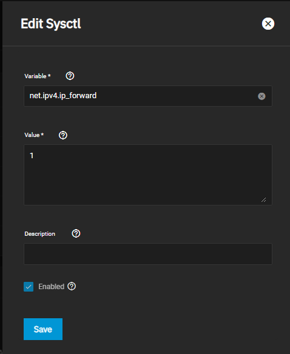
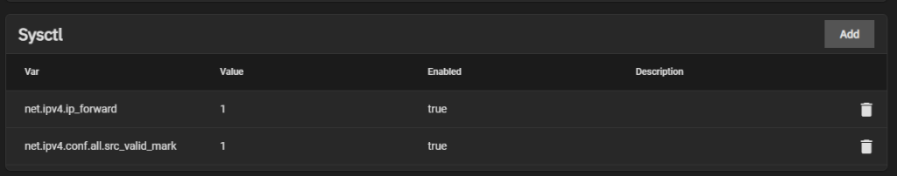
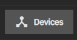
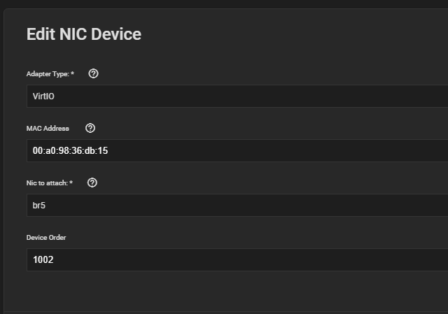

# TrueNAS Scale - VM/Containers cannot access host.

How to address Virtual Machines and/or containers not being able to access the TrueNAS Scale server hosting them.

<!-- more -->

To address this issue, we will need to add a new bridge interface for the TrueNAS system, and enable ipv4 forwarding to allow the network adaptor to pass packets between the VM's network adapter, and the adaptor assigned to TrueNAS.

## Process

### Step 1. Create a bridge interface

Goto the network tab. Find the interface which you are using for your VMs.

Remove the IP address from this interface.

Now, Create a new interface, make sure to specify type=Bridge, and specify the original interface as a member.

At the bottom, add the IP address from the original interface.

Save / Test / Save / etc.

### Step 2. Update tunables

Goto `System Settings` -> `Advanced`

We will need to add a new value, which will enable ipv4 forwarding. This is required for packets to be forwarded from your VM's, to the TrueNAS host.

Add a new value.

* Variable: `net.ipv4.ip_forward`
* Value: 1

Your form should look like this:

After saving, you should see the value listed in the sysctl section like so:

### Step 3. Update VMs

First, Power off your VMs.

Next, for each VM, you need to click `Devices`

Find the NIC which you want to have access to the host system via its network, and edit it.

Change its interface to leverage the new bridge adapter, created in the first step. 

Save your changes.

!!! warning
    Don't power on the VM yet! We will need to reboot TrueNAS before ip forwarding is fully enabled.

### Step 4. Reboot

TrueNAS Scale doesn’t seem to apply a lot of network changes until AFTER a reboot. So, a reboot is a must here. As well, the sysctl values we added won’t take affect until after a reboot.

After your machine successfully reboots- make sure you edit your VMs, and update their network interface to leverage the new bridge you created. You will need to power off / power on the VMs for this to apply.