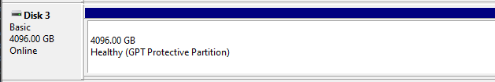
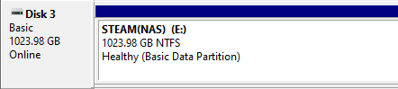

# TrueNAS – iSCSI – GPT Protective partition

While migrating from TrueNAS Scale to Core, I ran into an issue when remounting my existing iSCSI shares.

After getting everything configured, windows showed the status of, “Healthy (GPT Protective partition)”

<!-- more -->

After googling around for a bit, and finding many unresolved questions, I decided to start randomly changing settings.

Turns out, if you set the LUN size incorrectly, you will see this error.

After setting my LUN size to 4096 (Which is what was originally configured), the error goes away, and my mount works normally.

