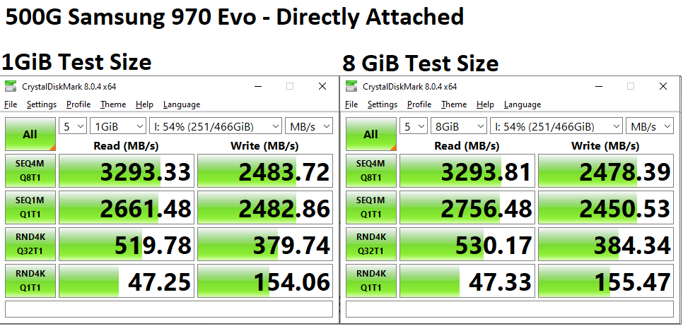
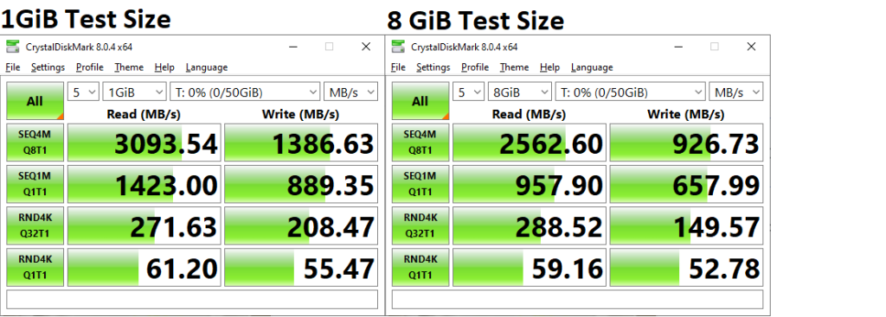
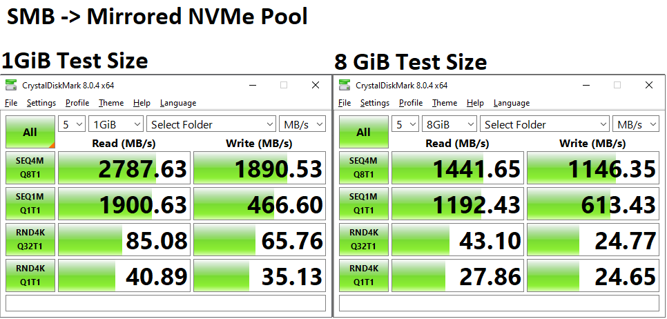
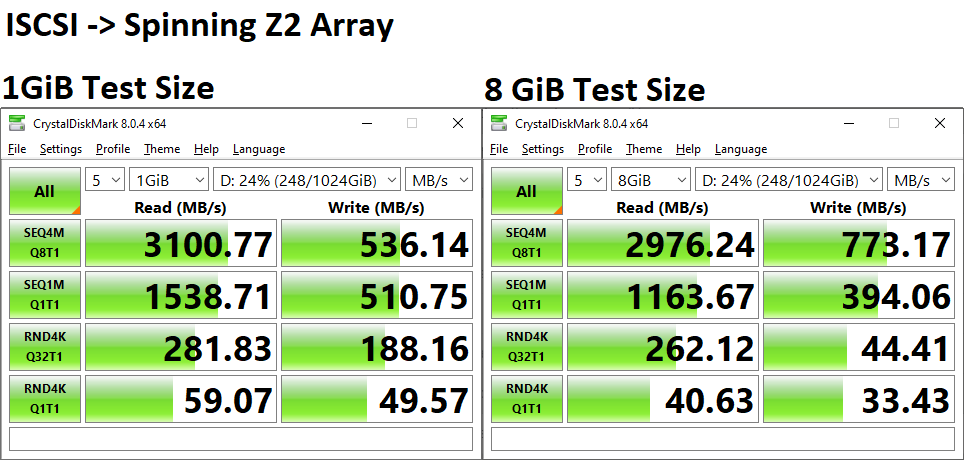
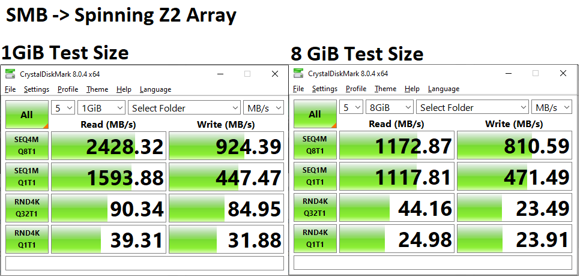

# 40Gb Ethernet Cost and Benchmarks

A while back, you may have seen my post for my [10/40GBe Network Upgrade](./../2021/2021-09-21-10g-network-upgrade.md){target=_blank}. However, you were likely disappointed like myself, due to the lack of any actual 40GBe test results.

Well, today, I have managed to get 40Gbit point to point connectivity from my PC, to my Server, and I have prepared test results!

<!-- more -->

### Disclaimers

--8<--- "docs/snippets/ebay-affiliate.md"


## Cost

### Network Interface Cards (NICs)

#### [Mellanox ConnectX-3 Dual Port 40GBe – Around 40-60$](https://ebay.us/gogOBA){target=_blank} - 40-60$

I have used these NICs for my Gaming PC, My Server, and my firewall. The configuration CAN be a bit complex if you choose to use them in infiniband mode, however, you can use them for regular ethernet mode without issues. Drivers are included for Linux/Unix/Windows, and these NICs are “mostly” plug and play.

#### [Chelsio 40GBe Dual Port 50-100$](https://ebay.us/kNk0VD){target=_blank} 50-100$

Chelsio also makes a very high quality NIC. These actually “feel” heavier then the other options I have tested from Intel and Mellanox. You can’t go wrong here.

### Cables

#### [Cheap DAC From eBay or Amazon](https://ebay.us/TX5u43){target=_blank} - 20$

For inter-rack connectivity, I have used cheap 5-10ft DAC cables without issue at both 10 and 40GBe. However…. if you need to transmit 40GBe across your house, like I did for this test…. See below.

#### [FS.com 3-164 foot DAC/AOC](https://www.fs.com/products/30912.html){target=_blank} - 100-200$

After my QSFP+ modules failed to establish a connection, I ended up ordering a 15m cable from fs.com. It arrived in 3 or 4 days, and was literally plug and play. (Not- I am not sponsored or affiliated by fs.com)

### Total Cost - ~300$

For the setup I ended up actually using, the total cost was around 240$.

1. Chelsio T580-LP-CR: 99$
2. ConnectX-3 CX354A: 45$
3. FS.Com 50ft 40GBe DAC: 140$

To note, there is a LOT of opportunity to go much cheaper here. You can get perfectly suitable NICs for 45$ each which can do 40GBe all day long.

There is a MASSIVE opportunity to save on the fiber itself. I was able to get 50ft of OS2 fiber for hardly 20$. However, the cheap modules I found, did not actually work. I could have made a mistake somewhere. Never know. But, if these work for you, you can do the project much cheaper. The other option, is getting MPO cable, which costs a bit more, but, is still cheaper then the DAC I ordered. I ended up going the route of the DAC, because I was tired of things not working!

## Benchmarking

### IPerf2 – Result: 36Gbit/s

Note, I am using iperf2, instead of iperf3, due to iperf3 being single threaded, and being more difficult to benchmark 40G. You can read more about that here: <https://fasterdata.es.net/performance-testing/network-troubleshooting-tools/iperf/multi-stream-iperf3/>

You can download both iperf2 and iperf3 from the official website: <https://iperf.fr/iperf-download.php>

``` bash
Windows Client
iperf -c 10.100.255.1 -P 4
------------------------------------------------------------
Client connecting to 10.100.255.1, TCP port 5001
TCP window size:  208 KByte (default)
------------------------------------------------------------
[  5] local 10.100.255.2 port 1147 connected with 10.100.255.1 port 5001
[  3] local 10.100.255.2 port 1145 connected with 10.100.255.1 port 5001
[  4] local 10.100.255.2 port 1146 connected with 10.100.255.1 port 5001
[  6] local 10.100.255.2 port 1148 connected with 10.100.255.1 port 5001
[ ID] Interval       Transfer     Bandwidth
[  5]  0.0-10.0 sec  10.5 GBytes  8.99 Gbits/sec
[  3]  0.0-10.0 sec  9.30 GBytes  7.98 Gbits/sec
[  4]  0.0-10.0 sec  9.78 GBytes  8.39 Gbits/sec
[  6]  0.0-10.0 sec  12.4 GBytes  10.6 Gbits/sec
[SUM]  0.0-10.0 sec  41.9 GBytes  36.0 Gbits/sec

TrueNAS Server
root@truenas[~]# iperf -s
------------------------------------------------------------
Server listening on TCP port 5001
TCP window size:  128 KByte (default)
------------------------------------------------------------
[  4] local 10.100.255.1 port 5001 connected with 10.100.255.2 port 1148
[  5] local 10.100.255.1 port 5001 connected with 10.100.255.2 port 1146
[  6] local 10.100.255.1 port 5001 connected with 10.100.255.2 port 1145
[  7] local 10.100.255.1 port 5001 connected with 10.100.255.2 port 1147
[ ID] Interval       Transfer     Bandwidth
[  4]  0.0-10.0 sec  12.4 GBytes  10.6 Gbits/sec
[  5]  0.0-10.0 sec  9.78 GBytes  8.38 Gbits/sec
[  6]  0.0-10.0 sec  9.30 GBytes  7.97 Gbits/sec
[  7]  0.0-10.0 sec  10.5 GBytes  8.97 Gbits/sec
[SUM]  0.0-10.0 sec  41.9 GBytes  35.9 Gbits/sec
```

### CrystalDisk

#### Benchmark disclaimer.

I have ran all of these benchmarks at both 1G test size, as well as 8G test size. I also ran 5 iterations of each test.

Many people will argue that all of your results are “cached” in ram at a 1G test size. While, this may be completely accurate- Remember, in the real world, you don’t move massive files very often!

#### Testing Pools

My NVMe pool consists of two 1tb 970 evos mirrored together. For SMB Testing, The target dataset did have LZ4 compression enabled.

My Spinning Disk pool, consists of 8x 8TB seagate exos sata drives, in a ZFS Z-2 configuration.

My TrueNAS Box is hosted on a Dell R720XD, with 2x E5-2695v2 processors, and 128GB of DDR-3 1333mhz ECC ram. It is running TrueNAS Scale.

Lastly- no services were stopped on this server while testing. The website you are reading is hosted on this server. I have game servers hosted here. I have MANY things hosted on this server. This is NOT a clean-room benchmark. This was benchmarked under my current, typical conditions.

During none of the below testing, did CPU utilization really rise above 30%. The Server usually runs around 15-20% utilization on average.

#### Baseline - 500G 970 EVO

For a reference to compare again, this is a benchmark of a Samsung 970 evo 500G, on my testing PC. No Raid, No ZFS. No Compression. Just a windows client with a 970 evo.



#### ISCSI -> Mirrored NVMe Pool: Result: Up to 3GB/s.



Results seem consistent, inline with what I would expect. Random I/O isn’t very great, but, being this is happening on a server 50 foot away, I am more than impressed.

#### SMB -> Mirrored NVMe Pool.



Something interesting happened here- For large test-sizes, SMB performance seemed to fall off a cliff. Although, writing to a file share at 1GB/s really isn’t bad.

#### ISCSI -> Spinning Z2 Array



What is very interesting about this test- The read speeds…. are basically identical to that of my NVMe array. For a Z2 pool consisting of a bunch of dirt-cheap 8TB disks I picked up, This is quite impressive to me. Write speeds, as you would expect, aren’t nearly as good… Parity calculation, and spinning disk performance shows its face here. I am willing to bet 8GB writes will be much worse.

Even more interesting, for the 8GiB Test, read speeds…. were extremely good.

#### SMB -> Spinning Z2 Array



Again, it seems samba takes a huge drive in performance when testing larger sizes.

## Overall Results?

My PRIMARY use case for upgrading to 40GBe, is for remote storage using ISCSI. I want to play with multi-booting multiple OS versions, over ISCSI. I want storage-level backups, snapshots, and recovery for my primary PC.

Given, my array of spinning disks, is offering a level of performance nearly even to a stand-alone 970 evo, I am more then thrilled.

While, I am only able to saturate around 25Gbit/s of the 40GBe link, I do believe there is still more performance on the table. As well, it is possible I may be bottlenecked due to my antique CPU and its 1,333mhz RAM. There is also the possibility of bottlenecks between the CPUs and associated PCIe busses. There are many possibilities.

But, for now, this level of performance is more then acceptable. I will note, Server CPU utilization never exceeded 30-40%. CPU utilization on my workstation was nearly unnoticeable. I do have full offloading enabled on my chelsio NIC.