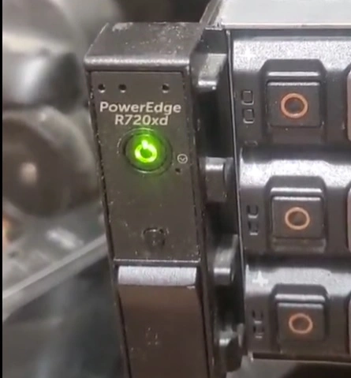
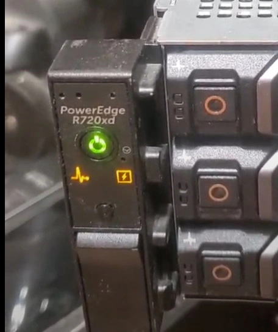
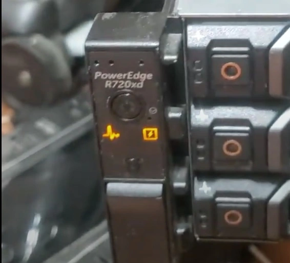

# Death of my r720XD

My r720XD took its last breath earlier this week...

This is just a short post about its troubleshooting, and.... what will replace it.

<!-- more -->

## What Happened?

Earlier this week, while I was installing my Solar panels, inverters, etc... I knew the power would be out all day. The idea- I would run everything important on my [homemade UPS](https://xtremeownage.com/2021/06/12/portable-2-4kwh-power-supply-ups/){target=_blank} while the work was being done.

Since- the R720XD is a bulk storage server primarly, and is not required for any of my critical services, I decided to shut it down to save 200watts or so of usage. This- was important because... I only have 2.4kwh of storage on my homemade UPS.

Regarding the UPS- it performed fantastically. It maintained my fridge, freezer, gaming computer, kubernetes cluster, firewall, POE switch and everything else while the work was being done. 

Well, after the work was done, I went to power the r720XD back on.... and... Nothing.

### Troubleshooting

So- to troubleshoot, I removed the power cords, held the power button in for 10 seconds to drain the power- and reconnected power.

At first- all looked good.

After a few seconds, the fan started kicking up- and a few warning lights appeared.

Ok- not a huge deal, right? Just a few warnings. And.... then....

Completely dead in the water! At this point, the power button is unresponsive. If you attempt to power the server on via iDrac, nothing happens.

### iDrac Logs?

iDrac presented a few errors for "Power Supply Misconfiguration"

So, at this point, I tried changing a few things. I tried...

1. Only PSU 1
2. Only PSU 2
3. Both PSUs
4. Connecting to different outlets
5. Connecting only to inverter power
6. Dancing with red slippers.
7. Removing all of the HDDs, assuming perhaps the startup power was too much.

No dice.

### Remove everything!

The next troubleshooting step, was to remove every piece of non-essential hardware.

So... I did.

I removed every PCIe device. The 2nd CPU was already done. I reseated all of the dimms. I disconnected the backplane.

And? Nothing changed.

### Final notes-

I will note, before the server "shuts off", both PSUs blink green fast, three times.

IDrac remains fully operational the entire time.

Once it shuts off, only removing power can get it to turn back on.

At this point, its either an issue of a bad PSU, or a bad mainboard. 

If, anyone does have any ideas (That aren't already listed on Dell's troubleshooting guide....), I can give them a try.

## Next Steps

~~A replacement PSU can cost around 100$ a piece, even on eBay.~~ A replacement mainboard, could potentially be in the same ballpark.

*Edit- I ended up finding a replacement PSU for 20$ shipped. If, the PSU fixes the server, at least I will have backup hardware if this ever happens again....*

So- Instead of potentially wasting a few hundred bucks attempting to guess to which component is having issues- 

I ordered a new (used) r730XD.

This new server will exceed nearly everything about the r720XD it is going to replace. It will use less power. It should be faster in terms of compute. It has faster RAM. It has more HDD bays. It has native birfuracation which doesn't require [fancy/expensive PLX cards](./../2022-01/R720XD-Bifurcation.md){target=_blank}

So-

Give a week or two for it to arrive in the mail, and I will do a quick write up of unboxing it, and getting it setup and configured to run my TrueNAS array.

Speaking of my Array- it is setting on the bookshelf.

In the future, you can look forward to...

1. Seeing if we can push the [40GBe ethernet project](./../../../../pages/Projects/40G-NAS.md){target=_blank} even faster!
2. Comparing energy usage of the r720XD versus a newer r730XD.