# 2023 Network Revamp, and Homelab History

Going over the history of my home network from the previous three years... and...

Deploying a Brocade ICX-6450 and Dell R730XD, without increasing power consumption.

<!-- more -->

## Introduction

Back in Jan 2023, [My r720XD lost both of its PSUs](./2023-01-13-r720xd-death.md){target=_blank}. Even after acquiring a new PSU, it still had a lot of power errors being displayed. So, I felt it was time to lay it to rest and replace it.

Part of this project, I will be replacing it with a R730XD, then customizing the R730XD to be more energy efficient. 

As well, Back in Dec 2021, I [Removed my Brocade ICX-6610](https://xtremeownage.com/2021/12/12/reducing-power-consumption-without-reducing-performance/){target=_blank}. While, removal of the switch made a VERY distinct drop in my overall power utilization, I still found myself missing some of the capabilities of this switch. Mainly- the ability to do layer 3 routing, combined with layer 4 ACLs at line speed, on all ports, at the same time. 

BUT, I didn't want the noise, or power utilization of the ICX-6610. It was overly loud, and consumed a lot of energy.

However, I will be replacing my existing Zyxel GS1900-24EP with the Brocade ICX-6450-48P, in an attempt to aggregate my 10G backbone, and- without greatly increasing noise and energy consumption.

## Network / Homelab History

If you are not interested in the history of my home network, please feel free to [SKIP TO PLANNED CHANGES](#planned-changes)

### 2020

At this time, my network was pretty simple.

* Ubquitity EdgeRouter 5, POE 
* Unifi UAP-AC-PRO
* A Raspberry PI

That was it! In the time before COVID, and I had to physically goto work every day, I really didn't have any serious home infrastructure.

Pre-covid, I did start to experiment with home assistant, running it on a raspberry pi. But, there wasn't anything serious at this point.

Once COVID happened, and I started working from home, the amount of home-automation projects I started tackling skyrocketed. At this point, the pi-4 was not up to the task anymore with the demands I was placing on it.

So, I considered getting a synology NAS. After looking the prices- I felt I could built my own NAS, better AND cheaper.

[500$ Closet NAS Build](https://xtremeownage.com/2020/07/24/closet-mini-server-build/){target=_blank}

### 2021

Well, I started adding a ton of security cameras, and even more and more automation.

As such, the compute and networking demands on my home network were quickly increasing beyond what my infrastructure could provide.

So- I upgraded.

[10/40G Network Upgrade](https://xtremeownage.com/2021/09/04/10-40g-home-network-upgrade/){target=_blank}

* Brocade ICX-6610 1/10/40G switch
* Dell R720XD Running TrueNAS Scale

And- everything was fast. I had tons of spare capacity.

Here is the network as of the end of 2021.

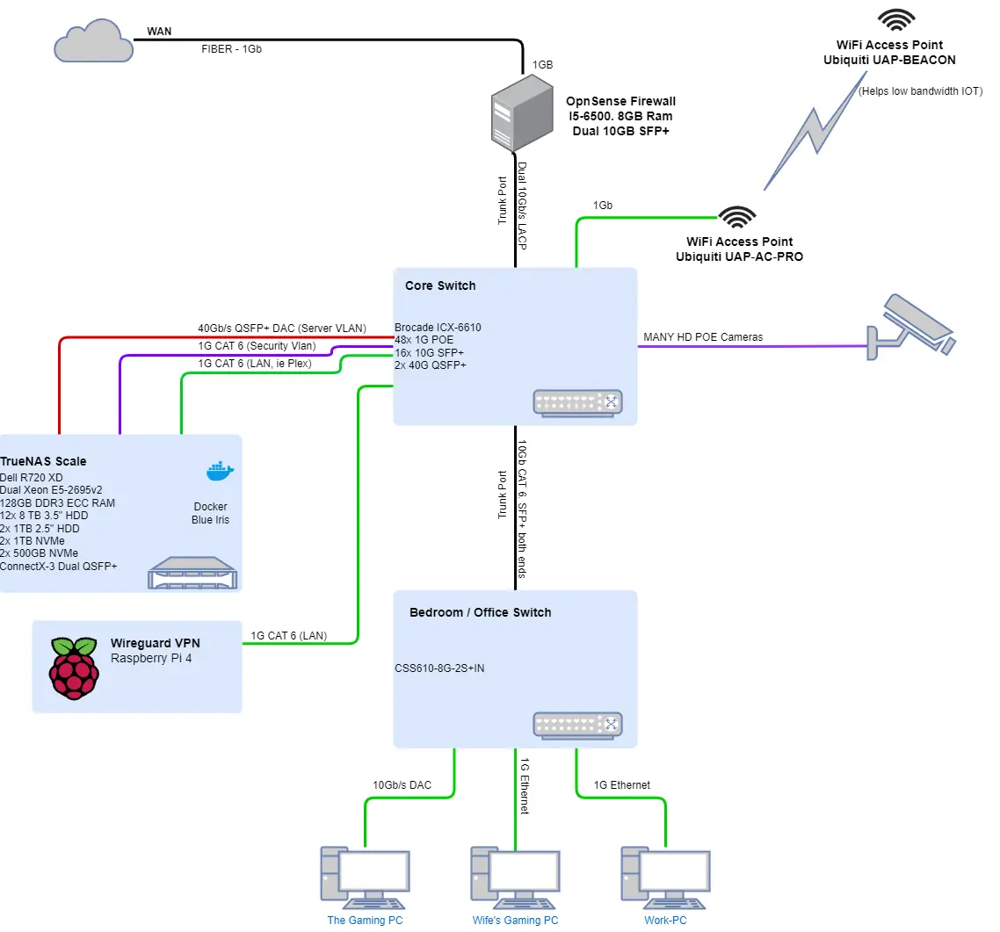

### 2022

I learned that electricity bills can get pretty expensive. Especially when you have a record breaking heat wave, causing it to be 110F outside for two months STRAIGHT.

For literally two months, my Air condition would turn on around 8am, and would run until 2am the next morning try to keep the house cool.

For reference, here is my WH of AC utilization per day for 2022.

~

1.5 mWh of consumption, in July. From My A/C Alone. That is 120$ alone! Not including the load of all of my servers running.

I don't have a large house! 

So, the goal was to start trimming as much energy usage as possible.

If you wish to read about a few of the things performed in details- See [40G NAS Project](./../../../../pages/Projects/40G-NAS.md){target=_blank}

To summarize:

1. R720XD put on a massive hardware diet.
2. Additional, Newer more efficient SFFs added to take over compute loads from the inefficient E5-2667v2.
3. 10/40G Brocade replaced with 1G only Zyxel.

This managed to get my network power utilization down to around 375-450w average, from 500-600w. As well, it GREATLY reduced the amount of noise in the server room.

Here is a diagram of my network at the end of 2022.

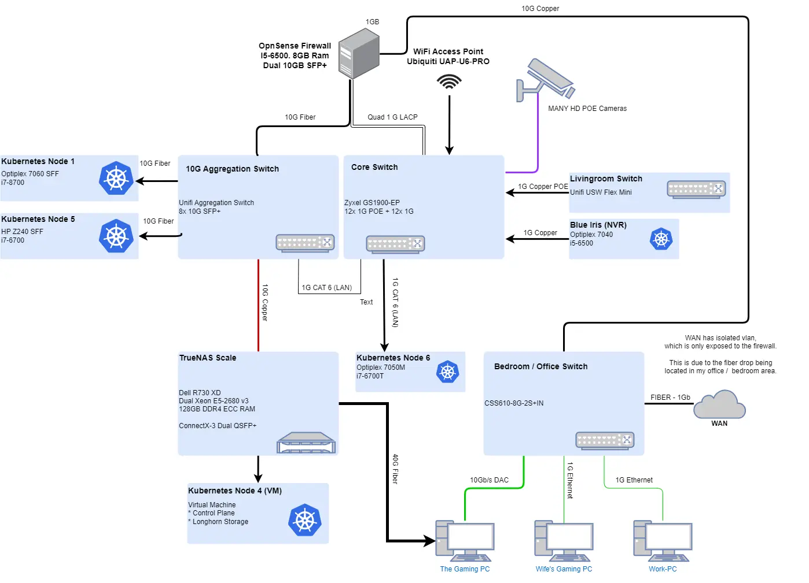

#### Late 2022 - Kubernetes

I started learning about Kubernetes. Well, this caused the number of servers in my rack to increase by a few to support my newfound passion.

As well, I leveraged local NVMe on each of the nodes, with replicated ceph storage. Come to find out, ceph will completely annihilate the 1G link, which is also needed by control plane traffic. 

So, I needed to once again, establish 10G switching capabilities in my rack. I added a Unifi Aggregation Switch to handle this.

And, it is quite efficient in terms of power usage, generally using around 15w, with 4x 10G links connected, and a 1G link via 10GBase-T module.

### 2023

Again, I find my power consumption starting to creep up as I keep expanding out my Kubernetes environment. 

AND, [My r720XD died](./2023-01-13-r720xd-death.md){target=_blank}, and was replaced with a r730XD. (Documented below). Power consumption increased from 190w of my stripped down R720XD, up to ~250W for the new R730XD.

As well, I am REALLY missing some of the L3 routing capabilities I had with the Brocade ICX-6610.

The solution here, was to replace my Zyxel core switch, with a modified Brocade ICX-6450-48P.

The modifications are simple- Replacing the fans with quieter variants. The datasheet shows around a 30w idle consumption. 

## Planned Changes:

Here are the changes I hope to accomplish during this project:

1. 10G connectivity between all major components in my rack.
2. Simplified network design.
3. Reduced power consumption from putting the R730XD on a diet.
4. Some VLANs/ACLs will be moved from Opnsense to the new switch, reducing Opnsense overhead.
5. Removal of extra links 
    * 4-link lagg currently exists between Opnsense and the Zyxel switch.
        * Only a single 10G link for LAN, and a single 1G link for WAN after this is completed.
    * 6-total network connections between TrueNAS and other systems. 
        * Only a single 10G link to the aggregation switch will exist afterwards.
        * 40G point to point connection may be removed as well. Undetermined at this point.

Here is the planned network diagram:

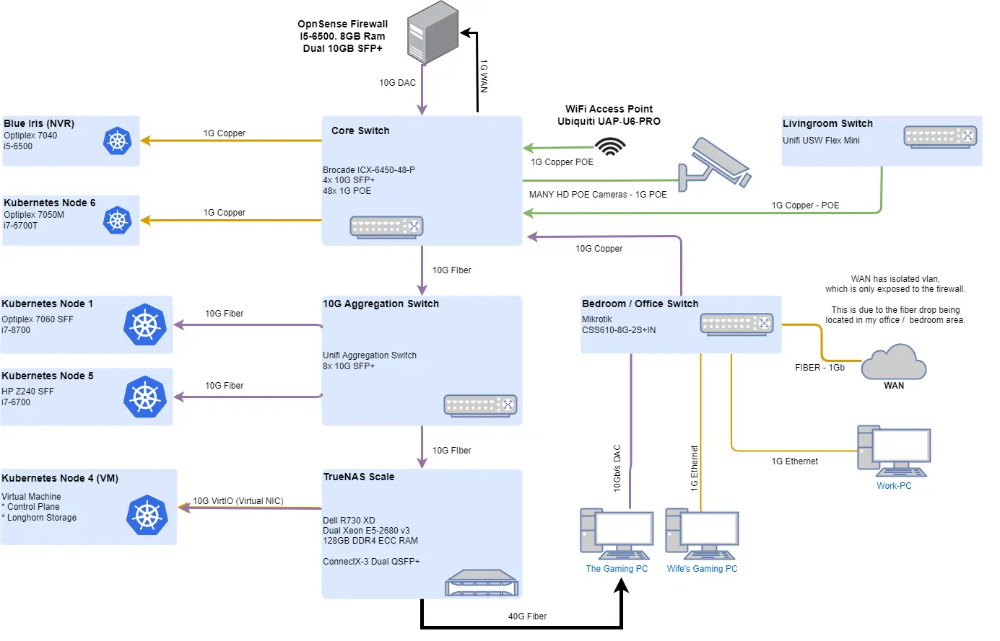

!!! note "Why is the WAN connected to the Office/Bedroom switch??!?"
    For those wondering why my wan connects to the bedroom switch- its because the fiber is terminated there. I do not have/want to invest in the tools to properly re-terminate the fiber currently. 

    As such, it has an isolated vlan, which is only shared by the WAN port on the office/bedroom switch, and the WAN -> Firewall port on the Core Switch.

    Since, the link between the two switches is 10Gigabit, and the internet speed is 1Gigabit MAX, there are no concerns of bottlenecks here.

## Installing the Brocade ICX-6450-48-P

Just a friendly reminder- make sure you have a console cable!

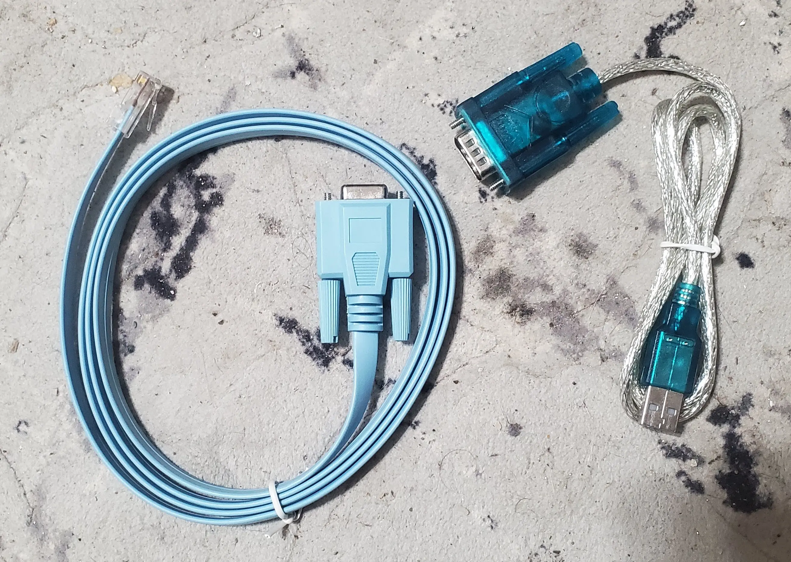

Always keep one of these somewhere.

### Replacing the fans

While the stock fans aren't overly loud, I wanted to replace them to make sure the switch was barely audible.

I used information from [this servethehome post](https://forums.servethehome.com/index.php?threads/brocade-icx-series-cheap-powerful-10gbe-40gbe-switching.21107/page-214#post-278605){target=_blank} and ordered the Delta fans from Digikey.

Replacing the fans isn't hard at all. 

!!! notice "Check if your new fans have the header already included or not!"
    The fans I received from digikey did not have a fan header already attached.

    Since- I didn't have a spare header around, I removed the old headers, and soldered the new fans onto them.

First- remove the cover. 

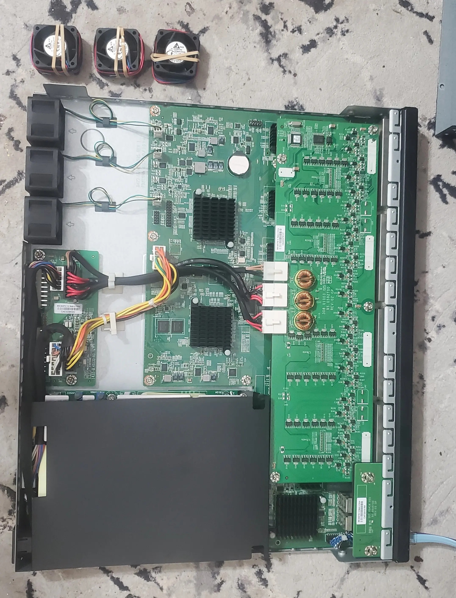

Then, remove the old fans. Here is a comparison between the stock fans (Left), and Delta fans (Right.)

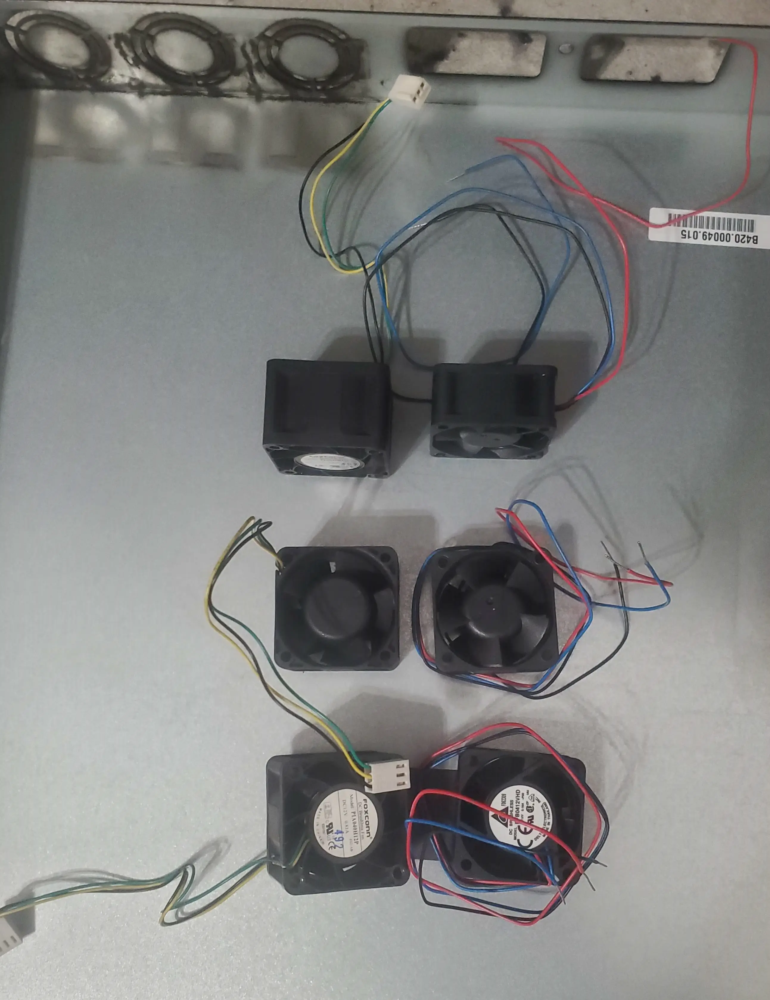

Afterwards, Just attach the new fans, and plug them in.

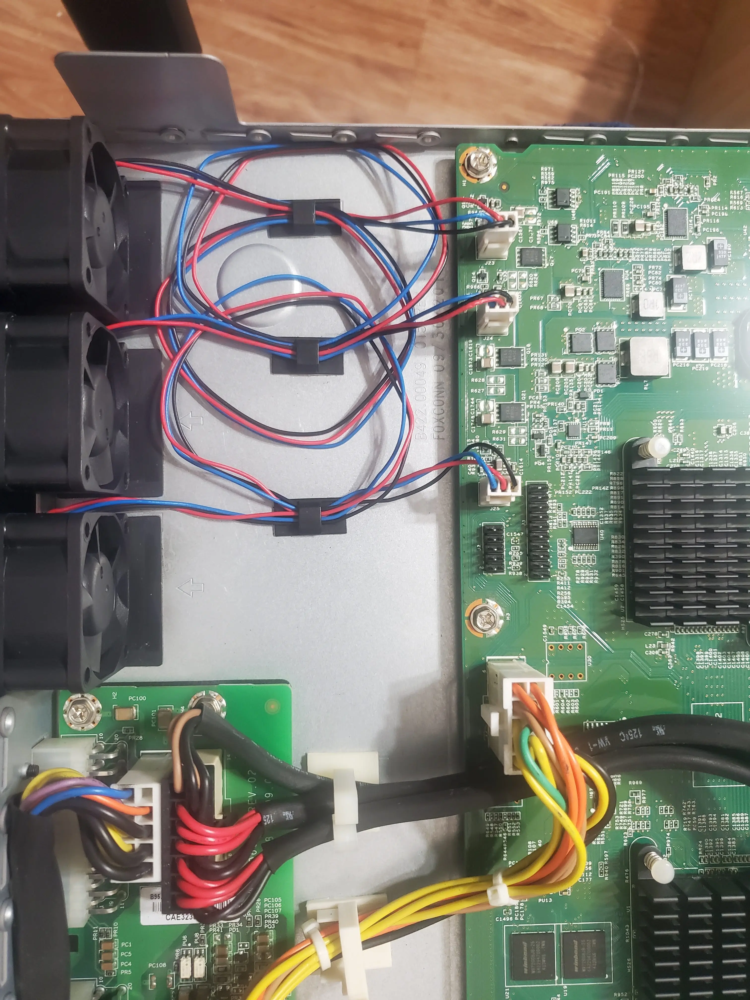

### Replacing my old switch

First- here is my rack before starting work.

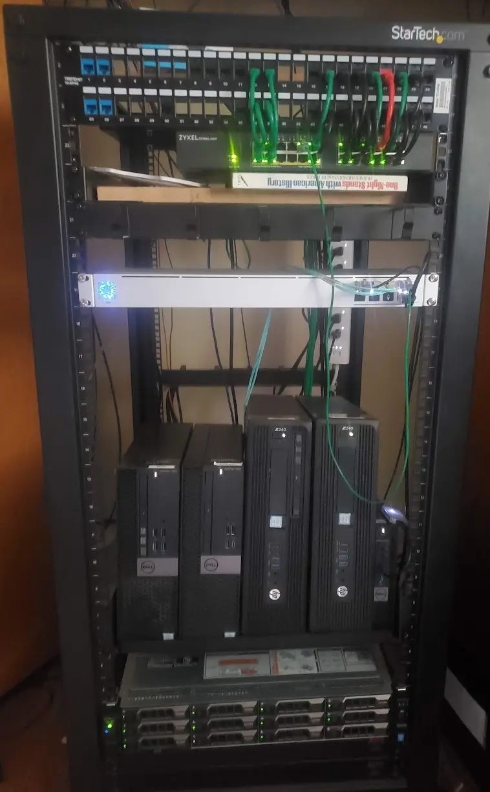

Since.... I share a house with my Wife and kids, who.... happen to stream TV, games, etc using the network/internet.....

It was a high priority on my list to perform this migration WITHOUT impacting them. Happy wife = happy life.

To perform the migration without bringing anything down- I unracked the old switch (It was just setting on a shelf...), and set it on the top of my rack.

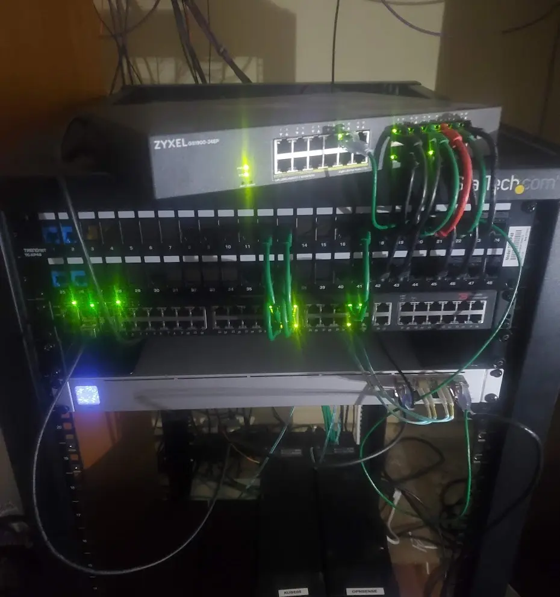

This allowed me to configure ports one by one, migrate vlans, and move the circuits over.

Since- my network makes very heavy use of vlans for segregation- this approach worked very well.

After installing the new switch, I cleaned up the rack just a hair. More to come later...

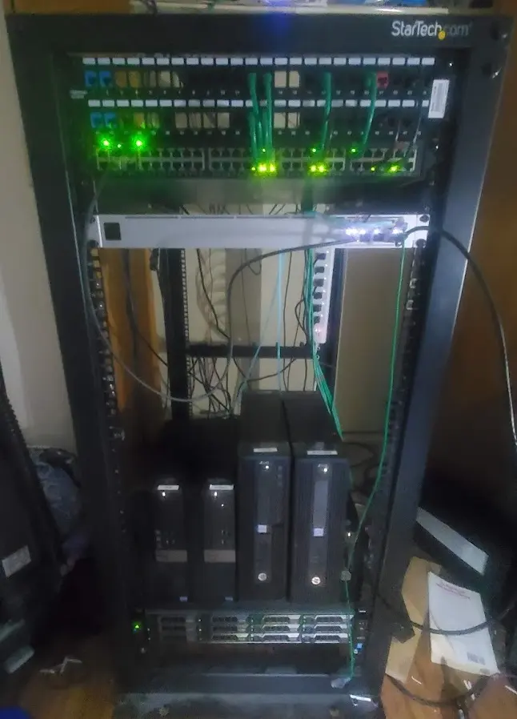

### Power Usage - +20 to 30 watts.

As expected, the Brocade indeed uses more energy then the Zyxel.

The brocade, with nothing connected, and no loads, runs around 50w of consumption.

I have around 30w of total POE loads.

All said and done, the Brocade uses around 85 to 90 watts pretty consistently with everything connected.

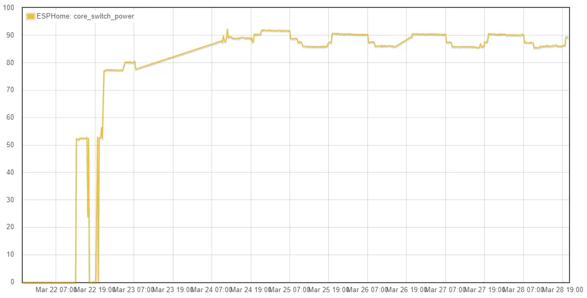

However, in exchange for added power consumption, we have gained a few benefits:

1. A core switch with 10GBe connectivity. This means, there is no longer the need for different 1G / 10G interfaces handing off of the firewall. This simplifies the network.
2. Layer 3 routing and ACLs, independent of the firewall. 
    * This can be leveraged to reduce the load hitting the firewall, improving performance and reducing consumption.
3. A much better VLAN configuration interface. (I really disliked the interface on the Zyxel...)

## R730XD Power Reduction

Since, my R730XD has been consuming around 240w average, I wanted to get it closer to the 190w average of my R720XD.

### Changes

#### CPU Replacement - 28 watts saved.

I replaced the Dual E5-2680v3 Xeons, with a single E5-2667v4.

I purposely did not choose a low power variant, because the last time I did that- I lost a lot of performance, without much energy savings. 

Instead, I went with a processor with very good single threaded performance.

This saved a total of 28 watts.

#### Removing unused HDDs - 14 watts saved

I had a few extra HDDs in my r730XD which were not in use. Despite having spin down enabled, removal of two extra drives somehow saved energy. 

2TB + 3TB removed = 14 watts saved.

#### Optimizing Fans - 14 watts saved

Originally, I attempted to throttle the fans down using racadm.

[Dell: Modifying thermal settings using iDrac](Dell Fan: https://www.dell.com/support/manuals/en-us/idrac9-lifecycle-controller-v3.3-series/idrac_3.30.30.30_ug/modifying-thermal-settings-using-racadm?guid=guid-af4b39bf-49c3-4f12-a20d-9488b37eeb8f&lang=en-us){target=_blank}

I specified the following settings:

* `racadm set system.thermalsettings.ThirdPartyPCIFanResponse 0`
* `racadm set system.thermalsettings.FanSpeedOffset 255`
* `racadm set system.thermalsettings.FanSpeedLowOffsetVal 0`
* `racadm set system.thermalsettings.ThermalProfile 2`

However, the fans would never go below 40%, despite great temps.

So, instead, I leveraged `ipmitool` to manually set the fans at 20%.

After carefully watching temps, this value seems good.

[Manually setting fan speed](https://angrysysadmins.tech/index.php/2022/01/grassyloki/idrac-7-8-lower-fan-noise-on-dell-servers/){target=_blank}

For an even better solution, I found [THIS REDDIT POST](https://www.reddit.com/r/homelab/comments/x5y63n/fan_curve_for_dell_r730r730xd/){target=_blank} containing a script which allows you to manually define fan curves.

But, for now, manually turning the fans down to 20% reduced power consumption by another 14 watts.

#### Replacing boot pool drives. - 0 watts saved

My boot pool consisted of a pair of 10k 250G 2.5" SAS disks.

After the power savings from removing some of the other drives from my server, I felt I could gain a easy 10-20w power saving by replacing these 10k sas drives.

So, I replaced them with a single 250G 2.5" SATA SSD.

!!! notice "No redundant boot pool? WTF"
    I actually ordered two mixed-vendor SATA SSDs to use in a mirrored boot pool configuration.

    However, the second disk was throwing a lot of I/O errors, and was unable to be used. In the future, I will mirror the boot pool to a second drive.

Sadly- after fiddling with a bad SSD for a few hours- I was greeted by saving...... zero watts.

#### Removing ALL of the HDDs - Total 98w average

While, attempting to reinstall TrueNAS onto my new SATA SSDs, for safety, I removed the HDDs for my primary array.

During the installation process, power usage remained at a steady 98w.

With that said, we can conclude the HDDs spinning in my array draw around 80 watts. 

That is- 8 drives normally spinning at all times, so, ~10 watts each.

### R730XD Summary - 72 watts saved

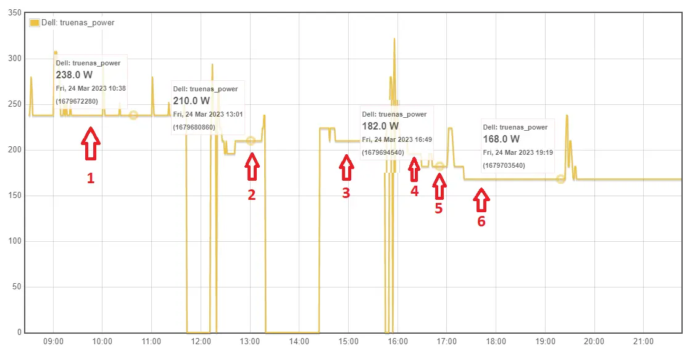

1. Base power consumption
    * 238w average
2. CPU Replacement
    * 2x E5-2680v3 replaced with SINGLE E5-2667v4. BIOS Power Settings Optimized. 
    * -28 watts, 210w average.
3. Lowered memory frequency. No change.
4. 14 watts saved - Removed two HDDs from server, which were not in a pool.
    * Surprising, since these HDDs were set to maximum power savings with spin-down enabled. 
    * -14 watts, 196w average
5. Removed second power supply.
    * -14 watts, 182w average.
6. Manually setting fan speed.
    * 14 watts, 168w average.

### 40GBe Benchmarking

While I took quite a few measures to reduce power consumption, I still need my NAS to be able to perform. So, lets benchmark it.

Hitting my flash pool, over 40GBe fiber via iSCSI.

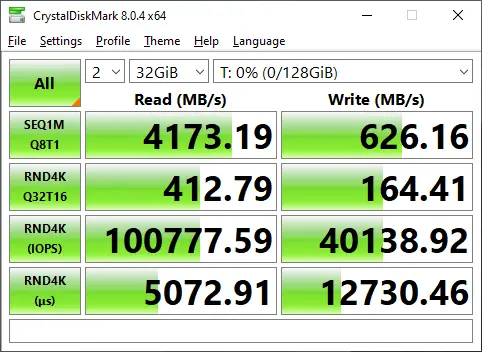

Yup. Seems like performance is pretty good.

Lets look at the metrics.

CPU / Temps:

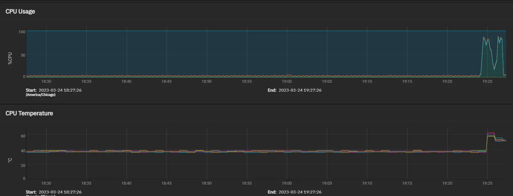

Temperatures remained within spec. No issues here.

Network Usage: 

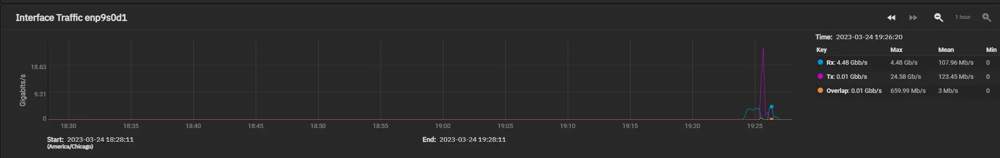

#### BUT ITS ALL CACHE, YOU ARE JUST BENCHMARKING YOUR CACHE!!!

You might be correct...

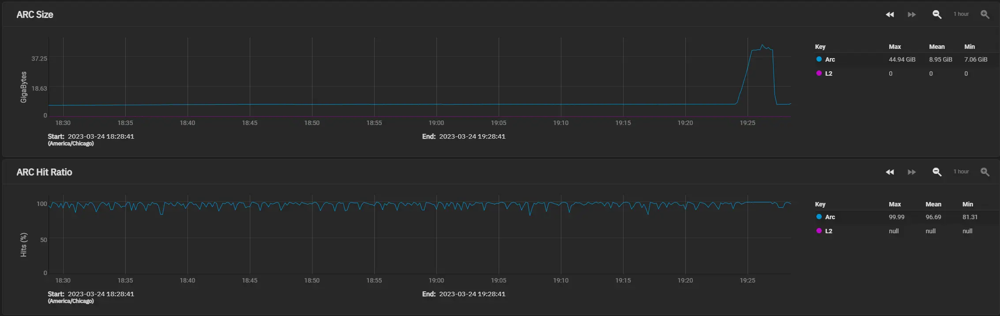

BUT, in a real-world scenario, there are hardly any files that will not fit in my ARC.

And, in a real-world scenario, my ARC hit rates are even higher then during benchmarking.

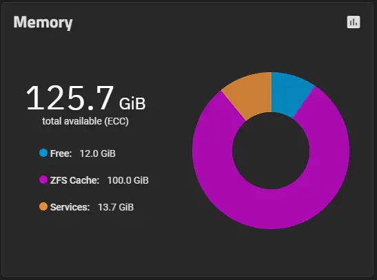

## Kubernetes Updates

### Replacing HP Z240 SFF with Optiplex 3060 Micro - 15-25 watts saved.
I felt I could do a few tweaks to my Kubernetes environment to save some power here as well.

I started by replacing my HP Z240, with a Optiplex 3060M.

The 3060 micro, doesn't have additional PCIe slots, however, it does have extremely low power consumption.

The HP had a i7-6700, while the Optiplex has a i5-8500t. According to [CPU Benchmark](https://www.cpubenchmark.net/compare/2598vs3231/Intel-i7-6700-vs-Intel-i5-8500T){target=_blank}, I should have roughly the same compute power, with half of the energy.

In addition to saving energy, this also cleaned up some room in my rack.

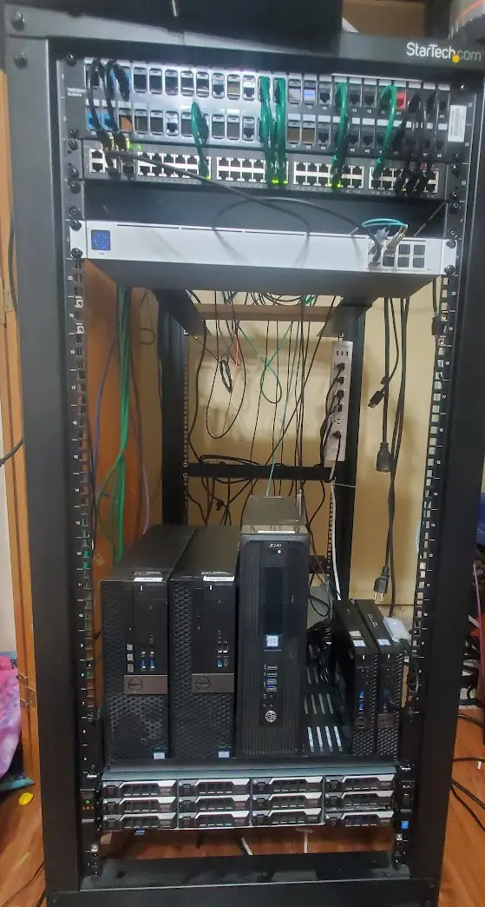

## Firewall / Opnsense Updates

During this update, I wanted to improve the overall security, AND reliability of my home network as well. 

In the event the primary firewall is down, everything internal to my network should still work.

### Replacing HP Z240 with Optiplex 3060m - 40 watts saved

Since- all of the 10G routing is now handled by the Brocade, and all internal routing is handled between the switches/routers- I no longer need a firewall with full 10G connectivity.

I only pay for 500 down/100 up WAN. 

So- I replaced the HP Z240, with a optiplex 3060m. 

Specs:
* i5-8500t
* 8Gb DDR4 RAM.
* 256G NVMe.

This box, is nothing special. However, it idles around 10 watts and has more then enough power for processing its traffic.

It is responsible for:
1. Primary WAN firewall
2. NAT
3. Primary DNS server
4. VPN
5. Primary NTP server

## Overall?

Overall- success.

Under 500w.